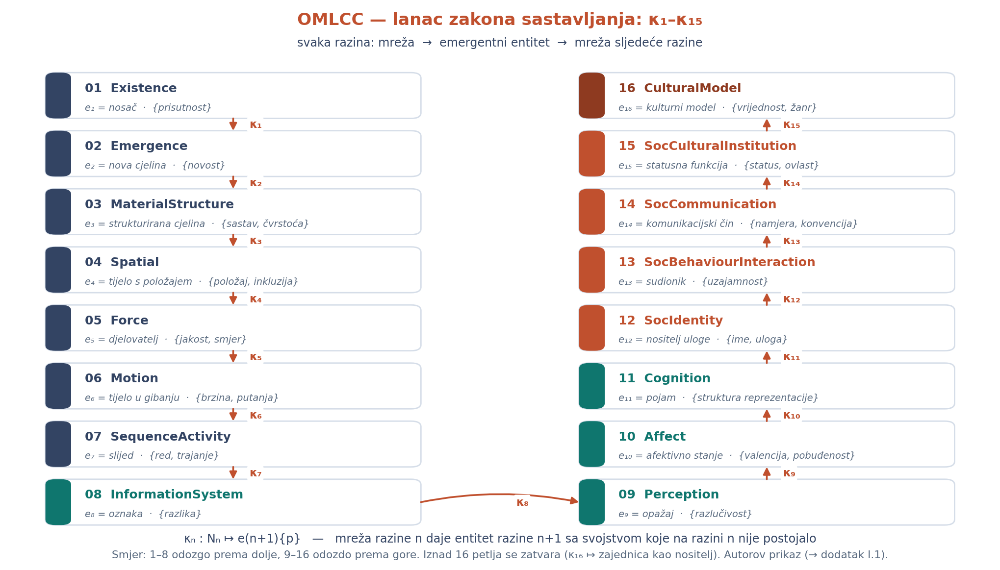
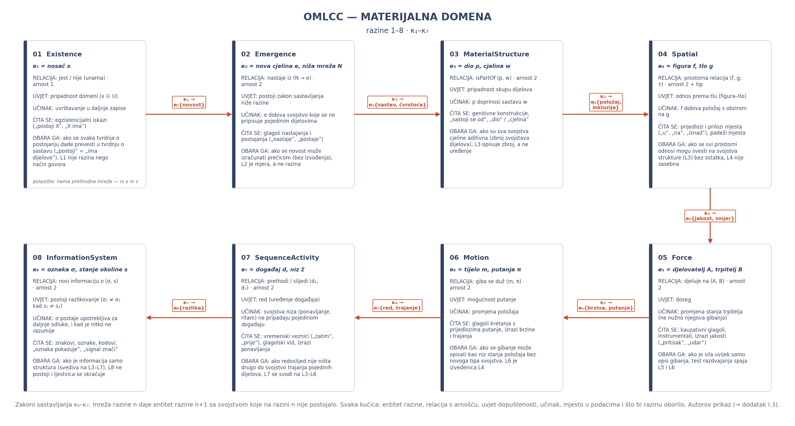
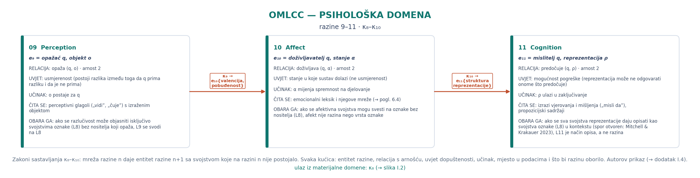
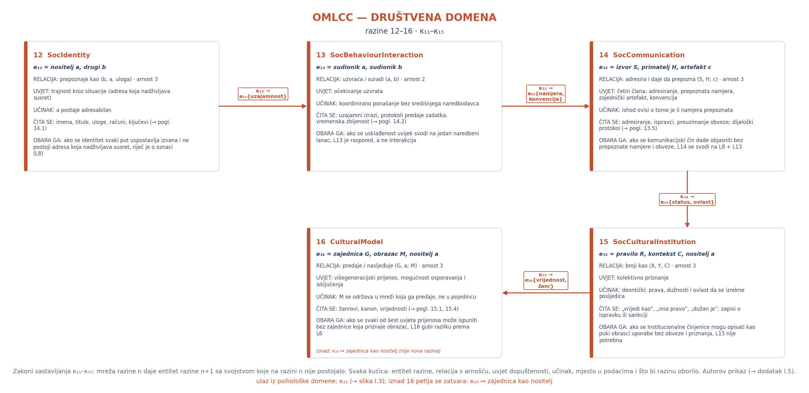

# Dodatak I — Formalizacija razina: entiteti, interakcije i zakoni sastavljanja

**Zašto ovaj dodatak postoji:** Osnovni tekst opisuje šesnaest razina riječima, a svaka je razina tip entiteta, tip relacije i tip svojstva (→ pogl. 2.2–2.3); ovaj dodatak isti sadržaj zapisuje **formalno**, i to u tri koraka. Najprije uvodi oznake i pravila dobroga zapisa. Zatim za svaku od **šesnaest** razina daje formalizaciju **entiteta**, formalizaciju **interakcije** i **zakon** sastavljanja po kojemu mreža te razine daje entitet više razine; na kraju za svaku razinu navodi kako se čita iz podataka i što bi je oborilo.

Dvije napomene odmah, da se ne bi činilo više nego što jest. **Prvo:** formalizacija je **autorova** i u ovoj se knjizi iznosi prvi put; ona ne dodaje nove tvrdnje o svijetu, nego **zapisuje** tvrdnje koje su u tekstu već izrečene (okvir je izložen na izlaganjima 2017a; 2017b; puni podaci: → pogl. 2.1). **Drugo:** formalni zapis ne nosi nikakvu mjeru — brojke ostaju u tekstu i u `data/fakti.csv`, s naznačenom vrstom (mjereno / procjena / izvedeno); formalizacija je **jezik**, a mjerenje ostaje posao poglavlja 4, 6 i 10.

## I.1 Oznake i pravila dobroga zapisa

Razinu bilježimo s **L_n**, gdje je *n* cijeli broj od 1 do 16. Svaka je razina **trojka** skupova tipova:

**L_n = (E_n, R_n, P_n)**

- **E_n** — skup tipova **entiteta** dopuštenih na razini *n* (ono *gdje* je nešto u sustavu);
- **R_n** — skup tipova **relacija** s potpisom *R : E_n × E_n → P_n* (relacija uzima dva entiteta i vraća svojstvo);
- **P_n** — skup tipova **svojstava** koje relacija može nositi.

**Relacijska shema (RS):** Pojedini iskaz zapisuje se shemom:

**a{E} — [p : r] → b{E}**

gdje je *a* entitet s tipom iz E_n, *b* drugi entitet, *r* relacija, a *p* svojstvo koje ta relacija nosi. Shema je **dobro oblikovana** ako su tipizirana **tri** mjesta; ako su tipizirana samo dva, fenomen pripada **nižoj** razini (→ pogl. 2.3).

**Mreža:** instancijacija razine *n* u podacima je mreža **N_n = (V_n, A_n)** s V_n ⊆ E_n i A_n ⊆ R_n × (V_n × V_n).

**Interakcija.** Interakciju bilježimo kao **peterokut**:

**I = (r, p, arnost, smjer, uvjet dopuštenosti; učinak)**

Prva četiri člana postoje na svim razinama. **Uvjet dopuštenosti** i **učinak** su ono po čemu se razine razlikuju; na nižim razinama uvjet je fizikalni (doseg, sila, redoslijed), a na razinama 12–16 uvjet je **društven** (priznanje, očekivanje uzvrata, prepoznata namjera, deontički status, prijenos).

**Zakon sastavljanja:** za svaku razinu postoji prijelaz

**κ_n : (V_n, A_n) ↦ e_{n+1}{p}, e_{n+1} ∈ E_{n+1}, p ∈ P_{n+1}**

koji čitamo: mreža razine n daje **entitet** razine n+1 sa svojstvom koje na razini n nije postojalo (Emmeche, Køppe & Stjernfelt 1997). **Operator** emergencije je ε_n = κ_n ∘ φ_n, gdje φ_n izdvaja relevantna svojstva mreže; emergencija je, naime, **slaba**: ε_n se ne daje zatvorenom formom, nego samo **izvođenjem** (Bedau 1997); nigdje se ne uvodi *downward causation*, a problem kauzalnog isključivanja ostaje priznato ograničenje (Kim 1999).

**Testovi:** *test spajanja* daje L_i = L_j ako i samo ako E_i = E_j, R_i = R_j i P_i = P_j; *test razdvajanja*: L_n se razdvaja ako mreža sadrži dvije klase svojstava s **različitim zakonima** sastavljanja (→ pogl. 2.4).

**Stega.** Riječ *razina* nikada ne označava model. **Entitet** imenuje poziciju (*gdje*), **agent** imenuje ulogu (*što radi*). Isti entitet može biti čitan na više razina (Koestler 1967).

**Lanac κ:** slika I.1 prikazuje tu tvrdnju: šesnaest razina povezanih zakonima sastavljanja, gdje svaka razina svojoj sljedećoj predaje entitet sa svojstvom koje prije nije postojalo.

**Slika I.1.** Lanac zakona sastavljanja κ₁–κ₁₅: šesnaest razina u dvama stupcima — 1–8 odozgo prema dolje, 9–16 odozdo prema gore — a svaka kućica nosi naziv razine, pripadni entitet *e_n* i svojstva koja razina donosi; strelice nose oznaku zakona κ_n, a prijelaz s razine 8 na razinu 9 prikazan je vodoravno. U podnožju stoji zapis κ_n : N_n ↦ e(n+1){p} i napomena da se iznad razine 16 petlja zatvara (κ₁₆ ↦ zajednica kao nositelj); autorov prikaz (→ dodatak I.1).

## I.2 Potpisi svih šesnaest razina

| razina | L_n = (E_n, R_n, P_n) — tipovi entiteta | R_n — relacija (potpis) | P_n — svojstvo |
|---|---|---|---|
| 1 Existence | nosač *x* | *jest / nije* (unarna) | prisutnost |
| 2 Emergence | nova cjelina *e*, niža mreža N | *nastaje iz* (N → e) | novost (relativna) |
| 3 MaterialStructure | dio *p*, cjelina *w* | *isPartOf* (p, w) | sastav, čvrstoća |
| 4 Spatial | figura *f*, tlo *g* | prostorna relacija (f, g; τ) | položaj, inkluzija |
| 5 Force | djelovatelj *A*, trpitelj *B* | *djeluje na* (A, B) | jakost, smjer |
| 6 Motion | tijelo *m*, putanja *π* | *giba se duž* (m, π) | brzina, putanja |
| 7 SequenceActivity | događaj *d*, niz *Σ* | *prethodi / slijedi* (d₁, d₂) | red, trajanje |
| 8 InformationSystem | oznaka *σ*, stanje okoline *s* | *nosi informaciju o* (σ, s) | razlika |
| 9 Perception | opažač *q*, objekt *o* | *opaža* (q, o) | razlučivost |
| 10 Affect | doživljavatelj *q*, stanje *α* | *doživljava* (q, α) | valencija, pobuđenost |
| 11 Cognition | mislitelj *q*, reprezentacija *ρ* | *predočuje* (q, ρ) | struktura reprezentacije |
| 12 SocIdentity | nositelj *a*, drugi *b* | *prepoznaje kao* (b, a, uloga) | ime, uloga |
| 13 SocBehaviourInteraction | sudionik *a*, sudionik *b* | *uzvraća / suradi* (a, b) | uzajamnost, očekivanje |
| 14 SocCommunication | izvor *S*, primatelj *H*, artefakt *c* | *adresira i daje da prepozna* (S, H; c) | namjera, konvencija |
| 15 SocCulturalInstitution | pravilo *R*, kontekst *C*, nositelj *a* | *broji kao* (X, Y, C) | status, ovlast, sankcija |
| 16 CulturalModel | zajednica *G*, obrazac *M*, nositelj *a* | *predaje / nasljeđuje* (G, a; M) | vrijednost, žanr, kanon |

*(Potpis je prikazan u pojednostavnjenome obliku; relacije su parne — relacije višega reda nisu obuhvaćene, → pogl. 2.5.)*

## I.3 Materijalna domena (1–8)

**Materijalna domena:** slika I.2 prikazuje osam razina materijalne domene s istim podacima koje donose potpoglavlja niže — entitet, relaciju s arnošću, uvjet dopuštenosti, učinak, mjesto u podacima i ono što bi razinu oborilo.

**Slika I.2.** Materijalna domena (razine 1–8): osam kućica u dva reda — prvi red slijeva nadesno (1–4), drugi zdesna nalijevo (5–8) — a svaka kućica nosi naziv i broj razine, entitet *e_n*, relaciju s arnošću, uvjet dopuštenosti, učinak, mjesto u podacima i što bi razinu oborilo; strelice nose zakone κ₁–κ₇, a κ₄ je prijelaz između redova; u kućici razine 1 stoji napomena da je ona polazište (nema ni κ ni ε); autorov prikaz (→ dodatak I.3).

### L1 — Existence
**Entitet.** *x* je nosač, dakle bilo što što ulazi u domenu razmatranja; formalno x ∈ U, gdje je U domena.
**Interakcija.** Unarna relacija prisutnosti: *jest(x) = 1* ili *0*; arnost je 1, uvjet dopuštenosti je pripadnost domeni, a učinak je uvrštavanje u daljnje zapise.
**Zakon sastavljanja.** **Polazište** je razina 1: nema prethodne mreže, pa nema ni κ ni ε, a prisutnost se ne izvodi ni iz čega.
**Čitanje:** egzistencijalni iskazi („postoji X", „X ima") i imenice koje uvode sudionika.
**Oborilo bi je:** Ako se svaka tvrdnja o postojanju može prevesti u tvrdnju o sastavu („postoji" = „ima dijelove"), razina 1 nije razina nego način govora.

### L2 — Emergence
**Entitet.** Dvije vrste: **mreža** N₁ i **cjelina** *e* koja iz nje nastaje.
**Interakcija.** *nastaje iz*: N₁ → e. Uvjet dopuštenosti: postoji zakon sastavljanja niže razine; učinak: e dobiva svojstvo koje se ne pripisuje pojedinim dijelovima.
**Zakon sastavljanja.** κ₁: N₁ ↦ e₂{novost} — mreža nosača daje **cjelinu**, sa svojstvom novosti relativne prema razini.
**Čitanje:** glagoli nastajanja i postajanja („nastaje", „postaje", „iz toga proizlazi").
**Oborilo bi je:** Ako se novost može izračunati **prečicom** (bez izvođenja), nije riječ o slaboj emergenciji nego o promjeni vrijednosti nižega svojstva, i tada je L2 mjera, a ne razina.

### L3 — MaterialStructure
**Entitet.** *dio* p i *cjelina* w; formalno w = (P, ≼) gdje je P skup dijelova, a ≼ relacija dijela prema cjelini.
**Interakcija.** *isPartOf(p, w)*: arnost 2; uvjet dopuštenosti je pripadnost skupu dijelova. Učinak: p doprinosi sastavu w.
**Zakon sastavljanja.** κ₂: N₂ ↦ e₃{sastav, čvrstoća} — iz mreže nastalih cjelina i njihovih sastavnica nastaje **cjelina**.
**Čitanje:** genitivne konstrukcije, „sastoji se od", „dio", „cjelina", brojivi i nebrojivi sastav; **oborilo bi je:** ako su **sva** svojstva cjeline aditivna (zbroj svojstava dijelova), razina 3 opisuje zbroj, a ne uređenje.

### L4 — Spatial
**Entitet.** *figura* f i *tlo* g (Gibson 1979 daje psihološku stranu istoga pojma).
**Interakcija.** Prostorna relacija s topološkim tipom τ ∈ {kontakt, inkluzija, smjer, udaljenost}: R(f, g; τ); arnost 2 + tip; učinak: f dobiva **položaj** s obzirom na g.
**Zakon sastavljanja.** κ₃: N₃ ↦ e₄{položaj, inkluzija} — iz mreže dijelova i cjelina nastaje **tijelo** s položajem.
**Čitanje:** prijedlozi i prilozi mjesta („u", „na", „uz", „iznad"), padežni oblici mjesta; **oborilo bi je:** ako se svi prostorni odnosi mogu svesti na svojstva strukture (L3) bez ostatka, prostorna razina nije zasebna.

### L5 — Force
**Entitet.** *djelovatelj* A i *trpitelj* B.
**Interakcija.** *djeluje na*: A × B → (jakost, smjer); uvjet dopuštenosti je **doseg**; učinak je promjena stanja trpitelja (a ne nužno njegova gibanja).
**Zakon sastavljanja.** κ₄: N₄ ↦ e₅{jakost, smjer} — iz rasporeda tijelâ nastaje **djelovatelj**: sila postaje svojstvo entiteta koji je nosi.
**Čitanje:** kauzativni glagoli, instrumentali, izrazi jakosti („pritisak", „udar", „vuča"); **oborilo bi je:** ako je sila uvijek samo **gibanja** (nema razlike prema L6 u podacima), test razdvajanja spaja L5 i L6.

### L6 — Motion
**Entitet.** *tijelo* m i *putanja* π (putanja kao funkcija vremena).
**Interakcija.** *giba se duž*: m × π → brzina; uvjet je mogućnost putanje. Učinak je promjena položaja.
**Zakon sastavljanja.** κ₅: N₅ ↦ e₆{brzina, putanja} — iz mreže sila i trpiteljâ nastaje **tijelo** u gibanju.
**Čitanje:** glagoli kretanja s prijedlozima putanje, izrazi brzine i trajanja; **oborilo bi je:** ako se gibanje može opisati kao niz **položaja** bez ijednoga novog tipa svojstva, L6 je, pak, izvedenica L4.

### L7 — SequenceActivity
**Entitet.** *događaj* d i *niz* Σ = (d₁, d₂, …) s relacijom uređenja.
**Interakcija.** *prethodi / slijedi*: par događaja s uvjetom **reda**; učinak je da svojstva niza (ponavljanje, ritam) ne pripadaju pojedinom događaju.
**Zakon sastavljanja.** κ₆: N₆ ↦ e₇{red, trajanje} — kad se gibanja zapišu kao **događaji**, nastaje **slijed**.
**Čitanje:** vremenski veznici („zatim", „prije", „nakon"), glagolski vid, izrazi ponavljanja; **oborilo bi je:** ako redoslijed nije ništa drugo do svojstvo trajanja pojedinih dijelova, L7 se svodi na L3–L6.

### L8 — InformationSystem
**Entitet.** *oznaka* σ koja stoji u korelaciji sa stanjem okoline *s*.
**Interakcija.** *nosi informaciju o*: σ × s → razlika; uvjet dopuštenosti: postoji **razlikovanje** (σ₁ ≠ σ₂ kad s₁ ≠ s₂); učinak: σ postaje upotrebljiva za daljnje odluke, **neovisno o tome** razumije li je itko.
**Zakon sastavljanja.** κ₇: N₇ ↦ e₈{razlika} — kad se slijed **stabilizira**, njegove faze postaju razlikovne: nastaje **oznaka**.
**Čitanje:** znakovi, oznake, kodovi; rečenice koje pripisuju sadržaj nositelju („oznaka pokazuje", „signal znači").
**Oborilo bi je:** Ako je informacija samo struktura (svediva na L3–L7), informacijska razina, dakle, ne postoji i ljestvica se skraćuje (→ pogl. 2.6, „kako bismo znali da griješimo").

## I.4 Psihološka domena (9–11)

**Psihološka domena:** ulaz iz materijalne domene je κ₈ — kad razlike dobiju nositelja, nastaje **opažaj** (razina 9). Slika I.3 prikazuje tri razine psihološke domene s istim podacima koje donose potpoglavlja niže.

**Slika I.3.** Psihološka domena (razine 9–11) u jednome redu: tri kućice, svaka s entitetom *e_n*, relacijom s arnošću, uvjetom dopuštenosti, učinkom, mjestom u podacima i onim što bi razinu oborilo; strelice nose zakone κ₈–κ₁₀, a u podnožju je napomena o ulazu iz materijalne domene (κ₈); autorov prikaz (→ dodatak I.4).

### L9 — Perception
**Entitet.** *opažač* q i *objekt opažanja* o.
**Interakcija.** *opaža*: q × o → razlučivost. Uvjet dopuštenosti je **usmjerenost** (postoji razlika između toga da q prima razliku i da je ne prima). Učinak: o postaje **za** q.
**Zakon sastavljanja.** κ₈: N₈ ↦ e₉{razlučivost} — kad razlike imaju **nositelja**, nastaje **opažaj**.
**Čitanje:** perceptivni glagoli („vidi", „čuje", „opaža") s izraženim objektom; **oborilo bi je:** ako se razlučivost može objasniti isključivo svojstvima oznake (L8) bez nositelja koji opaža, L9 se svodi na L8.

### L10 — Affect
**Entitet.** *doživljavatelj* q i *stanje* α.
**Interakcija.** *doživljava*: q × α → (valencija, pobuđenost); uvjet je **stanje** u koje sustav dolazi (ne usmjerenost). Učinak: α mijenja spremnost na djelovanje.
**Zakon sastavljanja.** κ₉: N₉ ↦ e₁₀{valencija, pobuđenost} — kad opažaj dobije vrijednosni predznak, nastaje **afektivno** stanje.
**Čitanje:** emocionalni leksik i njegove mreže; u ovoj knjizi mjereno na mreži od 125 hrvatskih emocionalnih leksema (Ban Kirigin & Perak 2020; → pogl. 6.4).
**Oborilo bi je:** Ako se afektivna svojstva mogu svesti na oznake bez nositelja (L8), afekt nije razina nego vrsta oznake.

### L11 — Cognition
**Entitet.** *mislitelj* q i *reprezentacija* ρ sa strukturom.
**Interakcija.** *predočuje*: q × ρ → struktura reprezentacije; uvjet je **mogućnost** pogreške (reprezentacija može ne odgovarati onome što predočuje). Učinak: ρ ulazi u zaključivanje.
**Zakon sastavljanja.** κ₁₀: N₁₀ ↦ e₁₁{struktura reprezentacije} — kad se afektivna stanja **razvrstavaju**, nastaje **pojam**.
**Čitanje:** izrazi vjerovanja i mišljenja („misli da", „drži da"), propozicijski sadržaji.
**Oborilo bi je:** Ako se sva svojstva reprezentacije daju opisati kao svojstva oznake (L8) u kontekstu (a spor o tome je otvoren; Mitchell & Krakauer 2023), L11 je način opisa, a ne razina.

## I.5 Društvena domena (12–16)

**Društvena domena:** za razliku od nižih razina, gdje je uvjet dopuštenosti fizikalni ili funkcionalni, ovdje je uvjet **priznanje**. Iz psihološke domene ulaz je κ₁₁: stabilizirana **reprezentacija** (L11) daje **identitet** (L12). Slika I.4 prikazuje pet razina društvene domene s istim podacima koje donose potpoglavlja niže.

**Slika I.4.** Društvena domena (razine 12–16): pet kućica u dva reda — prvi red slijeva nadesno (12–14), drugi zdesna nalijevo (15–16) — sa sadržajem kao na slikama I.2 i I.3; strelice nose zakone κ₁₁–κ₁₅, a κ₁₄ je prijelaz između redova; u kućici razine 16 stoji napomena da se iznad nje petlja zatvara (κ₁₆ ↦ zajednica kao nositelj), a u podnožju napomena o ulazu iz psihološke domene (κ₁₁); autorov prikaz (→ dodatak I.5).

### L12 — SocIdentity
**Entitet.** *nositelj* a i *drugi* b; identitet je **uloga**, ne unutrašnje svojstvo.
**Interakcija.** *prepoznaje kao*: b × a × uloga → (ime, uloga); uvjet dopuštenosti je **trajnost** kroz situacije (adresa koja nadživljava susret). Učinak: a postaje adresabilan.
**Zakon sastavljanja.** κ₁₁: N₁₁ ↦ e₁₂{ime, uloga} — kad se reprezentacija **stabilizira**, nastaje **identitet**.
**Čitanje:** imena, titule, uloge, računi, ključevi, konfiguracije; rečenice pripisivanja (→ pogl. 14.1).
**Oborilo bi je:** Ako se identitet svaki put uspostavlja izvana i ne postoji adresa koja nadživljava susret, riječ je o oznaci (L8), a ne o identitetu.

### L13 — SocBehaviourInteraction
**Entitet.** *sudionik* a i *sudionik* b, svaki s identitetom iz L12.
**Interakcija.** *uzvraća / suradi*: a × b → (uzajamnost, očekivanje); uvjet je **očekivanje** uzvrata (akcija je smislena samo ako se uzvrat očekuje). Učinak: koordinirano ponašanje bez središnjega naredbodavca.
**Zakon sastavljanja.** κ₁₂: N₁₂ ↦ e₁₃{uzajamnost} — kad dva adresabilna nositelja **uzvraćaju**, nastaje **interakcija**.
**Čitanje:** uzajamni i recipročni izrazi, protokoli predaje zadatka, mjerenja vremenske zbijenosti i raspodjele (→ pogl. 14.2).
**Oborilo bi je:** Ako se usklađenost uvijek svodi na jedan naredbeni lanac, L13 je raspored, a ne interakcija (→ pogl. 14.2, tri mjerila).

### L14 — SocCommunication
**Entitet.** *izvor* S, *primatelj* H i *zajednički artefakt* c; komunikacijski čin je trojka (S, H, c) s namjerom.
**Interakcija.** *adresira i daje da prepozna*: S × H (uz c) → (namjera, konvencija); uvjet dopuštenosti ima **četiri** člana: adresiranje, prepoznata namjera, zajednički artefakt, konvencija (Grice 1957; Harris 1981; Clark 1996; Hutchins 1995). Učinak: ishod ovisi o **prepoznatoj namjeri** — što je član koji se čisto distribucijskim opisom ne može zadovoljiti.
**Zakon sastavljanja.** κ₁₃: N₁₃ ↦ e₁₄{namjera, konvencija} — kad koordinacija zahtijeva **namjeru**, nastaje **čin**.
**Čitanje:** adresiranje, ispravci, preuzimanje obveze; dijaloški protokol kao mjerni instrument (→ pogl. 13.5).
**Oborilo bi je:** Ako se komunikacijski čin dade objasniti bez prepoznate namjere i bez obveze, L14 se svodi na **L8 + L13** i nosiva tvrdnja knjige pada.

### L15 — SocCulturalInstitution
**Entitet.** *pravilo* R, *kontekst* C i nositelj a kojemu se pripisuje status; formalno: **X broji kao Y u C** (Searle 1995; 2010).
**Interakcija.** *broji kao*: (X, Y, C) → (status, ovlast); uvjet dopuštenosti je **priznanje**; učinak je **deontički**: nastaju prava, dužnosti i ovlast da se izrekne posljedica (Tuomela 2007; Elder-Vass 2010; Gilbert 1990).
**Zakon sastavljanja.** κ₁₄: N₁₄ ↦ e₁₅{status, ovlast} — kad se konvencija **prizna**, nastaje **pravilo** sa sankcijom.
**Čitanje:** pravne i statusne konstrukcije („vrijedi kao", „ima pravo", „dužan je"), zapisi o ispravku ili sankciji (→ pogl. 8.1, 8.7, 14.4).
**Oborilo bi je:** Ako institucionalne činjenice možemo opisati kao **obrasce** uporabe bez obveze i priznanja, L15 nije potrebna.

### L16 — CulturalModel
**Entitet.** *zajednica* G, *obrazac* M i nositelj a; M nije u pojedincu kao cjelina, nego u **mreži** koja ga predaje.
**Interakcija.** *predaje / nasljeđuje*: G × a → M, uz uvjete **višegeneracijskoga** prijenosa, mogućnosti osporavanja i isključenja (→ pogl. 15.3.3, šest uvjeta).
**Zakon sastavljanja.** κ₁₅: N₁₅ ↦ e₁₆{vrijednost, žanr} — kad se pravila prenose kao **tumačenja**, nastaje **model**. Iznad toga petlja se **zatvara**: κ₁₆: N₁₆ ↦ **zajednica**, što nije nova razina (→ pogl. 15.3).
**Čitanje:** žanrovi, kanon, vrijednosti, „kako se svijet čita" u nekoj zajednici; prijenos bez korpusa (→ pogl. 15.1, 15.4).
**Oborilo bi je:** Ako se svaki od šest uvjeta prijenosa može ispuniti bez **zajednice** koja priznaje obrazac, razina 16 gubi razliku prema razini 6.

## I.6 Što iz formalizacije slijedi

**Najprije:** ljestvica je lanac zakona sastavljanja, a ne popis tema; svaka je razina određena time što njezina mreža daje **razini iznad**, pa se o razini može raspravljati kao o prijelazu κ_n, a ne kao o naslovu.

**Zatim:** društvene se razine razlikuju po uvjetu dopuštenosti, a ne po složenosti. Na razinama 1–11 uvjet je fizikalni ili funkcionalni; od razine 12 nadalje uvjet je **priznanje drugoga**: adresa (12), uzvrat (13), prepoznata namjera (14), kolektivno priznanje (15), prijenos u zajednici (16); otud se društvene razine ne mogu »izračunati« iz nižih, ne zbog mistike, nego zato što im uvjet dopuštenosti nije u **nižim razinama** samima; to je isti oblik zahtjeva koji Ashby (1956) izriče kao zakon **nužne raznolikosti**: regulator mora biti dorastao poremećaju, pa i uvjet dopuštenosti mora biti dorastao razini na koju se primjenjuje.

**Naposljetku:** isti entitet nosi više razina. Model je istodobno oznaka (8), izvoditelj radnji (6–7), sudionik u koordinaciji (13) i adresat (14); ono što mu **nedostaje** nije razina, nego **uvjet dopuštenosti** na razinama 15 i 16, priznanje koje bi ga obvezalo (→ pogl. 12.3, 14.6); i četvrto: **mjerenje** ostaje odvojeno. κ_n su **zapis**, a ne mjera; svaka tvrdnja o stvarnome slučaju mora proći mjerni postupak iz poglavlja 4 i 6, s brojkom i njezinom vrstom u `data/fakti.csv`.

### Literatura dodatka

Ashby 1956 · Ban Kirigin & Perak 2020 · Bedau 1997 · Clark 1996 · Elder-Vass 2010 · Emmeche, Køppe & Stjernfelt 1997 · Gibson 1979 · Gilbert 1990 · Grice 1957 · Harris 1981 · Hutchins 1995 · Kim 1999 · Koestler 1967 · Mitchell & Krakauer 2023 · Perak, OMLCC - izlaganja 2017a; 2017b · Searle 1995 · Searle 2010 · Tuomela 2007
