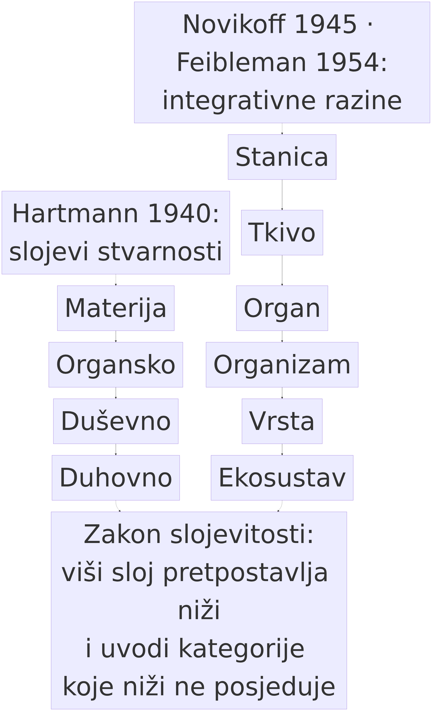

# 1. Sustavi, cjeline i organizacija — što je razina

> *Teza poglavlja:* razina nije veličina ni količina složenosti, nego **razlika u tipu svojstava** koja proizlazi iz organizacije. Ako to ne uspijemo razlučiti, cijeli daljnji tekst — o jeziku, o komunikaciji, o modelima — ostaje na razini metafore.

---

## 1.1 Cjelina i dijelovi: sustav kao organizacija, ne kao zbroj

Svaka rasprava o razinama počinje jednim gotovo banalnim uvidom: **postoje cjeline čije se ponašanje ne može pročitati iz popisa njihovih dijelova.** Ludwig von Bertalanffy, utemeljitelj opće teorije sustava, definirao je sustav kao „kompleks elemenata u interakciji" (von Bertalanffy 1968: 55) — i ta je definicija namjerno siromašna: ne govori ništa o veličini, materijalu ni svrsi, a govori sve o *relacijama*. Sustav nije *stvar*, nego **način na koji su stvari povezane**.

Herbert Simon je četiri desetljeća kasnije dodao ono što ovoj definiciji nedostaje: hijerarhiju. U predavanju „The Architecture of Complexity" (Simon 1962) pokazuje da su složeni sustavi gotovo uvijek **gotovo-razloživi** (*nearly decomposable*): sastoje se od podsustava koji su iznutra gusto povezani, a međusobno slabo. Ta arhitektura nije estetski ukras — ona je razlog zašto složeni sustavi uopće mogu nastati i opstati. Simonova poznata usporedba dva urara (jedan sastavljen od dijelova, drugi od sličnih podsklopova) pokazuje da hijerarhijska organizacija skraćuje vrijeme potrebno za nastanak sustava za redove veličine. Poruka je važna i za ovu knjigu: **hijerarhija nije samo opis nečega što postoji; ona je uvjet da to nešto uopće postoji.**

Arthur Koestler (1967) je za istu činjenicu predložio riječ koja se u literaturi zadržala: **holon** — biće koje je istovremeno cjelina i dio. Riječ je važna jer uklanja jednu čestu zabludu: da je nešto ili „dio" ili „cjelina". Riječ *holon* kaže da je to isti predmet gledan iz dvije perspektive. Kad u petom poglavlju budemo gledali riječ kao jedinicu jezika i kao element konstrukcije, i kad u drugom poglavlju budemo gledali razinu 8 (informacijski sustav) kao najvišu materijalnu i kao podlogu psihološke, radit ćemo upravo s holonima.

Iz ovoga slijedi prva radna razlika koju ćemo u knjizi stalno koristiti:

| pojam | što znači | primjer |
|---|---|---|
| **dio** | element bez unutarnje organizacije relevantne za svojstvo koje promatramo | jedan neuron u mreži, jedan token u nizu |
| **cjelina** | skup dijelova + relacije među njima, uzet zajedno | neuronska mreža, rečenica |
| **organizacija** | *uzorak* relacija, neovisno o tome koji dijelovi ga trenutačno nose | „adresiranost" u razgovoru, gramatička konstrukcija |

Treći redak tablice nosi tezu cijele knjige. Materijal se mijenja — glasovni val, slovo, vektor — a **organizacija se ponavlja**. Kad u trećem poglavlju budemo govorili o tri koraka emergencije, formula će biti upravo ova: *dijelovi → mreža → nova cjelina*, pri čemu se **materijal ne mijenja, mijenja se organizacija**.

Kako takav lanac organizacije izgleda u jednome jezičnom modelu, prikazuje slika 1.1.

**Slika 1.1.** *Levels of organisation in a language model* (vlastita izrada). Pet okvira povezanih strelicama slijeva nadesno nose oznake TOKENS, FEATURES, DISTRICTS, CIRCUITS i PLANNING, a podnožje sažima slijed: „simple parts → local interactions → structure at the system level (weakly emergent)". Slika je shema organizacije, bez brojki i bez mjerenja: oznaka *planning* pripada rječniku same slike, a knjiga o planiranju u modelu ne iznosi tvrdnju — svaka bi takva tvrdnja tražila mjeru (odjeljak 1.7).

**Zašto ovo nije trivijalno.** Moglo bi se prigovoriti: pa svaka analiza raščlanjuje na dijelove i sastavlja natrag. Odgovor je da klasična analiza pretpostavlja da će svojstva cjeline *biti zbroj* svojstava dijelova (to je načelo kompozicionalnosti u najgrubljem obliku). Sustavna perspektiva tu pretpostavku odbacuje: svojstva cjeline mogu biti **kvalitativno nova** u odnosu na dijelove, i to ne zbog misterija, nego zbog organizacije. Upravo zato Simonova „gotovo-razloživost" nije samo tehnički pojam — ona objašnjava zašto je **moguće** da iz jednostavnih dijelova nastane nešto što dijelovi ne pokazuju, a da pritom ne posegnemo za nikakvim dodatnim silama.

## 1.2 Odakle pojam: emergentno nasuprot rezultantnom (1843–1925)

Riječ „emergencija" u znanosti nije novost, i vrijedi se vratiti na početak — jer se ondje nalazi razlika koju suvremene rasprave često izgube.

John Stuart Mill je u *Sistemu logike* (1843) uočio da mehanički zakoni sastavljanja ne vrijede uvijek: postoje slučajevi u kojima je učinak zajedničkog djelovanja uzroka **heteropatski** — različit po vrsti od učinaka pojedinih uzroka. Mill još ne rabi riječ *emergencija*, ali postavlja pitanje na koje cijela tradicija odgovara: **postoji li zakon sastavljanja koji je više od zbroja?**

George Henry Lewes je u *Problems of Life and Mind* (1875) predložio razliku koja se pokazala trajnom: **rezultantni** (*resultant*) efekti su oni koji se mogu izračunati iz djelovanja sastavnica, a **emergentni** (*emergent*) oni koji se ne mogu. Nije slučajno da tu razliku uvodi netko tko je istovremeno fiziolog i filozof: živi organizam je najočitiji primjer sustava u kojem kemija daje nešto što kemija sama ne objašnjava kao zbroj.

Tridesetih i dvadesetih godina 20. stoljeća ta se razlika razvija u cijelu školu. Samuel Alexander (1920) opisuje svijet kao uspon kroz razine, s *nisusom* — težnjom k višem koja se ne može izvesti iz niže razine. Conwy Lloyd Morgan (1923) u knjizi *Emergent Evolution* daje pojmu ime i sustavan oblik: evolucija nije samo preraspodjela postojećega, nego nastajanje novih kvaliteta. Charlie Dunbar Broad (1925) u *The Mind and Its Place in Nature* uvodi najprecizniju ranu formulaciju: **emergentna kvaliteta** je svojstvo koje se ne može deducirati iz potpunog znanja o nižoj razini — i dodaje da granica dedukcije nije granica spoznaje, nego granica *zakona sastavljanja* koje poznajemo.

Ta rana rasprava ostavila je i jedan fer prigovor koji se u knjizi mora priznati: pojmovi „novo", „nepredvidljivo" i „nesvodivo" često su bili pomiješani, a razlika se često tražila u našem *neznanju* umjesto u strukturi svijeta. Zato suvremena filozofija emergencije inzistira na preciznijim definicijama — i zato ćemo se u sljedećem odjeljku vezati uz jednu od njih, a ne na cijelu tradiciju.

**Zašto je ovo i danas važno.** Kad u sedmom odjeljku ovog poglavlja budemo gledali tvrdnje o „emergentnim sposobnostima" velikih jezičnih modela, vidjet ćemo istu grešku iz 1920-ih u novoj odjeći: pojava koja izgleda kao skok često je skok *naše metode mjerenja*, a ne skok u sustavu.

## 1.3 Slaba i jaka emergencija: gdje ova knjiga namjerno staje

Mark Bedau (1997) je predložio razlikovanje koje je danas standardno. **Slaba emergencija** (*weak emergence*) jest slučaj kad je makrostanje **izvedivo** iz mikrodinamike, „ali samo simulacijom" — dakle nije nedostupno načelno, nego nedostupno u zatvorenoj formi: ne možete ga izračunati prečicom, morate odigrati proces. **Jaka emergencija** (*strong emergence*), u formulaciji kakvu daje David Chalmers (2006), znači da makrosvojstvo **nije deducibilno ni u načelu** iz istina niže domene — a takva formulacija obično dolazi s dodatnom tvrdnjom: da makrorazina djeluje na mikrorazinu kauzalno, bez premošćivanja (*downward causation*).

Izbor je ovdje konstitutivan, pa ću ga izreći otvoreno: **ova knjiga radi isključivo sa slabom emergencijom.**

Razlog nije skromnost, nego metoda. Slaba emergencija ima operativni sadržaj: možemo reći *što* treba simulirati, *koje* su relacije nužne i *koji* bi nas rezultat oborio. Jaka emergencija, u praksi rasprava, obično funkcionira kao mjesto gdje se rasprava zaustavlja: kad tvrdite da nešto nije deducibilno ni u načelu, teško je zamisliti ishod koji bi vas demantirao. A knjiga koja ne može pasti nije teorija — to je stav, i u 16. poglavlju ćemo pokazati što to znači za njezine vlastite tvrdnje.

To ne znači da je tradicija jake emergencije neozbiljna. Chalmersova formulacija ima smisla u raspravi o svijesti, gdje je „teški problem" upravo to da se ni simulacijom ne dobiva *iskustvo*. Ali kad govorimo o jeziku, komunikaciji i modelima, nemamo takav slučaj: imamo sustav koji možemo opisati kao proces. Zato je slaba emergencija ne samo dovoljna, nego i **poštenija** — ona ne tvrdi više nego što se može provjeriti.

Vrijedi uočiti i treći, najčešći položaj u praksi, onaj koji Bedau zove nominalnom emergencijom: „emergentno" samo zato što je neopisivo ili složeno. Na taj se položaj u knjizi nećemo oslanjati. Kad god napišemo „emergentno", mora postojati odgovor na dva pitanja: **koja je niža razina** i **koji je zakon sastavljanja** koji onemogućuje prečicu.

## 1.4 Vrijednost svojstva je uvijek relativna prema razini

Treća je točka ona koja ovoj knjizi daje naslov. Danski filozofi Claus Emmeche, Simo Køppe i Frederik Stjernfelt u članku „Explaining Emergence" (1997) formuliraju naizgled jednostavnu, a zapravo odlučujuću tvrdnju: **emergentno svojstvo uvijek je relativno prema razini organizacije.** Ne postoji „emergentno svojstvo po sebi". Postoji svojstvo koje je *za* neku razinu novo, a *za* nižu razinu nije: temperatura je nova na razini mnoštva čestica (nijedna čestica nema temperaturu), a čvrstoća je nova na razini kristalne rešetke (nijedan atom nije „čvrst"). I obrnuto: ono što je na višoj razini jedinstveno svojstvo — „rečenica je istinita" — na nižoj se raspada u fonetske, morfološke i sintaktičke činjenice, a istinitost među njima ne postoji.

Iz relativnosti proizlazi i **definicija razine** koju ćemo upotrebljavati u ovoj knjizi:

> **Razina je skup entiteta i relacija kod kojih vrijedi isti tip svojstava i isti tip zakona sastavljanja.**

Ta definicija ima tri posljedice koje treba odmah izreći, jer se na njima u drugom poglavlju gradi OMLCC.

**Prvo**, razina nije klasa stvari, nego **klasa svojstava i relacija**. Dvije vrlo različite stvari mogu biti na istoj razini (srce i pumpa — ako ih promatramo na razini mehanizma), a jedna te ista stvar može biti na više razina (taj isti srce: materijalna struktura, fiziološka funkcija, društveni simbol). Time se izbjegava klasična zbrka u kojoj se „razina" čita kao kategorija u kojoj stvari *jesu*, umjesto kao **odnos prema svojstvu koje promatramo**.

**Drugo**, razina je **operacionalizabilna**: ako znamo koji tip svojstva tražimo i koji tip relacija ga nosi, možemo provjeriti je li nešto na toj razini. U četvrtom poglavlju to ćemo primijeniti na podatke — a bez toga bi cijela knjiga bila filozofija bez ruku.

**Treće**, i najvažnije za temu: **svojstva koja su „nova" za neku razinu ne moraju biti mistična.** Ona su nova zato što su *relacijska organizirano*: postoje samo u uzorku, ne u dijelovima. Ova se tvrdnja u četvrtom poglavlju pretvara u mjerni zadatak, a u trećem u postupak (tri koraka).

**Mala provjera na primjeru koji će nam trebati.** Uzmimo riječ *strah*. Na razini materijalne strukture to je niz slova (ili, u govoru, akustički obrazac). Na razini informacijskog sustava to je oznaka koja nosi razliku prema drugim oznakama. Na razini afekta to je *znak za stanje*, dio kognitivno-afektivnog aparata onoga koji ga rabi. Na razini komunikacije to je *čin* kojim se nešto tvrdi, priznaje ili zahtijeva. Na razini kulturnog modela to je dio šireg obrasca koji u hrvatskom jeziku povezuje *strah* s *užasom*, *tjeskobom*, *panikom* — i taj obrazac ne postoji ni u jednom pojedinom govorniku kao gotova cjelina (Perak 2014; EmoCNet 2019–21). Jedna riječ, pet razina, pet različitih tipova svojstava. **Nitko od njih ne objašnjava ostale, i nijedan nije „samo" niža razina u prerušenom obliku.** To je cijela poanta ove knjige u jednom primjeru.

## 1.5 Hijerarhija razina: od biologije do ontologije

Ako razine nisu puko naše pomagalo za snalaženje, nego nešto u strukturi svijeta, mora se pokazati gdje se to vidi. Tri su tradicije to učinile na način koji ova knjiga preuzima.

**Integrativne razine u biologiji.** Alexander Novikoff (1945) u kratkom tekstu u *Scienceu* formulira ono što je postalo radni program: živa tvar organizirana je u razine — stanica, tkivo, organ, organizam, vrsta, ekosustav — i svaka razina ima svoja svojstva koja se ne mogu pripisati nižima. Joseph Feibleman (1954) tu misao razvija u „teoriju integrativnih razina": viša razina *uključuje* nižu, ali njome ne upravlja po njezinim pravilima; integracija je proces u kojem niže jedinice postaju dijelovi više cjeline i time stječu nove relacije. To je formula koju ćemo u trećem poglavlju zvati jednostavno *tri koraka*.

**Slojevi stvarnosti u ontologiji.** Nicolai Hartmann u *Der Aufbau der realen Welt* (1940) razradio je ono što je danas najozbiljnija „stara" ontologija razina: *Schichtenlehre*, nauk o slojevima. Hartmann razlikuje slojeve (materija, organsko, duševno, duhovno) i tvrdi da među njima vrijede zakoni slojevitosti: viši sloj **pretpostavlja** niži, ali uvodi kategorije koje niži ne posjeduje (*kategorijalna novost*), a pritom **ostaje utemeljen** u nižemu (*zakon snažnijeg nižeg sloja*). Njegovo je jaka tvrdnja da viši sloj nikada ne može biti shvaćen iz nižega, a slabi da viši ne može opstati bez nižega. Ovo je, u terminologiji ove knjige, precizno formuliran **ontološki emergentizam** — i zato je Hartmann jedan od okosnih izvora drugog poglavlja, u kojem se razine ne izvode iz primjera, nego iz tipova svojstava.

Isti se slijed slojeva, u najkraćemu obliku, vidi na slici 1.2.

**Slika 1.2.** Dvije ljestvice jedna uz drugu. Lijevo su **slojevi stvarnosti** (Hartmann 1940): Materija → Organsko → Duševno → Duhovno. Desno su **integrativne razine** (Novikoff 1945; Feibleman 1954): Stanica → Tkivo → Organ → Organizam → Vrsta → Ekosustav. Ispod obiju stoji zakon slojevitosti: *viši sloj pretpostavlja niži i uvodi kategorije koje niži ne posjeduje.* Slika je shema, bez brojki i bez mjerenja; izvor: vlastita izrada (Perak 2026).

**Stratificirani realizam u filozofiji znanosti.** Roy Bhaskar u *A Realist Theory of Science* (1975) uvodi razliku koja je za nas operativno najkorisnija: razliku između domene **realnog** (mehanizmi i kauzalne moći), domene **aktualnog** (događaji) i domene **empirijskog** (opažaji). Znanost je moguća jer su mehanizmi realni i djeluju i kad ih ne opažamo. Ta je razlika važna zato što nas štiti od zamke koja u istraživanjima jezika i modela vreba na svakom koraku: **iz odsutnosti opažaja ne slijedi odsutnost mehanizma**, a iz prisutnosti korelacije ne slijedi postojanje mehanizma.

**Fizika kao korektiv.** Philip Anderson je 1972. godine u tekstu „More Is Different" u *Scienceu* izrekao ono što svaka teorija razina mora uvažiti: na svakoj razini složenosti vrijede *novi* zakoni, i ne postoji način da se iz nižih zakona izvedu viši bez uzimanja u obzir organizacije mnoštva. Andersonov argument je pošten i suzdržan: ne tvrdi metafizičku novost, tvrdi **epistemološku neizvedivost u praksi**. Upravo je takav stav i stav ove knjige.

Iz ove četiri tradicije proizlazi shema koju knjiga rabi:

| razina | što je nosivo | tip svojstva (primjer) | tko je to formulirao |
|---|---|---|---|
| materijalna | struktura i sile | temperatura, vodljivost | Novikoff 1945; Hartmann 1940 |
| informacijska | razlike i oznake | „nosi razliku", kod | Feibleman 1954; Simon 1962 |
| psihološka | nositelj s afektom i kognicijom | „osjeća", „zna" | Hartmann 1940; Searle 1992 |
| društvena | priznanje i obveza | „vrijedi kao", „duguje" | Searle 1995; Bhaskar 1975 |
| komunikacijska | namjera i zajednički artefakt | „kaže", „preuzima obvezu" | Grice 1957; Harris 1981 |

*(Tablica je skica; u drugom poglavlju svaka od tih rubrika postaje razina s vlastitom relacijskom shemom.)*

## 1.6 Najozbiljniji prigovor: zar nije sve ipak samo fizika?

Svaka tvrdnja o razinama mora se suočiti s prigovorom koji je najbolje formulirao Jaegwon Kim (1999): ako je više svojstvo **supervenijentno** — ako nužno slijedi iz nižega, tako da je nemoguće da niže ostane isto, a više se promijeni — onda je svaki kauzalni rad koji pripišemo višemu svojstvu već obavilo niže svojstvo, i to dvaput. To je problem **kauzalnog isključivanja**. Ako više svojstvo ne dodaje kauzalnu moć, ono je epifenomen; ako dodaje, moramo objasniti kako, a da ne prekršimo zatvorenost fizike.

Knjiga na taj prigovor odgovara na tri načina, i sva tri su izbjegavanja, ne rješenja — što treba reći otvoreno.

**Prvo**, ne tvrdimo *downward causation* u jakom smislu. Donald Campbell (1974) i Karl Popper s Johnom Ecclesom (1977) dopuštali su da viša razina selektivno djeluje na nižu; u ovoj knjizi takve tvrdnje nisu potrebne. Dovoljno nam je da organizacija dijelova **mijenja učinke** koje dijelovi proizvode — a to je već tvrdnja o sastavljanju, ne o dodatnoj sili.

**Drugo**, razine u ovoj knjizi nisu kategorije bića, nego **kategorije opisa i mjerenja**. To ih ne čini proizvoljnima (relacijska organizacija je stvarna), ali ih čini **provjerljivima**: u petom poglavlju razina 14 mora pokazati razliku u podacima, inače nije potrebna.

**Treće**, Kimov prigovor ostaje na snazi kao **trajno ograničenje**: ako se u nekom slučaju pokaže da viša razina ne dodaje ništa ni opisu ni predviđanju, moramo odustati od nje u tom slučaju. To je razlog zašto svako poglavlje ove knjige završava odjeljkom „Kako bismo znali da griješimo". U 14. poglavlju taj će prigovor dobiti svoj najoštriji oblik: ako „funkcionalni parnjaci" društvenih razina u agentskim sustavima nisu razlučivi od „pravih" slučajeva nijednim mjerljivim kriterijem, onda je razlika verbalna — i knjiga to mora priznati.

## 1.7 Što razina NIJE — i jedna vrlo recentna pouka iz AI-a

Tri stvari koje „razina" ne znači, a koje se u literaturi i u javnoj raspravi neprestano vraćaju:

1. **Razina nije mjerilo veličine.** Veće nije više. Model s 10¹² parametara nije „na višoj razini" od gljive; on je složeniji po broju dijelova, ali tip svojstava može biti niži. (Ovo će u 10. poglavlju dobiti i empirijsku potporu: Thompson 2026 i njegova napomena da je rangiranje po veličini modela suvišno — „veći modeli nisu bolji modeli".)
2. **Razina nije vrijednosna ljestvica.** „Više" ne znači bolje, plemenitije ni svrhovitije. Čovjek nije „viši" od ekosustava; ekosustav nije „viši" od stanice. Razine su razlike u tipu svojstava, ne u dostojanstvu.
3. **Razina nije stupanj našeg neznanja.** Pojam koji se koristi kad nešto ne znamo objasniti („emergentno" kao „nerazumljivo") nije pojam o kojem ova knjiga govori.

Tu treću točku najbolje ilustrira **najsvježija pouka iz istraživanja velikih jezičnih modela**, i vrijedi je ispričati jer pokazuje da je metodološka stega o kojoj govorimo praktično, a ne akademsko pitanje.

Godine 2022. tim iz Googlea i drugih institucija objavio je rad „Emergent Abilities of Large Language Models" (Wei et al. 2022, *TMLR*): na nizu zadataka sposobnost modela izgleda kao da se **ne pojavljuje postupno, nego skokovito** nakon određenog broja parametara ili koraka učenja. Zaključak se proširio u javnosti kao opća tvrdnja o „emergentnim sposobnostima" umjetne inteligencije.

Godinu kasnije, Rylan Schaeffer i suradnici objavili su rad pod naslovom koji je postao poznat: „Are Emergent Abilities of Large Language Models a Mirage?" (Schaeffer et al. 2023, *NeurIPS*). Njihov argument nije bio da su modeli lošiji, nego da **skok može biti artefakt metrike**. Ako mjerite sposobnost mjerom s nelinearnim pragom (npr. „točno ili ništa" ili višestruko podudaranje), mali pomak u vjerojatnosti točnog odgovora prelazi prag i rezultat izgleda kao skok iz nule u jedinicu. Istu procjenu vjerojatnosti, mjerenu kontinuirano, vidjeli biste kao gladak porast. Pokazali su to i empirijski: na istim modelima i istim podacima „emergencija" se pojavljuje ili nestaje ovisno o izboru mjere.

Pouka za ovu knjigu je trostruka i vrijedi za svako poglavlje koje slijedi:

- **skok u grafu nije skok u sustavu** dok se ne pokaže da nije posljedica mjere;
- **mjera je dio tvrdnje** — ne može se tvrditi razina, a prešutjeti instrument;
- i, što je najvažnije, **pojava koja se ne može razlučiti od artefakta mjerenja mora se prijaviti kao nerazlučiva.**

S time je povezan i zanimljiv nalaz iz istraživanja skaliranja: kvantizacijski model neuronskog skaliranja (Michaud et al. 2023, *NeurIPS*) pokazuje da se napredak na mnogim mjerama može opisati kao postupno uključivanje „kvanta" — zasebnih naučenih struktura — tako da porast nije ni čudesan ni gladak, nego **sastavljen od dijelova**. To je u potpunosti u duhu ove knjige: ono što se na jednoj mjeri vidi kao skok, na razini organizacije vidi se kao integracija. Razlika je između pitanja *„je li sposobnost skočila?"* i pitanja *„što se u sustavu organiziralo?"* — a samo drugo pitanje vodi prema odgovoru.

## 1.8 Kako ćemo postupati u ovoj knjizi

Sažmimo pravila koja vrijede od ovog poglavlja do kraja knjige.

1. **Radimo sa slabom emergencijom** (Bedau 1997): makrosvojstvo je izvedivo iz mikrodinamike, ali samo simulacijom. Nikad ne tvrdimo jaku emergenciju (Chalmers 2006) — ni za jezik, ni za komunikaciju, ni za modele.
2. **Razina je relativna prema tipu svojstva** (Emmeche, Køppe & Stjernfelt 1997). Prije svake tvrdnje o razini mora stajati odgovor: *koje svojstvo, koja niža razina, koji zakon sastavljanja.*
3. **Razina je klasa svojstava i relacija, ne klasa stvari.** Ista stvar može biti na više razina; dvije različite stvari mogu biti na istoj.
4. **Tvrdnja o razini je mjerljiva tvrdnja.** Ako se ne može razlučiti od artefakta mjere, prijavljuje se kao nerazlučiva (pouka Schaeffer et al. 2023).
5. **Ontološki okvir se ne izmišlja iznova.** Podjela na materijalno, psihološko i društveno preuzeta je od Searlea (1995; 2010); slojevitost stvarnosti od Hartmanna (1940) i Bhaskara (1975); hijerarhija i integrativne razine od Simona (1962), Novikoffa (1945) i Feiblemana (1954). **Naš je doprinos razrada na šesnaest razina i njihove relacijske sheme** — i to je ono što sljedeće poglavlje izlaže.

### Kako bismo znali da griješimo

- Ako se za **svako** svojstvo koje u knjizi nazivamo „razinom" pokaže da je izvedivo iz niže razine bez simulacije (u zatvorenoj formi), okvir razina nema posla i prva tvrdnja knjige pada.
- Ako se pokaže da razlike među razinama nestaju čim se kontrolira veličina uzorka, vrsta teksta i mjera (četvrto poglavlje), „razina" je artefakt i knjiga mora prijeći na ravni model.
- Ako Kimov prigovor (1999) u nekom konkretnom slučaju pokaže da viša razina ne dodaje ništa ni opisu ni predviđanju, **odustajemo od te razine u tom slučaju** — i to zapisujemo.

### Vježbe

🟢 **Provjeri razumijevanje.** Za sljedećih osam svojstava navedi razinu i nižu razinu od koje ga razlikuješ: *temperatura vode · smisao rečenice · obveza iz obećanja · crvena boja lista · značenje riječi „kuća" · brojanje do deset · „kralj je mrtav, živio kralj!" · vektorska udaljenost dvaju leksema.* Za svako napiši jednu rečenicu: što je niža razina i zašto svojstvo nije njezin zbroj.

🟡 **Primijeni na vlastite podatke.** Uzmi popis od dvadeset riječi iz svojeg područja i za svaku napiši koje bi svojstvo pripadalo razini materijalne strukture, koje informacijskog sustava, a koje psihološke razine. Označi one slučajeve gdje ne možeš odlučiti — oni su najzanimljiviji i vraćamo im se u sljedećem poglavlju.

🏆 **Istraživački zadatak.** Odaberi jednu tvrdnju o „emergentnoj sposobnosti" iz recentne literature (2022–2026) i provedi test koji su predložili Schaeffer et al. (2023): provjeri kako se zaključak mijenja kad se mjera zamijeni kontinuiranom. Napiši kratko izvješće: (a) koja je mjera upotrijebljena, (b) kako izgleda isti podatak uz kontinuiranu mjeru, (c) ostaje li tvrdnja o skoku. Ako ne ostaje — to nije neuspjeh: to je rezultat.

### Sažetak

- Sustav je organizacija elemenata u interakciji (von Bertalanffy 1968: 55); složeni su sustavi hijerarhijski i gotovo-razloživi (Simon 1962), a njihove su jedinice istovremeno cjeline i dijelovi — *holoni* (Koestler 1967).
- Razlika između rezultantnih i emergentnih efekata stara je više od stoljeća (Mill 1843; Lewes 1875) i prošla je kroz klasičnu školu (Alexander 1920; Morgan 1923; Broad 1925).
- **Slaba emergencija** (Bedau 1997): izvedivo je, ali samo simulacijom. **Jaka emergencija** (Chalmers 2006): nededucibilno ni u načelu. Ova knjiga radi samo s prvom.
- **Svojstvo je uvijek relativno prema razini organizacije** (Emmeche, Køppe & Stjernfelt 1997); razina je klasa svojstava i relacija, ne klasa stvari.
- Ontologija razina ima ozbiljnu tradiciju: Hartmannova *Schichtenlehre* (1940), Bhaskarova stratificirana stvarnost (1975), integrativne razine u biologiji (Novikoff 1945; Feibleman 1954), Andersonovo „More Is Different" (1972).
- Najozbiljniji prigovor — problem kauzalnog isključivanja (Kim 1999) — knjiga prihvaća kao trajno ograničenje, a ne rješava ga.
- **Pouka iz AI-a:** „emergentne sposobnosti" mogu biti artefakt mjere (Wei et al. 2022 prema Schaeffer et al. 2023) — zato je mjera dio tvrdnje, a ne dodatak.

### Ključni pojmovi

*organizacija · holon · gotovo-razloživost · rezultantno/emergentno · slaba emergencija · jaka emergencija · kauzalno isključivanje · kauzalna moć · razina · relativnost svojstva · integrativna razina · slojevitost stvarnosti · supervenijencija · artefakt mjere*

### Literatura poglavlja

Alexander 1920 · Anderson 1972 · Bedau 1997 · Bhaskar 1975 · Broad 1925 · Campbell 1974 · Chalmers 2006 · Emmeche, Køppe & Stjernfelt 1997 · Feibleman 1954 · Hartmann 1940 · Kim 1999 · Koestler 1967 · Lewes 1875 · Michaud et al. 2023 · Mill 1843 · Morgan 1923 · Novikoff 1945 · Popper & Eccles 1977 · Schaeffer et al. 2023 · Searle 1992, 1995, 2010 · Simon 1962 · Thompson 2026 · von Bertalanffy 1968 · Wei et al. 2022
