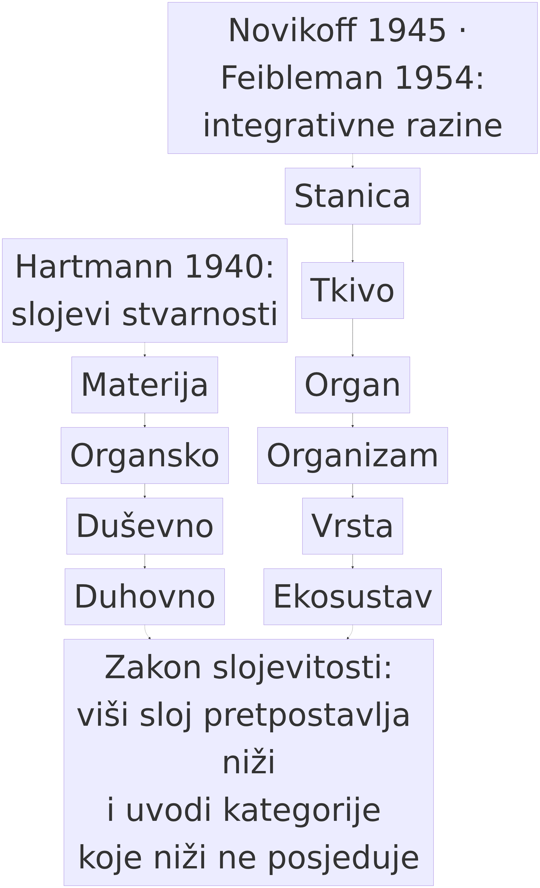

# 1. Sustavi, cjeline i organizacija — što je razina

> *Teza poglavlja:* razina nije veličina ni količina složenosti, nego razlika u tipu svojstava koja proizlazi iz organizacije. Ako to ne razlučimo, sve dalje — o jeziku, o komunikaciji, o modelima — ostaje na razini metafore.

---

## 1.1 Cjelina i dijelovi: sustav kao organizacija, ne kao zbroj

Uzmimo vodu i njezinu temperaturu: ona postoji na razini mnoštva čestica, a nijedna je pojedina čestica nema. Isto tako, **čvrstoća** je nova na razini kristalne rešetke, jer nijedan atom nije „čvrst". Popis dijelova ne sadrži nijedno od tih svojstava, a o njima ipak govorimo kao o nečemu stvarnome. Tu prazninu svaka rasprava o razinama mora objasniti, i tu počinje i ova knjiga.

U raspravi se odmah pojave dva odgovora. Prvi kaže da su takva svojstva samo način govora i da je, u temelju, sve fizika nižih dijelova. Drugi kaže da je riječ o **emergenciji**, o nečemu doista novome što se iz dijelova ne može izvesti. Odgovori izgledaju suprotno, a dijele istu prazninu: nijedan ne kaže *koja je niža razina* ni *koji zakon sastavljanja* nosi to svojstvo. Zato se o njima ne odlučuje, nego se samo nabrajaju primjeri, a ono što ne može pasti nije teorija, nego stav (odjeljak 1.3).

Ni uvid nije nov, i to je dio nevolje. Ludwig von Bertalanffy definirao je sustav kao „kompleks elemenata u interakciji" (von Bertalanffy 1968: 55): definicija koja ne govori ništa o veličini, materijalu ni svrsi, a govori sve o relacijama. Herbert Simon dodao je četrdeset godina kasnije hijerarhiju i pokazao da su složeni sustavi **gotovo-razloživi** (Simon 1962), a Arthur Koestler za jedinicu koja je istovremeno cjelina i dio predložio je riječ **holon** (Koestler 1967). Sve je to imenovanje iste činjenice; ono što u njoj nedostaje jest razlika po kojoj se odlučuje o *tipu* svojstva, a ne samo nabraja.

Oblik gotovog odgovora zato nije novo mišljenje, nego zapis, i on se može pokazati odmah. Tvrdnja o razini zapisuje se u pet redaka — *svojstvo · niža razina · zakon sastavljanja · prečica (ima/nema) · ishod* — a ishod je jedno od triju: **rezultantno**, **slabo emergentno** ili **nerazlučivo od mjere** (odjeljak 1.9). Zapis ima i svoju cijenu: ako se pokaže da je svojstvo izvedivo iz niže razine bez simulacije, u zatvorenoj formi, okvir razina nema posla i prva tvrdnja knjige pada (odjeljak 1.9). Čitatelj odatle dobiva ime za mjesto, razliku koja ga čuva od dviju pogrešaka — od čitanja razine kao veličine i od čitanja razine kao stupnja neznanja — postupak izvediv na vlastitome materijalu i mjesto na kojemu bi tvrdnja pala.

**Što vam ovo poglavlje daje.** Teza ovoga poglavlja, običnim jezikom, glasi: *„razina" ne znači da je čega više ni da je što veće, nego da se pojavljuje nešto druge vrste, i to ne u pojedinome dijelu, nego u njihovu rasporedu.* U svojem materijalu — popisu riječi, korpusu, vlastitim bilješkama — moći ćete pokazati na što mislite kad nešto nazovete razinom. Kad u razgovoru netko tvrdi da je nešto „na višoj razini", imat ćete pitanje koje to razlučuje: koja je tu vrsta svojstva nova, a gdje je ima samo cjelina? Tako i vlastita tvrdnja dobiva mjesto na kojemu se provjerava, a ne primjer koji je brani (→ pogl. 1.9).

Iz toga slijedi prva radna razlika koju ćemo u knjizi stalno rabiti:

| pojam | što znači | primjer |
|---|---|---|
| **dio** | element bez unutarnje organizacije relevantne za svojstvo koje promatramo | jedan neuron u mreži, jedan token u nizu |
| **cjelina** | skup dijelova + relacije među njima, uzet zajedno | neuronska mreža, rečenica |
| **organizacija** | *uzorak* relacija, neovisno o tome koji dijelovi ga trenutačno nose | „adresiranost" u razgovoru, gramatička konstrukcija |

Treći redak tablice nosi tezu cijele knjige. Materijal se mijenja — glasovni val, slovo, vektor — a organizacija se ponavlja. Kad u trećem poglavlju budemo govorili o tri koraka emergencije, formula će biti ova: *dijelovi → mreža → nova cjelina*, pri čemu se materijal ne mijenja, mijenja se **organizacija**.

Kako takav lanac organizacije izgleda u jednome jezičnom modelu, prikazuje slika 1.1.

**Slika 1.1.** *Levels of organisation in a language model* (vlastita izrada). Pet okvira povezanih strelicama slijeva nadesno nose oznake TOKENS, FEATURES, DISTRICTS, CIRCUITS i PLANNING, a podnožje sažima slijed: „simple parts → local interactions → structure at the system level (weakly emergent)". Slika je shema organizacije, bez brojki i bez mjerenja: oznaka *planning* pripada rječniku same slike, a knjiga o planiranju u modelu ne iznosi tvrdnju — svaka bi takva tvrdnja tražila mjeru (odjeljak 1.7).

Moglo bi se prigovoriti: pa svaka analiza raščlanjuje na dijelove i sastavlja natrag. Odgovor je da klasična analiza pretpostavlja kako će svojstva cjeline *biti zbroj* svojstava dijelova, što je načelo kompozicionalnosti u najgrubljem obliku. To je pretpostavka, ne zakon. Sustavna perspektiva tu pretpostavku odbacuje: svojstva cjeline mogu biti kvalitativno nova u odnosu na dijelove, i to ne zbog misterija, nego zbog organizacije. Zato Simonova **gotovo-razloživost** nije samo tehnički pojam. Ona objašnjava zašto je *moguće* da iz jednostavnih dijelova nastane nešto što dijelovi ne pokazuju, a da pritom ne posegnemo za nikakvim dodatnim silama.

## 1.2 Odakle pojam: emergentno nasuprot rezultantnom (1843–1925)

Riječ *emergencija* u znanosti nije novost. Vrijedi se vratiti na početak, jer se ondje nalazi razlika koju suvremene rasprave često izgube.

John Stuart Mill je u *Sistemu logike* (1843) uočio da mehanički zakoni sastavljanja ne vrijede uvijek: postoje slučajevi u kojima je učinak zajedničkog djelovanja uzroka **heteropatski**, dakle različit po vrsti od učinaka pojedinih uzroka. Mill još ne rabi riječ *emergencija*, ali postavlja pitanje na koje cijela tradicija odgovara: postoji li zakon sastavljanja koji je više od zbroja?

George Henry Lewes je u *Problems of Life and Mind* (1875) predložio razliku koja se pokazala trajnom: **rezultantni** (*resultant*) efekti jesu oni koji se mogu izračunati iz djelovanja sastavnica, a **emergentni** (*emergent*) oni koji se ne mogu. Razliku uvodi fiziolog koji je pisao i filozofiju; granica koju povlači jest granica između izračunljivoga i neizračunljivoga. Živi organizam najočitiji je primjer sustava u kojemu kemija daje nešto što kemija sama kao zbroj ne objašnjava.

Tijekom dvadesetih i tridesetih godina 20. stoljeća ta se razlika razvija u cijelu školu. Samuel Alexander (1920) opisuje svijet kao uspon kroz razine, s *nisusom*, težnjom k višem koja se ne može izvesti iz niže razine. Conwy Lloyd Morgan (1923) u knjizi *Emergent Evolution* daje pojmu ime i sustavan oblik: evolucija nije samo preraspodjela postojećega, nego nastajanje novih kvaliteta. Charlie Dunbar Broad (1925) u *The Mind and Its Place in Nature* uvodi najprecizniju ranu formulaciju: **emergentna kvaliteta** jest svojstvo koje se ne može deducirati iz potpunog znanja o nižoj razini. Broad pritom dodaje da granica dedukcije nije granica spoznaje, nego granica *zakona sastavljanja* koje poznajemo. Nasuprot redukcionističkom čitanju, ta granica nije u našem neznanju, nego u ustroju svijeta.

Ta rana rasprava ostavila je i jedan fer prigovor koji se u knjizi mora priznati: pojmovi „novo", „nepredvidljivo" i „nesvodivo" često su bili pomiješani, a razlika se često tražila u našem *neznanju* umjesto u strukturi svijeta. Zato suvremena filozofija emergencije inzistira na preciznijim definicijama, i zato ćemo se u sljedećem odjeljku vezati uz jednu od njih, a ne na cijelu tradiciju.

To nije samo povijesna bilješka. Kad u sedmom odjeljku ovoga poglavlja budemo gledali tvrdnje o „emergentnim sposobnostima" velikih jezičnih modela, vidjet ćemo istu grešku iz dvadesetih godina u novoj odjeći: pojava koja izgleda kao skok često je skok *naše metode mjerenja*, a ne skok u sustavu. Odatle ulazimo u sljedeći odjeljak s pitanjem koje ta tradicija ostavlja otvorenim: što se od novosti može izvesti, a što ne.

## 1.3 Slaba i jaka emergencija: gdje ova knjiga namjerno staje

Tu povijesnu razliku Mark Bedau (1997) dijeli na danas standardan način: **slabu** i **jaku** emergenciju. **Slaba emergencija** (*weak emergence*) jest slučaj kad je makrostanje *izvedivo* iz mikrodinamike, „ali samo simulacijom"; dakle nije nedostupno načelno, nego nedostupno u zatvorenoj formi: ne može se izračunati prečicom, mora se odigrati proces. **Jaka emergencija** (*strong emergence*), u formulaciji kakvu daje David Chalmers (2006), znači da makrosvojstvo *nije deducibilno ni u načelu* iz istina niže domene. Takva formulacija obično dolazi s dodatnom tvrdnjom: da makrorazina djeluje na mikrorazinu kauzalno, bez premošćivanja (*downward causation*).

Izbor je ovdje konstitutivan. Izričem ga otvoreno: ova knjiga radi isključivo sa **slabom emergencijom**, dok jaku, nasuprot njoj, ostavlja izvan svojega predmeta i izvan svojih mjerila.

Razlog nije skromnost, nego metoda. Slaba emergencija ima operativni sadržaj: možemo reći *što* treba simulirati, *koje* su relacije nužne i *koji* bi nas rezultat oborio. Jaka emergencija, u praksi rasprava, obično funkcionira kao mjesto gdje se rasprava zaustavlja: kad tvrdite da nešto nije deducibilno ni u načelu, teško je zamisliti ishod koji bi vas demantirao. A knjiga koja ne može pasti nije teorija, nego stav; u 16. poglavlju pokazat ćemo što to znači za njezine vlastite tvrdnje.

Najozbiljniji suvremeni pokušaj da se emergencija ne opisuje nego *mjeri* jest **kausalna emergencija**, mjera koja pokazuje koliko je integrirani sustav više od zbroja svojih dijelova. Primijenjena na genske regulacijske mreže, ta mjera *raste s učenjem*: u 29 bioloških mreža integrativna kausalna emergencija povećava se nakon treninga, a odgovori se razvrstavaju u pet obrazaca (Pigozzi, Goldstein & Levin 2025; mjereno). Za ovu je knjigu važno što ta mjera *ne* tvrdi: ona ne pokazuje da makrostanje nije izvedivo iz niže razine, nego *koliko je integrirano*, pa ostaje u domeni slabe emergencije i ne uvodi *downward causation*. Uz citat ide i napomena koju zahtijeva pravilo o izvorima: rad je 23. 2. 2026. dobio *ispravak autora* (DOI 10.1038/s42003-026-09668-x), pa se navodi s tom oznakom.

To ne znači da je tradicija jake emergencije neozbiljna. Ona, naprotiv, ima smisla u raspravi o svijesti, gdje je „teški problem" upravo to da se ni simulacijom ne dobiva *iskustvo*. Ali kad govorimo o jeziku, komunikaciji i modelima, takav slučaj nemamo: imamo sustav koji možemo opisati kao proces. Zato je slaba emergencija ne samo dovoljna, nego i *poštenija*: ona ne tvrdi više nego što se može provjeriti.

Vrijedi uočiti i treći, najčešći položaj u praksi, onaj koji Bedau zove **nominalnom emergencijom**: „emergentno" samo zato što je neopisivo ili složeno. Na taj se položaj u knjizi nećemo oslanjati. Kad god napišemo „emergentno", mora postojati odgovor na dva pitanja: *koja je niža razina* i *koji je zakon sastavljanja* koji onemogućuje prečicu.

## 1.4 Vrijednost svojstva je uvijek relativna prema razini

Treća je točka ona koja ovoj knjizi daje naslov. Danski filozofi Claus Emmeche, Simo Køppe i Frederik Stjernfelt u članku „Explaining Emergence" (1997) formuliraju naizgled jednostavnu, a zapravo odlučujuću tvrdnju: *emergentno svojstvo uvijek je relativno prema razini organizacije*. Ne postoji „emergentno svojstvo po sebi". Postoji svojstvo koje je *za* neku razinu novo, a *za* nižu razinu nije: temperatura je nova na razini mnoštva čestica, jer nijedna čestica nema temperaturu, a čvrstoća je nova na razini kristalne rešetke, jer nijedan atom nije „čvrst". I obrnuto: ono što je na višoj razini jedinstveno svojstvo — „rečenica je istinita" — na nižoj se raspada u fonetske, morfološke i sintaktičke činjenice, a istinitost među njima ne postoji.

Iz relativnosti proizlazi i definicija razine koju ćemo u ovoj knjizi upotrebljavati:

> **Razina je skup entiteta i relacija kod kojih vrijedi isti tip svojstava i isti tip zakona sastavljanja.**

Ta definicija ima tri posljedice koje treba odmah izreći, jer se na njima u drugom poglavlju gradi OMLCC.

Najprije, razina nije klasa stvari, nego *klasa svojstava i relacija*. Dvije vrlo različite stvari mogu biti na istoj razini (srce i pumpa, ako ih promatramo na razini mehanizma), a jedna te ista stvar može biti na više razina (to isto srce: materijalna struktura, fiziološka funkcija, društveni simbol). Time se izbjegava klasična zbrka u kojoj se „razina" čita kao kategorija u kojoj stvari *jesu*, umjesto kao *odnos prema svojstvu koje promatramo*.

Zatim, razina je *operacionalizabilna*: ako znamo koji tip svojstva tražimo i koji tip relacija ga nosi, možemo provjeriti je li nešto na toj razini. U četvrtom poglavlju to ćemo primijeniti na podatke, a bez toga bi cijela knjiga bila filozofija bez ruku.

Naposljetku, i za temu najvažnije: svojstva koja su „nova" za neku razinu ne moraju biti mistična. Ona su nova zato što su *relacijski organizirana*: postoje samo u uzorku, ne u dijelovima. Ta se tvrdnja u četvrtom poglavlju pretvara u mjerni zadatak, a u trećem u postupak od tri koraka.

Primjer koji će nam trebati. Uzmimo riječ *strah*. Na razini materijalne strukture to je niz slova, ili u govoru akustički obrazac. Na razini informacijskog sustava to je oznaka koja nosi razliku prema drugim oznakama. Na razini afekta to je *znak za stanje*, dio kognitivno-afektivnog aparata onoga koji ga rabi. Na razini komunikacije to je *čin* kojim se nešto tvrdi, priznaje ili zahtijeva. Na razini kulturnog modela to je dio šireg obrasca koji u hrvatskom jeziku povezuje *strah* s *užasom*, *tjeskobom* i *panikom*, a taj obrazac ne postoji ni u jednom pojedinom govorniku kao gotova cjelina (Perak 2014; EmoCNet 2019–21). Jedna riječ, pet razina, pet različitih tipova svojstava. Nijedna od tih razina ne objašnjava ostale, i nijedna nije „samo" niža razina u prerušenom obliku. To je cijela poanta ove knjige u jednom primjeru.

## 1.5 Hijerarhija razina: od biologije do ontologije

Ako razine nisu puko naše pomagalo za snalaženje, nego nešto u strukturi svijeta, mora se pokazati gdje se to vidi. Tri su tradicije to učinile na način koji ova knjiga preuzima. Za razliku od čitanja razina kao pukoga pomagala za snalaženje, te tradicije brane njihovo mjesto u strukturi svijeta.

*Integrativne razine u biologiji.* Alexander Novikoff (1945) u kratkom tekstu u *Scienceu* formulira ono što je postalo radni program: živa je tvar organizirana u razine — stanica, tkivo, organ, organizam, vrsta, ekosustav — i svaka razina ima svoja svojstva koja se ne mogu pripisati nižima. Joseph Feibleman (1954) tu misao razvija u „teoriju integrativnih razina": viša razina *uključuje* nižu, ali njome ne upravlja po njezinim pravilima; integracija je proces u kojem niže jedinice postaju dijelovi više cjeline i time stječu nove relacije. Integracija nije zbroj. To je formula koju ćemo u trećem poglavlju zvati jednostavno **tri koraka**.

*Slojevi stvarnosti u ontologiji.* Nicolai Hartmann u *Der Aufbau der realen Welt* (1940) razradio je ono što je danas najozbiljnija „stara" ontologija razina: *Schichtenlehre*, nauk o slojevima. Hartmann razlikuje slojeve (materija, organsko, duševno, duhovno) i tvrdi da među njima vrijede zakoni slojevitosti: viši sloj *pretpostavlja* niži, ali uvodi kategorije koje niži ne posjeduje (**kategorijalna novost**), a pritom *ostaje utemeljen* u nižemu (*zakon snažnijeg nižeg sloja*). Njegova je jaka tvrdnja da viši sloj nikada ne može biti shvaćen iz nižega, a slaba da viši ne može opstati bez nižega. Ovo je, u terminologiji ove knjige, precizno formuliran **ontološki emergentizam**, pa je Hartmann jedan od okosnih izvora drugog poglavlja, u kojem se razine ne izvode iz primjera, nego iz tipova svojstava.

Isti se slijed slojeva, u najkraćemu obliku, vidi na slici 1.2.

**Slika 1.2.** Dvije ljestvice jedna uz drugu. Lijevo su **slojevi stvarnosti** (Hartmann 1940): Materija → Organsko → Duševno → Duhovno. Desno su **integrativne razine** (Novikoff 1945; Feibleman 1954): Stanica → Tkivo → Organ → Organizam → Vrsta → Ekosustav. Ispod obiju stoji zakon slojevitosti: *viši sloj pretpostavlja niži i uvodi kategorije koje niži ne posjeduje.* Slika je shema, bez brojki i bez mjerenja; izvor: vlastita izrada (Perak 2026).

*Stratificirani realizam u filozofiji znanosti.* Roy Bhaskar u *A Realist Theory of Science* (1975) uvodi razliku koja je za nas operativno najkorisnija: razliku između domene *realnog* (mehanizmi i kauzalne moći), domene *aktualnog* (događaji) i domene *empirijskog* (opažaji). Znanost je moguća jer su mehanizmi realni i djeluju i kad ih ne opažamo. Ta nas razlika štiti od zamke koja u istraživanjima jezika i modela vreba na svakom koraku: iz odsutnosti opažaja ne slijedi odsutnost mehanizma, a iz prisutnosti korelacije ne slijedi postojanje mehanizma.

*Fizika kao korektiv.* Philip Anderson je 1972. godine u tekstu „More Is Different" u *Scienceu* izrekao ono što svaka teorija razina mora uvažiti: na svakoj razini složenosti vrijede *novi* zakoni, i ne postoji način da se iz nižih zakona izvedu viši bez uzimanja u obzir organizacije mnoštva. Andersonov je argument pošten i suzdržan: ne tvrdi metafizičku novost, tvrdi *epistemološku neizvedivost u praksi*. Takav je i stav ove knjige.

Iz tih četiriju tradicija proizlazi shema koju knjiga rabi:

| razina | što je nosivo | tip svojstva (primjer) | tko je to formulirao |
|---|---|---|---|
| materijalna | struktura i sile | temperatura, vodljivost | Novikoff 1945; Hartmann 1940 |
| informacijska | razlike i oznake | „nosi razliku", kod | Feibleman 1954; Simon 1962 |
| psihološka | nositelj s afektom i kognicijom | „osjeća", „zna" | Hartmann 1940; Searle 1992 |
| društvena | priznanje i obveza | „vrijedi kao", „duguje" | Searle 1995; Bhaskar 1975 |
| komunikacijska | namjera i zajednički artefakt | „kaže", „preuzima obvezu" | Grice 1957; Harris 1981 |

*(Tablica je skica; u drugom poglavlju svaka od tih rubrika postaje razina s vlastitom relacijskom shemom.)*

Ljestvica razina ima i stariju liniju. Ta je linija starija od suvremene rasprave o kompleksnosti. Wiener (1948) uvodi kibernetiku kao znanost o upravljanju i komunikaciji, dakle isti par pojmova koji se ovdje razdvaja na razinama 13 i 14, a Ashby (1956) daje zakon **nužne raznolikosti**: regulator mora imati najmanje toliko raznolikosti koliko je ima poremećaj, pa je „viša" razina uvijek i *složenija po uređenju*, a ne samo po imenu. Capra i Luisi (2014) tu liniju sažimaju u tezu da je svojstvo svake razine posljedica *uređenja* mreže procesa, a Meadows (2008) pokazuje da mjesto djelotvornoga zahvata ovisi o razini na koju se djeluje. OMLCC se od te linije razlikuje u jednome: dodaje *komunikacijsku razinu* s priznanjem i obvezom, čega u sistemskim teorijama nema (→ dodatak H.2).

## 1.6 Najozbiljniji prigovor: zar nije sve ipak samo fizika?

Svaka tvrdnja o razinama mora se suočiti s jednim prigovorom. Najbolje ga je formulirao Jaegwon Kim (1999): ako je više svojstvo **supervenijentno**, dakle ako nužno slijedi iz nižega tako da je nemoguće da niže ostane isto, a više se promijeni, onda je svaki kauzalni rad koji pripišemo višemu svojstvu već obavilo niže svojstvo, i to dvaput. To je problem **kauzalnog isključivanja**. Ako više svojstvo ne dodaje kauzalnu moć, ono je **epifenomen**. Ako dodaje, moramo objasniti kako, a da ne prekršimo zatvorenost fizike. Prigovor, naprotiv, ne dopušta da viša razina dobije vlastitu kauzalnu moć: on traži račun bez nje.

Knjiga na taj prigovor odgovara na tri načina. Sva tri su izbjegavanja, a ne rješenja. Prigovor time nije riješen.

Ne tvrdimo, naime, *downward causation* u jakom smislu. Donald Campbell (1974) i Karl Popper s Johnom Ecclesom (1977) dopuštali su da viša razina selektivno djeluje na nižu, ali u ovoj knjizi takve tvrdnje nisu potrebne. Dovoljno nam je da organizacija dijelova *mijenja učinke* koje dijelovi proizvode, a to je već tvrdnja o sastavljanju, ne o dodatnoj sili.

Razine u ovoj knjizi, usto, nisu kategorije bića, nego *kategorije opisa i mjerenja*. To ih ne čini proizvoljnima, jer je relacijska organizacija stvarna, ali ih čini *provjerljivima*: u sedmom poglavlju razina 14 mora pokazati razliku u podacima, inače nije potrebna.

Kimov prigovor, naposljetku, ostaje na snazi kao *trajno ograničenje*. Ako se u nekom slučaju pokaže da viša razina ne dodaje ništa ni opisu ni predviđanju, moramo odustati od nje u tom slučaju. Zato svako poglavlje ove knjige završava odjeljkom „Kako bismo znali da griješimo". U 14. poglavlju taj će prigovor dobiti svoj najoštriji oblik. Ako „funkcionalni parnjaci" društvenih razina u agentskim sustavima nisu razlučivi od „pravih" slučajeva nijednim mjerljivim kriterijem, onda je razlika verbalna, i knjiga to mora priznati.

## 1.7 Što razina nije — i jedna recentna pouka iz područja umjetne inteligencije

Tri stvari koje „razina" ne znači, a koje se u literaturi i u javnoj raspravi neprestano vraćaju:

1. Razina nije mjerilo veličine. Veće nije više. Model s 10¹² parametara nije „na višoj razini" od gljive; on je složeniji po broju dijelova, ali tip svojstava može biti niži. (Ovo će u 10. poglavlju dobiti i empirijsku potporu: Thompson 2026 i njegova napomena da je rangiranje po veličini modela suvišno, jer veći modeli nisu bolji modeli.)
2. Razina nije vrijednosna ljestvica. „Više" ne znači bolje, plemenitije ni svrhovitije. Čovjek nije „viši" od ekosustava; ekosustav nije „viši" od stanice. Razine su razlike u tipu svojstava, ne u dostojanstvu.
3. Razina nije stupanj našeg neznanja. Pojam koji se rabi kad nešto ne znamo objasniti („emergentno" kao „nerazumljivo") nije pojam o kojemu ova knjiga govori.

Tu treću točku najbolje osvjetljuje *najsvježija pouka iz istraživanja velikih jezičnih modela*, i vrijedi je ispričati, jer pokazuje da je metodološka stega o kojoj govorimo praktično, a ne akademsko pitanje.

Godine 2022. tim iz Googlea i drugih institucija objavio je rad „Emergent Abilities of Large Language Models" (Wei et al. 2022, *TMLR*): na nizu zadataka sposobnost modela izgleda kao da se *ne pojavljuje postupno, nego skokovito* nakon određenog broja parametara ili koraka učenja. Zaključak se proširio u javnosti kao opća tvrdnja o „emergentnim sposobnostima" umjetne inteligencije.

Godinu kasnije Rylan Schaeffer i suradnici objavili su rad pod naslovom koji je postao poznat: „Are Emergent Abilities of Large Language Models a Mirage?" (Schaeffer et al. 2023, *NeurIPS*). Njihov argument nije bio da su modeli lošiji, nego da skok može biti **artefakt metrike**. Ako se sposobnost mjeri mjerom s nelinearnim pragom, primjerice mjerom „točno ili ništa" ili višestrukim podudaranjem, mali pomak u vjerojatnosti točnog odgovora prelazi prag i rezultat izgleda kao skok iz nule u jedinicu. Istu procjenu vjerojatnosti, mjerenu kontinuirano, vidjeli bismo kao gladak porast. To su pokazali i empirijski: na istim modelima i istim podacima emergencija se pojavljuje ili nestaje ovisno o izboru mjere.

Pouka za ovu knjigu je trostruka i vrijedi za svako poglavlje koje slijedi:

- skok u grafu nije skok u sustavu dok se ne pokaže da nije posljedica mjere;
- mjera je dio tvrdnje — ne može se tvrditi razina, a prešutjeti instrument;
- i, što je najvažnije, pojava koja se ne može razlučiti od **artefakta mjerenja** mora se prijaviti kao **nerazlučiva**.

S time je povezan i zanimljiv nalaz iz istraživanja skaliranja: **kvantizacijski model neuronskog skaliranja** (Michaud et al. 2023, *NeurIPS*) pokazuje da se napredak na mnogim mjerama može opisati kao postupno uključivanje „kvanta", zasebnih naučenih struktura, tako da porast nije ni čudesan ni gladak, nego *sastavljen od dijelova*. To je posve u duhu ove knjige: ono što se na jednoj mjeri vidi kao skok, na razini organizacije vidi se kao integracija. Razlika je između pitanja *je li sposobnost skočila* i pitanja *što se u sustavu organiziralo*, a samo drugo pitanje vodi prema odgovoru.

## 1.8 Kako ćemo postupati u ovoj knjizi

Sažmimo pravila koja vrijede od ovoga poglavlja do kraja knjige.

1. Radimo sa **slabom emergencijom** (Bedau 1997): makrosvojstvo je izvedivo iz mikrodinamike, ali samo simulacijom. Nikad ne tvrdimo jaku emergenciju (Chalmers 2006), ni za jezik, ni za komunikaciju, ni za modele.
2. Razina je relativna prema **tipu svojstva** (Emmeche, Køppe & Stjernfelt 1997). Prije svake tvrdnje o razini mora stajati odgovor: koje svojstvo, koja niža razina, koji zakon sastavljanja.
3. **Razina** je **klasa svojstava i relacija**, ne klasa stvari. Ista stvar može biti na više razina; dvije različite stvari mogu biti na istoj.
4. Tvrdnja o **razini** je **mjerljiva tvrdnja**. Ako se ne može razlučiti od artefakta mjere, prijavljuje se kao nerazlučiva (pouka Schaeffer et al. 2023).
5. **Ontološki okvir** se ne izmišlja iznova. Podjela na materijalno, psihološko i društveno preuzeta je od Searlea (1995; 2010); slojevitost stvarnosti od Hartmanna (1940) i Bhaskara (1975); hijerarhija i integrativne razine od Simona (1962), Novikoffa (1945) i Feiblemana (1954). Naš je doprinos razrada na šesnaest razina i njihove relacijske sheme, i to je ono što sljedeće poglavlje izlaže.

## 1.9 Radni primjer: od svojstva do razine

Postupak koji slijedi služi jednome: da se tvrdnja o razini *provjeri, a ne izrekne*. Ponovljiv je na svakome svojstvu iz ovoga poglavlja. Svaki korak vraća na odjeljak u kojem je pojam uveden. Kao gradivo uzimamo svojstvo koje poglavlje već rabi, *temperaturu*, i provodimo ga do kraja. Svojstvo mora biti takvo da ga pojedinačni dio ne posjeduje — inače je rezultantno, a ne emergentno. Temperatura to zadovoljava: postoji na razini mnoštva čestica, a ne postoji ni na jednoj pojedinoj čestici. Postupak ne uvodi nijedan novi pojam; svi su pojmovi koje traži već izloženi u odjeljcima na koje se koraci pozivaju.

1. *Imenuj svojstvo, a ne stvar.* Zapiši tvrdnju u obliku „X ima svojstvo Y" i izdvoji Y: *voda ima temperaturu*. Ako svojstvo ne možeš imenovati jednim izrazom, tvrdnja još nije provjerljiva i razina joj ne treba.
2. *Odredi dio, cjelinu i organizaciju.* Prema tablici iz odjeljka 1.1 napiši što su dijelovi (mnoštvo čestica), što je cjelina (uzorak njihova međudjelovanja) i što je organizacija (uzorak relacija među njima). Bez trećega retka nema razine, imaš samo popis dijelova.
3. *Nađi nižu razinu i pokaži gdje svojstva nema.* Niža je razina pojedina čestica: nijedna čestica nema temperaturu. Ako nižu razinu ne možeš imenovati, nemaš tvrdnju o razini, nego pridjev.
4. *Napiši zakon sastavljanja u jednoj rečenici.* Formuliraj kako organizacija daje svojstvo: raspodjela energije po česticama *jest* temperatura. Rečenica mora sadržavati i nižu razinu i uzorak koji svojstvo nosi.
5. *Provjeri postoji li prečica.* Pitaj može li se svojstvo izračunati iz nižega bez odigravanja procesa. Ako može, svojstvo je rezultantno i novu razinu ne nosi; ako ne može, dakle ako je izvedivo samo simulacijom, tvrdnja stoji na terenu slabe emergencije (odjeljak 1.3).
6. *Provjeri je li skok artefakt mjere.* Ako se svojstvo pojavljuje skokovito, izmjeri ga drugom, kontinuiranom mjerom. Razlika koja pri promjeni mjere nestane prijavljuje se kao nerazlučiva od artefakta (odjeljak 1.7).
7. *Provjeri dodaje li razina ičemu.* Napiši što bi se izgubilo kad bi razinu uklonio iz opisa. Ako se ne izgubi ni u opisu ni u predviđanju, odustaješ od nje u tome slučaju (odjeljak 1.6).
8. *Zapiši ishod.* U pet redaka: *svojstvo · niža razina · zakon sastavljanja · prečica (ima/nema) · ishod (**rezultantno**, **slabo emergentno**, **nerazlučivo od mjere**).* Isti zapis ponovi za drugo svojstvo i usporedi zapise: tvrdnju drži postupak, a ne uvjerljivost primjera.

Ako ne radi — tri najčešće greške. *Prva:* razina se pročita kao mjerilo veličine, pa se broj dijelova zamijeni za tip svojstva („veće je na višoj razini"). Rješenje je korak 1: razina nije veličina ni vrijednosna ljestvica, a veće nije više. *Druga:* svojstvo se pripiše dijelu („čestica je topla", „token nosi značenje") i razina se izgubi prije nego je nađena. Rješenje je korak 3: ako svojstvo preživi na dijelu, pronašao si nižu razinu, a ne ovu. *Treća:* skok u mjeri proglasi se skokom u sustavu. Rješenje je korak 6: zamijeni pragovnu mjeru kontinuiranom i zapiši ishod kakav jest, jer pojava koja se ne razlučuje od artefakta mora se prijaviti kao nerazlučiva.

**Što to mijenja u praksi.** Za svako svojstvo koje nazovete razinom mora stajati odgovor: koje svojstvo, koja niža razina i koji zakon sastavljanja. Time se sprječava da se veći broj dijelova pročita kao viša razina i da se skok u mjeri zamijeni za skok u sustavu. Ograda ostaje Kimova: ako razina ne dodaje ništa ni opisu ni predviđanju, odustaje se od nje u tome slučaju.

### Kako bismo znali da griješimo

- Ako se za svako svojstvo koje u knjizi nazivamo „razinom" pokaže da je izvedivo iz niže razine bez simulacije, u zatvorenoj formi, okvir razina nema posla i prva tvrdnja knjige pada.
- Ako se pokaže da razlike među razinama nestaju čim se kontrolira veličina uzorka, vrsta teksta i mjera (četvrto poglavlje), „razina" je artefakt i knjiga mora prijeći na ravni model.
- Ako Kimov prigovor (1999) u nekom konkretnom slučaju pokaže da viša razina ne dodaje ništa ni opisu ni predviđanju, odustajemo od te razine u tom slučaju, i to zapisujemo.

### Vježbe

🟢 *Provjeri razumijevanje.* Za sljedećih osam svojstava navedi razinu i nižu razinu od koje ga razlikuješ: *temperatura vode · smisao rečenice · obveza iz obećanja · crvena boja lista · značenje riječi „kuća" · brojanje do deset · „kralj je mrtav, živio kralj!" · vektorska udaljenost dvaju leksema.* Za svako napiši jednu rečenicu: što je niža razina i zašto svojstvo nije njezin zbroj.

🟡 *Primijeni na vlastite podatke.* Uzmi popis od dvadeset riječi iz svojeg područja i za svaku napiši koje bi svojstvo pripadalo razini materijalne strukture, koje informacijskog sustava, a koje psihološke razine. Označi one slučajeve gdje ne možeš odlučiti; oni su najzanimljiviji i vraćamo im se u sljedećem poglavlju.

🏆 *Istraživački zadatak.* Odaberi jednu tvrdnju o „emergentnoj sposobnosti" iz recentne literature (2022–2026) i provedi test koji su predložili Schaeffer et al. (2023): provjeri kako se zaključak mijenja kad se mjera zamijeni kontinuiranom. Napiši kratko izvješće: (a) koja je mjera upotrijebljena, (b) kako izgleda isti podatak uz kontinuiranu mjeru, (c) ostaje li tvrdnja o skoku. Ako ne ostaje, to nije neuspjeh, to je rezultat.

### Sažetak

- Sustav je organizacija elemenata u interakciji (von Bertalanffy 1968: 55); složeni su sustavi hijerarhijski i gotovo-razloživi (Simon 1962), a njihove su jedinice istovremeno cjeline i dijelovi, *holoni* (Koestler 1967).
- Razlika između rezultantnih i emergentnih efekata stara je više od stoljeća (Mill 1843; Lewes 1875) i prošla je kroz klasičnu školu (Alexander 1920; Morgan 1923; Broad 1925).
- **Slaba emergencija** (Bedau 1997): izvedivo je, ali samo simulacijom. **Jaka emergencija** (Chalmers 2006): nededucibilno ni u načelu. Ova knjiga radi samo s prvom.
- Svojstvo je uvijek relativno prema **razini organizacije** (Emmeche, Køppe & Stjernfelt 1997); razina je klasa svojstava i relacija, ne klasa stvari.
- Ontologija razina ima ozbiljnu tradiciju: Hartmannova *Schichtenlehre* (1940), Bhaskarova stratificirana stvarnost (1975), integrativne razine u biologiji (Novikoff 1945; Feibleman 1954), Andersonovo „More Is Different" (1972).
- Najozbiljniji prigovor, problem kauzalnog isključivanja (Kim 1999), knjiga prihvaća kao trajno ograničenje, a ne rješava ga.
- **Pouka iz područja AI-a:** „emergentne sposobnosti" mogu biti artefakt mjere (Wei et al. 2022 prema Schaeffer et al. 2023), pa je mjera dio tvrdnje, a ne dodatak.

### Ključni pojmovi

**organizacija** · **holon** · **gotovo-razloživost** · **rezultantno/emergentno** · **slaba emergencija** · **jaka emergencija** · **kauzalno isključivanje** · **kauzalna moć** · **razina** · **relativnost svojstva** · **integrativna razina** · **slojevitost stvarnosti** · **supervenijencija** · **artefakt mjere**

### Literatura poglavlja

Alexander 1920 · Anderson 1972 · Ashby 1956 · Bedau 1997 · Bhaskar 1975 · Broad 1925 · Campbell 1974 · Capra & Luisi 2014 · Chalmers 2006 · Emmeche, Køppe & Stjernfelt 1997 · Feibleman 1954 · Hartmann 1940 · Kim 1999 · Koestler 1967 · Lewes 1875 · Meadows 2008 · Michaud et al. 2023 · Mill 1843 · Morgan 1923 · Novikoff 1945 · Pigozzi, Goldstein & Levin 2025 · Popper & Eccles 1977 · Schaeffer et al. 2023 · Searle 1992, 1995, 2010 · Simon 1962 · Thompson 2026 · von Bertalanffy 1968 · Wei et al. 2022 · Wiener 1948
