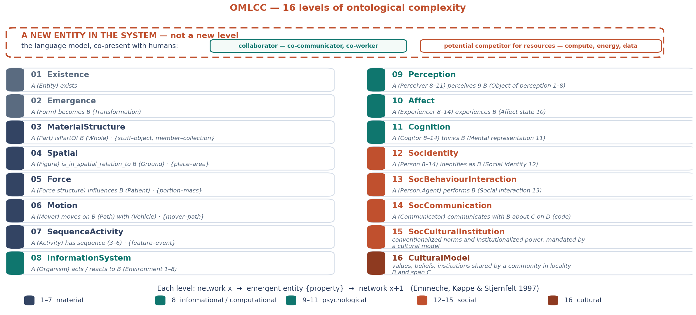
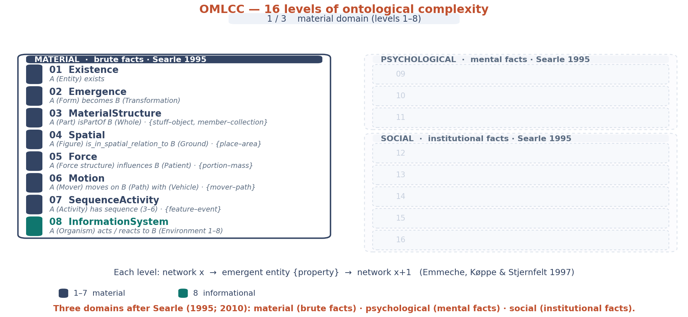
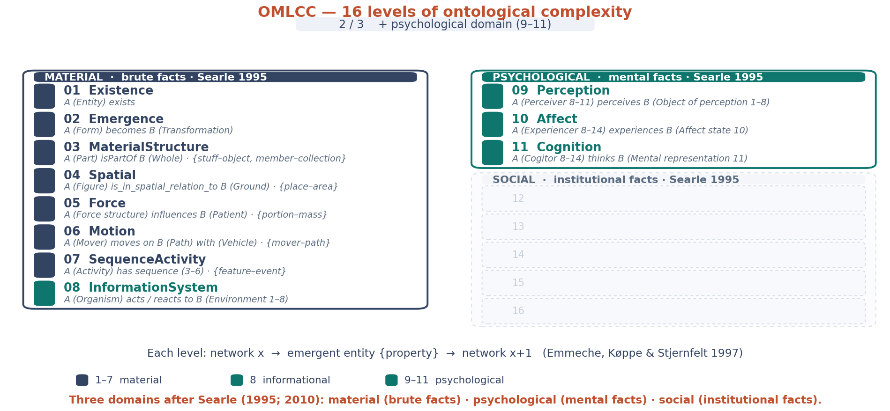
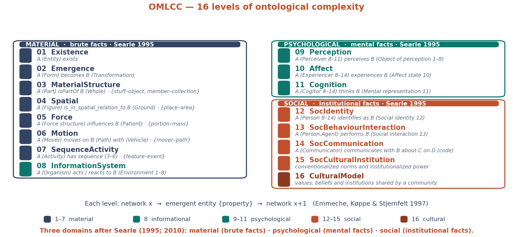
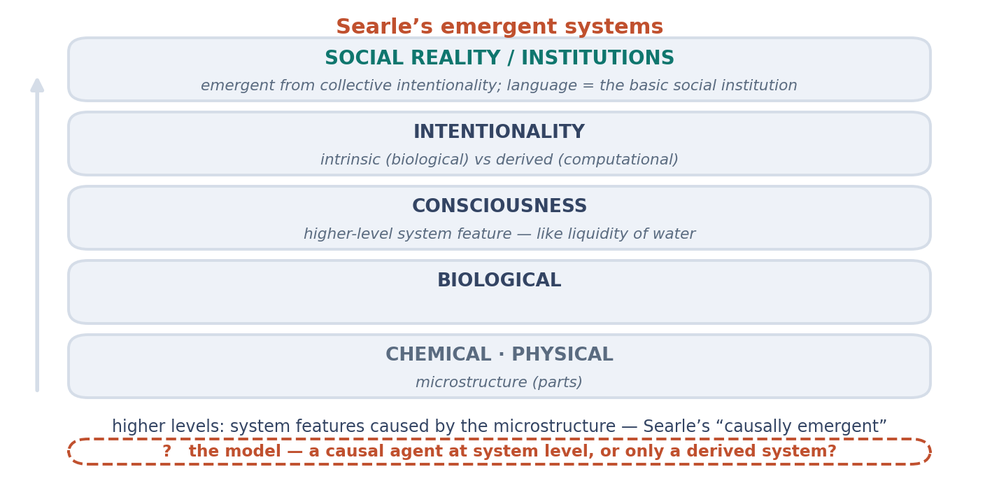

# 2. OMLCC: šesnaest razina ontološke složenosti

> *Teza poglavlja:* ontologiju možemo organizirati u **tri domene** i **šesnaest razina**, pri čemu je svaka razina definirana **relacijskom shemom** — tip entiteta, tip relacije, tip svojstva — a ne popisom primjera. Ako je razina popis, o njoj se može samo nabrajati; ako je shema, o njoj se može raspravljati i mjeriti je.

---

## 2.1 Što je OMLCC: ime, oblik i namjena

Riječ *razina* rabi se za sve. Za visinu vode, za kakvoću usluge, za „višu razinu" koja se čini boljom od niže. Svaka je od tih uporaba razumljiva, a zajedničko im je samo ime. Kad jedna riječ pokriva i visinu vode i kakvoću usluge, ona prestaje razlučivati, a tada se svaki popis može proglasiti ljestvicom. Nasuprot toj raširenoj uporabi, ovo poglavlje razinu veže uz jedan određen kriterij.

Tu nastaje problem s kojim se ovo poglavlje nosi. Ako je razina popis imena, o njoj se može samo nabrajati: svaka se tvrdnja brani novim primjerom, a nijedna se ne može oboriti. Ljestvica s kriterijima može nešto oboriti. Razlika između popisa i ljestvice zato nije stvar ukusa: ona je razlika između tvrdnje koja se može provjeriti i tvrdnje koja se samo ponavlja.

Odgovor ovoga poglavlja ima određen oblik, i taj oblik vrijedi vidjeti odmah. Razina se ne određuje popisom primjera: određuje ju **relacijska shema** — tip entiteta, tip relacije i tip svojstva (odjeljak 2.3). Te se sheme za sve razine mogu složiti u tablicu — šesnaest redaka, svaki s trima tipovima — i iz nje se za neki fenomen čita na kojoj je razini i zašto. Postupak koji to provodi na stvarnome iskazu ima osam koraka i završava nalazom u kojemu uz razinu stoji i ono što nije odlučeno (odjeljak 2.7). Nalaz ima i uvjet pod kojim pada: ako se **test spajanja i razdvajanja** ne može primijeniti dosljedno, broj šesnaest nije rezultat: on je konvencija; ako ravni model bez razina predviđa jednako dobro kao model s razinama, ljestvica je suvišna i okvir pada (odjeljak 2.4).

Taj okvir ima ime. Zove se **OMLCC** — *Ontological Model of Lexical Concepts and Constructions*, odnosno **ontološki model leksičkih koncepata i konstrukcija** — i ontologiju, pitanje *što postoji i koje je vrste*, ne postavlja kao popis stvari, već kao **ljestvicu od šesnaest razina** u tri domene. U ovoj se knjizi ne izlaže kao gotov sustav, već kao **mjerni instrument**, jer daje kriterij po kojemu se za neki fenomen može reći na kojoj je razini i zašto (→ pogl. 2.3).

**Što vam ovo poglavlje daje.** Teza ovoga poglavlja, običnim jezikom, glasi: *razine ne određuje popis imena, već pravilo po kojemu se svaka prepoznaje. Kakav je u njoj entitet, kakva relacija i kakvo svojstvo — po tomu se o razini može odlučivati, ne samo nabrajati.* U svojem materijalu moći ćete za svaku tvrdnju o razini imenovati tri stvari koje je ondje smještaju. Kad u razgovoru netko kaže da nešto „pripada višoj razini", imat ćete tri pitanja koja to provjeravaju: što je tu entitet, što je relacija i što je svojstvo. Tako se i broj šesnaest dade braniti, ne samo navesti (→ pogl. 2.7).

**Zašto se tako zove**

- **Ontološki** — zato što se pita *što postoji i koje je vrste*, a ne samo kako se o nečemu govori. Ontologija je ovdje ljestvica **vrsta svojstava i relacija**, a ne popis bića (→ pogl. 1.4).
- **Model** — zato što je ljestvica **organizacijska shema i mjerni postupak**, a ne opis svijeta: ne tvrdi da razine postoje „u prirodi" kao pretinci (→ pogl. 2.5).
- **Leksičkih koncepata** — zato što polazi od **leksičkoga značenja**: od toga kako se razine očituju u značenju riječi i u njihovim mrežama (polazište je istraživanje leksema *strah*; Perak 2014; EmoCNet 2019–21).
- **Konstrukcija** — zato što je jedinica opisa **konstrukcija**: spoj oblika i značenja koji nosi relacijsku shemu — imenica kao entitet, glagol kao relacija, pridjev kao svojstvo entiteta, prijedlog i prilog kao svojstvo relacije. Zato se razine mogu čitati iz morfosintakse, a ne postulirati (→ pogl. 2.3; 4.2).

**Zašto se u knjizi rabi kratica.** Zato što je okvir pod tim imenom izložen i pod tim se imenom navodi u literaturi. Opisni naziv („ljestvica šesnaest razina") imenuje samo **ishod** okvira, a ne sam okvir, i ne razlikuje ga od drugih ljestvica razina. Kad u knjizi stoji *OMLCC*, misli se na okvir; kad stoji *ljestvica*, misli se na njegov ishod (→ pogl. 2.6, gdje se uspoređuje s pet srodnih tradicija).

**Status okvira i citiranje** OMLCC dosad **nije objavljen integralno**. Razine su izložene na dvama izlaganjima: *Emergence of Social Reality in the Ontological Model of the Lexical Concepts and Constructions* (John Searle Symposium, Rijeka, 17. 5. 2017.) i *Emergent Structures in the Ontological Model of the Lexical Concepts and Constructions* (RaAM Specialized Seminar „Ecological Cognition", Odense, 4. 5. 2017.) — u bazi referenci to su jedinice **Perak 2017a** i **Perak 2017b**. Objavljeni dijelovi okvira stoje u radovima Ban Kirigin & Perak 2020 i Brdar, Brdar-Szabó & Perak 2020. Okvir se u ovoj knjizi nikada ne citira kao „Perak 2018" ni „Perak 2019" — takve publikacije ne postoje, a radne godine koje su stajale na starijim inačicama slika nisu referencija i uklonjene su (→ `docs/ISPRAVKE.md`). Atribucija se zato u ostatku knjige **ne ponavlja uz svaku razinu**, već upućuje ovamo: podjela na tri domene je **Searleova** (1995; 2010), a razrada na šesnaest razina i njihove relacijske sheme **autorov su doprinos**.

### 2.1.1 Tri domene: Searleova podjela i njezina cijena

Prvo poglavlje završilo je definicijom koja je istovremeno točna i prazna: razina je skup entiteta i relacija kod kojih vrijedi isti tip svojstava i isti tip zakona sastavljanja. Točna je jer ne pretpostavlja ništa o veličini, a prazna jer ne kaže **koliko tipova svojstava ima**. Ovo poglavlje daje odgovor: šesnaest, u tri domene. Umjesto podjele po tipu svojstva, koja vrijedi za razine, domena se dijeli po vrsti ovisnosti.

Najgrublja podjela dolazi iz Searleove ontologije činjenica. U knjigama *The Construction of Social Reality* (1995) i *Making the Social World* (2010) Searle razlikuje **grube činjenice** (*brute facts*), **mentalne činjenice** (*mental facts*) i **institucionalne činjenice** (*institutional facts*). Grube činjenice vrijede neovisno o tome što bilo tko o njima misli — planina je visoka i onda kad nikoga nema da to primijeti. Mentalne činjenice jesu činjenice o nečijem stanju, primjerice da nekoga boli ili da nešto vjeruje (Searle 1995). Institucionalne činjenice postoje samo zato što ih zajednica priznaje: novac, granica i diploma nisu kemijske činjenice — one su *X koji broji kao Y u kontekstu C* (Searle 1995; 2010).

Iz toga slijedi podjela koju ovaj okvir preuzima i naziva **domenama**: materijalna domena (grube činjenice), psihološka domena (mentalne činjenice) i društvena domena (institucionalne činjenice). Podjela je **Searleova**; razrada na šesnaest razina i njihove relacijske sheme **autorov su doprinos** (→ pogl. 2.1). Najveći je dio toga okvira posuđen, a najmanji — i najosjetljiviji — onaj koji je vlastit.

Kriterij po kojemu se domene razlikuju nije količina ni složenost: to je **vrsta ovisnosti**. Gruba činjenica ne ovisi ni o kome; mentalna ovisi o tome da postoji nositelj koji je doživljava; institucionalna ovisi o *mnoštvu* koje je priznaje (Searle 1995; 2010). Tri vrste ovisnosti daju tri domene; kolektivno se priznanje razrađuje kao zajednička obveza i intencionalnost (Gilbert 1990; Tuomela 2007; Tomasello 2008).

Domena, međutim, **nije razina**. Domena je najgrublja podjela po vrsti ovisnosti; razina je podjela po tipu svojstva i tipu relacije (Emmeche, Køppe & Stjernfelt 1997). Dva različita kriterija daju dva razgraničenja — zato domena ima tri, a razina šesnaest.

Redoslijed domena je redoslijed **pretpostavljanja**, i to treba razlikovati od redukcije. Mentalna činjenica pretpostavlja organizam s materijalnom strukturom, a institucionalna nositelje koji mogu nešto prepoznati i priznati (Searle 1995). Pretpostavljanje nije izvođenje: iz toga što viša domena ne može opstati bez niže ne slijedi da se iz niže može izvesti. Tu je razliku Anderson (1972) izrekao u jednoj rečenici — psihologija nije primijenjena biologija, a biologija nije primijenjena kemija — i cijela je knjiga drži kao granicu svojih tvrdnji.

Jedno ograničenje podjele treba priznati odmah. Granica između psihološkoga i društvenoga nije granica između dviju supstancija. Searle mentalna stanja drži biološkim pojavama (Searle 1992), pa se materijalna i psihološka domena razlikuju samo po tipu svojstva koje na njima mjerimo. Društvena je domena u tom pogledu drukčija, jer njezina svojstva ne bi postojala bez priznanja. Granica koju ovdje crtamo nije metafizička tvrdnja: to je pretpostavka koja se mora pokazati korisnom — ili pasti.

## 2.2 Šesnaest razina s definicijama

Unutar tih domena ovaj okvir razlučuje šesnaest razina. Atribucija je izrečena na jednome mjestu i ovdje se ne ponavlja (→ pogl. 2.1): podjela na materijalnu, psihološku i društvenu domenu je **Searleova** (1995; 2010); razrada na šesnaest razina i njihove relacijske sheme **autorov su doprinos** (→ pogl. 2.1). Nasuprot popisu, svaka je od tih razina određena tipovima, a ne primjerima.

Cijela je ljestvica najprije na jednoj slici.

**Slika 2.1.** Cjelovita ljestvica u dvama stupcima: lijevo razine 1–8 (materijalna domena, osma informacijska), desno razine 9–16; u podnožju je tvrdnja „Each level: network x → emergent entity {property} → network x+1" uz atribuciju (Emmeche, Køppe & Stjernfelt 1997), a legenda dijeli boje na 1–7 material, 8 informational / computational, 9–11 psychological, 12–15 social i 16 cultural. U gornjem okviru slika najavljuje novi entitet — „A NEW ENTITY IN THE SYSTEM — not a new level", „the language model, co-present with humans: collaborator — co-communicator, co-worker" i „potential competitor for resources — compute, energy, data" (tema dvanaestoga poglavlja). Autorov prikaz (→ pogl. 2.1). Naslov slike ne nosi godinu ni referenciju: okvir se citira u pogl. 2.1, a slika prikazuje ljestvicu.

### 2.2.1 Materijalna domena (razine 1–8)

Prvih sedam razina materijalne su i strukturne, a osma je informacijska. Suprotno domenama koje slijede, ovdje nema nositelja koji prepoznaje ni obveze koja se priznaje:

1. **Existence.** Razina na kojoj je postavljeno samo jedno pitanje: nešto jest. Svojstvo je prisutnost ili odsutnost.
2. **Emergence.** Nastajanje: organizacija niže razine daje nositelja kojega prije nije bilo; relacija je „nastaje iz", a svojstvo novost, uvijek relativna prema razini organizacije (Emmeche, Køppe & Stjernfelt 1997).
3. **MaterialStructure.** Sastav i ustrojstvo: što je s čime spojeno u cjelinu. Svojstva su čvrstoća, gustoća i sastav; relacija je dio–cjelina.
4. **Spatial.** Prostorni odnosi: položaj, blizina, obuhvaćanje, red u prostoru.
5. **Force.** Sila: djelovanje jednoga nositelja na drugi. Svojstva su jakost i smjer, a relacija „djeluje na".
6. **Motion.** Kretanje: promjena položaja u vremenu. Svojstva su putanja i brzina.
7. **SequenceActivity.** Slijed i radnja: uređen niz događaja; svojstva su red, trajanje i ponavljanje, a relacija „prethodi" odnosno „slijedi".
8. **InformationSystem.** Informacijski sustav: razina na kojoj entitet postaje **oznaka**, svojstvo **razlika prema drugim oznakama**, a relacija „nosi informaciju o". Tu se prvi put pojavljuje sadržaj — ali sadržaj koji je korelacija, a ne namjera: da bi oznaka nosila razliku, ne treba nitko da je razumije. U terminima ovoga okvira to je rano uvođenje rječnika informacijske razine u društvenu teoriju, kakvo nalazimo u Hallidayevu opisu jezika kao društvene semiotike (Halliday 1978).

Materijalna je domena na jednome prikazu:

**Slika 2.2.** Prva od triju ploča ljestvice („1 / 3 material domain (levels 1–8)"): materijalna domena s razinama 1–8, svaka zapisana relacijskom shemom (npr. „03 MaterialStructure: A (Part) isPartOf B (Whole)"); zaglavlje ploče je „MATERIAL · brute facts · Searle 1995", a stupci psihološke i društvene domene na ovoj su slici prikazani **prigušeno**: nose samo brojeve 09–16, bez naziva razina i bez relacijskih shema. Podnožje nosi tvrdnju „Each level: network x → emergent entity {property} → network x+1" (Emmeche, Køppe & Stjernfelt 1997) i redak „Three domains after Searle (1995; 2010): material (brute facts) · psychological (mental facts) · social (institutional facts)". Autorov prikaz (→ pogl. 2.1).

### 2.2.2 Psihološka domena (razine 9–11)

Tri su razine, i svaka ima drukčiji tip relacije prema okolini. Za razliku od materijalne domene, koja povezuje stvari, psihološke razine povezuju nositelja s onim što opaža, osjeća ili misli:

9. **Perception.** Opažanje: *opažač* opaža *objekt opažanja*. Relacija je usmjerenost, a svojstvo razlučivost.
10. **Affect.** Afekt: *doživljavatelj* doživljava *afektivno stanje*. Svojstva su valencija i pobuđenost, a odnos prema okolini nije usmjerenost, nego stanje u koje sustav dolazi. Hrvatski emocionalni leksik pokazuje da se ta stanja u jeziku ne pojavljuju pojedinačno, nego u mrežama s određenim središtima (Perak 2014; EmoCNet 2019–21).
11. **Cognition.** Kognicija: *mislitelj* misli *mentalnu reprezentaciju*. Relacija je predočavanje, a svojstvo struktura reprezentacije. Klasična je teorija pojmove držala definicijski strukturiranima, s nužnim i dovoljnim uvjetima (Fodor 1975). Spor o tome što u jezičnome modelu uopće možemo nazvati razumijevanjem i dalje je otvoren (Mitchell & Krakauer 2023).

Psihološka je domena na jednome prikazu:

**Slika 2.3.** Druga ploča ljestvice („2 / 3 + psychological domain (9–11)"): psihološka domena s razinama 9–11 (Perception 9, Affect 10, Cognition 11) uz ponovljenu materijalnu domenu 1–8; zaglavlja su „MATERIAL · brute facts · Searle 1995" i „PSYCHOLOGICAL · mental facts · Searle 1995", a stupac društvene domene na ovoj je slici prikazan **prigušeno**, samo brojevima 12–16 i bez relacijskih shema. Podnožje ponavlja tvrdnju „Each level: network x → emergent entity {property} → network x+1" (Emmeche, Køppe & Stjernfelt 1997) i redak „Three domains after Searle (1995; 2010)". Autorov prikaz (→ pogl. 2.1).

S tim nositeljem otvara se put prema razinama koje slijede, od prepoznavanja uloge do zajedničkog obrasca tumačenja, a taj nas put vodi k društvenoj domeni.

### 2.2.3 Društvena domena (razine 12–16)

Poredak je ovdje argument, a ne popis:

12. **SocIdentity.** Društveni identitet: nositelj kojega drugi prepoznaju kao nekoga — ime, naslov, uloga, račun. Relacija je prepoznavanje i pripisivanje.
13. **SocBehaviourInteraction.** Društveno ponašanje i interakcija: uzajamno djelovanje s očekivanjem da će druga strana uzvratiti. Zajedničko je djelovanje ovdje paradigmatičan slučaj (Gilbert 1990), a na toj se razini u razvoju komunikacije pojavljuje zajednička intencionalnost (Tomasello 2008).
14. **SocCommunication.** Društvena komunikacija: čin kojim jedan sudionik drugome daje nešto da prepozna. Zahtijeva adresiranje, namjeru, zajednički artefakt i konvenciju; značenje je pritom prepoznata namjera (Grice 1957), a komunikacija nije prijenos nego usklađivanje (Harris 1981; Clark 1996). Ovoj se razini posvećuje sedmo poglavlje.
15. **SocCulturalInstitution.** Društveno-kulturna institucija: pravilo po kojemu nešto broji kao nešto drugo u danome kontekstu (Searle 1995; 2010), s obvezom i s mogućnošću sankcije. Tu informacija postaje obveza, a ponašanje dužnost (Tuomela 2007; Elder-Vass 2010).
16. **CulturalModel.** Kulturni model: naslijeđeni obrasci tumačenja — vrijednosti, uvjerenja, žanrovi, načini na koje se svijet čita. Takav obrazac ne postoji ni u jednom pojedinom nositelju kao gotova cjelina; on je svojstvo mreže koja ga predaje (Perak 2025; → pogl. 15).

Tu se psihološki nositelj iz prethodnoga odjeljka spaja s drugima, pa se, nasuprot nabrajanju, društvene razine ovdje izvode jedna iz druge. Poredak 12 → 13 → 14 → 15 → 16 jest tvrdnja o zavisnosti: identitet prije interakcije, interakcija prije komunikacije, komunikacija prije institucija, a kulturni model samo povrh institucija. Isto vrijedi i niže: ni razina 8 ne može postojati bez nositelja koji nosi razliku.

**Formalni zapis ljestvice.** Ljestvica se može zapisati i strože, i to je učinjeno u **dodatku I**. Svaka je razina **trojka tipova** — **L_n = (E_n, R_n, P_n)**, gdje je E_n skup tipova entiteta, R_n skup tipova relacija s potpisom *R : E_n × E_n → P_n*, a P_n skup tipova svojstava; interakcija se bilježi kao peterokut **(r, p, arnost, smjer, uvjet dopuštenosti; učinak)**, a prijelaz s razine na razinu kao **zakon sastavljanja κ_n : N_n ↦ e_{n+1}{p}** — mreža razine *n* daje entitet razine *n+1* sa svojstvom koje na razini *n* nije postojalo. Ta formalizacija **ne dodaje tvrdnje o svijetu**. Ona zapisuje tvrdnje iz ovoga poglavlja i pokazuje gdje se razine razlikuju po **uvjetu dopuštenosti** (→ dodatak I.1, I.6); cijeli lanac zakona sastavljanja prikazuje **Slika I.1**, a razine po domenama razlažu **slike I.2–I.4**.

Sve tri domene na jednome su prikazu:

**Slika 2.4.** Treća ploča: sve tri domene jedna pod drugom — materijalna (1–8), psihološka (9–11) i društvena (12 SocIdentity, 13 SocBehaviourInteraction, 14 SocCommunication, 15 SocCulturalInstitution, 16 CulturalModel), svaka razina sa svojom relacijskom shemom. Zaglavlja ploča nose „MATERIAL · brute facts · Searle 1995", „PSYCHOLOGICAL · mental facts · Searle 1995" i „SOCIAL · institutional facts · Searle 1995", a podnožje tvrdnju „Each level: network x → emergent entity {property} → network x+1" (Emmeche, Køppe & Stjernfelt 1997), legendu (material, psychological, social, cultural) i redak „Three domains after Searle (1995; 2010): material (brute facts) · psychological (mental facts) · social (institutional facts)". Autorov prikaz (→ pogl. 2.1).

Ovdje treba dodati napomenu o terminologiji koja vrijedi do kraja knjige. **Entitet imenuje *gdje* je nešto u sustavu — njegovu poziciju; agent imenuje *što* to nešto radi — njegovu sistemsku ulogu.** To su dva pitanja i dva odgovora. Isto tako, riječ *razina* u ovoj knjizi nikada ne označava model: razina je tip svojstva i relacije, a model je organizacija koja se na tim razinama čita. U dvanaestom se poglavlju zato neće tvrditi da model čini sedamnaestu razinu: riječ je o novom **entitetu** u postojećem sustavu.

**Slike 2.2–2.4** — Ljestvica šesnaest razina kroz tri domene (autorov prikaz, `fig_omlcc_s1`–`fig_omlcc_s3`; → pogl. 2.1). Svaka je razina zapisana relacijskom shemom (tip entiteta + tip relacije), a podnožje slike nosi tvrdnju koja povezuje razine. Svaka je razina mreža koja daje emergentni entitet sa svojstvom, a taj entitet ulazi u mrežu sljedeće razine (Emmeche, Køppe & Stjernfelt 1997). Novi entitet iz dvanaestog poglavlja **nije** na ovoj ljestvici — on je iznad nje, i to imenuje tekst, a ne slika.

## 2.3 Relacijske sheme: kako se razina operacionalizira

Ako razina nije popis primjera, čime je onda definirana? Odgovor ovoga okvira jest da se **na svakoj razini primjenjuje ista shema** — entitet sa svojstvom, relacija sa svojim svojstvom, drugi entitet sa svojim svojstvom — i da razinu određuje **tip** svakoga od triju članova (→ pogl. 2.1). Shema nije formalizam nametnut jeziku. Morfosintaksa već kodira te uloge: imenice i zamjenice označavaju entitete, pridjevi svojstva entiteta, glagoli relacije i procese, a prilozi i prijedlozi svojstva relacija (→ pogl. 2.1). Jezik, dakle, nosi uputu o razini opisa — i zato se ljestvica mogla izvući iz korpusne uporabe, a ne postulirati.

Razina je, dakle, **trostruka shema**: tip entiteta + tip relacije + tip svojstva. Fenomen je na nekoj razini ako su prisutna sva tri člana; ako su prisutna samo dva, pripada nižoj razini.

| razina | tip entiteta | tip relacije | tip svojstva |
|---|---|---|---|
| 1 Existence | nosač | jest / nije | prisutnost |
| 2 Emergence | novi nosač, niža organizacija | nastaje iz | novost (relativna prema razini) |
| 3 MaterialStructure | dio, cjelina | dio–cjelina | sastav, čvrstoća |
| 4 Spatial | tijelo, mjesto | nalazi se u, uz, obuhvaća | položaj, blizina |
| 5 Force | djelovatelj, trpitelj | djeluje na | jakost, smjer |
| 6 Motion | tijelo, putanja | giba se duž | brzina, putanja |
| 7 SequenceActivity | događaj, niz | prethodi / slijedi | red, trajanje |
| 8 InformationSystem | oznaka, okolina | nosi informaciju o | razlika, sadržaj |
| 9 Perception | opažač, objekt opažanja | opaža | razlučivost |
| 10 Affect | doživljavatelj, stanje | doživljava | valencija, pobuđenost |
| 11 Cognition | mislitelj, reprezentacija | predočuje | struktura reprezentacije |
| 12 SocIdentity | nositelj uloge, drugi | prepoznaje kao | ime, uloga, pripisivanje |
| 13 SocBehaviourInteraction | sudionik, sudionik | uzvraća, suradi | uzajamnost, očekivanje |
| 14 SocCommunication | izvor, primatelj | adresira, daje da prepozna | namjera, konvencija, obveza |
| 15 SocCulturalInstitution | pravilo, kontekst | broji kao (X kao Y u C) | status, ovlast, sankcija |
| 16 CulturalModel | zajednica, obrasci | nasljeđuje, tumači | vrijednost, žanr, kanon |

*(Skraćeni prikaz; potpuni tipizirani zapis svih šesnaest razina — s potpisima relacija, uvjetima dopuštenosti i zakonima sastavljanja — stoji u **dodatku I.2–I.5**; pune relacijske sheme vode se i u repozitoriju knjige.)*

**Gdje se koja razina obrađuje** Ljestvica nije samo popis nego i **karta**: svaka razina ima svoje mjesto na kojemu se mjeri ili opovrgava, i to je najkraći put od okvira do primjene.

| razina | tipičan primjer | gdje se obrađuje |
|---|---|---|
| 1 Existence | kamen, broj, praznina | 1.1, 2.7 |
| 2 Emergence | nastanak cjeline iz dijelova | 1.2, 3.1–3.3 |
| 3 MaterialStructure | sastav tvari, dio i cjelina | 3.1, 4.2 |
| 4 Spatial | „uz", „iznad", obuhvaćanje | 2.2.1, dodatak I.2 |
| 5 Force | guranje, pritisak | 2.2.1, dodatak I.2 |
| 6 Motion | putanja, brzina | 2.2.1, dodatak I.2 |
| 7 SequenceActivity | slijed koraka, recept, obred | 6.3, 11.1 |
| 8 InformationSystem | oznaka koja nosi razliku, znak, vektorski zapis | 4.2, 9.2 |
| 9 Perception | opažanje predmeta | 2.2.2, 7.7 |
| 10 Affect | strah, radost — kao mreža leksema | 6.4, 6.6 |
| 11 Cognition | pojam, mentalna reprezentacija | 6.6, 11.4 |
| 12 SocIdentity | ime, uloga, račun, ključ | 8.4, 14.1 |
| 13 SocBehaviourInteraction | uzvraćanje, koordinacija, predaja zadatka | 8.3, 14.2 |
| 14 SocCommunication | adresirana poruka s prepoznatom namjerom | 7.5, 13.5, 14.3 |
| 15 SocCulturalInstitution | novac, granica, diploma, pravilo sa sankcijom | 8.1, 8.7, 14.4 |
| 16 CulturalModel | žanr, kanon, vrijednosti koje zajednica predaje | 8.3, 15.1 |

**Kako se karta rabi.** Ona nije sadržaj — ona je **putokaz**: kad u nekom poglavlju naiđeš na tvrdnju o razini, ovdje je mjesto na kojemu se ta razina mjeri, opovrgava ili u koje se upire. Praznina u ovoj karti značila bi da razina nije obrađena — a to bi bio nalaz o knjizi, ne o svijetu.

Operacionalizacija je u tome da se shema pretvara u **kontrolnu listu**. Uzmimo razinu 14, koja u ovoj knjizi nosi najviše tereta. Da bi nešto bio komunikacijski čin, moraju biti zadovoljena pet uvjeta: (a) **adresiranje** — postoji izvor i primatelj, a izraz je njima usmjeren (deiksa, dijaloške oznake, obrasci izmjene); (b) **namjera** — izvor želi da primatelj prepozna njegovu namjeru upravo time što ju je prepoznao (Grice 1957; Harris 1981); (c) **zajednički artefakt** — postoji nešto treće na što se oba sudionika odnose (tekst, dokument, kontekst; Clark 1996; usp. Clark & Chalmers 1998; Hutchins 1995); (d) **konvencija** — postoji obrazac koji sudionici dijele i koji omogućuje da se izraz potvrdi ili ispravi; (e) **obveza** — izvor se obvezao da će izraz vrijediti i da snosi posljedicu ako ne vrijedi (→ pogl. 7.5). Prvi, treći, četvrti i peti uvjet mogu se, u načelu, zadovoljiti i čisto distribucijskim opisom; drugi se ne može. Tvrdnja o razini 14 zato je nosiva tvrdnja knjige. Sedmo poglavlje mora pokazati da se drugi uvjet u podacima razlikuje od ostalih — ili priznati da se ne razlikuje.

Primjer pokazuje kako shema radi. Ispis vremenske prognoze: kao niz oznaka koje nose razliku o stanju okoline to je razina 8, a kao poruka upućena čitatelju s namjerom da nešto poduzme to je razina 14. Razlika nije u količini teksta. Ona je u prisutnosti adresata i namjere. Iz toga slijedi pitanje o broju razina: po čemu se opravdava baš šesnaest?

## 2.4 Zašto šesnaest, a ne pet ili sto

Ista razina iz prethodnoga odjeljka, kao i svaka druga, mora se opravdati u cjelini ljestvice. Broj razina zato nije odabran: on je **rezultat postupka**, a bez njega je ljestvica proizvoljna. Postupak ima dva pravila:

- **Test spajanja.** Ako dvije razine imaju isti tip entiteta, isti tip relacije i isti tip svojstva, one su jedna razina.
- **Test razdvajanja.** Ako jedna razina sadrži dva tipa svojstva s različitim zakonima sastavljanja, mora se razdvojiti.

Kriterij je, dakle, promjena tipa svojstva i tipa relacije, ne promjena količine (Emmeche, Køppe & Stjernfelt 1997): razlike koje se broje samo kao „više" ili „manje" ne daju novu razinu.

Zašto su razine 4, 5 i 6 tri, a ne jedna? Razlog je u tipovima svojstava: položaj je stanje, gibanje je promjena stanja, a sila je *uzrok* promjene. Nijedno se ne izvodi iz drugoga bez promjene tipa relacije — „nalazi se uz" nije „djeluje na", a ni „giba se duž". Slijed (razina 7) zasebna je razina zato što je redoslijed svojstvo *skupa raznovrsnih događaja*, ne tijela: recept, obred i razgovor imaju red i trajanje, a nemaju brzinu. Informacijski sustav (razina 8) zasebna je razina zato što kameni sastav nije *o* ničemu, a oznaka jest: na razini 8 relatum je razlika, a relacija je nošenje informacije o stanju okoline. Ta razlika nije količinska i zato je razina.

Isto pravilo razdvaja psihološke razine. Opažanje, afekt i kognicija imaju tri različita tipa relacije prema okolini — usmjerenost, stanje s valencijom i predočavanje sa strukturom — pa bi njihovo spajanje u jednu „mentalnu razinu" izgubilo ono što u podacima mjerimo. U društvenoj domeni isti test daje pet razina: prepoznavanje uloge (12), uzajamno djelovanje (13), adresirani čin s namjerom (14), pravilo s obvezom i sankcijom (15) i naslijeđeni obrazac tumačenja (16) — pet je različitih tipova relacije i svojstva, i svaki pretpostavlja prethodni.

Zašto onda ne pet razina? Izgubilo bi se jedino što pojam razine čini korisnim: unutar materijalne domene položaj, sila, gibanje i red imaju različite tipove svojstava, pa model s pet razina ne bi razlikovao loptu koja se kotrlja od ruke koja ju gura. Domene su podjela po vrsti ovisnosti, a ne po tipu svojstva, i zato ne mogu preuzeti posao razina.

Zašto ne sto razina? Među stotinu razina našla bi se najmanje dva skupa s istim tipom entiteta, relacije i svojstva, i test spajanja vratio bi ih zajedno. Stotinu razina nije ljestvica: to je popis tema, a popis se ne može ni provjeriti ni oboriti. Broj šesnaest je, naime, rezultat dvaju testova primijenjenih na korpusno izvučene entitete, svojstva i relacije (→ pogl. 2.1). On nije tvrdnja o prirodi. Ako se na novim podacima pokaže da neka razina nema vlastiti tip svojstva, ona se spaja; ako se pokaže da neka razina sadrži dva tipa, ona se razdvaja. Isti test odlučuje i o tome je li šesnaest konačan broj. Taj broj tako postaje mjesto koje se na podacima brani ili napušta.

## 2.5 Granice modela: što OMLCC tvrdi, a što ne tvrdi

Svaki okvir mora reći gdje mu prestaje doseg. OMLCC tvrdi sljedeće:

1. Da se u svakome fenomenu mogu razlučiti tip svojstva i tip relacije, i da ti tipovi tvore konačan, uređen skup unutar kojega vrijedi **pretpostavljanje**, a ne vrijednost ni veličina: viša razina pretpostavlja nižu, a niža se ne izvodi iz više (Anderson 1972).
2. Da podjela na tri domene slijedi vrstu ovisnosti (Searle 1995; 2010), dok su razrada na šesnaest razina i njihove relacijske sheme autorov doprinos (→ pogl. 2.1).
3. Da se razine mogu **čitati iz podataka**, jer morfosintaksa kodira uloge entiteta, svojstava i relacija (→ pogl. 2.1); to se u četvrtom poglavlju pretvara u mjerni postupak.
4. Da se cijeli okvir drži na **slaboj emergenciji**: makrosvojstvo je izvedivo iz mikrodinamike, ali samo simulacijom (Bedau 1997), i nigdje se ne traži jaka emergencija (Chalmers 2006).

A ovo su stvari koje **ne** tvrdi:

1. Ne tvrdi da razine postoje „u prirodi" kao takve. Ljestvica je organizacijska shema i mjerni instrument, a ne popis vrsta bića: nije proizvoljna, jer je relacijska organizacija stvarna, ali je provjerljiva.
2. **Ne tvrdi potpunost.** Nema tvrdnje da su svi fenomeni obuhvaćeni ni da je šesnaest najbolji mogući broj.
3. Ne tvrdi da je viša razina bolja, plemenitija ili svrhovitija. Ljestvica nije vrijednosna, kako je rečeno i u prvome poglavlju.
4. Ne tvrdi da viša razina kauzalno određuje nižu. Problem kauzalnog isključivanja ostaje trajno ograničenje (Kim 1999) i u ovoj se knjizi ne rješava, nego priznaje.
5. Ne tvrdi da isti entitet pripada točno jednoj razini. Ista se stvar može čitati na više razina, što je posljedica pojma holona, cjeline koja je istodobno dio (Koestler 1967). Riječ *strah* može se čitati kao niz slova (3), kao oznaka koja nosi razliku (8), kao afektivno stanje (10), kao komunikacijski čin (14) i kao dio kulturnoga obrasca (16) — nijedno od tih čitanja nije „pravo", jer svako odgovara na drugo pitanje.
6. Ne tvrdi da su društvene razine 12–16 prisutne u jezičnome modelu. To je otvoreno pitanje četrnaestoga poglavlja; ovdje se tvrdi samo da okvir mora biti takav da tu razliku učini provjerljivom.
7. Ne tvrdi ništa o svijesti ni o moralnome statusu. „Agent" je sistemska uloga, a ne izjava o unutrašnjosti, i ta je ograda dio same definicije.

Dvije su tehničke granice koje treba zapisati. Prva: relacijska je shema parna, pa relacije višega reda — one među trojkama i skupinama, koje mijenjaju dinamiku drukčije od zbroja parnih veza (Battiston i dr. 2021) — nisu obuhvaćene. Razgovor trojice sudionika nije zbroj triju dvostranih razgovora: to je otvoreni zadatak, a ne rezultat. Druga: ljestvica je izvučena iz korpusne uporabe odozdo prema gore (→ pogl. 2.1), pa je prije svega tvrdnja o jeziku, a tek zatim tvrdnja o svijetu. Prednost je što se mogla provjeriti na podacima. Rizik je što nije isključeno da dijelom odražava osobitosti hrvatske morfologije. **❓ nepotvrđeno:** nemam mjerenje koje pokazuje da se istih šesnaest tipova svojstava dâ izvući iz tipološki različitoga korpusa; replikacija na drugim jezicima zato je test, ne ukras. S istom se ogradom navode i radovi koji razrađuju okvir: **Status okvira:** puni podaci stoje u pogl. 2.1 — okvir **nije objavljen integralno**, izložen je na dvama izlaganjima (2017a; 2017b), a objavljeni su mu dijelovi Ban Kirigin & Perak 2020 i Brdar, Brdar-Szabó & Perak 2020.

## 2.6 Srodni modeli: gdje se OMLCC poklapa, a gdje razilazi

OMLCC nije prva ljestvica razina i ne tvrdi da jest; stoga ga valja postaviti uz pet tradicija.

| model | jedinica podjele | odnos prema OMLCC |
|---|---|---|
| Searleove domene (1995; 2010) | tri domene | domene preuzete; razine i sheme su autorov doprinos |
| Hartmannovi slojevi (1940) | slojevi stvarnosti | isti zakon pretpostavljanja; slojevi su kategorije bića |
| Bhaskar (1975) | stratificirana stvarnost | isti realizam; stratum je mehanizam, razina tip svojstva |
| integrativne razine (Novikoff 1945; Feibleman 1954) | razine organizacije u biologiji | isti postupak; biološka ljestvica nema institucija |
| Anderson (1972) | razine znanosti | isti epistemološki, nenametljiv stav |
| sistemske teorije i kibernetika (Wiener 1948; Ashby 1956; Maturana & Varela 1980; Capra & Luisi 2014; Meadows 2008) | razine organizacije, upravljanje, zatvorenost | isti oblik ljestvice i isti naglasak na uređenju; OMLCC dodaje komunikacijsku razinu i pripisivanje, a od njih preuzima **kriterije koje model ne zadovoljava** (→ dodatak H.2) |
| ANT i teorija asemblaza (Latour 2005; Callon 1984; DeLanda 2006) | mreža ljudi i ne-ljudi | isti predmet (djelovanje ne-ljudi), ali ravna ontologija bez razina: ANT opisuje *da* nešto djeluje, a ne na kojoj razini njegov akt vrijedi (→ dodatak H.3) |
| Luhmann (1984) | komunikacija kao element društvenoga sustava | potpora smještanju razine 14 kao konstitutivne, uz razliku da sustavi s modelima nisu autopoietični (→ dodatak H.3) |

**Searleove domene.** Podjela na grube, mentalne i institucionalne činjenice (Searle 1995; 2010) ulazi u OMLCC kao okvir domena, a razrada na šesnaest razina i njihove relacijske sheme autorov je doprinos (→ pogl. 2.1). Searleove su domene neuređene: razlikuju vrste činjenica, ali ne tvrde da jedna pretpostavlja drugu. OMLCC dodaje uređenje i mjerni kriterij, a obrazac „X broji kao Y u kontekstu C" postaje formula petnaeste razine (Searle 1995; 2010).

Uz domene ovdje valja vidjeti i Searleov vlastiti sklop emergentnih sustava:

**Slika 2.5.** Searleov sklop emergentnih sustava u pet okvira, odozdo prema gore: „CHEMICAL · PHYSICAL" („microstructure (parts)"), „BIOLOGICAL", „CONSCIOUSNESS" („higher-level system feature — like liquidity of water"), „INTENTIONALITY" („intrinsic (biological) vs derived (computational)") i „SOCIAL REALITY / INSTITUTIONS" („emergent from collective intentionality; language = the basic social institution"). Podnožje nosi „higher levels: system features caused by the microstructure — Searle's 'causally emergent'", a u isprekidanome okviru stoji otvoreno pitanje „? the model — a causal agent at system level, or only a derived system?". Slika ne nosi godinu ni bibliografski izvor i **ne prikazuje** podjelu na grube, mentalne i institucionalne činjenice — ta je podjela u tekstu (Searle 1995; 2010).

**Hartmannovi slojevi.** *Schichtenlehre* Nicolaija Hartmanna razlikuje slojeve stvarnosti — materiju, organsko, duševno, duhovno — i postavlja zakone slojevitosti: viši sloj pretpostavlja niži, uvodi kategorije koje niži ne posjeduje, ali ostaje utemeljen u nižemu (Hartmann 1940). OMLCC preuzima taj obrazac, a razilazi se u dvije točke. Prvo, Hartmannovi su slojevi **kategorije bića**, dok su razine u OMLCC-u klase svojstava i relacija koje se čitaju iz podataka: Kod Hartmanna ontologija kaže što jest. Kod OMLCC-a kaže što se na čemu mjeri. Drugo, Hartmannov najviši sloj, duhovno, nije isto što razine 15 i 16 — obuhvaća objektivni duh i njegove tvorevine, ali nije definiran zajedničkim priznanjem i deontičkim ovlastima, što je Searleov kriterij (Searle 1995; 2010). Hartmann također nema zasebnu informacijsku razinu (8).

**Bhaskarov stratificirani realizam.** Roy Bhaskar razlikuje domenu realnoga (mehanizmi i kauzalne moći), domenu aktualnoga (događaji) i domenu empirijskoga (opažaji), i tvrdi da mehanizmi djeluju i kad ih ne opažamo (Bhaskar 1975). S OMLCC-om dijeli stratificiranost i realizam o slojevima, a razilazi se, usto, u tome što su Bhaskarovi stratumi **mehanizmi s kauzalnim moćima**, a razine OMLCC-a **tipovi svojstava i relacija**. Bhaskar daje ontološko utemeljenje, OMLCC mjerni protokol, a pouka da iz odsutnosti opažaja ne slijedi odsutnost mehanizma vrijedi i za naša mjerenja.

**Integrativne razine.** Alexander Novikoff opisao je živu tvar kao organiziranu u razine od stanice do ekosustava, gdje svaka razina ima svojstva koja joj se ne mogu pripisati iz niže (Novikoff 1945). Joseph Feibleman to je razvio u teoriju integrativnih razina. Viša razina uključuje nižu, ali njome ne upravlja po njezinim pravilima, a integracija je proces u kojem niže jedinice postaju dijelovi više cjeline i time stječu nove relacije (Feibleman 1954). To je postupak koji treće poglavlje opisuje u tri koraka. Razlika je u dosegu. Njihova je ljestvica ljestvica biološke organizacije, pa se institucije i kulturni modeli u njoj ne pojavljuju; OMLCC zadržava istu logiku integracije, ali ljestvicu proteže onkraj biološkoga — i zato društveni dio njegove ljestvice treba zasebno opravdati.

**Anderson i ljestvice stupnjeva.** Andersonova hijerarhija znanosti (1972) tvrdi epistemološku neizvedivost, a ne metafizičku novost, i OMLCC zauzima isti, suzdržan stav. Dvije su pak ljestvice srodne, a nisu ljestvice domena. Chalmersova razlika između slabe i jake emergencije (Chalmers 2006) tvori **skalu po deducibilnosti**, ortogonalnu OMLCC-u. Budući da knjiga radi samo sa slabom emergencijom, ta se skala u njoj nikada ne pomiče prema jakome kraju. Searleov argument da je manipulacija simbolima nedostatna za značenje (Searle 1980) u terminima ovoga okvira povlači granicu između osme razine i razina 9 odnosno 14. To je naše čitanje, a ne Searleova tvrdnja o razinama. Tri svijeta Poppera i Ecclesa (Popper & Eccles 1977) prekrivaju se dijelom s prvim dvjema domenama, ali treći svijet, objektivni sadržaji misli, nije zamjena za razine 15 i 16. One se određuju zajedničkim priznanjem (Searle 1995; 2010).

Što je onda doprinos OMLCC-a? Četiri stvari, i nijedna nije „prva ljestvica": **operativan kriterij** za izdvajanje razina (odjeljak 2.4), **informacijska razina kao razina**, **komunikacija kao razina** (14), ne kao tema i **protokol čitanja s podataka**, jer su razine izvedene iz korpusne uporabe, a ne postulirane (→ pogl. 2.1). Svaki se pojam time veže na mjesto na kojemu se o njemu odlučuje.

## 2.7 Radni primjer: od rečenice do relacijske sheme

Razina se u ovome okviru ne pogađa po temi iskaza: čita se iz njegove morfosintakse (odjeljak 2.3). Postupak koji slijedi to pretvara u provjerljiv niz koraka, a ponovljiv je na svakome iskazu iz korpusa. Ono što se provjerava nije sadržaj iskaza ni njegova vrijednost: provjerava se shema po kojoj je složen — tko je u njemu entitet, što je relacija i koje svojstvo relacija nosi. Postupak zato ne traži ni jedno novo ime za razinu: traži samo dosljednu primjenu sheme iz ovoga poglavlja.

1. **Uzmi jedan iskaz i navedi mu izvor.** Iskaz mora biti stvaran i ponovljiv — iz korpusa ili iz zabilježenoga razgovora — s mjestom na kojem se može provjeriti. Izmišljen primjer ne može poslužiti kao dokaz.
2. **Ispiši uloge iz morfosintakse.** Imenice i zamjenice odredi kao entitete, glagole kao relacije i procese, pridjeve kao svojstva entiteta, a priloge i prijedloge kao svojstva relacija. U ovome koraku ne tumači sadržaj; samo prepisuj uloge.
3. **Sastavi zapis sheme.** Napiši ga u obliku *entitet {svojstvo} — relacija {svojstvo} → entitet {svojstvo}*. Ako koji član nedostaje, zapiši ga kao prazno mjesto: praznina je nalaz, a ne smetnja.
4. **Usporedi zapis s tablicom relacijskih shema.** Nađi razinu kojoj odgovaraju sva tri tipa — tip entiteta, tip relacije i tip svojstva. Ako odgovaraju samo dva od triju članova, fenomen pripada nižoj razini.
5. **Primijeni test spajanja.** Usporedi dobivenu razinu sa susjednom. Ako imaju isti trojac, to je jedna razina, a ne dvije — provjeri nisi li zapisao dvije razine ondje gdje je jedna.
6. **Primijeni test razdvajanja.** Ako u istome materijalu vidiš dva tipa svojstva s različitim zakonima sastavljanja, to su dvije razine — ili je materijal za reviziju ljestvice, koju tada moraš obraniti podacima, a ne ukusom.
7. **Ako je iskaz adresiran, provjeri pet uvjeta razine 14.** Adresiranje, namjera, zajednički artefakt, konvencija i obveza. Zabilježi koji su zadovoljeni, a koji nisu: uvjet koji se ne može zadovoljiti čisto distribucijskim opisom jest namjera, i zato on odlučuje o smještaju.
8. **Zapiši nalaz i ono što nije odlučeno.** Uz razinu upiši je li nositelj *entitet* (pozicija: gdje je) ili *agent* (uloga: što radi) — to su dva pitanja i dva dokaza. Slučaj koji nisi mogao odlučiti označi kao nepotvrđen i ne popravljaj ga kasnije.

**Ako ne radi — tri najčešće greške.** *Prva:* domena se pročita kao razina, pa se iz vrste ovisnosti izvede mjesto na ljestvici („ovo je društveno, dakle visoka razina"). Rješenje je podsjetnik iz odjeljka 2.1: domena ima tri, razina šesnaest, a razlikuju se po različitim kriterijima. *Druga:* razina se čita iz teme, a ne iz sheme — odluka se donosi prema tomu o čemu iskaz govori, pa nalaz ispadne smislen, ali neponovljiv. Rješenje je korak 2: uloge se prepisuju iz morfosintakse prije no što se išta protumači, a zapis mora sadržavati sva tri člana. *Treća:* sve novo proglasi se novom razinom — najčešće model. Rješenje je imenovati novi tip svojstva i novu relacijsku shemu; ako ih nema, ne postoji sedamnaesta razina, nego novi entitet u postojećem sustavu.

### Kako bismo znali da griješimo

- Ako se na novim podacima pokaže da **ravni model bez razina** predviđa jednako dobro kao model s razinama, razine su suvišne i OMLCC pada kao okvir.
- Ako se **test spajanja i razdvajanja ne može primijeniti dosljedno** (neovisni anotatori sustavno ne mogu odlučiti koji je tip svojstva prisutan), kriterij nije operativan, a broj šesnaest nije rezultat, nego konvencija.
- Ako se pokaže da se **razina 8 svodi na razine 3–7**, tj. da je informacija samo struktura, informacijska razina ne postoji i ljestvica se skraćuje.
- Ako se komunikacijski čin može u cijelosti objasniti bez prepoznate namjere i bez obveze, **razina 14 svodi se na 8 + 13** i nosiva tvrdnja knjige pada (sedmo poglavlje).
- Ako se institucionalne činjenice mogu opisati kao puki obrasci uporabe, bez obveze i priznanja, **razina 15 nije potrebna** (osmo poglavlje).
- Ako se ljestvica **ne može izvući iz tipološki različitoga korpusa**, ona je svojstvo hrvatske morfologije, a ne ontologija.
- Ako je šesnaest razina moguće predvidjeti iz **manjeg broja dimenzija**, šesnaest je pregruba podjela i mora se svesti.

### Vježbe

🟢 **Provjeri razumijevanje.** Smjesti svaki od ovih dvadeset pojmova na jednu razinu i obrazloži odluku navođenjem triju članova sheme (tip entiteta, tip relacije, tip svojstva): *more · obveza · crvena boja · pet · kralj · jutro · brzina · strah · dva kilograma · elektronička pošta · isprika · potpis · tužba · algoritam · sjećanje · glasno · most · skupština · vjetar · obećanje.* Za svaki pojam napiši i jednu rečenicu: koja je niža razina i zašto pojam nije njezin zbroj.

🟡 **Primijeni na vlastite podatke.** Uzmi pet spornih slučajeva — predlažemo *emociju u tekstu*, *algoritam*, *obvezu u protokolu među agentima*, *memoriju agenta* i *„iskustvo" modela* — i za svaki provedi oba testa iz odjeljka 2.4. Napiši koji od četiriju uvjeta za razinu 14 odlučuju o smještaju i gdje ne možeš odlučiti: slučajevi u kojima odluka izostaje najvrjedniji su dio vježbe.

🏆 **Istraživački zadatak.** Predloži reviziju jedne razine: ili spoji dvije, ili razdvoji jednu. Reviziju moraš obraniti protiv zamjene: navesti podatke koji bi je potvrdili i one koji bi je oborili te opis onoga što bi se računalo kao neuspjeh. Ako predložiš sedamnaestu razinu, pokaži tip svojstva koji nijedna od šesnaest ne pokriva; ako predložiš petnaest, pokaži da dvije razine imaju isti tip svojstva i isti tip relacije.

### Sažetak

- Podjela na tri domene — materijalnu (grube činjenice), psihološku (mentalne činjenice) i društvenu (institucionalne činjenice) — je **Searleova** (1995; 2010); razrada na šesnaest razina i njihove relacijske sheme **autorov su doprinos** (→ pogl. 2.1).
- Domene se razlikuju po **vrsti ovisnosti**, razine po **tipu svojstva i relacije**; zato domena ima tri, a razina šesnaest.
- Ljestvica je: 1 Existence, 2 Emergence, 3 MaterialStructure, 4 Spatial, 5 Force, 6 Motion, 7 SequenceActivity, 8 InformationSystem (materijalno); 9 Perception, 10 Affect, 11 Cognition (psihološko); 12 SocIdentity, 13 SocBehaviourInteraction, 14 SocCommunication, 15 SocCulturalInstitution, 16 CulturalModel (društveno).
- Poredak je tvrdnja o **pretpostavljanju**: identitet prije interakcije, interakcija prije komunikacije, komunikacija prije institucija, kulturni model samo povrh institucija.
- Svaka je razina definirana **relacijskom shemom** — tip entiteta + tip relacije + tip svojstva — a morfosintaksa te uloge kodira: imenice su entiteti, pridjevi svojstva entiteta, glagoli relacije, prilozi i prijedlozi svojstva relacija (→ pogl. 2.1).
- Razina 14 zahtijeva **adresiranje, namjeru, zajednički artefakt i konvenciju** (Grice 1957; Harris 1981; Clark 1996); namjera je uvjet koji se čisto distribucijski ne može zadovoljiti, i zato je ta razina nosiva tvrdnja knjige.
- Broj šesnaest **nije odabran**: rezultat je testa spajanja (isti tip svojstva i relacije) i testa razdvajanja (dva tipa svojstva na jednoj razini).
- Okvir tvrdi organizacijsku shemu i mjerni postupak, a **ne tvrdi** da razine postoje u prirodi, da su potpune, da su vrijednosne ni da viša razina kauzalno određuje nižu (Kim 1999 ostaje ograničenje); isti se entitet može čitati na više razina (Koestler 1967), pa razine nisu kutije u koje stvari pripadaju.
- U odnosu na Hartmannove slojeve (1940), Bhaskarov stratificirani realizam (1975) i integrativne razine (Novikoff 1945; Feibleman 1954), OMLCC preuzima zakon pretpostavljanja i logiku integracije, a dodaje operativan kriterij, informacijsku razinu, komunikaciju kao razinu i protokol čitanja s podataka.
- **❓ nepotvrđeno:** replikacija ljestvice na tipološki različitim jezicima nije izmjerena. Sam je okvir dosad izložen na izlaganjima 2017. (→ pogl. 2.1), a integralna objava tek slijedi.

### Ključni pojmovi

*domena (materijalna, psihološka, društvena) · grube, mentalne i institucionalne činjenice · statusna funkcija (X broji kao Y u C) · razina · relacijska shema · tip entiteta · tip relacije · tip svojstva · test spajanja i razdvajanja · ljestvica šesnaest razina · pretpostavljanje (bez redukcije) · entitet (gdje) i agent (što radi)*

### Literatura poglavlja

Anderson 1972 · Ashby 1956 · Ban Kirigin & Perak 2020 · Battiston i dr. 2021 · Bedau 1997 · Bhaskar 1975 · Brdar, Brdar-Szabó & Perak 2020 · Callon 1984 · Capra & Luisi 2014 · Chalmers 2006 · Clark 1996 · Clark & Chalmers 1998 · DeLanda 2006 · Elder-Vass 2010 · Emmeche, Køppe & Stjernfelt 1997 · EmoCNet 2019–21 · Feibleman 1954 · Fodor 1975 · Gilbert 1990 · Grice 1957 · Halliday 1978 · Harris 1981 · Hartmann 1940 · Hutchins 1995 · Kim 1999 · Koestler 1967 · Latour 2005 · Luhmann 1984 · Meadows 2008 · Mitchell & Krakauer 2023 · Novikoff 1945 · Perak 2014 · Perak, OMLCC - izlaganja 2017a; 2017b · Perak 2020 · Perak 2025 · Perak 2026 · Popper & Eccles 1977 · Searle 1980 · Searle 1992 · Searle 1995 · Searle 2010 · Tomasello 2008 · Tuomela 2007 · Wiener 1948
