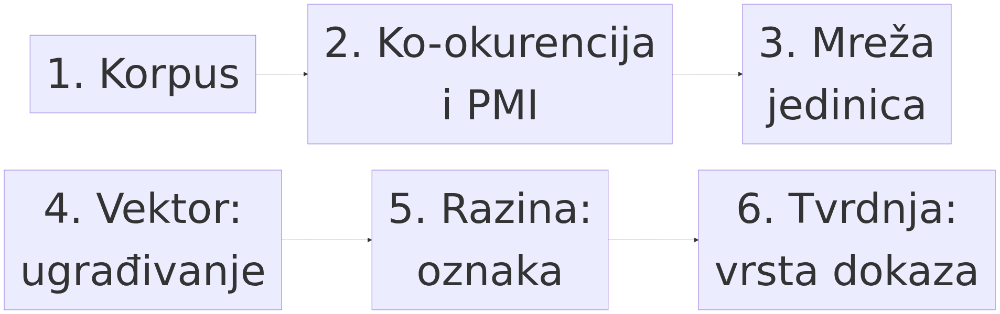
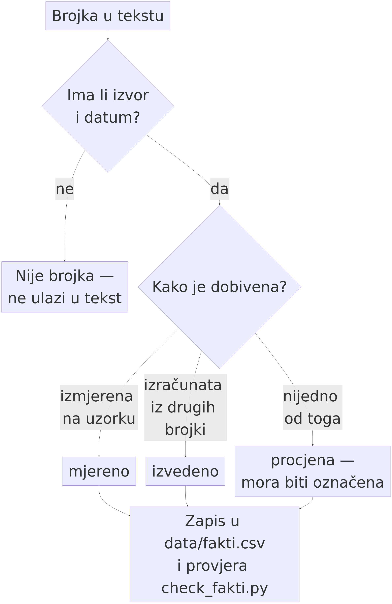

# 4. Kako se razine čitaju iz podataka — metodologija

> *Teza poglavlja:* razine nisu metafizičke tvrdnje, nego **mjerljive hipoteze**. Čitamo ih iz komunikacijskih podataka — iz korpusa, ko-okurencije, mreža, konstrukcija i ugrađivanja — i svaka se tvrdnja o razini mora moći zapisati tako da je drugi mogu ponoviti, provjeriti i **opovrgnuti**. Ako se razina ne može pretvoriti u mjernu tvrdnju s jedinicom analize, oznakom i mjerom slaganja, onda nije dio metodologije, nego dio retorike.

---

## 4.1 Podaci: korpusi, leksikoni, anketni i eksperimentalni materijal — i jedna odluka koja se stalno skriva

Prvo poglavlje postavilo je sustave i razine, drugo ih je popisalo (šesnaest razina, tri domene), treće je opisalo tri koraka kojima iz organizacije nastaje nova cjelina. Ovo poglavlje radi nešto drugo: **prevodi taj okvir u postupak.** Njegov je posao da pokaže odakle dolaze brojke, kako se izračunavaju, što smiju značiti i gdje im je granica. Bez toga bi cijela knjiga bila tvrdnja bez dokaza, a okvir razina bio bi shema bez primjene.

Postupak ima četiri stupnja i jedan lanac: **tekst → mreža → vektor → razina → tvrdnja** (tablica 4.3). Svaki stupanj ima svoje jedinice, svoje mjere i svoju vrstu pogreške. Nijedan se stupanj ne preskače, i to je metodološko pravilo knjige: tvrdnja o razini koja na neki stupanj nije stupila nije mjerenje, nego dojam.

**Prvi sloj: korpusi.** Knjiga radi na **uporabi zapisanoj u tekstu**, pa je prvo pitanje *koji tekst*. Primarni korpus je hrvatski web-korpus **hrWac**, izgrađen crawlom domene `.hr` 2011. i 2014. (Ljubešić i Klubička 2014; inačica hrWaC 2.1, CLARIN.SI). To je korpus *uporabe*, a ne korpus *primjera*: u njemu nema recenzenta koji odlučuje što je dobra rečenica, pa je i nalaz o njemu nalaz o tome kako se piše, a ne kako bi se *trebalo* pisati. To je bitno jer se razine ne čitaju iz propisa o jeziku, nego iz njegove uporabe.

Drugi korpus koji nosi ovu knjigu nije web-korpus, nego **Hrvatski nacionalni korpus u obimu od 131,8 milijuna pojavnica (Mw)**, kako je naveden u doktorskoj disertaciji o opojmljivanju leksema *strah* (Perak 2014; sažetak izvornika, str. 6). Ta je brojka **mjereno**, datum izvora 2014., i u ovom se poglavlju navodi upravo zato da se vidi razlika između *korpusa kao podatka* i *korpusa kao dijela metodološkog zapisa*: 131,8 Mw nije kontekst, nego mjerni instrument. Ista disertacija daje i ostale brojke na koje se ovo i šesto poglavlje pozivaju, i sve su one **mjereno** uz navedenu stranicu izvornika: **14.875 pojavnica** leme *strah* u HNK-u (sažetak, str. 6), **825 pojavnica** prijedložnog izraza *od straha* — drugi po čestotnosti među izrazima s tom lemom (tiskana str. 304) — i **17 pojavnica** konstrukcije *miješati se sa strahom* (tiskana str. 369). Uz njih ide i leksikon od **125 hrvatskih emocionalnih leksema** s leksemom *strah* u središtu mreže (Ban Kirigin i Perak 2020; Perak 2014; EmoCNet 2019–21).

**Treći sloj: anketni i eksperimentalni podaci.** Korpus pokazuje što je *zapisano*, ali ne što govornici *prihvaćaju* ili *procjenjuju*. Zato uz njega idu podaci iz ispitivanja: procjene sličnosti parova riječi, prihvatljivost konstrukcija, vrijeme reakcije. Njihova je uloga drugačija: oni **nisu izvor mreže**, nego **test izvan mreže**. Mreža daje hipotezu („ovi su leksemi bliski"), a anketa ili eksperiment je provjerava na nositeljima koji nisu tekst — i tako se izbjegava kružno zaključivanje u kojem se podatak potvrđuje samim sobom.

### Uzorak i populacija — odluka, a ne formalnost

Najveća metodološka razlika u ovom poglavlju nije tehnička, nego pojmovna, i tiče se riječi koje se u tekstovima o jeziku obično prešućuju: **što je populacija, a što uzorak.**

| pojam | što je u ovoj knjizi | zašto to nije isto |
|---|---|---|
| **populacija** | ukupna jezična uporaba neke zajednice u zadanom razdoblju i mediju — uključujući ono što nikad nije zapisano | nije dostupna; postoji kao odredište tvrdnje, a ne kao skup podataka |
| **uzorak (korpus)** | ono što je crawlom, transkripcijom ili prikupljanjem *doista* dospjelo u skup podataka | ima granicu: medij, žanr, razdoblje, jezik, pismo |
| **uzorak (ispitanici)** | govornici koji su pristali sudjelovati, u zadanom zadatku | ima granicu: broj, dob, obrazovanje, jezična varijanta |
| **jedinica analize** | ono što se broji: oblik riječi, lema, lema s vrstom riječi, konstrukcija, rečenica, potez | nije zadano podatkom; **odabire ga istraživač** |

Najvažnija rečenica ovoga odjeljka je ova: **uzorak nije „dio populacije" u smislu u kojem je uzorak vode dio vode.** Web-korpus nije slučajni uzorak jezične uporabe — pristran je prema pisanom, objavljenom i tehnički dostupnom — a anketa od trideset studenata nije slučajni uzorak govornika hrvatskoga. Ni jedno ni drugo nije *manje vrijedno*; ono je **manje općenito**, i to se mora izreći: tvrdnja koja vrijedi za hrWac ne vrijedi automatski za govorni jezik.

Zato je **uzorak odluka, a ne formalnost**: kad izaberemo korpus i jedinicu, time smo odlučili na koje se pitanje uopće može odgovoriti. Iz te odluke slijedi i vrsta dopuštenog zaključka:

- iz **korpusa uporabe** smije se zaključivati o **obrascima zapisane uporabe** u zadanom mediju i razdoblju;
- iz **ankete** smije se zaključivati o **procjenama ispitanika** u zadanom zadatku;
- iz **eksperimenta** smije se zaključivati o **ponašanju u kontroliranim uvjetima**;
- ni iz jednoga se **ne smije** zaključivati o unutrašnjosti nositelja — to je granica koju knjiga drži od prvoga poglavlja.

I jedna posljedica za čitanje ostatka knjige: **svaka brojka nosi svoj uzorak sa sobom.** Kad se u šestom poglavlju navodi da mreža ima 125 leksema, to nije opis „hrvatskog emocionalnog leksika", nego jedne mreže izgrađene iz zadanoga skupa podataka (Ban Kirigin i Perak 2020). Ako se uz brojku ne navede uzorak, ona postaje tvrdnja koju podaci ne nose.

## 4.2 Od teksta do mreže: ko-okurencija, PMI, i prag koji *stvara* predmet

Drugi stupanj pretvara tekst u graf.



**Slika 4.1.** Cjevovod od korpusa do tvrdnje u dvama redovima: prvi red vodi od korpusa preko ko-okurencije i PMI-ja do mreže jedinica, drugi od mreže preko ugrađivanja i oznake razine do tvrdnje. Slika prikazuje **redoslijed odluka**, a ne rezultat: svaka oznaka razine u ovoj knjizi prolazi kroz sve tri točke drugoga reda. Izvor: vlastita izrada (Perak 2026), shema bez podataka.

 Postupak je lanac odluka, a ne postupak s jednim ispravnim izlazom. Ovdje ga izlažem u pet koraka, s naglaskom na ono što se obično preskače: **što koja odluka isključuje.**

**1. Jedinica analize.** Prva odluka je *što je čvor*: oblik riječi, lema ili lema s vrstom riječi daju tri različite mreže iz istog korpusa. Za hrvatski je to ozbiljno, jer je morfološki bogat: *strah*, *straha*, *strahu* i *strahom* četiri su niza znakova i jedna lema. Postupak koji ih drži odvojenima ne mjeri jezik, nego morfologiju — nalaz je tada artefakt odluke, a ne svojstvo gradiva.

**2. Kontekstni prozor.** Ko-okurencija je pojava dviju jedinica unutar zadanoga okna, a **veličina okna nije neutralna**: usko okno (dvije do tri pozicije) hvata sintagmatske obrasce, široko (rečenica ili odlomak) tematsku bliskost. Isti korpus, dva okna, dvije mreže — i nijedna nije „točnija". Zato se veličina okna prijavljuje uz svaku mrežu.

**3. Mjera asocijacije — i zašto frekvencija nije mjera.** Sirova zajednička čestota nije mjera asocijacije, jer se česte riječi pojavljuju uz sve. Kenneth Church i Patrick Hanks pokazali su 1990. da se asocijacija mora mjeriti **uzajamnom informacijom** (pointwise mutual information, PMI): mjerom koja uspoređuje zatečenu supojavnost s onom koju bismo očekivali iz pojedinačnih čestota (Church i Hanks 1990, *Computational Linguistics* 16(1): 22–29). Uzajamna informacija za par jedinica *x* i *y* jest logaritam omjera između vjerojatnosti da se pojave zajedno i umnoška njihovih pojedinačnih vjerojatnosti:

```python
import math, collections

def pmi(par, zajedno, f_x, f_y, N):
    """PMI para: koliko je supojavnost veća od očekivane iz pojedinačnih čestota.

    par       – (x, y), samo za zapis
    zajedno   – broj prozora u kojima se x i y pojavljuju zajedno
    f_x, f_y  – pojedinačne čestote
    N         – ukupan broj prozora u korpusu (jedinica brojanja!)
    """
    if zajedno <= 0 or f_x <= 0 or f_y <= 0:
        return None                       # par se nije pojavio: nema mjere, nema brida
    return math.log2((zajedno * N) / (f_x * f_y))
```

Dvije ograde uz tu formulu. **Prva:** PMI je pristran prema rijetkim parovima — par koji se pojavi jednom dobiva visoku vrijednost uz malu pouzdanost — pa se rabi i normalizirana inačica (nPMI) ili se uz mjeru navodi zajednička čestota. **Druga:** mjera ovisi o tome što je *N* (prozor, rečenica ili pojavnica); ako *N* nije zapisan, mjera nije reproducibilna. PMI se računa iz tri broja koji ovise o tri odluke, pa je transparentnost tih odluka dio mjere, a ne dodatak.

**4. Graf: čvorovi i bridovi.** Kad mjera postoji, mreža je zapis. Čvor je zapis entiteta (leksem ili konstrukcija), brid je zapis relacije, a težina brida je mjera asocijacije. Shema je ista kao u ostatku knjige: *entitet {svojstvo} — [relacija {svojstvo}] → entitet {svojstvo}* (Perak, OMLCC — izlaganja 2017a; 2017b). Terminološka stega vrijedi i ovdje: **čvor imenuje *gdje* jedinica jest u mreži, brid imenuje *što* se među njima zbiva** — i nijedno od toga nije još ni značenje ni komunikacija.

**5. Prag: odluka koja stvara mrežu.** PMI daje kontinuiranu vrijednost; prag je odluka „veza postoji ili ne postoji". Zato: **prag ne filtrira postojeću mrežu, nego određuje koja organizacija uopće postoji.** Dvije mreže uz različite pragove nisu dvije slike istoga predmeta — one su dva različita predmeta.

**Tablica 4.1 — prag i njegove posljedice**

| prag | što se dogodi s mrežom | kako to izgleda u mjerama | što se pogrešno zaključuje |
|---|---|---|---|
| prenizak | povezano je gotovo sve sa svime | gustoća visoka, modularnost niska, centralnost se izjednačava | „leksik je jedinstven i koherentan" — a opisuje se šum |
| previsok | ostaju izolirani otoci i nakupine | mnogo komponenti, mreža fragmentirana | „domena se raspada na nepovezane dijelove" — a opisuje se odluka o pragu |
| srednji, **prijavljen** | zadržava se dio strukture i dio šuma; prag se navodi uz mrežu | usporedivo s drugim mrežama istoga praga | ništa se ne zaključuje samo iz praga; tvrdnja traži dodatni test |

Prag se u našim analizama drži uz okno, jedinicu i mjeru: četiri brojke koje idu u svaki zapis. Ako ih čitatelj ne vidi, nalaz nije provjerljiv — pa nalaza nema.

### Odnosi višeg reda: što parna mreža ne može

Mreža izgrađena isključivo na parovima ima ugrađenu slijepu točku. Federico Battiston i suradnici (2021, *Nature Physics* 17) pokazali su da veze **višega reda** — trojke i skupine, a ne samo parovi — mijenjaju dinamiku sustava: sustav s identičnim parnim vezama može se ponašati bitno drukčije ovisno o tome postoje li skupne veze. Za jezik to nije tehnička finesa. Razgovor trojice sudionika nije zbroj triju dvostranih razgovora, a značenje koje se ustali u skupini nije zbroj značenja u parovima. Parna relacijska shema zapisuje ono što se može zapisati — i tu granicu treba prijaviti kao ograničenje, a ne prešutjeti je.

I jedna opća opreza o mjeri, koja u ovoj knjizi ima status metodološkog pravila. Rylan Schaeffer i suradnici (2023, *NeurIPS*) pokazali su da „iznenadne" sposobnosti jezičnih modela mogu biti **artefakt metrike** — nelinearnog praga u načinu bodovanja — a ne skok u sustavu. Isti se mehanizam u mrežnoj analizi pojavljuje dvaput: u pragu koji kontinuiranu mjeru pretvara u brid i u granici skupine koja gusto povezan dio mreže pretvara u „zajednicu". **Oba su pragovi; oba se prijavljuju.** Skok u grafu lako se zamijeni za skok u sustavu.

## 4.3 Od mreže do vektora: ugrađivanje na vlastitom mjernom postavu

Treći stupanj mijenja oblik zapisa: mreža se pretvara u **vektor**. Razlika nije kozmetička. Mreža je *eksplicitna* — svaki brid je zapisan i može se pokazati. Ugrađivanje je *implicitno* — jedinica je zapisana kao niz brojeva, a sve relacije postoje samo kao geometrijski odnosi u tom nizu. To donosi jednu veliku prednost i jednu veliku opasnost. Prednost: vektorski prostor hvata i odnose koji u parnoj mreži nisu bili bridovi, pa se sličnost može mjeriti i za parove koji se nikad nisu pojavili zajedno. Opasnost: **u vektoru se ne vidi zašto su dvije jedinice blizu**, pa se lako proglasi nalazom ono što je posljedica postupka.

**Vlastiti mjerni postav.** U ovoj knjizi ugrađivanja se *ne* preuzimaju iz tuđih, već se računaju na vlastitome postavu: model **Qwen3-Embedding**, s vektorima od **4096 dimenzija** (Qwen Team 2025, arXiv:2506.05176; vlastiti mjerni postav, poslužitelj `spark-embed`). Brojka je **mjereno**, datum izvora 2025., i pojavljuje se i u desetom poglavlju, gdje se čita geometrija toga prostora. Vlastiti postav bira se iz tri razloga i svaki je metodološki:

1. **verzija se zna** — uz svaki rezultat stoji koja je inačica modela dala vektor, pa se tvrdnja može ponoviti ili opovrgnuti;
2. **podaci ne izlaze** — korpus i vektori ostaju pod kontrolom istraživača, što je uvjet reproducibilnosti;
3. **mjera je vezana uz pitanje** — model se bira za hrvatski, pa se ne mjeri engleski prostor i ne pripisuje hrvatskome.

**Tablica 4.2 — dimenzija: što stoji, a što ne**

**Dimenzija: što znači i što ne znači.** 4096 dimenzija nije 4096 „svojstava značenja". To je **dimenzionalnost reprezentacije**, i to je tvrdnja koju treba izgovoriti bez pojašnjenja u oba smjera:

| tvrdnja | stoji? | zašto |
|---|---|---|
| „vektor ima 4096 dimenzija" | **da, mjereno** | broj je zapisan u izlazu modela (Qwen Team 2025) |
| „svaka dimenzija odgovara jednom značenju ili svojstvu" | **ne** | dimenzije su posljedica učenja i nisu pojedinačno imenovane; tumačenje pojedine dimenzije traži zaseban test |
| „bliže u prostoru = sličnije u značenju" | **uvjetno** | vrijedi kao hipoteza za zadani model i zadani korpus; mjeri se i provjerava, ne pretpostavlja |
| „veći broj dimenzija = bolji rezultat" | **ne slijedi** | broj dimenzija je parametar postupka; njegov učinak treba izmjeriti |
| „4096 dimenzija pokazuje da je značenje složeno" | **ne** | ista greška kao čitanje gustoće mreže kao uzroka |

**Ugrađivanje ne zamjenjuje mrežu; ono je drugi čitatelj istoga gradiva.** Mreža daje *eksplicitan* zapis relacija iz zadanoga okna i praga, a vektor *implicitan* zapis bliskosti koja se ne mora poklapati s bridovima. Zato se u šestom poglavlju leksem *strah* prikazuje i mrežno i vektorski, pa se slike uspoređuju: ako govore isto, to je nalaz; ako se raziđu, i to je nalaz. Vektorski prostor ne smije se prikazati kao „dokaz" mrežne tvrdnje — to su dvije mjere koje mogu i proturječiti.

**Vektorska bliskost kao mjera s pragom.** I na trećem stupnju postoji prag — **granica srodnosti**, koliko blizu moraju biti dva vektora da ih proglasimo srodnima — s istim posljedicama kao u tablici 4.1. Zato se prijavljuje uz rezultat, uz vrstu udaljenosti i broj dimenzija. Bez toga je slika lijepa slika, a slika bez provjerljive tvrdnje nije rezultat, nego ilustracija.

## 4.4 Od vektora do razine: kako se tvrdnja „ovo je razina 14" uopće testira

Do sada smo dobili zapise: korpus, mrežu, vektor. Nijedan od njih nije razina. **Razina je tvrdnja o zapisu** — i upravo se ta razlika u raspravama o umjetnoj inteligenciji najčešće prešuti, pa se svojstvo *zapisa* proglasi svojstvom *predmeta*. Lanac ima pet stupnjeva i na svakom se mijenja jedinica analize (tablica 4.3).

**Tablica 4.3 — cjevovod: tekst → mreža → vektor → razina → tvrdnja**

| stupanj | ulaz | jedinica | mjera | izlaz |
|---|---|---|---|---|
| **1. tekst** | korpus (hrWac; HNK 131,8 Mw) | pojavnica, lema, konstrukcija | čestota | frekvencijska lista |
| **2. mreža** | frekvencijska lista + okno | par jedinica (brid) | PMI (Church i Hanks 1990) | graf s pragom |
| **3. vektor** | kontekst jedinice | jedinica → 4096-dim. vektor (Qwen Team 2025) | kutna udaljenost | prostor bliskosti |
| **4. razina** | vektor ili brid → oznaka | **epizoda / potez / odnos** | slaganje anotatora (κ) | oznaka razine uz nesigurnost |
| **5. tvrdnja** | oznake + mjere | tvrdnja o razini | omjer šansi uz kontrolu | nalaz ili **negativan nalaz** |

Cjevovod u ovoj knjizi nije prikazan slikom, nego **tablicom i kodom**, jer se tako može provjeriti; slika se dodaje tek kad postoji skripta koja je reproducira (→ 4.7).

### Tri postupka — i samo jedan od njih smije nositi ime razine

Do oznake razine vode tri postupka koja se u literaturi stalno miješaju; razlika je u tome **što je oznaka i odakle dolazi.**

| postupak | što daje | smije li se zvati „razina"? | zašto |
|---|---|---|---|
| **klasifikacija (nadzirana)** | oznaku iz **unaprijed zadanoga skupa oznaka**, koju je dodijelio čovjek | **da**, uz mjeru slaganja i uz kontrolu | oznaka je definirana prije podataka; mjeri se koliko model pogađa ljudsku odluku |
| **klasteriranje (nenadzirano)** | skupine izvedene iz podataka, bez zadanih oznaka | **ne** | skupina nema ime; ime joj dodaje istraživač, i tada mjeri svoju odluku, ne gradivo |
| **ručna anotacija** | oznaku i **sporazum** među anotatorima | **da**, kao referentna vrijednost | to je mjera koja pokazuje je li oznaka uopće primjenjiva na gradivo |

Ova je tablica obrana od najlakše pogreške u području: **klaster se preimenuje u razinu.** Pronaći nekoliko skupina ne govori ništa o broju razina; govori da metoda uz taj parametar pronalazi toliko skupina. Rečenica „algoritam je pronašao strukturu koja odgovara našim razinama" vrijedi samo ako je skup oznaka **zadan prije** i slaganje **izmjereno** — inače je to kružni argument.

### Kako se tvrdnja „ovo je razina 14" prevodi u mjernu tvrdnju

Razina 14 je **SocCommunication**: komunikacija kao razina na kojoj su prisutni adresiranje, artefakt, obrasci konvencije i **prepoznata namjera** (Perak, OMLCC — izlaganja 2017a; 2017b). Recimo da želimo tvrditi: „ovaj je zapis slučaj komunikacije, dakle razine 14." Tvrdnja se, da bi bila empirijska, mora razložiti na pet koraka i svaki mora biti zapisan.

**1. Jedinica analize.** Prvo se odlučuje *što* se označava. Za razinu 14 to nije riječ ni leksem, nego **epizoda**: niz poteza koji ima početak, sudionike i završetak (primjerice jedan zahtjev i odgovor na njega). Ako je jedinica pogrešna, svi ostali koraci mjere nešto drugo. Ovo je odluka, ne nalaz, i zato se navodi.

**2. Oznaka (kodna lista).** Zatim se zapiše koja se svojstva traže — i to **prije** gledanja u podatke. Za razinu 14 operativno se traže četiri prisutnosti:

| svojstvo | kako se prepoznaje u zapisu | primjer pozitivnog nalaza |
|---|---|---|
| **adresiranje** | postoji naslovljeni primatelj, a ne samo publika | izravno obraćanje, ime, uloga primatelja |
| **artefakt** | postoji nositelj koji nadživljuje situaciju | zapis, datoteka, poruka, dokument |
| **prepoznata namjera** | iz zapisa je vidljivo da je namjera prepoznata s druge strane | odgovor koji se na namjeru oslanja, a ne samo nastavlja niz |
| **konvencija** | postoji obrazac koji obje strane slijede | pozdrav, protokol, ustaljeni obrazac razmjene |

**3. Anotatori i neovisnost.** Ista se jedinica označava neovisno, s više anotatora (najmanje dvoje, u našim provjerama troje), bez dogovora o pojedinačnim slučajevima. Ako se anotatori dogovaraju tijekom označavanja, mjera slaganja mjeri dogovor, a ne primjenjivost oznake.

**4. Mjera slaganja.** Slaganje se iskazuje mjerom koja **odbija slaganje nastalo slučajno** — Cohenovom κ ili Krippendorffovom α, a nikad samo postotkom suglasnosti: oznake koje se u velikom dijelu slučajeva javljaju slučajno daju visok postotak i nisku κ.

```python
def kappa(a, b):
    """Cohenova kappa za dvoje anotatora.

    a, b – liste oznaka iste duljine (jedinica analize = jedan zapis u listi)
    vraća (kappa, uočeno, očekivano) — uvijek se prijavljuju sva tri broja,
    jer kappa sama skriva koliko je slaganje bilo očekivano.
    """
    n = len(a)
    oznake = sorted(set(a) | set(b))
    uoceno = sum(1 for x, y in zip(a, b) if x == y) / n
    ocekivano = sum((a.count(k) / n) * (b.count(k) / n) for k in oznake)
    if ocekivano == 1:
        return None, uoceno, ocekivano      # nema varijabilnosti: kappa nije definirana
    return (uoceno - ocekivano) / (1 - ocekivano), uoceno, ocekivano
```

**5. Kontrola.** Oznaka se mora pokazati **otpornom na ono što nije razina**: ako prati duljinu zapisa, vrstu teksta ili broj sudionika, tvrdnja ne mjeri razinu, nego te osobine. Postupak kontrole opisan je u „Kako bismo znali da griješimo" — to je jedini test koji tvrdnju pretvara u empirijsku.

### Od mreže do oznaka: gdje mrežne mjere ulaze u klasifikaciju

Mrežne mjere iz drugog stupnja nisu ukras: one su **ulazna svojstva** za klasifikaciju. Za označavanje taksonomskih razreda iz grafova svojstva čvora (pripadnost zajednici, mjere važnosti) uzimaju se kao ulaz u nadzirano označavanje (Ban Kirigin, Bujačić Babić i Perak 2022, *Future Internet* 14(12): 383; ista skupina razvila je i mjeru važnosti čvora koja spaja lokalnu i polulokalnu informaciju — *Mathematics* 10(3): 405). Metodološki je važno *kako*: oznake razreda **dolaze izvan grafa**, a graf daje svojstva. Ako se oznake izvode iz grafa i na istom grafu provjeravaju, mjeri se dosljednost, a ne točnost.

**Terminološka stega.** Kad je riječ o velikim jezičnim modelima, „razina" u ovoj knjizi **ne** ulazi u uporabu: model nije razina i **nije sedamnaesta razina**, nego kandidat za novi entitet koji ulazi u postojeće razine. Zato se stupci u klasifikacijskim tablicama četvrtoga dijela zovu *prisutno / nije prisutno*, a ne *niža / viša razina*. Entitet i agent ostaju razdvojeni: **entitet je *gdje* nešto jest**, **agent je *što* radi** — pa mjera prisutnosti entiteta ne pokazuje ništa o djelovanju.

## 4.5 Statistika i etika mjerenja: zašto „isti broj iz iste metode" nije formalnost

Ovo je najmanje uzbudljiv i najvažniji odjeljak poglavlja. Pravilo je jednostavno: **brojka bez izvora, datuma i vrste nije brojka.** Vrsta može biti *mjereno*, *procjena* ili *izvedeno*, i odlučuje što se smije tvrditi.



**Slika 4.2.** Trijaža svake brojke u rukopisu. Prvo pitanje je ima li **izvor i datum**; ako nema, to nije brojka i ne ulazi u tekst. Drugo je pitanje **kako je dobivena**: izmjerena na uzorku → *mjereno*, izračunata iz drugih brojki → *izvedeno*, nijedno od toga → *procjena*, koja mora biti izričito označena. Svaki ishod završava istim korakom — zapisom u `data/fakti.csv` i provjerom `check_fakti.py`. Izvor: vlastita izrada (Perak 2026).

**Veličina uzorka.** Prvo pitanje svake mjerne tvrdnje jest *na koliko je jedinica izračunata*: mreža od 125 leksema i višestruko veća mreža daju različite gustoće i modularnosti, a **gustoća se ne smije usporediti između mreža različitoga broja čvorova bez korekcije**. Isto vrijedi za anotaciju: κ izračunata na malom broju jedinica ima tako širok interval pouzdanosti da razlika među vrijednostima u praksi nije razlika. Zato se uz svaku mjeru slaganja navode **broj jedinica i broj anotatora**, a kad je uzorak mali i interval, ne samo točka.

**Višestruka usporedba.** Druga je zamka aritmetička: ako se testira mnogo hipoteza, dio će ih biti „potvrđen" samo zato što su testirane. Na razini značajnosti 0,05 očekuje se da će se **jedna od dvadeset** provjera pokazati značajnom i kad učinka nema. Okvir ima šesnaest razina i više mjera po razini, pa se u knjizi primjenjuju tri pravila:

1. **Hipoteza se zapisuje prije analize.** Ako se razina traži nakon što su podaci već pogledani, nalaz je pronađen, a ne testiran.
2. **Kad se provodi više usporedbi, prijavljuje se koliko ih je bilo** i primjenjuje se korekcija (Bonferroni ili Holm), ili se nalaz izričito označava kao **istraživački**, a ne potvrdni.
3. **Negativan rezultat se objavljuje.** Ako razlika među razinama ne preživi kontrolu, to je nalaz o okviru — i knjiga ga mora navesti u istom obliku u kojem navodi pozitivan.

**Reproducibilnost: četiri stavke koje idu u svaki zapis.** Rezultat je reproducibilan ako uz njega stoji:

| stavka | zašto |
|---|---|
| **verzija podataka** | korpus ima inačicu (hrWaC 2.1, CLARIN.SI), a i leksikon ima datum; bez toga se ne zna što je bilo na ulazu |
| **verzija postupka** | jedinica, okno, mjera asocijacije, prag, broj dimenzija, vrsta udaljenosti |
| **verzija modela** | Qwen3-Embedding (Qwen Team 2025) — ugrađivanja iz različitih inačica nisu ista mjera |
| **kontrolni zapis (checksum) i licenca** | bez toga se ne može utvrditi je li reproduciran **isti** skup podataka |

To je razlog zašto je rečenica „isti broj iz iste metode" metodološka, a ne pedantna: **broj je isti samo ako su podaci, postupak i model isti.** Ugrađivanje dobiveno iz druge inačice modela nije „isti vektor s manje decimale" — to je druga mjera.

**Vlastita pogreška kao primjer.** Knjiga sama sebe podvrgava istom pravilu, i to je zapisano javno u `docs/ISPRAVKE.md`. Tri su ispravka iz rujna 2026. poučna upravo metodološki:

- **ISPRAVAK-001 (METR-ov vremenski horizont).** U izlaganju je pisalo da horizont za frontier model iznosi ~13–14,5 h. Točno je: prvotna procjena od **~14,5 h** (20. 2. 2026.) ispravljena je **3. 3. 2026.** nakon što je METR ispravio pogrešku u svome modeliranju, pa vrijednost iznosi **~12 h** (METR 2025, arXiv:2503.14499; METR-ova napomena, 2026.). Vrsta prvotne brojke bila je **procjena**, a pogreška je bila u tome što je procjena prenesena kao mjera.
- **ISPRAVAK-002 (strop GPQA).** Pisalo je ~90 %, a strop je **~80 %** *(procjena; Thompson 2026, ažurirano 4. 8. 2026.)*, uz zasićenje 11/2025 na 93,8 % *(mjereno; Gemini 3 Pro)*.
- **ISPRAVAK-003 (strop HLE).** Naveden je jedan strop (25,6 %), a postoje **dva izvora s različitim vrijednostima** — ~51,3 % (FutureHouse, 7/2025) i 25,6 % (Alibaba, 2/2026, arXiv:2602.13964v2). Pravilo koje iz toga slijedi: **nikad se ne navodi jedan strop kao jedini**; navode se oba, s izvorom i datumom.

Zajednički imenitelj svih triju pogrešaka nije nemarnost u računu, nego **nemarnost u vrsti brojke**: procjena je izgovorena kao mjerenje, jedna vrijednost kao strop, a ispravak je došao od drugoga, ne od nas. Zato je ova datoteka javna i zato u poglavlju 16 (posljedice i falsifikacija) stoji kao dio dokaza da okvir razina dopušta i vlastitu pogrešku.

**Etika mjerenja: tri obveze.** **Nepripisivanje** — mjera iz teksta ne smije se prikazati kao mjera unutrašnjosti nositelja. **Granica** — uzorak se navodi s granicama (medij, žanr, razdoblje, broj ispitanika), jer tvrdnja koja prešuti granicu tvrdi više nego što podaci nose. **Ispravak** — kad se brojka pokaže netočnom, ispravak se objavljuje, a ne zamjenjuje tiho, jer bi čitatelj inače i dalje citirao vrijednost koja je već otisnuta.

## 4.6 Kako prijaviti rezultat: tablica + graf + kod + verzije + neuspjeli pokušaji

Rezultat koji se ne može ponoviti nije rezultat, nego anegdota. Zato knjiga uvodi **zapis rezultata** — obrazac od devet stavki uz svaku mjeru koja ulazi u tekst. Obrazac je namjerno dosadan: njegova je svrha da se pogreška vidi prije nego što postane tvrdnja.

**Tablica 4.4 — zapis rezultata (obvezne stavke)**

| # | stavka | što se upisuje | što se njome sprječava |
|---|---|---|---|
| 1 | **tvrdnja** | jedna rečenica koja se može opovrgnuti | tvrdnja koja „potvrđuje" sama sebe |
| 2 | **podaci** | naziv, inačica, licenca, datum pristupa, checksum | mjerenje na nepoznatom izvoru |
| 3 | **uzorak** | jedinica, broj jedinica, granice (medij, žanr, razdoblje) | prijenos nalaza izvan uzorka |
| 4 | **postupak** | okno, mjera asocijacije, prag, dimenzije, udaljenost | odluke koje se poslije ne mogu rekonstruirati |
| 5 | **verzije** | model (Qwen3-Embedding, Qwen Team 2025), biblioteke, skripta | tihi prijelaz na drugu inačicu modela |
| 6 | **tablica** | brojke s jedinicama i vrstom (*mjereno / procjena / izvedeno*) | procjena koja se čita kao mjerenje |
| 7 | **graf** | samo ono što je u tekstu | slika koja tvrdi više od teksta |
| 8 | **kod** | skripta koja proizvodi tablicu i graf (`kod/`) | „kod nije potreban, opis je dovoljan" |
| 9 | **neuspjeli pokušaji** | što nije prošlo i zašto | pristranost prema pozitivnim rezultatima |

**Zašto je deveta stavka obvezna.** Ako se objavljuju samo uspjeli pokušaji, slika postupka je lažna. Najveći dio posla čine pragovi koji su dali besmislenu mrežu, oznake koje se nisu slagale i kontrole koje su „nalaz" svele na posljedicu duljine teksta. Zato se negativni rezultati **spremaju i navode**: u repozitoriju u `kod/negativni/` i `data/negativni/`, a u tekstu kad su za tvrdnju relevantni (`kod/README.md`; `data/README.md`).

```python
import csv, json, datetime

def zapisi_rezultat(put, tvrdnja, podaci, uzorak, postupak, verzije,
                    tablica, graf, kod, neuspjeli):
    """Zapis rezultata: jedan JSON + jedan CSV iz istoga izvora.

    Neuspjeli pokušaji se ZAPISUJU, a ne brišu: bez njih je slika postupka
    pristrana prema onome što je uspjelo.
    """
    zapis = {
        "datum": datetime.date.today().isoformat(),
        "tvrdnja": tvrdnja,          # mora se moći opovrgnuti
        "podaci": podaci,            # {naziv, inacica, licenca, datum_pristupa, checksum}
        "uzorak": uzorak,            # {jedinica, broj_jedinica, granice}
        "postupak": postupak,        # {okno, mjera, prag, dimenzije, udaljenost}
        "verzije": verzije,          # {model, biblioteke, skripta}
        "tablica": tablica, "graf": graf, "kod": kod,
        "neuspjeli": neuspjeli,      # [{"pokusaj": ..., "ishod": "", "zasto": ""}]
    }
    with open(put, "w", encoding="utf-8") as f:
        json.dump(zapis, f, ensure_ascii=False, indent=2)
    return zapis

def u_csv(zapis, put):
    """Ista brojka u dva oblika: JSON za provjeru, CSV za tablicu u tekstu."""
    with open(put, "w", newline="", encoding="utf-8") as f:
        w = csv.writer(f)
        w.writerow(["tvrdnja", "jedinica", "brojka", "vrsta", "izvor"])
        for red in zapis["tablica"]:
            w.writerow([zapis["tvrdnja"], red["jedinica"], red["brojka"],
                        red["vrsta"], red["izvor"]])   # vrsta: mjereno|procjena|izvedeno
```

**Pravilo o figuri.** Slika ne smije tvrditi više od teksta; ako se natpis na slici i rečenica razilaze, ispravlja se **tekst** ili se slika ponovno izrađuje (`slike/README.md`). Slika koja prikazuje više nego što je izmjereno povlači se iz knjige, koliko god bila lijepa.

**Dvije vrste prijave.** *Nalaz* ima tvrdnju, mjeru, nesigurnost i kontrolu i smije ući u sažetak poglavlja; *pokušaj* ima samo postupak i ishod i ostaje u repozitoriju, a u tekst se navodi tek ako je za tvrdnju važan. Ta je razlika za ovu knjigu ključna jer je njezin predmet upravo **granica između onoga što se tvrdi i onoga što se još ne može tvrditi**. Model je u trećem dijelu knjige *kandidat* za novi entitet, nikad zaključak — i metodologija koja to ne bi mogla zapisati bila bi u suprotnosti s vlastitom tezom.

## 4.7 Repozitorij knjige: stvarna struktura i kako se svaka brojka provjerava

Ovo poglavlje ne bi imalo smisla kad se ne bi moglo provjeriti. Zato ovdje stoji **stvarna** struktura repozitorija — ona koju čitatelj dobiva, a ne ona koju je nacrt predviđao.

**Tablica 4.5 — struktura repozitorija (stvarno stanje)**

| mapa | što sadrži | uloga u metodologiji |
|---|---|---|
| `plan/` | `KNJIGA_PLAN.md`, `NACRT_B_DETALJNO.md` | plan i nacrt do razine sekcija |
| `rukopis/` | `poglavlje-01.md` … `poglavlje-16.md`, `predgovor.md`, `studije-slucaja/` | tekst knjige; ovo poglavlje je `poglavlje-04.md` |
| `referencije/` | `REFERENCE_BASE.md` | **jedini dopušteni izvor citata** |
| `pojmovnik/` | `koncepti.yaml`, `koncepti.csv`, `RJECNIK.md` | registar pojmova + generirani rječnik |
| `docs/` | `CITIRANJE.md`, `MREZA-KNJIGA.md`, `UPUTE-PO-POGLAVLJIMA.md`, `ISPRAVKE.md`, `ci-mreza.yml.example` | citiranje, mreža triju knjiga, evidencija ispravaka |
| `kod/` | `check_fakti.py`, `check_links.py`, `pojmovnik_build.py`, `izvuci_doktorat.py`, `README.md` | analize, slike i **provjere** |
| `slike/` | 20 PNG datoteka + `README.md` (npr. `fig_omlcc16.png`, `fig_emotion_network.png`, `fig_strah_vektori.png`) | slike s izvorom i poglavljem |
| `data/` | `fakti.csv`, `README.md`, `izvori/doktorat-2014/` (4 CSV-a) | evidencija brojki i podaci iz doktorata |

**Jedna razlika prema nacrtu.** Nacrt je predviđao mape `/data`, `/code`, `/figures` i `/notebooks`; stvarni repozitorij rabi hrvatske nazive (`kod/`, `slike/`, `data/`) i **mapa za bilježnice ne postoji**. To se navodi namjerno, kao primjer pravila iz 4.6: nacrt je *namjera*, a repozitorij *stanje*. Isto vrijedi za skripte: `kod/README.md` navodi `pipeline_tekst_mreza_vektor.py` (4. poglavlje), `mreza_emocija.py` i `mjere_mreze.py` (6.), `geometrija_vlastiti_podaci.py` i `provjera_brojki.py` (10.) te `tablica_razine_12_16.py` (14.) kao **planirane**. One još nisu u repozitoriju, pa se cjevovod ovoga poglavlja za sada prijavljuje kao **tablica i kod**, a ne kao slika — slika ulazi u knjigu tek kad je skripta koja je reproducira (`kod/README.md`).

**Četiri provjere koje se mogu pokrenuti odmah.** Uz repozitorij idu skripte koje provjeravaju da tekst i podaci ostanu u skladu; tri rade lokalno, bez mreže.

**1. `python3 kod/check_fakti.py`** — provjerava evidenciju brojki `data/fakti.csv` protiv rukopisa: strukturu (polja, dopuštene vrste), brojke s jedinicom u tekstu, dvostruke identifikatore i nepotvrđene brojke (❓). Uz `--strict` daje izlaz 1 ako ima neevidentiranih brojki. To je skripta koja stoji iza tvrdnje iz 4.5 da brojka bez izvora, datuma i vrste nije brojka.

```bash
python3 kod/check_fakti.py            # izvještaj; upozorenja ne ruše izlaz
python3 kod/check_fakti.py --strict   # izlaz 1 ako ima neevidentiranih brojki
```

**2. `python3 kod/check_links.py`** — provjerava mrežu knjiga: lokalne upute tipa `rukopis/poglavlje-07.md#sidro`, upute na druge knjige, registar pojmova (postoji li datoteka navedena u polju *kanonski*) i broj uputa na druge knjige po odjeljku. Uz `--http` dodaje HEAD-provjeru vanjskih uputa.

**3. `python3 kod/pojmovnik_build.py`** — iz `pojmovnik/koncepti.yaml` gradi rječnik (`pojmovnik/RJECNIK.md`) i CSV, pa se pojmovi ovoga poglavlja (jedinica analize, prag, PMI, ugrađivanje, κ) provjeravaju na jednome mjestu za sve tri knjige.

**4. `python3 kod/izvuci_doktorat.py`** — izvlači podatke iz doktorskog rada (Perak 2014) u `data/izvori/doktorat-2014/`. Izvlačenje je automatsko (tekstualni sloj PDF-a, PyMuPDF) uz pomak stranica PDF = tiskana + 24 (provjereno na trima uzorcima). Uz podatke ide **popis ograničenja**: izvlačenje može propustiti retke prelomljene preko stranica i višestupčane tablice, pa se svaka brojka **provjerava na navedenoj stranici izvornika** — tako su potvrđene 14.875 pojavnica leme *strah* i 825 pojavnica izraza *od straha* iz 4.1.

Time je krug zatvoren: **svaka brojka ima svoj redak u `data/fakti.csv`, svoj izvor s datumom, svoju vrstu i skriptu koja provjerava da se ne pojavi bez toga.** Ako se ta veza prekine, provjera to prijavljuje — i čitatelj to vidi sam.

### Kako bismo znali da griješimo

Poglavlje je empirijsko samo ako navede uvjet pod kojim pada. Četiri su takva uvjeta i sva četiri su **planova** — provodiva s podacima koji se mogu prikupiti.

**1. Ako se razlike među razinama izgube čim se kontrolira veličina uzorka i vrsta teksta, tvrdnja o razinama nije empirijska.** Ovo je glavni uvjet i zato ga treba napisati do kraja, s postupkom.

- **Zašto je opasnost stvarna.** Oznaka „razina 14" može biti posljedica toga što su dulji zapisi bogatiji sadržajem, pa se u njima lakše pronađe adresiranje, artefakt i konvencija. Tada oznaka ne mjeri razinu, nego **duljinu i vrstu teksta** pod imenom razine.
- **Kako se kontrola provodi.** *Korak 1:* za svaku jedinicu (epizodu) izračuna se oznaka i zabilježe dvije kontrolne varijable — **broj pojavnica u jedinici** i **vrsta teksta** (forum, vijest, transkript razgovora, službeni dokument). *Korak 2:* jedinice se **uparuju** (*matching*) po tim dvjema varijablama, pa se uspoređuju samo zapisi jednake duljine i iste vrste — ili se oznaka regresira na prisutnost svojstva uz kontrolu duljine i vrste i prijavljuje se **omjer šansi uz kontrolu**. *Korak 3:* ako se razlika nakon toga svede na nulu (interval pouzdanosti obuhvaća nulu), tvrdnja **pada** u tom uzorku i objavljuje se kao negativan rezultat (→ 4.6).
- **Što se time ne rješava.** Kontrola pokazuje da oznaka nije *samo* duljina i vrsta teksta; ne pokazuje da je „točna". Nalaz ostaje tvrdnja o uzorku i o mjeri slaganja, ništa više.

**2. Ako se slaganje anotatora ne razlikuje od slučajnoga, oznaka razine nije primjenjiva.** Ako κ nakon kontrole ostane blizu nule, oznaka nije u gradivu, nego u glavi pojedinog anotatora — i cijeli stupanj 4 iz tablice 4.3 mora se povući za taj slučaj.

**3. Ako se tvrdnja o razini 14 ne razlikuje od tvrdnje o razini 13 na istim podacima, razlika među razinama nije operativna.** Test je izravan: ista jedinica označava se objema kodnim listama i mjeri se preklapanje. Ako se oznake ne razlikuju bolje od slučajnoga, razine u tom uzorku nisu razlučene — ozbiljan prigovor okviru, koji se ne smije zatajiti: okvir bi se morao suziti (manje razina) ili pokazati razliku na drugim jedinicama i mjernim svojstvima.

**4. Ako prag ne mijenja nalaz, mreža nije potrebna; ako ga mijenja potpuno, nalaz je posljedica praga.** Dvije krajnosti koje obje ruše drugi stupanj: mreža koja daje isti zaključak pri svakom pragu vjerojatno ne nosi informaciju, a mreža koja daje proturječne zaključke pri susjednim pragovima nosi samo odluku istraživača. Provjera je obavezna: **nalaz se prijavljuje na rasponu pragova**, ne na jednome.

Uz ta četiri uvjeta stoji jedna opća opreza: Sve što ovo poglavlje opisuje mjeri **zapise**, a ne unutrašnjost nositelja. Ako bi se pokazalo da se svojstva razine mogu pripisati samome tekstu bez ikakva nositelja — da je „prepoznata namjera" samo obrazac u nizu znakova — onda razina 14 nije razina komunikacije, nego svojstvo teksta. Knjiga taj ishod ne isključuje; ona tvrdi samo da je **provjerljiv**, i to je razlika između okvira i stava (Perak 2026).

### Vježbe

🟢 **Ručni izračun PMI-ja za pet parova.** Za korpus od **N = 1.000.000 prozora** zadane su čestote i zajedničke pojavnosti pet parova. Izračunaj PMI za svaki par po formuli iz 4.2 i popuni tablicu. Zatim odgovori: koji bi par preživio prag PMI ≥ 3,0 i **zašto drugi nisu**?

| par | f(x) | f(y) | zajedno | PMI = log₂( (zajedno·N) / (f(x)·f(y)) ) | prelazi prag 3,0? |
|---|---|---|---|---|---|
| (*strah*, *panika*) | 20.000 | 5.000 | 1.000 | | |
| (*strah*, *drhtati*) | 20.000 | 1.200 | 120 | | |
| (*strah*, *stol*) | 20.000 | 30.000 | 700 | | |
| (*strah*, *umrijeti*) | 20.000 | 8.000 | 400 | | |
| (*strah*, *i*) | 20.000 | 400.000 | 12.000 | | |

Provjeri račun kodom i objasni razliku između najveće zajedničke pojavnosti (par sa *i*) i najveće asocijacije — to je srž razlike između **čestote** i **mjere asocijacije** (Church i Hanks 1990).

🟡 **Izgradi mrežu iz vlastitog korpusa — s pragom i s izlazom u CSV.** Isječak je izvediv kakav jest: broji ko-okurenciju unutar zadanoga okna, računa PMI, primjenjuje prag i zapisuje bridove u CSV (prag, okno i *N* idu u zaglavlje zapisa). Pokreni ga na vlastitom tekstu, pa **promijeni prag triput** i zabilježi što se dogodi s brojem bridova i komponenti. Nalaz nije mreža — nalaz je **kako se mreža mijenja s pragom**.

```python
import csv, math, re, collections

def tokeniziraj(tekst):
    """Vrlo jednostavna tokenizacija: mala slova, slova i crtice."""
    return re.findall(r"[a-zčćžšđA-ZČĆŽŠĐ\-]+", tekst.lower())

def parovi_okna(tokeni, okno):
    """Parovi unutar okna (bez ponavljanja para unutar istog prozora)."""
    parovi = collections.Counter()
    for i, w in enumerate(tokeni):
        for j in range(i + 1, min(i + 1 + okno, len(tokeni))):
            a, b = sorted((w, tokeni[j]))
            if a != b:
                parovi[(a, b)] += 1
    return parovi

def pmi_bridovi(tekst, okno=5, prag=3.0, min_zajedno=5):
    """PMI po paru + prag. Vraća (bridovi, N, okno, prag) — sve ide u zapis."""
    tokeni = tokeniziraj(tekst)
    N = max(1, len(tokeni) - okno)          # N = broj prozora, ne broj riječi!
    f = collections.Counter(tokeni)
    bridovi = []
    for (a, b), zajedno in parovi_okna(tokeni, okno).items():
        if zajedno < min_zajedno:            # rijetki parovi: PMI je nestabilan
            continue
        vrijednost = math.log2((zajedno * N) / (f[a] * f[b]))
        if vrijednost >= prag:               # PRAG odlučuje što postoji
            bridovi.append((a, b, round(vrijednost, 4), zajedno))
    return bridovi, N, okno, prag

def zapisi_csv(bridovi, put, N, okno, prag):
    """Izlaz u CSV; prag, okno i N u zaglavlje kao komentare."""
    with open(put, "w", newline="", encoding="utf-8") as f:
        f.write(f"# N={N} okno={okno} prag={prag} mjera=PMI\n")
        w = csv.writer(f)
        w.writerow(["a", "b", "pmi", "zajedno"])
        w.writerows(bridovi)

bridovi, N, okno, prag = pmi_bridovi(open("moj_tekst.txt", encoding="utf-8").read(),
                                     okno=5, prag=3.0)
zapisi_csv(bridovi, "mreza_prag-3.0.csv", N, okno, prag)
print(N, okno, prag, "bridova:", len(bridovi))
```

*Ako ne radi.* Ako je **broj bridova nula**, prag je previsok za veličinu korpusa — spusti ga i zabilježi pri kojoj vrijednosti mreža „oživi"; to je podatak, a ne neuspjeh. Ako **sve visi o jednoj riječi**, u mreži su ostale najčešće riječi jezika; rješenje nije pojačati prag, nego računati asocijaciju (PMI) i izbaciti funkcijske riječi s popisa. Ako **isti par izlazi s PMI-jem iznad 10**, provjeri `zajedno`: visoke vrijednosti na malim čestotama nisu nalaz, nego nestabilna mjera.

🏆 **Istraživački zadatak: testiraj hipotezu o razini i prijavi i negativan rezultat.** Odaberi jednu razinu, zapiši **prije analize** kodnu listu (tri do četiri prisutnosti, prema primjeru za razinu 14 u 4.4) i jedinicu analize. Označi 60–100 jedinica s dva ili tri neovisna anotatora, izračunaj κ (isječak iz 4.4), pa **provedi kontrolu** iz „Kako bismo znali da griješimo" i vidi je li razlika preživjela. Prijavi po obrascu iz tablice 4.4, **uključujući neuspjele pragove i odbačene kodne liste**. Ako razlika nije preživjela kontrolu, napiši to kao nalaz i reci što treba promijeniti: jedinicu, kodnu listu ili samu tvrdnju.

### Sažetak

- **Razine su mjerljive hipoteze, ne metafizičke tvrdnje:** čitaju se iz komunikacijskih podataka kroz pet stupnjeva — **tekst → mreža → vektor → razina → tvrdnja** (tablica 4.3) — i nijedan se ne preskače.
- **Podaci:** primarni korpus je **hrWac** (Ljubešić i Klubička 2014), a uz njega podaci iz doktorske disertacije — HNK od **131,8 milijuna pojavnica**, 14.875 pojavnica leme *strah*, 825 pojavnica izraza *od straha*, 17 pojavnica konstrukcije *miješati se sa strahom* (sve **mjereno**, Perak 2014) — i leksikon od 125 emocionalnih leksema (Ban Kirigin i Perak 2020).
- **Uzorak nije dio populacije u doslovnom smislu, nego odluka** — uz svaku brojku ide medij, žanr, razdoblje, jedinica analize i broj jedinica; bez toga brojka tvrdi više nego što podaci nose.
- **Mreža je lanac odluka:** jedinica, okno, mjera asocijacije (PMI, Church i Hanks 1990), prag, konstrukcijski sloj, mjere, zapis. **Prag ne filtrira mrežu, nego određuje koja organizacija postoji** (tablica 4.1). Parna mreža ne pokriva odnose višega reda (Battiston i suradnici 2021), a „skok" u grafu može biti artefakt metrike (Schaeffer i suradnici 2023).
- **Ugrađivanje:** Qwen3-Embedding, **4096 dimenzija**, na vlastitome postavu (Qwen Team 2025; `qwen3_embed_dim`, mjereno). Dimenzija je dimenzionalnost reprezentacije — **nije** imenovano svojstvo značenja, a veći broj dimenzija ne znači bolji rezultat (tablica 4.2).
- **Tvrdnja „ovo je razina 14" testira se pet koraka:** jedinica analize (epizoda), kodna lista zapisana prije podataka, neovisni anotatori, mjera slaganja koja odbija slučajno slaganje (κ, ne postotak), i **kontrola** za duljinu i vrstu teksta. Klasteriranje **ne** daje razine: klaster dobiva ime od istraživača (4.4).
- **Statistika i etika:** veličina uzorka, višestruka usporedba (jedna od dvadeset provjera „značajna" je i bez učinka), četiri stavke reproducibilnosti (podaci, postupak, model, checksum) i tri obveze (nepripisivanje, granica, ispravak). Vlastiti ispravci su javni u `docs/ISPRAVKE.md` — METR-ov horizont (~14,5 h → ~12 h), GPQA (~90 % → ~80 %), HLE (jedna vrijednost → dvije) — i svi su pogreške u **vrsti** brojke, ne u računu.
- **Rezultat se prijavljuje obrascem od devet stavki** (tablica 4.4), s negativnim rezultatima uključenima; repozitorij (tablica 4.5) uz svaku brojku nosi provjeru (`check_fakti.py`, `check_links.py`, `pojmovnik_build.py`, `izvuci_doktorat.py`).

### Ključni pojmovi

*populacija · uzorak · jedinica analize · kontekstni prozor · ko-okurencija · uzajamna informacija (PMI) · prag · mjera asocijacije · gustoća · modularnost · centralnost · odnosi višeg reda · ugrađivanje (embedding) · dimenzionalnost reprezentacije · klasifikacija · klasteriranje · ručna anotacija · Cohenova κ · omjer šansi · kontrola (duljina i vrsta teksta) · višestruka usporedba · reproducibilnost · verzija modela · checksum · negativan rezultat · zapis rezultata · razina 14 (SocCommunication)*

### Literatura poglavlja

Ban Kirigin, T., Bujačić Babić, S. i Perak, B. 2022 · Ban Kirigin, T. i Perak, B. 2020 · Battiston, F. i sur. 2021 · Church, K. W. i Hanks, P. 1990 · EmoCNet 2019–21 · hrWaC 2.1 (CLARIN.SI, 2016) · Ljubešić, N. i Klubička, F. 2014 · METR 2025; 2026 · Perak, B. 2014 · Perak, B. 2020 · Perak, B. 2025 · Perak, B. 2026 · Perak, B. i Ban Kirigin, T. 2023 · Perak, B., OMLCC — izlaganja 2017a; 2017b · Qwen Team 2025 · Schaeffer, R. i sur. 2023 · Thompson, A. D. 2026

*Napomena o referencijama.* Sve reference nalaze se u `referencije/REFERENCE_BASE.md`; izvor koji ondje nije zapisan ne ulazi u poglavlje. Sve reference imaju pune podatke u bazi (Perak i Ban Kirigin 2023 provjereni su 17. 9. 2026.); nijedna referenca nije nositelj brojke. Okvir od šesnaest razina citira se isključivo kao izlaganje (Perak, OMLCC — 2017a; 2017b), jer integralno nije objavljen.
