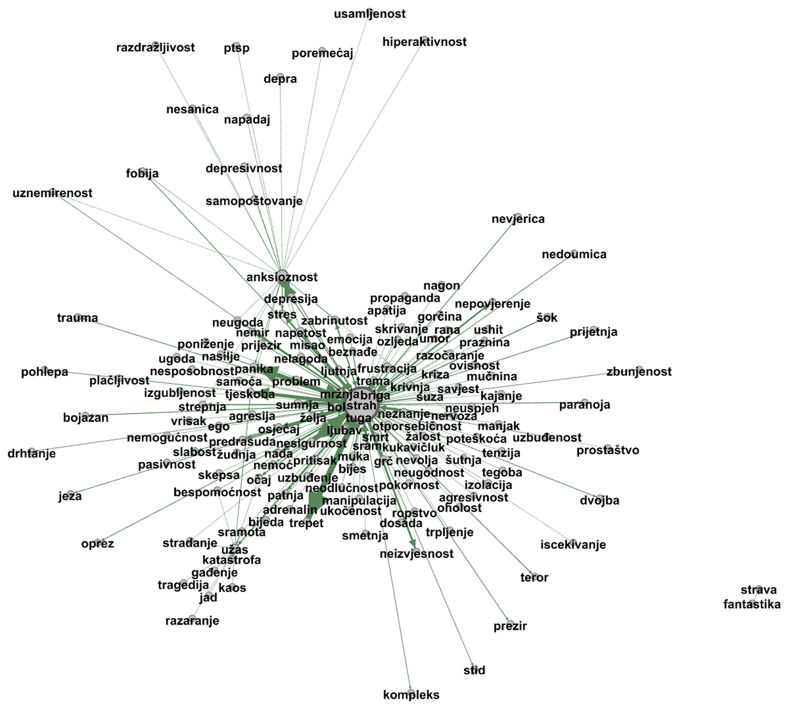

# 6. Mreže značenja: od ko-okurencije do konceptualne mreže

> *Teza poglavlja:* značenje je relacijsko i mrežno — rekonstruira se iz zajedničke pojavnosti i pretvara u **konceptualnu mrežu**, a mreža je *prikaz* značenja, ne njegov spremnik. Ako mreža ne pokaže ništa izvan podataka iz kojih je izgrađena, ostaje lijepa slika — i tada pada cijeli ovaj dio knjige.

---

## 6.1 Konceptualna mreža: čvorovi, veze, konstrukcije — i što je jedinica analize

Treće poglavlje zaustavilo se na drugom koraku: relacije su stabilne, mreža postoji, ali mreža još nije *jedan* nositelj. Ovo poglavlje radi tri stvari u nizu: pokazuje kako se mreža **izgrađuje** iz korpusa (6.2), kako se njezine mjere **čitaju** — i kako se najčešće čitaju pogrešno (6.3), te izvodi jednu mrežu do kraja, na stvarnim podacima (6.4). Zatim imenuje granicu (6.5) i vezu prema razinama afekta i kognicije (6.6).

**Tri pojma i jedna odluka.** Konceptualna mreža je graf u kojem su **čvorovi** jezične jedinice (riječi, leme, konstrukcije), a **bridovi** mjere asocijaciju iz uporabe; mreža prikazuje strukturu uporabe, a ne „spremnik" značenja (Perak & Ban Kirigin 2023). Ta definicija je namjerno siromašna i skriva u sebi jednu odluku koju treba izreći: **što je jedinica analize**. Čvor nije zadan; čvor je odabran. Isti korpus dat će bitno različite mreže ako su čvorovi oblici riječi, leme, lema s pripadnom vrstom riječi ili cijele konstrukcije. To je ista *pogreška razlučivosti* iz trećeg poglavlja (Perak 2026) — jedinica koja je presitna proizvodi šum, a jedinica koja je pregruba skriva svojstvo koje tražimo.

**Zašto je identitet jedinice relacijski.** Za mrežu značenja nije dovoljno supstancijalno čitanje identiteta, po kojem jedinica „nosi" svoje značenje sama. Ferdinand de Saussure (1916) u *Tečaju opće lingvistike* tvrdi da je znak čija je vrijednost *razlika*: u jeziku nema pozitivnih članova, samo razlika među njima, a *langue* je „sustav čistih vrijednosti". Ako je to tako, onda ono što jedinica jest ovisi o njezinu položaju prema ostalima — a položaj je upravo ono što mreža bilježi. Distribucijski kriterij daje tome operativni oblik: Zellig Harris (1954) definira distribuciju elementa kao **ukupnost svih okruženja u kojima se pojavljuje**, a John Rupert Firth (1957) istu misao sažima u formulu da riječ poznajemo po društvu u kojem se drži. Mreža značenja nije ništa drugo nego zapis toga društva.

**Konstrukcije, a ne samo riječi.** Ako bi mreža sadržavala samo lekseme, gramatika bi ostala izvan nje — a upravo je granica između leksika i gramatike ono što se u uporabi neprestano prelazi. Konstrukcija je par oblika i značenja koji se nasljeđuje iz ponovljene uporabe (Goldberg 2006), a radikalna konstrukcijska gramatika odustaje od pretpostavke da gramatika i leksik čine dvije odvojene cjeline (Croft 2001). Emergentistička gramatika isti stav izvodi iz uporabe: gramatika nije propis koji prethodi uporabi, nego njezin ustaljeni ishod (Hopper 1987). Pojmovna mreža utemeljena na konstrukcijskim odnosima pokazuje to konkretno: leksemi se povezuju preko konstrukcija koje dijele, pa se gramatika i leksik ponašaju kao **jedan graf**, a ne kao dvije police (Perak & Ban Kirigin 2023).

**Što mreža još ne može.** Mreža izgrađena isključivo na parovima ima ugrađenu slijepu točku. Federico Battiston i suradnici (2021) pokazali su da veze višega reda — trojke i skupine, a ne samo parovi — mijenjaju dinamiku sustava, pa sustav s istim parnim vezama može imati bitno drukčije ponašanje ovisno o tome postoje li skupne veze. Za jezik to nije tehnička finesa: razgovor trojice sudionika nije zbroj triju dvostranih razgovora, i značenje koje se ustali u skupini nije zbroj značenja u parovima. Parna relacijska shema zapisuje ono što se može zapisati — i mora se prijaviti kao ograničenje.

**Radna definicija.** Konceptualna mreža stoga je graf u kojem je čvor zapis entiteta (leksem ili konstrukcija), a brid zapis relacije; težina brida je mjera asocijacije iz uporabe, pa oba slijede istu shemu koju rabimo od trećeg poglavlja — *entitet {svojstvo} — [relacija {svojstvo}] → entitet {svojstvo}* (Perak, OMLCC - izlaganja 2017a; 2017b). Terminološka stega je pritom ista kao i drugdje: **čvor imenuje *gdje* jedinica jest u mreži, brid imenuje *što* se među njima zbiva.** Čvor je entitet, brid je relacija — i nijedno od toga nije još ni značenje ni komunikacija.

## 6.2 Kako se mreža gradi iz korpusa: koraci, pragovi i njihove posljedice

Postupak ima sedam koraka, a svaki od njih može se izvesti dobro ili loše. Ovdje ga izlažemo redom, jer mreža je **lanac odluka**: loša odluka u trećem koraku ne popravlja se u sedmom.

**1. Korpus i jedinica.** Polazište je korpus uporabe; u ovoj knjizi to je hrvatski web-korpus hrWac, koji je primarni korpus i za mjere iz četvrtoga poglavlja (hrWac). Prva odluka je razina jedinice: oblik riječi, lema ili lema s vrstom riječi. Za hrvatski je odluka ozbiljna, jer je morfološki bogat jezik i oblik riječi nije isto što i leksem. Uvjetno rečeno: *strah*, *straha*, *strahu* i *strahom* tri su različita niza znakova i jedna lema; postupak koji ih drži odvojenima ne mjeri jezik, nego morfologiju. ↗ Za tehnički opis toga kako jedinica postaje niz znakova i potom vektor — uključujući cijenu tokenizacije za morfološki bogate jezike — vidi *Komunikacija u doba umjetne inteligencije* (2025), pogl. 4 Dekonstrukcija jezika.

**2. Kontekstni prozor.** Ko-okurencija je pojava dviju jedinica unutar zadanoga okna. Veličina okna nije neutralna: usko okno (dvije do tri pozicije) hvata sintagmatske obrasce, široko (cijela rečenica ili odlomak) hvata tematsku bliskost. Isti korpus, dva okna, dvije mreže. Zato se uz svaku mrežu prijavljuje i veličina okna — u protivnom se dvije nesumjerljive slike uspoređuju kao jedna.

**3. Brojanje i mjera asocijacije.** Sirova frekvencija zajedničke pojavnosti nije mjera asocijacije: česte se riječi pojavljuju uz sve. Zato se rabi mjera koja uspoređuje zatečenu supojavnost s onom koju bismo očekivali iz pojedinačnih frekvencija (omjer vjerojatnosti, uzajamna informacija i njezine normalizirane inačice).

**4. Prag — odluka koja *stvara* mrežu.** Prag pretvara kontinuiranu mjeru u odluku „veza postoji ili ne postoji". Prag nije tehnički detalj na kraju postupka; on je odluka koja određuje **koja organizacija uopće postoji**. To je najvažnija rečenica ovoga odjeljka, pa je ponavljamo i u tablici.

**Tablica 6.1 — prag i njegove posljedice**

| prag | što se dogodi s mrežom | kako to izgleda u mjerama | što se pogrešno zaključuje |
|---|---|---|---|
| prenizak | povezano je gotovo sve sa svime | gustoća visoka, modularnost niska, centralnost se izjednačava | „leksik je jedinstven i koherentan" — a opisuje se šum |
| previsok | ostaju izolirani otoci i nakupine | mnogo komponenti, mreža fragmentirana | „domena se raspada na nepovezane dijelove" — a opisuje se odluka o pragu |
| srednji, prijavljen | zadržava se dio strukture i dio šuma; prag se navodi uz mrežu | usporedivo s drugim mrežama istoga praga | ništa se ne zaključuje samo iz praga; tvrdnja traži dodatni test |

**Ono što ova tablica ne kaže.** Ne postoji „točan" prag koji bi bio svojstvo jezika; postoji prag kao odluka istraživača i obveza da se ta odluka prijavi. Dvije mreže uz različite pragove nisu dvije slike istoga predmeta — one su dva različita predmeta.

**5. Konstrukcijski sloj.** Mreža značenja ne mora ostati na ko-okurenciji. Ako se za svaki par leksema zabilježi i konstrukcija u kojoj su se zajedno našli, brid dobiva vrstu, a ne samo težinu: *strah* i *panika* povezani su i zato što se pojavljuju u istim konstrukcijama, a ne samo zato što se pojavljuju blizu. Takav zapis — leksemi i konstrukcije kao čvorovi jedne mreže — omogućuje da se gramatički i leksički sloj čitaju zajedno.

**6. Izračun mjera.** Kad mreža postoji, računaju se mjere iz 6.3. Mjere su **izlaz postupka**, a ne njegov cilj: način da se ono što vidimo zapiše tako da ga i drugi mogu provjeriti.

**7. Zapis i reproducibilnost.** Prag, okno, mjera asocijacije, verzija korpusa i postupak lematizacije idu u zapis uz mrežu. Bez toga slika nije rezultat, nego ilustracija.

**Praktikum (skica koda).** Postupak se izvodi u nekoliko desetaka redaka; isječak pokazuje gdje su odluke, a gdje rutina:

```python
import networkx as nx

def izgradi_mrezu(parovi, prag, okno):            # okno i prag idu u zapis mreže
    G = nx.Graph(okno=okno)
    for a, b, mjera in parovi:
        if mjera >= prag:                        # prag odlučuje što postoji
            G.add_edge(a, b, weight=mjera)
    return G

G = izgradi_mrezu(parovi, prag=3.0, okno=5)      # mjera: log-omjer, ne frekvencija
print(nx.density(G), nx.transitivity(G))         # gustoća, tranzitivnost
print(nx.degree_centrality(G))                   # + posrednička, svojstvena
zajednice = nx.community.greedy_modularity_communities(G)
print(nx.modularity(G, zajednice))               # modularnost dane podjele
```

**Ako ne radi — tri najčešće greške.** *Prva:* mreža je izgrađena na oblicima riječi, pa se *strah* i *straha* pojavljuju kao dva slabo povezana čvora i mreža izgleda rascjepkano. *Druga:* u mreži su ostale funkcijske riječi i najčešće riječi jezika, pa sve visi o nekolicini čvorova koji ne nose nikakvo značenje domene — rješenje nije „pojačati prag", nego izračunati asocijaciju umjesto frekvencije. *Treća:* prag je odabran tako da slika izgleda lijepo, a ne tako da se može braniti; ljepota rasporeda nije kriterij, a siloviti (*force-directed*) raspored u kojem je slika najčešće nacrtana koristi **samo bridove** — položaj čvora na slici nije udaljenost u značenju, nego posljedica algoritma crtanja.

## 6.3 Interpretacija mjera: što mjera znači i što NE znači

Mreža se opisuje malim brojem mjera, a svaku od njih u praksi čitamo preko njezinih mogućnosti. Tablica 6.2 zato ima četiri stupca: mjera, što je, što znači i što **ne** znači.

**Tablica 6.2 — mjere i njihove granice**

| mjera | što je | što znači | što NE znači |
|---|---|---|---|
| **gustoća** | udio ostvarenih bridova među svim mogućim parovima | koliko je mreža povezana *uz zadani prag i zadan broj čvorova* | da je domena „koherentna", da su veze jake ni da su članovi međusobno slični |
| **modularnost** | koliko je više bridova *unutar* skupina nego što bi se očekivalo prema modelu nulte vrijednosti | da se mreža dijeli na skupine gušće povezane iznutra | da su te skupine psihološki ili kulturno stvarne; vrijednost je relativna prema modelu i prema podjeli |
| **centralnost (stupnjevna, posrednička, svojstvena)** | svojstvo **čvora**, ne mreže | da čvor ima mnogo veza, da leži na putevima između dijelova mreže ili da je vezan na dobro povezane čvorove | da je taj čvor „središte značenja", uzrok drugih čvorova ili da je pojam važniji u mišljenju govornika |
| **tranzitivnost (klasteriranje)** | udio zatvorenih trojki među povezanim trojkama | da se susjedstva često zatvaraju: susjed moga susjeda često je i moj susjed | da tri leksema „idu zajedno" u značenju; pokazuje ustaljenost okruženja, ne bliskost pojmova |
| **broj komponenti i promjer** | koliko je dijelova mreža i koliko je najdulji najkraći put | posljedica praga i pokrivenosti korpusa | da domena nije povezana „u jeziku"; nepostojanje brida u korpusu ne dokazuje nepostojanje odnosa |

**Najčešća pogreška: mjera se čita kao uzrok.** Rečenica „visoka gustoća mreže čini emocije međusobno sličnima" izgleda kao nalaz, a nije: gustoća je **opis uzorka**, a ne sila. Mrežna verzija te pogreške ista je ona koju je Jaegwon Kim (1999) formulirao za razine: ako više svojstvo ne dodaje ništa objema stranama — opisu i predviđanju — onda mu ne treba pripisivati kauzalnu moć. Gustoća ne djeluje; centralnost ne privlači; modularnost ne razdvaja. Mjera je zapis o tome kako su odluke o jedinici i pragu ostavile trag u podacima.

**Druga pogreška: mjera se čita izvan svojih uvjeta.** Gustoća se ne može usporediti između mreža različitoga broja čvorova bez korekcije, a modularnost se ne može navesti bez podatka o podjeli na skupine i o modelu nulte vrijednosti. Isto vrijedi za centralnost: stupnjevna centralnost u mreži izgrađenoj na frekvenciji mjeri najvećim dijelom **frekvenciju**, ne strukturu. Ako čitatelj ne može iz teksta vidjeti prag, okno i mjeru, ne može ni provjeriti nalaz — pa nalaza nema.

**Treća pogreška: parne mjere se čitaju kao da pokrivaju cijelu strukturu.** Sve mjere iz tablice 6.2 računaju se na parovima, pa ne mogu same opravdati tvrdnje o skupnim odnosima; veze višega reda mijenjaju dinamiku sustava i nisu zbroj parnih (Battiston i suradnici 2021). Tvrdnja da nešto vrijedi za „skupinu leksema kao cjelinu" nije izlaz iz gustoće i modularnosti, nego dodatna tvrdnja koja traži svoj test.

**I jedna opća opreza o mjeri.** Pouka iz istraživanja velikih jezičnih modela ovdje je općenita: pojava koja na grafu izgleda kao skok može biti posljedica nelinearnog praga u mjeri, pa se skok u grafu lako zamijeni za skok u sustavu — mjera je dio tvrdnje, a ne dodatak (Schaeffer i suradnici 2023). U mrežnoj analizi isti se mehanizam pojavljuje dva puta: u pragu koji pretvara kontinuiranu mjeru u brid i u granici skupine koja pretvara gusto povezan dio mreže u „zajednicu". Oba su pragovi; oba se prijavljuju.

**Što se iz mreže smije izvesti.** Smije se izvesti opis organizacije: koje su jedinice gusto povezane, koje leže na putevima, gdje se mreža dijeli i gdje susjedstva zatvaraju. Iz toga slijede **hipoteze** koje se testiraju izvan mreže — na novome korpusu, na anketnom ili eksperimentalnom materijalu. Mreža je instrument za postavljanje pitanja, a ne odgovor; izvesti se iz nje ne smije tvrdnja o uzroku, o vrijednosti ili o unutrašnjosti govornika.

## 6.4 Studija slučaja: emocije — mreža od 125 hrvatskih emocionalnih leksema

Emocionalni je leksik za ovu svrhu prikladan iz jednoga razloga: to je domena u kojoj je odnos između jezika i unutrašnjosti najzanimljiviji, a najmanje providan. Emocija se ne može pročitati iz riječi, ali se uporaba riječi o emocijama može izmjeriti.

**Podaci i postupak.** Polazište je hrvatski emocionalni leksik — **125 leksema** koji pripadaju domeni emocija — a veze se izvode iz uporabe u korpusu (hrWac) mjerom asocijacije uz prijavljeni prag, uz dodatni konstrukcijski sloj koji bilježi lekseme u istim konstrukcijama (Perak 2014; EmoCNet 2019–21; Perak & Ban Kirigin 2023). Mreža je izgrađena oko leksema *strah* kao polazišta, pa se oko njega čitaju susjedstva, a ne popis sinonima. Rezultat je prikazan na slici 6.1.



**Slika 6.1.** *Mreža od 125 hrvatskih emocionalnih leksema s leksemom „strah" u središtu* (objavljeno u: Ban Kirigin & Perak 2020, *Rasprave IHJJ* 46(2): 957–996; `fig_emotion_network.png`, 1618 × 1456 px; izvor podataka: hrWac; Perak 2014; EmoCNet 2019–21). Čvorovi su potpisani leksemima, bridovi su mjera asocijacije iz uporabe, a raspored je siloviti (*force-directed*), što znači da položaj čvora na slici proizlazi iz bridova i algoritma crtanja, a ne iz mjere značenja.

> **Izvor slike.** Mreža od 125 emocionalnih leksema sa *strah* u središtu objavljena je u: Ban Kirigin, T. & Perak, B. (2020). *Corpus-Based Syntactic-Semantic Graph Analysis: Semantic Domains of the Concept „Feeling“.* Rasprave: Časopis Instituta za hrvatski jezik i jezikoslovlje 46(2): 957–996 (Hrčak: 245479). Ovdje je prenosimo u skraćenom obliku.

**Što se u ovoj mreži vidi.** Prvo, da se emocionalni leksemi hrvatskoga u uporabi **ne pojavljuju pojedinačno**, nego u mrežama s određenim središtima — što je isti nalaz koji je u drugom poglavlju naveden kao svojstvo razine 10 (Perak 2014; EmoCNet 2019–21). Drugo, da leksem ne nosi svoju definiciju kao spremnik: struktura je u relacijama koje *strah* vežu uz *trepet*, *lepet*, *paniku* i *frku*, a svaki od tih leksema ima drugi položaj i drugo susjedstvo (Perak 2014; EmoCNet 2019–21). Treće, da mreža ima unutarnja polja koja su međusobno razdvojena, a neka su susjedna — a to je svojstvo **cjeline**: nijedan pojedini leksem ne „sadrži" činjenicu da su dva polja razdvojena.

**Provjera pet kriterija iz trećega poglavlja.** Je li ova mreža samo opis ili je postala jedan nositelj? *Namenljivost:* može se imenovati jedninom — *emocionalni leksik hrvatskoga*, *mreža straha*. *Relacijska sposobnost:* s njom se može usporediti druga takva cjelina, iz druge domene ili iz drugoga korpusa. *Svojstvo bez nositelja u sastavnicama:* razdvojenost polja i položaj *straha* nisu svojstva ni jednoga pojedinog leksema. *Granica i pripadnost:* granica postoji, ali je postupna i ovisi o pragu. *Zamjenjivost sastavnica:* najosjetljiviji kriterij; ono što preživljava zamjenu podataka jest **uzorak** — a to je upravo ono što ovdje zovemo organizacijom.

**Što ova studija slučaja ne pokazuje.** Ne pokazuje kakav je *strah* kao doživljaj, ne pokazuje uzrok njegova položaja u mreži ni hijerarhiju važnosti među emocijama. Ne pokazuje ni da govornici hrvatskoga dijele unutarnji pojmovni prostor koji slika prikazuje: pokazuje da se u zapisanome jeziku ustalio obrazac uporabe koji se može opisati mrežom. Razlika između te dvije tvrdnje nije nijansa — to je razlika između jezičnoga podatka i psihološkoga zaključka, i u njoj se lako izgubiti. Zato je sljedeći odjeljak posvećen granici.

### 6.4.1 Podaci iz izvornika (2014) — što je u radu izmjereno

Mreža emocija nije nastala kao ilustracija; iza nje stoji korpusna obrada iz doktorskoga rada (Perak 2014). Ključne izmjerene vrijednosti, s izvornim stranicama:

| što je mjereno | vrijednost | mjesto u izvorniku |
|---|---|---|
| korpus | Hrvatski nacionalni korpus, **131,8 Mw** | sažetak izvornika |
| pojavnice leme *strah* | **14.875** | sažetak izvornika |
| prijedložni izraz *od straha* | **825** pojavnica — drugi po čestotnosti | str. 304 |
| glagoli u konstrukciji *od straha* | drhtati (62), umrijeti (61), tresti (39), trnuti (18), plakati (12), kriknuti (11), izbezumiti (10), bježati (9), razboljeti se (8), osloboditi (8), ukočiti (8) | str. 304 |
| konstrukcije miješanja | *miješati* (n=17), *prožeti* (n=6), *prodrijeti* (n=4) | str. 369 |

**Zašto je to važno za ovu knjigu.** Ovi brojevi pokazuju dvije stvari koje se u raspravama o „mrežama značenja" često preskaču. Prvo, **mreža je izvedena iz uporabe, a ne iz intuicije**: svaki brid ima frekvenciju i mjesto u korpusu. Drugo, **frekvencija nije značenje**: to što se uz *strah* najčešće pojavljuju *drhtati* i *umrijeti* govori o stabilnosti konstrukcije, ne o „sadržaju" emocije. Upravo zato u ovome poglavlju mjere čitamo kao **strukturu uporabe**, a ne kao kartu unutrašnjosti.

Izvorni podaci izvučeni su u `data/izvori/doktorat-2014/` (četiri CSV-a, s pomakom stranica PDF = tiskana + 24 i s navedenim ograničenjima automatskog izvlačenja). Svaka brojka koja ulazi u knjigu provjerava se na navedenoj stranici izvornika.

## 6.5 Granice: mreža ne sadrži značenje — prikazuje strukturu uporabe

**Pogreška spremnika.** Najlakše je zamisliti da mreža „sadrži" značenje i da se čitanjem bridova ono vadi na vidjelo. Ta slika ima utjecajnu povijest i jednako utjecajnu kritiku: Roy Harris (1981) uvjerenje da se značenje prenosi kao predmet naziva „telemencijom" i to uvjerenje smatra mitom, a komunikaciju opisuje kao **prepoznavanje namjere** — što je i Griceova (1957) formulacija: govornik želi da sugovornik prepozna njegovu namjeru time što je prepoznaje. Ako je značenje prepoznata namjera, onda ono nije u grafu: graf ne prepoznaje ništa, graf je zapis okruženja. Ono što jest u grafu jesu **okolnosti uporabe** — a to je, strogo uzevši, manje nego značenje, ali i više od ničega.

**Zašto relacije same ne daju referenciju.** Mreža je sustav znakova u kojem znakovi dobivaju vrijednost jedan prema drugome; takav sustav može biti bogat i dobro organiziran, a da nijedan njegov član ne bude povezan sa svijetom. Stevan Harnad (1990) taj je problem imenovao problemom utemeljenja simbola: unutarnje relacije simbola ne utemeljuju ih u onome na što upućuju. Za ovu je knjigu to granica pojma mreže i priprema za treći dio, u kojemu će isto pitanje biti postavljeno o modelu.

**Ista organizacija, drugi zapis.** Mreža značenja nije jedini mogući zapis te organizacije. Ono što je u grafu čvor i brid, u drugom je zapisu točka i udaljenost: od koordinata riječi (Mikolov i suradnici 2013; Pennington i suradnici 2014) do kontekstualnih ugrađivanja (Qwen Team 2025) mijenja se notacija, ne ono što njome opisujemo — položaj jedinice prema njezinu društvu. ↗ Postupak kojim se mreža prevodi u vektore i kako se iz njih gradi semantička pretraga vidi u *Data Science u kulturi*, pogl. 9 Embedding i semantička pretraga. Ključna je tvrdnja i tamo i ovdje ista: **promjena zapisa ne mijenja organizaciju** — ali ni jedan od dvaju zapisa ne stvara referenciju koju polazište nema.

**Skromnost tvrdnje.** Mreža značenja u ovom je okviru **slabo emergentna** cjelina (Bedau 1997): svojstva mreže izvediva su iz mikrodinamike uporabe, ali samo simulacijom — iznenađujuće u praksi, izvedivo načelno. Ne tvrdimo jaku emergenciju (Chalmers 2006). I kao i svako svojstvo u ovoj knjizi, svojstvo mreže **relativno je prema razini organizacije** (Emmeche, Køppe & Stjernfelt 1997): razdvojenost polja nije svojstvo ni jedne riječi, nego razine na kojoj mrežu promatramo. Ono što mreža opisuje uvijek je *organizacija uporabe*, a uporaba je jedan sloj — ne cijeli čovjek i ne cijelo društvo.

**Test koji mora proći.** Mreža opravdava svoje mjesto u ovoj knjizi samo ako **predviđa nešto izvan podataka iz kojih je izgrađena**: ponašanje leksema u novome korpusu, obradu u eksperimentu, zastupljenost u drugome žanru ili jeziku. Ako ne predviđa ništa, njezina je vrijednost opisna i prikazna — i to treba reći, a ne pretvarati prikaz u objašnjenje.

## 6.6 Od mreže do razina 10 i 11 — i najava sedmoga poglavlja

Mreža emocionalnoga leksika nije važna sama po sebi; važna je po tome gdje upućuje. Njezini čvorovi pripadaju jeziku, ali sadržaj koji preko njih čitamo odnosi se na dvije razine koje u ovome okviru pripadaju **psihološkoj domeni**: razinu 10 (afekt) i razinu 11 (kognicija). Podjela na materijalnu, psihološku i društvenu domenu preuzeta je od Searlea (1995; 2010), dok je razrada razina unutar domena autorska (Perak, OMLCC - izlaganja 2017a; 2017b).

**Razina 10 (afekt).** Na toj je razini nositelj doživljavatelj koji doživljava afektivno stanje, a tipična su svojstva valencija (ugodno/neugodno) i pobuđenost (uzbuđenost/umirenost). Mreža nam daje **jezični trag** o tome kako se ta stanja razlikuju i slažu u uporabi — ali iz traga ne slijedi ništa o tome što je tko osjećao. Emocionalni leksem može se upotrijebiti u negaciji, u citatu, u ironiji i u opisu tuđega stanja; uporaba riječi o emociji nije emocija.

**Razina 11 (kognicija).** Na toj razini nositelj misli mentalnu reprezentaciju, a svojstvo je struktura te reprezentacije. Klasična je teorija pojmove držala definicijski strukturiranima, s nužnim i dovoljnim uvjetima (Fodor 1975), a kasnija je rasprava taj model oslabila i usmjerila se na sustavnost mišljenja (Fodor & Pylyshyn 1988). Mreža značenja u tom je sporu korisna upravo zato što ne pretpostavlja definicijsku strukturu: ona bilježi što se s čime u uporabi drži, bez tvrdnje da je to isto što i pojam u glavi. Ali time je i ograničena: mreža može pokazati da su polja razdvojena, ali ne i da ih govornik razdvaja po istome kriteriju.

**Zajednička opreza.** Obje ove tvrdnje ostaju unutar onoga što podaci dopuštaju. Iz mreže uporabe slijedi **hipoteza o razini**, a ne nalaz o razini: za potvrdu bi trebalo pokazati da se ista struktura pojavljuje i u podacima koji nisu jezični (anketni, eksperimentalni). Položaj je mreže time jasan: ona je na **razini 14** (društvena komunikacija) trag o uporabi, a njezino čitanje zadire u razine 10 i 11 preko pretpostavke koju moramo izreći, a ne prešutjeti.

**Zašto sljedeće poglavlje.** Mreža je zapis o uporabi, ali nije čin. Komunikacija je nešto drugo: društveni čin u kojemu jedna strana drugoj daje nešto da prepozna, s namjerom, zajedničkim artefaktom i konvencijom (Grice 1957; Harris 1981; Searle 1995; 2010). Mreža može pokazati da su se *strah* i *panika* ustalili u istim okruženjima; ne može pokazati da je itko ikome time nešto rekao. Tu razliku — između strukture uporabe i komunikacijskoga čina — sedmo poglavlje postavlja u središte i brani tvrdnju da je komunikacija **razina**, a ne alat.

---

### Kako bismo znali da griješimo

- Ako mrežna struktura **ne predviđa ništa izvan podataka iz kojih je izgrađena** (nulta prediktivna vrijednost), mreža je samo lijepa slika, a teza ovoga poglavlja pada na razinu ilustracije.
- Ako se rezultat **bitno mijenja pri maloj promjeni praga** — tako da se „nalaz" pojavljuje i nestaje s pragom — nalaz je artefakt odluke, a ne svojstvo uporabe; tada se prijavljuje kao nerazlučiv.
- Ako se mreža iz korpusa i mreža iz anketnih podataka za istu domenu **ne razlikuju ni po jednoj mjeri**, tvrdnja da mreža opisuje uporabu (a ne nešto drugo) nije potkrijepljena.
- Ako se pokaže da su sve mjere iz tablice 6.2 u potpunosti određene **frekvencijom** članova, mreža ne dodaje ništa onome što se vidi iz popisa frekvencija, pa je pojam konceptualne mreže u tom slučaju suvišan.
- Ako se za „središnjost" nekoga leksema pokaže da je posljedica **odabira jedinice** (npr. lematizacije ili okna), a ne organizacije, središnjost treba prijaviti kao artefakt mjere (Schaeffer i suradnici 2023).

### Vježbe

🟢 **Provjeri razumijevanje.** Uzmi bilo koju objavljenu mrežu značenja (iz članka, udžbenika ili vlastite kolegijske literature) i nađi **tri pogrešna čitanja** u njezinu opisu: jedno u kojemu se mjera čita kao uzrok, jedno u kojemu se gustoća ili modularnost uspoređuje bez prijavljenog praga, i jedno u kojemu se iz mreže izvodi zaključak o unutrašnjosti govornika. Za svako napiši ispravljenu formulaciju tvrdnje koja ostaje unutar podataka.

🟡 **Primijeni na vlastite podatke.** Izaberi jednu semantičku domenu (npr. leksik straha, hrane, pokretâ ili školskih pojmova) i izgradi mrežu u tri koraka: (a) popis jedinica i odluka o jedinici (oblik, lema, konstrukcija); (b) ko-okurencija iz korpusa s prijavljenim oknom i mjerom asocijacije; (c) prag i izračun gustoće, tranzitivnosti, modularnosti i stupnjevne centralnosti. Napiši dvije rečenice: što mreža pokazuje i što **ne** pokazuje. Ponovi postupak s drugim pragom i zabilježi što se promijenilo.

🏆 **Istraživački zadatak.** Usporedi mrežu izgrađenu iz korpusa s mrežom iste domene iz anketnih ili eksperimentalnih podataka (npr. procjene sličnosti ili tipičnosti leksema) i objasni razlike. Potrebno je: (a) prijaviti jedinicu, prag i mjeru u obama slučajevima; (b) navesti najmanje dvije mjere u kojima se mreže razlikuju — ili pokazati da se ne razlikuju; (c) objasniti što razlika (ili njezino odsustvo) govori o odnosu razina 11 i 14; (d) reći koji bi rezultat oborio tvoju interpretaciju.

### Sažetak

- **Konceptualna mreža** je graf u kojem su čvorovi jezične jedinice (leksemi, konstrukcije), a bridovi mjere asocijaciju iz uporabe; mreža prikazuje **strukturu uporabe**, a ne značenje kao sadržaj (Perak & Ban Kirigin 2023).
- **Jedinica analize je odluka, ne nalaz.** Ista građa uz oblik riječi, lemu ili konstrukciju daje različite mreže; identitet jedinice je relacijski — vrijednost znaka je razlika (Saussure 1916), a distribucija je ukupnost okruženja (Harris 1954; Firth 1957).
- Postupak ima sedam koraka: korpus i jedinica · kontekstni prozor · mjera asocijacije · **prag** · konstrukcijski sloj · izračun mjera · zapis i reproducibilnost. **Prag stvara mrežu** i zato se uvijek prijavljuje: prenizak daje šum, previsok izolirane otoke.
- Mjere — gustoća, modularnost, centralnost, tranzitivnost, broj komponenti — imaju točno određeno značenje i jednako točno određene granice. **Najčešća pogreška je čitati mjeru kao uzrok**: gustoća ne djeluje, centralnost ne privlači, modularnost ne razdvaja (usp. Kim 1999).
- Mjere su definirane isključivo na **parovima**, pa ne mogu same opravdati tvrdnje o skupnim odnosima; veze višega reda mijenjaju dinamiku sustava (Battiston i suradnici 2021).
- **Studija slučaja: emocije.** Mreža od **125 hrvatskih emocionalnih leksema** sa *strah* u središtu, iz korpusa hrWac (Perak 2014; EmoCNet 2019–21; `fig_emotion_network.png`, 1618 × 1456 px) pokazuje da se emocionalni leksemi u uporabi ne pojavljuju pojedinačno, nego u mrežama s određenim središtima i unutarnjim poljima.
- **Mreža ne sadrži značenje.** Značenje je prepoznata namjera (Grice 1957; Harris 1981), a unutarnje relacije znakova ne utemeljuju ih u svijetu (Harnad 1990). Ista se organizacija može zapisati kao graf ili kao vektorski prostor (Mikolov i suradnici 2013; Pennington i suradnici 2014; Qwen Team 2025) — promjena zapisa ne mijenja organizaciju.
- Mreža je **slabo emergentna** cjelina (Bedau 1997); njezina su svojstva relativna prema razini organizacije (Emmeche, Køppe & Stjernfelt 1997), nikada jaka emergencija (Chalmers 2006).
- Mreža upućuje na razine **10 (afekt)** i **11 (kognicija)**, ali iz nje slijedi hipoteza o razini, a ne nalaz o njoj; klasično je pojmove držalo definicijski strukturiranima (Fodor 1975; Fodor & Pylyshyn 1988).
- Mreža je zapis, ne čin: komunikacija kao društveni čin s namjerom, zajedničkim artefaktom i konvencijom tema je sedmoga poglavlja.

### Ključni pojmovi

*konceptualna mreža · čvor · brid · ko-okurencija · kontekstni prozor · mjera asocijacije · prag · gustoća · modularnost · centralnost · tranzitivnost · komponenta · jedinica analize · struktura uporabe · pogreška spremnika · relacija višega reda · siloviti raspored · artefakt mjere · prediktivna vrijednost mreže*

### Literatura poglavlja

Battiston i suradnici 2021 · Bedau 1997 · Chalmers 2006 · Croft 2001 · Emmeche, Køppe & Stjernfelt 1997 · EmoCNet 2019–21 · Firth 1957 · Fodor 1975 · Fodor & Pylyshyn 1988 · Goldberg 2006 · Grice 1957 · Harnad 1990 · Harris, R. 1981 · Harris, Z. 1954 · Hopper 1987 · hrWac · Kim 1999 · Mikolov i suradnici 2013 · Pennington i suradnici 2014 · Perak 2014 · Perak 2017a · Perak 2017b · Perak 2020 · Perak 2026 · Ban Kirigin & Perak 2020 · Perak & Ban Kirigin 2023 · Qwen Team 2025 · Saussure 1916 · Schaeffer i suradnici 2023 · Searle 1995 · Searle 2010

> **Napomena o referencama.** Izvor mreže: Ban Kirigin & Perak 2020 (Rasprave IHJJ 46(2): 957–996). OMLCC se citira kao izlaganje (Perak 2017a; 2017b); puni bibliografski podaci za Perak 2025 i Perak & Ban Kirigin 2023 preuzimaju se iz autorove bibliografije. Nijedna referenca ne izlazi izvan verificirane baze referenci knjige.
