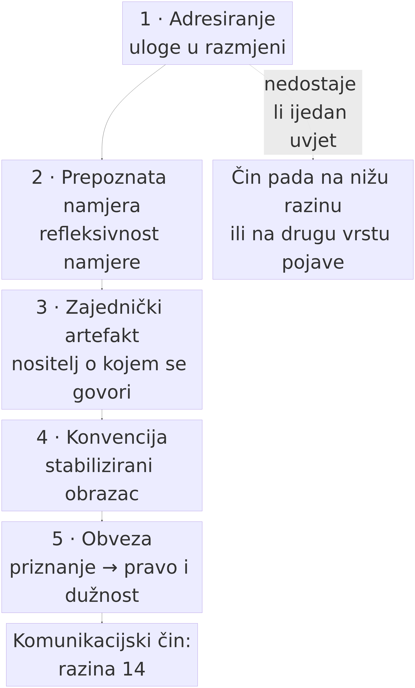

# 7. Komunikacija kao razina 14 — SocCommunication

> *Teza poglavlja:* komunikacijski čin nije prijenos informacije, nego **društveni čin**: zahtijeva prepoznatu namjeru, zajednički artefakt, konvenciju i obvezu. Zato je komunikacija **razina**, a ne alat — i zato se o njoj može govoriti kao o mjestu na kojem se ontologija *vidi*, a ne samo kao o vještini kojom se služimo.

---

## 7.1 Zašto komunikacija zaslužuje razinu

U drugom poglavlju postavili smo kriterij: razlika između razina nije razlika u količini, nego u **tipu svojstava i tipu relacija** (→ pogl. 2.4). Primijenimo ga sada na nešto što svatko misli da poznaje: na razgovor.

Uzmimo najjednostavniji slučaj. Netko kaže: *„Vrata su otvorena."* Ako na to gledamo kao na prijenos informacije, posao je obavljen kad je niz znakova prenesen i dekodiran — a to je upravo ono što radi tehnički opis na razini 8 (informacijski sustav: oznaka nosi razliku). Ali pogledajmo što se doista dogodilo:

1. **Adresiranje.** Poruka je upućena *nekome*; nije izgovorena u prazno. Time postoji nositelj uloge primatelja, a ne samo primatelj signala.
2. **Namjera.** Govornik je želio da sugovornik **prepozna njegovu namjeru** — i to prepoznavanje je dio same poruke (Grice 1957).
3. **Zajednički artefakt.** Postoji nešto na što se obojica mogu referirati: vrata, ali i sama izrečena rečenica, kao predmet o kojem se može reći „pa ti si rekao da su otvorena".
4. **Konvencija.** Rečenica ima smisao koji ne proizlazi iz zvukova nego iz ustaljenog obrasca uporabe kojemu su obojica pristupili (Firth 1957; Hopper 1987).
5. **Obveza.** Ako je rečeno u kontekstu u kojem je to *tvrdnja*, govornik je preuzeo nešto: da će se, bude li vrata zatvorena, njegova izjava moći smatrati pogrešnom, da je dužan pojasniti ili priznati. Obveza ne postoji na razini signala — ona postoji samo ako je **priznaju oba sudionika** (Gilbert 1990; Searle 2010).

Tih pet uvjeta nisu ukrasi: svaki od njih uvodi **novi tip svojstva** koji nijedan niži sloj ne posjeduje. Signal *nema* obvezu; oznaka *nema* namjeru; mehanizam *nema* konvenciju. Zato komunikacija nije „složeniji prijenos" — ona je razina.

**Razlika prema susjednim razinama** mora biti izrečena precizno, jer je ovdje najlakše pogriješiti:

| razina | što postoji | čega nema |
|---|---|---|
| **8 InformationSystem** | oznaka koja nosi razliku, kod, pohrana | namjere, adresata, obveze |
| **13 SocBehaviourInteraction** | ponašanje u odnosu, protokol, izmjena poteza | prepoznate namjere; konvencije kao obveze |
| **14 SocCommunication** | adresiranje, prepoznata namjera, zajednički artefakt, konvencija, obveza | institucije i njihove sankcije (to je 15) |
| **15 SocCulturalInstitution** | statusne funkcije, pravila, sankcije | — |

Tablica pokazuje zašto je razina 14 **nezamjenjiva**: sve što je u njoj *nove* vrste svojstava ne može se svesti na razinu 13 bez gubitka upravo onoga o čemu govorimo kad govorimo o značenju. Dvije jedinke mogu izmjenjivati signale (razina 13) i nikada ne uspostaviti komunikacijski čin u ovom smislu — kao što dvije države mogu izmjenjivati poteze bez da je ijedan od njih *izjava*.

## 7.2 Grice: značenje kao prepoznata namjera

Najprecizniju definiciju onoga što razlikuje komunikaciju od signaliziranja dao je Herbert Paul Grice u kratkom tekstu *Meaning* (1957). Njegova je poanta da „značenje" u komunikacijskom smislu nije svojstvo znaka, nego **relacija između namjere i njezina prepoznavanja**: govornik želi proizvesti neki učinak u sugovorniku **time što će sugovornik prepoznati njegovu namjeru**.

Ta formulacija ima tri posljedice koje je lako previdjeti.

**Prvo, namjera mora biti *javna*.** Nije dovoljno da govornik nešto namjerava; namjera mora biti takva da njezino prepoznavanje *je* mehanizam učinka. Zato se komunikacija razlikuje od utjecaja: dim mogu prouzročiti i bez da itko zna da ga ja stvaram, ali *poruku* ne mogu prenijeti bez da sugovornik prepozna da je to ono što činim.

**Drugo, posljedica je *refleksivna*.** Sugovornik ne mora samo pogoditi što govornik želi; on mora pogoditi **da govornik želi da on to pogodi**. Samo zato što je ovaj drugi sloj prisutan može doći do ironije, laži, impliciranja i ispravka — a to su sve pojave koje su, u ovom okviru, *svojstva razine 14*, a ne stilski ukrasi jezika.

**Treće, prepoznata namjera omogućuje *impliciranje*.** U kasnijem tekstu *Logic and Conversation* (1975) Grice uvodi razliku između onoga što je rečeno i onoga što je implicirano, i pokazuje da sugovornici uspješno prenose mnogo više od izrečenoga upravo zato što pretpostavljaju suradnju i njezine uvjete. Sperber i Wilson (1986) kasnije tu misao razvijaju u teoriju relevantnosti: komunikacija nije dekodiranje nego **zaključivanje o namjeri** uz najmanji potreban napor.

Za ovu knjigu iz Griceova uvida slijedi operativan zaključak: **komunikacijski čin je onaj kod kojeg je prepoznavanje namjere dio mehanizma, a ne dodatak.** Sve što se može objasniti bez tog sloja — prijenos, uzorak, asocijacija — nije razina 14, koliko god sličilo razgovoru.

## 7.3 Harris: prepoznavanje namjere i što model ne radi „iznutra"

Roy Harris (1981) je u knjizi *The Language Myth* izveo najžešći mogući zaključak iz te iste tradicije: ako je komunikacija prepoznavanje namjere, onda je predodžba jezika kao **sustava koji prenosi misli** (*telementation*) mit. Jezik nije cijev kroz koju teku misli; jezik je **materijal na kojem se namjere prepoznaju**, uvijek uz doprinos konteksta, znanja i procjene sugovornika.

Taj je uvid u ovoj knjizi koristan iz dva razloga.

**Prvi je filozofski.** On objašnjava zašto lingvistika koja polazi od „prenosa značenja" uvijek zapne na istom mjestu: na razlici između onoga što je rečeno i onoga što je značeno, i na činjenici da je ta razlika *normalno stanje*, a ne greška.

**Drugi je praktičan i tiče se velikih jezičnih modela.** Model proizvodi niz simbola koji je iznimno dobro prilagođen obrascima uporabe. Ali *prepoznavanje namjere* — kao mehanizam, ne kao opis — zahtijeva nositelja čija je namjera prepoznata i koji može **preuzeti obvezu**. Ovdje treba biti precizan i ne precijeniti tvrdnju:

- Model **jest** u poziciji da bude dio komunikacijskog čina — kao artefakt, kao posrednik, kao sudionik u razmjeni (→ pogl. 13).
- Model **nije** u poziciji da mu se namjera pripiše *na temelju intrinzičnog stanja*, jer takvo stanje nije ništa što njegov opis sadrži; ono što se pripisuje je **obrazac iz kojeg ljudi čitaju namjeru**.

To razlikovanje nije ustupak ni pristojnost — ono je isto razlikovanje koje smo postavili između funkcionalnog parnjaka i pravog slučaja (→ pogl. 14). I ono je u literaturi o modelima već prepoznato s druge strane: argument da jezična kompetencija i „mišljenje" nisu ista stvar (Mahowald et al. 2024), kao i analiza da je pitanje „razumije li" nerazlučivo od pitanja „po kojim kriterijima to tvrdimo" (Mitchell & Krakauer 2023).

**Posljedica:** ako komunikacijski čin traži prepoznatu namjeru i obvezu, onda se razina 14 ne može pripisati sustavu koji ni jedno ni drugo ne može nositi *intrinzično* — nego samo onoliko koliko ga ljudi u tu razinu uključe. To je, kako ćemo vidjeti u četvrtom dijelu, mnogo zanimljivija tvrdnja od pukog „da/ne".

## 7.4 Searle: gdje informacija postaje obveza

Ako Grice objašnjava *kako* komunikacija funkcionira, John Searle (1995; 2010) objašnjava *čime* postaje društvena činjenica. Njegov je temeljni mehanizam **statusna funkcija**:

> **X broji kao Y u kontekstu C.**

Komad papira broji kao novac u kontekstu države koja ga priznaje. Niz zvukova broji kao obećanje u kontekstu zajednice koja ga tako prihvaća. Bitno je da taj mehanizam **ne djeluje ni na razini materijala ni na razini pojedinca**: njegova je nosivost u *kolektivnoj intencionalnosti* — u tome što skupina ljudi prihvaća da nešto broji kao nešto drugo.

Time dobivamo ono što je razini 14 nedostajalo u griceovskom opisu: **deontologiju**. Statusna funkcija ne stvara samo značenje nego **prava, dužnosti i ovlasti**: ako je rečeno kao obećanje, postoji nešto što se duguje; ako je potpisano, postoji obveza koja nadživljuje raspoloženje potpisnika.

Tu misao u istom smjeru, ali s naglaskom na zajedničko djelovanje, razrađuju Margaret Gilbert (1990) s pojmom **zajedničke obveze** (*joint commitment*) i Raimo Tuomela (2007) s razlikovanjem zajedničkog i pojedinačnog stajališta. Gilbert je posebno korisna jer inzistira da zajednička obveza *nije zbroj pojedinačnih*: kad dvoje nešto zajedno obeća, obveza postoji i onda kad je jedan od njih više ne želi — i to je upravo razlika između dogovora i slučajne podudarnosti interesa. Michael Tomasello (2008) dodaje evolucijsku dimenziju: zajednička intencionalnost nije naknadni sloj nad individualnom, nego uvjet bez kojeg se komunikacijski čin ove vrste ne razvija.

Iz toga slijedi **treći uvjet razine 14** koji je za ovu knjigu odlučujuć: **obveza mora biti priznata, ne samo izvršena.** Sustav koji *djeluje* kao da je preuzeo obvezu (i to učinkovito) i dalje može biti opisan bez ijednog priznanja — a time i bez razine 14. Upravo će nam to biti test u četvrtom dijelu knjige: razlikuje li se, i čime, „djelovanje poput obveze" od obveze.

## 7.5 Anatomija komunikacijskog čina u OMLCC-u

Sve što je rečeno u prethodnim odjeljcima možemo sada zapisati kao **relacijsku shemu** razine 14 (→ pogl. 2.3). Uvjeti su kumulativni: ako jedan nedostaje, čin pada na nižu razinu ili na drugu vrstu pojave.

**Slika 7.1.** Pet uvjeta poredanih kako ih knjiga provjerava: **1** adresiranje, **2** prepoznata namjera, **3** zajednički artefakt, **4** konvencija, **5** obveza. Uvjeti su **kumulativni**: isprekidana strelica s natpisom „nedostaje li ijedan uvjet" vodi u isti izlaz — čin pada na nižu razinu ili na drugu vrstu pojave. Izvor: vlastita izrada (Perak 2026), shema prema tablici u 7.5.

| # | uvjet | tip relacije | što ga nosi | tko ga je formulirao |
|---|---|---|---|---|
| 1 | **adresiranje** | izvor → adresat | uloge u razmjeni | (klasična teorija govornih činova) |
| 2 | **prepoznata namjera** | namjera → prepoznavanje | refleksivnost namjere | Grice 1957; Sperber & Wilson 1986 |
| 3 | **zajednički artefakt** | sudionici → zajednički predmet | materijalni ili jezični nositelj o kojem se može govoriti | Clark & Chalmers 1998; Hutchins 1995; Clark 1996 |
| 4 | **konvencija** | uporaba → stabilizirani obrazac | ponavljanje koje sudionici priznaju | Firth 1957; Hopper 1987; Goldberg 2006 |
| 5 | **obveza** | priznanje → pravo/dužnost | kolektivna intencionalnost | Searle 1995; 2010; Gilbert 1990; Tuomela 2007 |

**Kako se shema upotrebljava.** Za svaki navodni komunikacijski čin pitamo: *je li poruka adresirana? je li namjera bila prepoznata kao dio mehanizma? postoji li nešto zajedničko na što se obojica mogu referirati? je li uporaba konvencionalna? je li što preuzeto?* Čin koji zadovoljava sve pet uvjeta je komunikacijski čin u punom smislu; čin koji zadovoljava dva ili tri nije „manje komunikacije", nego **nešto drugo** — ponašanje, signaliziranje, manipulacija okolinom.

**Zašto pet, a ne jedan uvjet.** Često se tvrdi da je komunikacija „prijenos značenja" i da je time sve rečeno. Problem je što ta formulacija ne razlikuje pet različitih načina na koje stvar može poći po zlu — a upravo ti načini daju sadržaj tvrdnji o razini:

- adresiranje zakaže → poruka postoji, sugovornik ne;
- namjera zakaže → sugovornik postupa ispravno, ali iz pogrešnog razloga (najčešći izvor sporazuma koji nisu sporazumi);
- zajednički artefakt zakaže → nema o čemu raspravljati jer nema zajedničkog predmeta;
- konvencija zakaže → ista rečenica znači dvije stvari i nitko ne zna koju;
- obveza zakaže → izjava se ne može uzeti kao obveza: „pa to je samo rekao".

Svaki od tih slučajeva se **mjeri** drugačije, i to je put prema sljedećem odjeljku.

### Pet uvjeta na primjeru koji spaja ljude i modele

Uzmimo isječak razgovora u kojem čovjek traži od sustava: *„Molim te, sastavi popis izvora koji si upotrijebio."*

- **Adresiranje:** postoji (obraćanje sustavu, uloga primatelja).
- **Prepoznata namjera:** postoji *ako* sustav odgovor uputi prema prepoznatoj namjeri, a ne prema najčešćem nastavku upita — to je razlika koju čitatelj provjerava čitajući odgovor.
- **Zajednički artefakt:** postoji (popis, tekst, kontekst) — i to je uvjet koji je kod modela najjače ispunjen.
- **Konvencija:** postoji djelomično (format popisa, žanr), ali bez mogućnosti da je sudionik prisvoji kao obvezu.
- **Obveza:** **ne postoji** u intrinzičnom smislu: ako je izvor izmišljen, nema nositelja koji je „preuzeo" da je točan. Odgovornost se pripisuje onome kome se pripisuje i prije i poslije tehnologije — onome koji se na odgovor oslonio ili onome koji ga je stavio u promet.

Zato je pravilo o kojem će biti riječi i u poglavljima 12–14: sustav se može opisati kao **sudionik u komunikaciji** (nosi uvjete 1, 3 i dijelom 4), ali ne kao **nostitelj obveze** (uvjet 5) — sve dok ne postoji zajednica koja mu obvezu *priznaje*. A to je empirijsko, ne filozofsko pitanje.

## 7.6 Mjerenje razine 14 u podacima

Tvrdnja o razini mora biti provjerljiva (→ pogl. 1.7). Zato razinu 14 operacionaliziramo kao **skup mjerljivih pokazatelja** u jezičnim podacima. Ne mjerimo „je li to komunikacija" (to je interpretacija), nego *koliko je od pet uvjeta prisutno* — i to na način da drugi istraživač na istim podacima dobije isti broj.

| uvjet | pokazatelj u korpusu | primjer jedinice | oprez |
|---|---|---|---|
| **1 adresiranje** | obrasci obraćanja, 2. lice, vokativi, imena sudionika | *ti, vi, kolege, „molim te"* | obraćanje može biti retoričko (monolog) |
| **2 prepoznata namjera** | jezični činovi (izjava, zahtjev, ispravak), obrasci ograđivanja, *„mislim da"*, *„namjeravao sam"* | klasifikacija činova po anotaciji | anotacija je odluka; objaviti shemu |
| **3 zajednički artefakt** | deikse (*ovo, ono, gore navedeno*), referencije na prethodni tekst, citiranje u razgovoru | anafora, koreferencija | obilje pokazatelja ne znači zajedništvo |
| **4 konvencija** | ustaljeni obrasci (formule, žanrovske sheme), niska varijabilnost oblika na visokoj frekvenciji | kolokacije, konstrukcije | ustaljeno ≠ emergentno ≠ proizvoljno (→ pogl. 5.5) |
| **5 obveza** | performativi (*obećavam, obvezujem se*), dijaloški ispravci, preuzimanje odgovornosti („ja sam rekao") | izravni i neizravni performativi | najslabije pokriven pokazatelj — i zato najvažniji |

**Kako izgleda tvrdnja i kako se obara.** Tvrdnja nije „ovaj je tekst komunikacija", nego: *„u ovom korpusu X % jedinica zadovoljava uvjete 1–4, a Y % uvjeta 5; očekujemo da Y raste s institucionalizacijom komunikacije (razina 15) i da je u privatnoj razmjeni niži nego u pravnoj."* Takva tvrdnja može pasti, i to na tri načina:

- ako se pokaže da se pokazatelji uvjeta 5 ne razlikuju od slučajnih obrazaca frekvencije;
- ako se isti rezultat dobije i na tekstovima koji *nisu* komunikacijski (popisi, šum, generirani sadržaj bez adresata);
- ako se rezultat promijeni zamjenom mjere (pouka Schaeffer et al. 2023).

Postupak pripreme korpusa i osnovnih mjera ne ponavljamo ovdje: ↗ *Data Science u kulturi*, pogl. 7 (NLP obrada teksta). Ono što je važno za ovu knjigu jest da je razina 14 time **pretvorena iz pojma u mjerni zadatak** — i to je jedina tvrdnja koju o komunikaciji u ovoj knjizi zastupamo.

## 7.7 Komunikacija kao metoda

U dosadašnjem izlaganju komunikacija se pojavljivala kao *predmet*: kao razina 14. Sada treba izreći i drugu, manje očitu ulogu — onu koja ovoj knjizi daje naslov.

**Sve ostale razine čitamo iz komunikacijskih podataka.** Razine 1–8 ne promatramo izravno: o njima doznajemo iz tekstova u kojima ljudi opisuju što rade (materijalna struktura, instrumenti, redoslijedi aktivnosti). Razine 9–11 (percepcija, afekt, kognicija) također su nam dostupne uglavnom preko jezika: mreža emocionalnih leksema (→ pogl. 6.4) nije zapis emocija, nego zapis onoga što ljudi o emocijama *kažu*. Razine 12–16 čitamo iz komunikacije gotovo u cijelosti, jer su institucionalne činjenice upravo one koje se *izriču* (Searle 1995).

Iz toga slijedi metodološki zaključak koji je ujedno i oprez:

> **Komunikacija je instrument mjerenja ostalih razina, a istovremeno i jedno od onoga što se mjeri.** Zato svaki nalaz o nižim razinama dolazi s dvostrukim teretom: mora se pokazati i da je obrazac u podacima, i da nije artefakt komunikacijskog kanala.

Taj dvostruki teret objašnjava zašto su rezultati u ovoj knjizi često skromniji od novinskih naslova: kad mjerite stvarnost kroz njezin opis, morate odbiti ono što je u nalazu doprinos opisa. To nije agresivna skepsa; to je cijena mjerenja.

## 7.8 Granica prema razini 15 — i što ostaje za sljedeće poglavlje

Gdje prestaje razina 14? Tamo gdje se komunikacijski čin stabilizira u **pravilo sa sankcijom** — to jest tamo gdje društvo ne samo da prepoznaje obvezu, nego je i *braní*: ispravi je, kažnjava njezino kršenje, pripisuje ovlasti. To je razina 15 (SocCulturalInstitution), a sljedeće poglavlje pokazuje kako iz nje nastaje razina 16, kulturni model.

Time je DIO II dovršen u svojoj tvrdnji: **komunikacija je razina**, ima svoju relacijsku shemu, svoje pokazatelje i svoje načine na koje pada. Sljedeći dio knjige radi ono što iz ove tvrdnje slijedi: ako je komunikacija razina s pravilima, što se dogodi kad u nju uđe sudionik koji nije ni čovjek ni institucija — nego **model**.

## 7.9 Radni primjer: pet uvjeta na vlastitome materijalu

Radni primjer prenosi shemu iz 7.5 na materijal koji čitatelj ima pred sobom — i to tako da se njegov rezultat može pokazati drugome. Uvjeti se ne procjenjuju „u cjelini", po dojmu, nego jedan po jedan, na istome isječku.

1. **Odaberi isječak i zapiši ga.** Uzmi uzastopni niz replika iz razgovora koji postoji u transkriptu ili iz javno dostupnoga teksta u kojemu je vidljivo tko kome piše. Zapiši odakle je isječak, tko su sudionici i što je jedinica analize — replika, rečenica ili čin. Bez toga zapisa nalaz se ne može ponoviti.
2. **Provjeri adresiranje (uvjet 1).** Za svaku jedinicu zabilježi postoji li nositelj uloge primatelja: obraćanje u drugome licu, vokativ, ime, uputa. Razlikuj obraćanje od pukoga postojanja primatelja signala — jedinica bez adresata nije komunikacijski čin, nego tekst.
3. **Odredi namjeru i zapiši obrazloženje (uvjet 2).** Imenuj jezični čin (izjava, zahtjev, ispravak, ograđivanje) i napiši jednu rečenicu o tome **po čemu** si to zaključio. Shemu anotacije objavi prije nego što pogledaš ishod: ako je mijenjaš tijekom posla, mijenjaš i predmet.
4. **Označi zajednički artefakt (uvjet 3).** Popiši deikse i referencije na prethodni tekst (*ovo, ono, gore navedeno*) i odgovori na pitanje: na što se obojica mogu referirati kao na zajednički predmet? Ako se pokazatelji množe, a predmet nitko ne može imenovati, uvjet nije ispunjen.
5. **Zabilježi konvenciju (uvjet 4).** Izbroji ustaljene obrasce i formule u isječku i zapazi njihovu nisku varijabilnost na visokoj frekvenciji. Ustaljeno nije isto što i emergentno ni proizvoljno (→ pogl. 5.5), pa se ta razlika bilježi, a ne prešućuje.
6. **Traži obvezu (uvjet 5).** Izluči performative, ispravke i preuzimanje odgovornosti („ja sam rekao", „obećavam", „priznajem da"). Za svaki zapiši **tko** je što preuzeo i **tko** to priznaje. To je najslabije pokriven pokazatelj u podacima i zato najvažniji.
7. **Izračunaj udjele i sastavi tablicu.** Za svaku jedinicu upiši ✓/✗ po uvjetima i dodaj jednu rečenicu obrazloženja; zatim izračunaj udjele u obliku iz 7.6: koliko jedinica zadovoljava uvjete 1–4, a koliko uvjet 5.
8. **Provjeri stabilnost nalaza.** Ponovi procjenu na drugome isječku iz drugoga žanra i, ako je moguće, s drugim ocjenjivačem. Zapiši svako odstupanje u procjeni: ono je podatak o mjeri, a ne smetnja.

**Ako ne radi — tri najčešće greške.** *Prva:* adresiranje se pročita iz činjenice da je poruka nekamo otišla, pa se svaki zapis proglasi komunikacijskim činom; nositelj uloge nije isto što i primatelj signala, a ta je razlika upravo ono što razinu 14 dijeli od razine 13. *Druga:* namjera se čita iz ishoda — „sustav je pogodio, dakle prepoznao je namjeru" — čime se mehanizam zamjenjuje rezultatom; prepoznata namjera mora biti dio mehanizma, a ne objašnjenje koje dolijepimo nakon uspjeha. *Treća:* obveza se pripiše obrascu jezika (pronađen performativ u tekstu) bez ijednoga priznanja; performativ u tekstu koji nitko ne priznaje jest jezični obrazac, a ne preuzeta obveza — i to je najčešći izvor tvrdnje da je razina 14 „već prijeđena".

### Kako bismo znali da griješimo

- Ako se komunikacijski čin može u cijelosti objasniti **bez** prepoznate namjere i bez obveze (čistom inferencijom iz distribucijskih podataka), razina 14 reducira se na 8 + 13 i **nosiva tvrdnja knjige pada**.
- Ako se pokaže da su pokazatelji uvjeta 1–5 međusobno zamjenjivi (da svaki od njih mjeri isto), shema je suvišno razgranata i mora se svesti na jedan uvjet.
- Ako se isti rezultat dobije na tekstovima bez adresata (popisi, šum), mjerenje ne zahvaća razinu nego frekvenciju.
- Ako se **obveza** pokaže nerazlučivom od „djelovanja poput obveze" nijednim mjerljivim kriterijem → razlika je verbalna i mora se priznati kao takva (→ pogl. 14.6).

### Vježbe

🟢 **Provjeri razumijevanje.** Uzmi deset kratkih izjava (npr. iz novina, iz razgovora, iz upute za uporabu) i za svaku odredi koji su od pet uvjeta zadovoljeni. Napiši rezultat u obliku tablice (uvjet ✓/✗ + jedna rečenica obrazloženja) i usporedi s kolegom: razlike u procjeni su najzanimljiviji dio zadatka.

🟡 **Primijeni na vlastite podatke.** Iz svog korpusa izdvoji 50 uzastopnih replika razgovora i anotiraj: adresiranje, tip jezičnoga čina, deikse, ustaljene formule, performative. Izračunaj udjele i napiši što bi se promijenilo da si iste replike anotirao drukčijom shemom.

🏆 **Istraživački zadatak.** Dizajniraj i provedi test koji razlikuje *„djelovanje poput obveze"* od *obveze koja je priznata*. Predlažem sljedeći okvir: uzmi iste funkcionalne zahtjeve upućene (a) osobi i (b) sustavu, pa mjeri što se dogodi kad zahtjev nije ispunjen — postoji li ispravak, priznanje, sankcija ili naknada. Izvijesti i o negativnom nalazu.

### Sažetak

- Komunikacijski čin ima **pet uvjeta**: adresiranje, prepoznatu namjeru, zajednički artefakt, konvenciju i obvezu; svaki uvodi tip svojstva kojega niže razine ne posjeduju.
- **Grice (1957; 1975):** značenje je prepoznata namjera — refleksivno, javno, i zato omogućuje impliciranje (Sperber & Wilson 1986).
- **Harris (1981):** komunikacija nije prijenos misli (*telementation*) nego prepoznavanje namjere na materijalu; zato je razlika između rečenog i značenog normalno stanje, a ne greška.
- **Searle (1995; 2010):** informacija postaje obveza preko **statusne funkcije** (X broji kao Y u C) i kolektivne intencionalnosti; Gilbert (1990) i Tuomela (2007) pokazuju da zajednička obveza nije zbroj pojedinačnih.
- Razina 14 **razlikuje se od 13** po prepoznatoj namjeri i konvenciji kao obvezi, a **od 15** po tome što institucija obvezu brani i sankcionira.
- **Mjerenje:** pet uvjeta pretvaramo u pokazatelje (obraćanje, jezični činovi, deikse, ustaljeni obrasci, performativi) i prijavljujemo udjele — s obveznim oprezom da mjera nije uzrok.
- **Komunikacija je i metoda:** ostale razine čitamo iz komunikacijskih podataka, pa svaki nalaz nosi dvostruki teret (obrazac u podacima + doprinos kanala).

### Ključni pojmovi

*komunikacijski čin · adresiranje · prepoznata namjera · refleksivnost namjere · impliciranje · telementation · zajednički artefakt · konvencija · obveza · zajednička obveza · statusna funkcija · kolektivna intencionalnost · deontologija · performativ · razina 14 · razina 15*

### Literatura poglavlja

Clark 1996 · Clark & Chalmers 1998 · Firth 1957 · Gilbert 1990 · Goldberg 2006 · Grice 1957 · Grice 1975 · Harris, R. 1981 · Harris, Z. 1954 · Hopper 1987 · Hutchins 1995 · Mahowald et al. 2024 · Mitchell & Krakauer 2023 · Perak 2017a · Perak 2017b · Schaeffer et al. 2023 · Searle 1995 · Searle 2010 · Sperber & Wilson 1986 · Tomasello 2008 · Tuomela 2007
