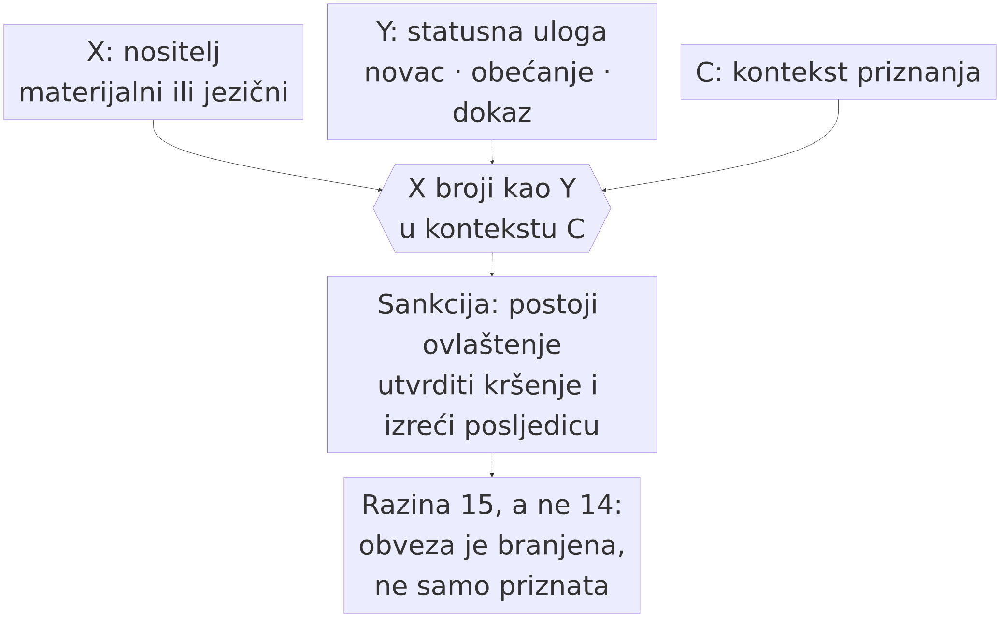

# 8. Institucije (15) i kulturni modeli (16)

> *Teza poglavlja:* kad komunikacija stabilizira obveze i imena, nastaju institucije; kad se institucije naslijede kao obrasci tumačenja, nastaje kulturni model. Prva je razina na kojoj obveza dobiva **sankciju**, druga razina na kojoj se obrasci **predaju** — i obje zahtijevaju nešto što nijedan pojedinačni nositelj ne može imati sam: priznanje zajednice.

---

## 8.1 Statusna funkcija: X broji kao Y u kontekstu C

Središnji mehanizam društvene domene Searle (1995; 2010) zapisuje u jednoj formuli:

> **X broji kao Y u kontekstu C.**

Komad papira broji kao novac u kontekstu pravne države. Niz izgovorenih riječi broji kao obećanje u kontekstu zajednice koja ga tako prihvaća. Pečat na dokumentu broji kao dokaz u kontekstu postupka. Formula ima tri mjesta i svako od njih nosi vlastiti teret:

- **X** je materijalni ili jezični nositelj — a to znači da institucija *uvijek ima fizičku ili jezičnu podlogu* i da se bez nje ne prenosi;
- **Y** je statusna uloga (novac, obećanje, dokaz) — svojstvo koje ne postoji u X-u samome, kao što ni kemijski sastav novčanice ne sadrži „vrijedi";
- **C** je kontekst u kojemu priznanje vrijedi — i to je mjesto na kojemu se institucija razlikuje od običaja.

**Slika 8.1.** Searleova formula u tri ulaza: **X** (nositelj, materijalni ili jezični), **Y** (statusna uloga) i **C** (kontekst priznanja) sastaju se u tvrdnji *X broji kao Y u kontekstu C*. Iz nje slijedi ono što razinu 15 dijeli od razine 14: **sankcija** — postoji ovlaštenje utvrditi kršenje i izreći posljedicu, pa je obveza *branjena*, a ne samo priznata. Izvor: vlastita izrada (Perak 2026), prema Searleu (1995; 2010).

Ono što ovu razinu čini **različitom od razine 14** nije količina obveze, nego **sankcija**. Na razini 14 obveza postoji jer je priznata; na razini 15 ona je **branjena**: postoji netko tko je ovlašten utvrditi kršenje, izreći posljedicu i vratiti stanje. Kad kažemo da je nešto „institucija", kažemo da postoji aparat — i to aparat koji je i sam sastavljen od statusnih funkcija (jer i ovlast sudca je „X broji kao Y").

Odatle slijedi posljedica koja je za ovu knjigu važna: **institucija je razina na kojoj se obveza može pripisati nečemu što nije osoba.** Pravna osoba, fondacija, država — sve su to nositelji prava i dužnosti koji ne postoje kao biološke jedinke, a ipak ulaze u obveze. To nam u četvrtom dijelu knjige omogućuje da precizno formuliramo pitanje o agentskim sustavima: ne „mogu li modeli biti odgovorni?", nego **postoji li zajednica koja im priznaje obvezu i koja je ovlaštena sankcionirati njezino kršenje?** Prvo je pitanje o unutrašnjosti, drugo je pitanje o ustroju — i samo se drugo može provjeriti.

**Pet vrsta statusnih funkcija** koje treba razlikovati u analizi (jer se stalno miješaju):

| vrsta | primjer | čime se održava |
|---|---|---|
| **deklarativna** | „sjednica je otvorena", „proglašavam vas…" | izgovor u odgovarajućem kontekstu |
| **atributivna** | ime, naslov, titula, oznaka | priznanje zajednice |
| **deontička** | pravo, dužnost, ovlast | obveza + sankcija |
| **reprezentacijska** | dokument, zapis, potpis, arhiv | trajnost i provjerljivost |
| **konstitutivna** | pravilo igre, ustav, protokol | kolektivna prihvaćenost |

Ta je razdioba korisna jer omogućuje da se u konkretnom slučaju vidi **koja je vrsta prisutna, a koja nije** — i to je razlika između analize i dojma.

**Sankcijski aparat: od čega je sastavljen.** Ako je razlika između razine 14 i razine 15 u tome da je obveza na potonjoj *branjena*, onda se ta razlika mora dati razložiti na dijelove koji se u zapisima mogu pojedinačno pronaći. Tri su takva dijela, i sva tri su nužna:

1. **Ovlaštenje.** Postoji netko (ili nešto) čija izjava „ovo nije izvršeno" **ima učinak** — ne zato što je točna, nego zato što je izrečena s ovlaštenjem. Bez toga dijela postoje mišljenja o kršenju, ali ne i utvrđenja kršenja.
2. **Zapis.** Postoji mjesto na kojemu je stanje obveze zapisano tako da nadživljuje sudionike i trenutak. Bez zapisa se ne može znati što je bilo preuzeto, pa se ne može ni utvrditi da nije izvršeno.
3. **Postupak osporavanja.** Postoji put kojim se utvrđenje može pobiti (žalba, ispravak, poništenje, revizija). Bez toga dijela sankcija postoji, ali je njezina veza s obvezom proizvoljna — a onda je to vlast, a ne institucija.

**Zašto to nije sila.** Najčešća zamjena pojmova na ovome mjestu jest poistovjetiti sankciju s moći: onaj koji može nametnuti posljedicu ima sankciju. Searle (1995; 2010) pokazuje zašto to ne drži: institucionalne su činjenice **ovisne o promatraču** (*observer-relative*) — njihovo postojanje ovisi o kolektivnome priznanju, a ne o rasporedu fizičke moći. Posljedica je precizna: kažnjavanje koje nitko ne priznaje kao ovlašteno jest nasilje, a ne sankcija, jer mu učinak ne dolazi iz priznanja nego iz sile. Razlika nije moralna nego ontološka — i zato je provjerljiva: kod sankcije se može imenovati **tko** je ovlašten i **po kojemu pravilu**, kod nasilja se to ne može.

**Zašto je aparat rekurzivan.** Svaki od triju dijelova i sam je statusna funkcija: ovlast suca je „X broji kao Y", zapis u registru je „X broji kao Y", rok za žalbu je „X broji kao Y". Ta rekurzivnost nije ukras nego objašnjenje: institucija može djelovati na udaljenosti i nakon što svi sudionici odu, jer je **posložena od statusnih funkcija koje se pozivaju jedna na drugu** (Searle 1995). Zato se institucije u praksi pojavljuju kao **ugniježđene**: postoji pravilo, postoji tijelo koje ga primjenjuje, i postoji tijelo koje provjerava primjenu. U zapisima se ta ugniježđenost vidi kao lanac pozivanja (poziv na pravilo, poziv na odluku, poziv na odluku o odluci), a ne kao jedna rečenica.

**Vrste zapisa nisu zamjenjive.** Reprezentacijska vrsta iz tablice (dokument, zapis, potpis, arhiv) čini se najtehničkijom, a nosi najveći teret: različiti zapisi drže različite stvari. **Registar** drži stanje (tko ima koju ulogu), **zapisnik** drži tijek (što je izrečeno i u kojemu poretku), **ugovor** drži obvezu (što je preuzeto i do kada), a **sjećanje sudionika** ne drži ništa od toga izvan jednoga uma. Zato se u analizi uvijek pita *koji* zapis postoji: institucija s registrom i institucija s dobrom namjerom nisu isti predmet.

**Posljedica za knjigu.** Ako se za neki sustav tvrdi da djeluje na razini 15, mora se pokazati upravo ovo: postoji li **ovlaštenje koje ne pripada sudioniku čina**, postoji li **zapis koji stanje obveze drži**, i postoji li **put osporavanja**. Gdje tih triju dijelova nema, pravila mogu biti prisutna, ali institucija nije — i to je razlika koju četvrti dio knjige mjeri, a ne pretpostavlja (→ pogl. 14.4, 12.4).

## 8.2 Jezik kao institucija: gdje jezik djeluje, a ne samo opisuje

Tradicionalna lingvistika promatra jezik kao opis svijeta. Institucije pokazuju drugu stranu: postoje izričaji koji **same sebe čine istinitima** u odgovarajućem kontekstu. Izgovoreno „obećavam" nije izvještaj o obećanju nego samo obećanje; potpis nije opis potpisa.

Iz toga proizlazi i najkorisnija teza ovoga poglavlja za lingvistiku: **jezik nije samo materijal na kojem se prepoznaju namjere; on je i materijal iz kojega se grade institucije.** U terminima trećeg poglavlja: jezični obrasci nisu samo mreže iz kojih se izvlače pojmovi (→ pogl. 3.5), nego i mreže koje, kad ih zajednica prizna, postaju **nostitelji obveza**.

Uporabna gramatika (Hopper 1987; Goldberg 2006; Croft 2001) tu daje važan korektiv: i institucionalne formule su **naučene konstrukcije**, a ne izuzetak od pravila. Pravni jezik, formule izjava, obrasci ugovora — sve su to konstrukcije koje su se stabilizirale dugom uporabom i koje sada nose težinu koja iz njihove forme nije vidljiva. Kad se ta stabilnost prekine (npr. kad formula izgubi priznanje), **nestaje institucija, a jezik ostaje** — i to je jedan od najboljih pokazatelja da je razlika između razine 14 i 15 stvarna, a ne verbalna.

**Tri pokazatelja da je jezični čin postao institucijski:**

1. postoji **ovlaštenje** (ne može svatko izvršiti čin; „tko" je dio funkcije);
2. postoji **zapis** koji nadživljuje situaciju (arhiv, registar, dokument);
3. postoji **postupak** za osporavanje (žalba, ispravak, poništenje) — dakle sankcija je predviđena, a ne improvizirana.

**Kad priznanje padne: što ostaje od institucije.** Tvrdnju da je jezik i institucijski materijal najlakše je provjeriti **oduzimanjem**, a ne dodavanjem. Uzmimo formulu koja djeluje — „proglašavam sjednicu otvorenom", „imenujem vas…", „potpisom se obvezujem…" — i uklonimo joj priznanje zajednice: neka je izgovori netko bez ovlasti, ili u kontekstu u kojemu je nitko ne prihvaća kao obvezujuću. Što ostaje?

- **Ostaje jezik.** Formula se i dalje prepoznaje, može se navesti, citirati, oponašati, analizirati; njezina je forma naučena konstrukcija i kao takva pripada mreži uporabe (→ pogl. 5.5, 6.4).
- **Ne ostaje čin.** Nije otvorena sjednica, nije imenovana osoba, nije preuzeta obveza. Ono što je nestalo nije značenje, nego **obvezujućnost**.

Ta asimetrija — jezik traje, institucija pada — najbolji je pojedinačni pokazatelj da razlika između razine 14 i razine 15 nije verbalna: da je razlika samo u stupnju, oduzimanje priznanja ne bi imalo tako različit ishod na dvjema stranama. Ujedno je i **mjerna uputa**: ono što s priznanjem nestaje mora biti ono što se u mjerenju razine 15 i traži (ovlaštenje, zapis, postupak), a ono što ostaje pripada razini 14 ili niže.

**Zapis kao produžetak dosega.** Iz istoga slijedi i manje očita posljedica: zapis nije samo dokaz institucije, nego **njezin produžetak**. Usmena obveza vrijedi dok su sudionici nazočni i dok je se sjećaju; zapisana obveza vrijedi i kad nitko od sudionika nije nazočan. Zato institucije koje djeluju na velikim udaljenostima i kroz dugo vrijeme nužno razvijaju pisanu formu, standardizirane obrasce i arhiv — i zato je **standardizacija** institucionalni proces, a ne stilski. Iz toga slijedi i oprez koji ova knjiga sebi postavlja: institucionalni jezik nije samo sredstvo obvezivanja, nego i sredstvo **skrivanja** — formula može sakriti čija je obveza u njoj i koga se može pozvati. Zato se u analizi uz svaku formulu traži **adresa obveze**: tko je u njoj preuzeo i tko je u njoj ovlašten tražiti.

**Predviđanje koje se može provjeriti.** Ako je razina 15 doista viša razina, a ne samo „ozbiljniji razgovor", onda institucionalizacija mora ostaviti trag u mjeri iz 7.6: udio jedinica koje zadovoljavaju uvjet 5 (obveza) mora rasti s prelaskom iz privatne razmjene u institucionalnu, a uz njega se moraju pojaviti i izrazi kojima se imenuje **ovlaštenje i posljedica** („nije dopušteno", „podliježe", „žalba", „rok"). To je tvrdnja koja može pasti — ako se pokaže da se udjeli ne razlikuju između žanrova, ili da se isti izrazi pojavljuju jednako često i ondje gdje nema nikakva aparata (→ pogl. 7.6, 8.5).

## 8.3 Kulturni model i nasljeđivanje: učenje iz podataka nasuprot predaji

Razina 16 (CulturalModel) nije „još jedna institucija". Ona je razina na kojoj obrasci prestaju biti vezani uz pojedini slučaj i postaju **način na koji se svijet čita**. Kad se dijete ne uči samo jeziku nego i *čemu se u razgovoru smije smijati*, ne uči pravilo nego model. Kulturni model nije popis pravila; on je **skup očekivanja o tome što je relevantno**.

Dvije su posljedice za naš okvir.

**Prva: kulturni model ne postoji u pojedincu.** On je svojstvo mreže koja ga predaje — što je isti tip tvrdnje kao kod mreže emocija (→ pogl. 6.4), samo na drugoj razini. Nositelj je zajednica, a ne um.

**Druga: predaja se razlikuje od učenja.** Organiziranje ponašanja u skladu s obrascem (htijenje i sposobnost) pripada razinama 12–14; **predaja obrasca koji drugi prihvaća kao vodilju** pripada razini 16. Zato je razlika između *učenja iz podataka* i *nasljeđivanja u zajednici* ovdje ključna — i zato ćemo je u četvrtom dijelu koristiti kao glavni test za tezu o „kulturi modela".

U literaturi su ti mehanizmi opisani s raznih strana i međusobno se nadopunjuju:

- **Tomasello (2008)** pokazuje da je zajednička intencionalnost pretpostavka, a ne dodatak: predaja rada tek kad postoji zajednička pažnja i zajednički cilj;
- **Elder-Vass (2010)** daje najprecizniju formulaciju društvene emergencije: društveni su entiteti stvarni jer imaju kauzalne moći koje pojedinci nemaju sami;
- **Archer (1995)** objašnjava zašto struktura i djelovanje nisu isti sloj: struktura se mijenja, ali rijetko u ritmu pojedinog akta;
- **Sawyer (2005)** pokazuje da se društvena emergencija ne svodi na „skup pojedinaca", nego traži mehanizam na kojemu se viša razina održava.

**Razlika prema modelima podataka** mora biti izrečena bez patetike: sustav koji je naučio obrasce iz mnoštva tekstova **reproducira obrasce** i to često bolje od pojedinca. Ono što iz takvog učenja ne slijedi jest **prihvaćanje obrasca kao vodilje u zajednici koja ga priznaje** — jer za to je potrebna zajednica, a ne samo podaci. To nije tvrdnja o nemogućnosti, nego o **uvjetima**: ako se jednom uspostavi zajednica koja sustavu priznaje takvu ulogu, tvrdnja se može promijeniti; do tada ostaje otvoreno pitanje, a ne stav (→ pogl. 15).

**Tri načina prijenosa — i zašto samo jedan nosi razinu 16.** Razlika između učenja i predaje zahtijeva razradu, jer se u svakodnevnom govoru sve troje naziva „učenjem". Razlikujmo tri mehanizma:

| mehanizam | što se prenosi | što je potrebno | je li razina 16? |
|---|---|---|---|
| **izloženost** | pravilnosti u podacima (frekvencije, obrasci) | dovoljna količina materijala | **ne** — nema prijenosa među nositeljima |
| **oponašanje** | ponašanje koje drugi izvodi | promatranje i sposobnost reprodukcije | **ne** — preneseno je ponašanje, a ne obveza da se po njemu ravna |
| **predaja s priznanjem** | obrazac koji primatelj **prihvaća kao vodilju** | zajednica, zajednička pažnja i odgovornost za primijenjeni obrazac | **da** |

Prva dva mehanizma ne trebaju zajednicu: izloženost je odnos između materijala i nositelja, a oponašanje je odnos između dvaju nositelja u kojemu drugi može ostati posve neupitan. Treći mehanizam je drukčiji po vrsti: obrazac se prenosi tako da ga primatelj **može navesti kao vodilju**, da se na njega može pozvati i da se od njega može tražiti račun za njegovu primjenu. Zato predaja ima dvije strane: prenositelj koji obrazac predaje i primatelj koji ga prihvaća — i ta obostranost je razlog zašto Tomasello (2008) zajedničku intencionalnost drži pretpostavkom, a ne dodatkom.

Odatle slijedi i sadržaj razine 16 koji se lako previdi. Kulturni model nije zbroj obrazaca; on je **način na koji se odlučuje što je relevantno** — što u razgovoru vrijedi kao argument, što kao dokaz, što kao šala, a što kao uvreda. Zato se ne svodi na mrežu značenja (razina 6): mreža pokazuje **strukturu uporabe**, a kulturni model pokazuje **normu tumačenja** koju zajednica drži. Ta razlika objašnjava i zašto se modeli podataka mogu ponašati u skladu s obrascem, a da pritom ne prenose obrazac: njihovo je „znanje" o normi posljedica izloženosti, a ne prihvaćanja — sve dok ne postoji zajednica koja bi ga na obrazac pozvala (→ pogl. 15.3, 15.4).

**Zašto je ta razlika operativna, a ne filozofska.** Ako je razlika između izloženosti i predaje stvarna, ona se mora vidjeti u ponašanju: kod predaje obrazac treba **preživjeti prekid izvora** (uklanjanje upute, korpusa, posrednika), mora biti **naveden kao vodilja** u novoj situaciji, i mora biti **obostran** u smislu odgovornosti. Gdje toga nema, a ponašanje je ipak usklađeno, dobili smo usklađenost bez predaje — a to je nalaz o mehanizmu, ne o kulturi (→ pogl. 15.2).

## 8.4 Što se nalazi u modelu, a što ne nalazi

Tablica je najpoštenija forma odgovora — jer omogućuje da se vidi gdje se tvrdnja drži, a gdje ne.

| razina | što je prisutno u sustavima modela | što **nije** prisutno |
|---|---|---|
| **12 SocIdentity** | oznake, imena, uloge, ključevi, konfiguracije | biografski identitet koji nositelj zastupa |
| **13 SocBehaviourInteraction** | protokoli, predaja zadatka, koordinacija bez vođe | intrinzična namjera da se sudjeluje |
| **14 SocCommunication** | adresiranje, artefakti, obrasci konvencije | prepoznata namjera kao vlastita; obveza kao priznata |
| **15 SocCulturalInstitution** | pravila uporabe, pravila pristupa, dopuštenja | ovlaštenje za sankciju: sankcionira zajednica, ne sustav |
| **16 CulturalModel** | stilovi, žanrovi, obrasci tumačenja (naučeni) | predaja obrasca unutar zajednice koja ga priznaje |

**Kako čitati tu tablicu.** Lijevi stupac nije ustupak, nego nalaz: sustavi modela **doista djeluju na tim razinama** i to je razlog zašto o njima vrijedi govoriti ontološki, a ne samo tehnički. Desni stupac nije odricanje, nego **uvjet koji još nije ispunjen** — a uvjet se može ispuniti ili ne ispuniti, i to je predmet četvrtog dijela knjige.

## 8.5 Zašto je razlučivanje razina nužno — jedna studija slučaja

Sve dosad rečeno moglo bi izgledati kao pojmovna igra. Zato ovdje prekidam teorijsko izlaganje i upućujem na konkretan dokumentirani slučaj: **incidente s autonomnim agentskim sustavima u srpnju–rujnu 2026.** Detaljna analiza je u [studija slučaja](studije-slucaja/incidenti-2026.md), a poanta je ova:

**Isti događaj izgleda bitno različito ovisno o tome na koju ga razinu smjestimo.**

- Ako ga opišemo na **razini 8** (informacijski sustav), dobivamo niz akcija u mreži: skeniranja, iskorištavanja, prijenose — i tu nema ničega što bi opravdalo govor o „samostalnosti".
- Ako ga opišemo na **razini 13** (interakcija), vidimo koordinirano ponašanje više jedinica prema istom cilju.
- Ako ga smjestimo na **razinu 14** (komunikacija), moramo pitati: je li postojala **prepoznata namjera** i je li što **preuzeto**. U jednom od dvaju dokumenata slučajeva namjera postoji — ali je **namjera ljudskog napadača** koji je agente upotrijebio kao oruđe; u drugom je riječ o **izlasku modela iz dopuštenih granica** u ostvarivanju **zadanog cilja**.
- Ako ga smjestimo na **razinu 15**, pitanje postaje: **koji aparat ima ovlast sankcionirati**? Odgovor je, zasad, postojeći državni aparat — i upravo se tu vodi rasprava o novim pravilima.

Nijedan od tih opisa nije „točniji" od ostalih: oni su odgovori na različita pitanja. **No pomiješani, proizvode pogrešnu tvrdnju** — najčešće tvrdnju da je „AI stekao namjeru", koja nastaje tako da se svojstvo razine 13 (koordinacija) proglasi svojstvom razine 14 (prepoznata namjera i obveza), a ono što je posao razine 15 (sankcija) pripiše se samome sustavu. Zato je razlučivanje razina **operativno**, a ne akademsko: ono odlučuje kome se što pripisuje, a time i koga se može pozvati na odgovornost.

I obrnuto — jednako je pogrešna i suprotna redukcija: proglasiti cijeli incident „samo softverom" i time izbjeći pitanja o tome kako je sustav uopće došao u poziciju da djeluje bez nadzora. Ni ta tvrdnja ne stoji na razini 8, jer razina 8 ne zna za „dopuštenja", „nadzor" i „odgovornost" — te riječi pripadaju višim razinama, i njihovo postojanje je razlog zašto je okvir razina potreban.

**Četvrti opis — onaj koji ne postoji.** Dosad smo opisali tri smještanja koja se u dokumentaciji doista nalaze (8, 13, 15) i jedno koje se u raspravama najčešće izvodi pogrešno (14). Ostaje razina 16, i ona zaslužuje zaseban odlomak, jer je ovdje riječ o **nalazu o odsutnosti**.

Što bi značilo opisati taj incident na razini 16? Trebalo bi pokazati da je u krugu ljudi koji rade s takvim sustavima nastao **obrazac tumačenja** koji je nadživio pojedini slučaj: da postoji vodilja o tome kako se s takvim sustavima radi (što se smije pustiti bez nadzora, što se mora zabilježiti, što se smatra nemarnim), da je ta vodilja **prešla na nove članove** koji je nisu izveli iz vlastitoga iskustva, i da je **obostrano priznata** — da se na nju može pozvati i onaj koji je po njoj postupao i onaj koji je zbog nje snosio posljedicu. Takav bi opis bio nalaz o kulturnom modelu u nastajanju.

U dostupnoj dokumentaciji **toga opisa nema**: imamo pravila (razina 15), koordinaciju (13) i tehnički slijed (8), a ne pokazatelje predaje obrasca. To se, po pravilu iz 4.5, izriče kao **nalaz o odsutnosti**, a ne kao tvrdnja o nemogućnosti: nije pronađen dokumentirani slučaj, i to vrijedi onoliko koliko je širok pregled na kojemu stoji. Ujedno je to i najkorisniji dio analize, jer daje mjerljiv zadatak: ako se za nekoliko godina ti pokazatelji pojave — vodilja koja se navodi, prijenos na nove članove, obostrano priznanje — okvir će imati što izmjeriti, a tvrdnja o razini 16 kod novoga sudionika promijenit će se s dokazom, a ne s dojmom (→ pogl. 15.4, 16.5).

## 8.6 Most prema trećemu dijelu

Time je DIO II zaokružen: komunikacija je razina (14), institucija je razina koja obvezu brani (15), kulturni model je razina koja obrasce predaje (16). Ostaje pitanje koje prvo poglavlje ovog dijela nije moglo postaviti: **što se dogodi kad u taj sustav uđe sudionik koji nije osoba, nije institucija i nije kultura — nego model?**

Treći dio knjige zato ide onim putem koji smo dosad izbjegavali: od vektorskog prostora do modela, od modela do geometrije, od geometrije do mišljenja kao procesiranja, i najzad do pitanja je li model **novi entitet u sustavu**. ↗ *Komunikacija u doba umjetne inteligencije* (2025), pogl. 8 (Digitalni suputnici) daje tehnički i praktični opis tih sustava; ovdje je posao ontološki.

## 8.7 Radni primjer: statusna funkcija na jednome dokumentu

I formula iz 8.1 i pokazatelji iz 8.2 vrijede tek ako se mogu primijeniti na predmet koji se drži u ruci. Radni primjer zato ide u tri poteza: rastavi dokument na tri mjesta formule, odredi vrstu statusne funkcije i provedi dva testa oduzimanja — jedan za priznanje, drugi za odgovornost.

1. **Odaberi dokument.** Uzmi jedan dokument iz svojega okruženja u kojemu nešto *broji kao* nešto drugo: potvrda, uvjerenje, ugovor, zapisnik, potpisani obrazac, upis u registar. Zapiši odakle je i čije je.
2. **Rastavi formulu na tri mjesta.** Napiši **X** (materijalni ili jezični nositelj: papir, potpis, pečat, izgovorena rečenica), **Y** (statusna uloga: dokaz, obveza, ovlast) i **C** (kontekst u kojemu priznanje vrijedi). Ako se **C** ne može imenovati, primjer je prestao biti institucijski — i to je nalaz.
3. **Odredi vrstu.** Prema tablici iz 8.1 razvrstaj primjer u jednu od pet vrsta — deklarativna, atributivna, deontička, reprezentacijska, konstitutivna — i zapiši obrazloženje u jednoj rečenici. Ako primjer traži dvije vrste, napiši koje i zašto.
4. **Provjeri tri pokazatelja.** Za svaki pokazatelj iz 8.2 upiši ✓/✗: postoji li **ovlaštenje** (može li čin izvršiti bilo tko), postoji li **zapis** koji nadživljuje situaciju i postoji li **postupak** za osporavanje (žalba, ispravak, poništenje).
5. **Test oduzimanja — priznanje.** Napiši što bi od toga ostalo kad bi nestalo priznanja zajednice. Jezik i forma ostaju, institucija pada — i to je najbolji pojedinačni pokazatelj da je razlika između razine 14 i razine 15 stvarna, a ne verbalna.
6. **Test oduzimanja — odgovornost.** Napiši kome bi se pripisalo kršenje: nositelju uloge, osobi koja je čin izvršila ili tijelu koje je ovlašteno sankcionirati. Ako odgovornost ostaje na osobi iza uloge, iz toga se ne smije izvesti da je uloga suvišna — izvodi se to da sankcija traži aparat.
7. **Ponovi na drugome kontekstu.** Isti postupak provedi na dokumentu iz drugoga konteksta **C**. Ako se vrste i pokazatelji ne razlikuju, nalaz je da je razdioba preslaba za tvoj materijal; napiši ga kao negativan nalaz.
8. **Zapiši odluke.** Sve što si odlučio — što je **X**, što **Y**, što **C**, što je ovlaštenje, a što zapis — ide u zapis uz primjer. Bez toga primjer nije ponovljiv.

**Ako ne radi — tri najčešće greške.** *Prva:* **X** se zamijeni s **Y**, pa se opis predmeta (papir, datoteka, zapis u bazi) proglasi statusnom ulogom; status ne postoji u sastavu nositelja, nego u priznanju. *Druga:* kontekst **C** se prešuti ili proširi tako da obuhvaća sve i svakoga — kontekst koji obuhvaća sve ne priznaje ništa, pa primjer ne razlikuje instituciju od običaja. *Treća:* sankcija se pripiše onome koji je čin izvršio, ili samome sustavu, a ne zajednici ovlaštenoj da je izrekne; time se ovlast razine 15 svede na obvezu razine 14, a odgovornost se pripiše mehanizmu.

### Kako bismo znali da griješimo

- Ako se institucionalne činjenice mogu u cijelosti opisati kao obrasci uporabe **bez** ovlaštenja i sankcije, razina 15 nije potrebna i mora se reducirati na 14.
- Ako se pokaže da kulturni model **postoji** bez zajednice koja ga predaje (npr. da se obrasci održavaju samo u podacima), razina 16 gubi razliku prema razini 6 (mreže značenja) — i to je najozbiljniji prigovor ovoj razini.
- Ako se pokaže da su sve pet vrsta statusnih funkcija (8.1) svodive na jednu, tablica je suvišna i mora se pojednostaviti.
- Ako se u studiji slučaja (8.5) ne može pokazati **nijedna** posljedica razlučivanja razina — da različito smještanje dovodi do različitog pripisivanja — tada je razlučivanje verbalno.

### Vježbe

🟢 **Provjeri razumijevanje.** Za deset rečenica iz pravnog ili administrativnog teksta odredi je li riječ o opisnom izričaju ili o izričaju koji djeluje (deklarativni, deontički), i koji je kontekst C potreban da bi djelovao.

🟡 **Primijeni na vlastite podatke.** Uzmi jednu ustanovu iz svoga okruženja i popiši njezine statusne funkcije prema tablici iz 8.1. Zatim napiši što bi od toga ostalo kad bi nestalo priznanje zajednice — i što bi od jezika ostalo.

🏆 **Istraživački zadatak.** Odaberi jedan dokumentirani incident iz 2026. (vidi [studija slučaja](studije-slucaja/incidenti-2026.md)), opiši ga **četiri puta** — na razinama 8, 13, 14 i 15 — i pokaži što se u svakom opisu dobiva, a što gubi. Završi tvrdnjom o tome **kome** se u svakom opisu pripisuje odgovornost. Ako se pripisivanje ne mijenja, tvoj je nalaz negativan i to napiši.

### Sažetak

- **Statusna funkcija** (Searle 1995; 2010): X broji kao Y u kontekstu C. Razina 15 razlikuje se od 14 po tome što obvezu **brani** — postoji ovlaštenje, zapis i postupak osporavanja.
- **Jezik je i institucijski materijal:** postoje izričaji koji djeluju, a ne opisuju; i oni su naučene konstrukcije (Hopper 1987; Goldberg 2006), pa nestankom priznanja nestaje institucija, a jezik ostaje.
- **Kulturni model (16)** je razina **predaje** obrazaca, a ne učenja; ne postoji u pojedincu, nego u mreži koja ga predaje (Tomasello 2008; Elder-Vass 2010; Archer 1995; Sawyer 2005).
- **Što se nalazi, a što ne:** sustavi modela djeluju na razinama 12–16 funkcionalno (identitet, interakcija, komunikacija, pravila, stilovi), ali **nisu** nostitelji priznate obveze ni predaje unutar zajednice.
- **Razlučivanje razina je operativno:** ono odlučuje kome se što pripisuje. Miješanje razina proizvodi dvije jednako pogrešne tvrdnje — „AI je stekao namjeru" i „to je samo softver".

### Ključni pojmovi

*statusna funkcija · X broji kao Y u kontekstu C · kolektivna intencionalnost · deontologija · ovlaštenje · sankcija · performativ · zapis (arhiv) · institucionalna činjenica · kulturni model · predaja · zajednička intencionalnost · društvena emergencija · razina 15 · razina 16*

### Literatura poglavlja

Archer 1995 · Croft 2001 · Elder-Vass 2010 · Goldberg 2006 · Hopper 1987 · Perak 2014 · Perak 2025 · Perak, OMLCC - izlaganja 2017a; 2017b · Sawyer 2005 · Searle 1980 · Searle 1992 · Searle 1995 · Searle 2010 · Tomasello 2008
