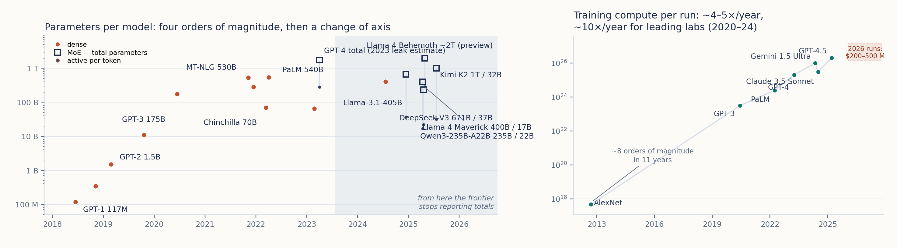

# 9. Od vektorskog prostora do modela

> *Teza poglavlja:* model je **organizacija statističkih relacija iz komunikacijskih podataka**; arhitektura koja ugrađivanje spaja s pažnjom pretvara ko-okurenciju u geometriju, a geometrija omogućuje operacije koje nalikuju pojmovnim — ali ta sličnost nije identitet. Tvrdnja koju ovo poglavlje brani je uža od uobičajenih: model ne sadrži svijet i ne sadrži značenje; on sadrži **uređenje uporabe**, i to uređenje je ono što se mjeri, imenuje i, na kraju, postavlja kao kandidat za entitet u sustavu.

---

## 9.1 Distribucijska hipoteza: što tvrdi, a što joj se pripisuje

Treći dio knjige počinje ondje gdje je drugi stao. Drugi dio pokazao je da je značenje relacijsko i da se rekonstruira iz uporabe (→ pogl. 5.3, 6.1); sada treba vidjeti što se dogodi kad se taj uvid **prevede u računski postupak**. Prijevod ima svoju povijest, i ta povijest je mjesto na kojemu se najčešće gubi razlika između tvrdnje i njezine popularne verzije.

Dva su teksta ovdje nosiva. Zellig Harris (1954) u radu *Distributional structure* definira **distribuciju elementa kao ukupnost svih okruženja u kojoj se element pojavljuje** i tvrdi da se jezik može opisati upravo distribucijski — dakle bez pozivanja na značenje kao kriterij analize. John Rupert Firth (1957) istu misao sažima u rečenicu koja je danas najcitiraniji ulomak iz lingvistike dvadesetoga stoljeća: riječ poznajemo po društvu u kojem se drži. Obje tvrdnje polaze od istog opažanja: **jedino što je izravno dostupno jesu okruženja**, a identitet jedinice čita se iz razlika prema drugim jedinicama — što je u drugom rječniku već rekao Saussure (1916) kad je vrijednost znaka odredio kao čistu razliku.

Što Harris i Firth **nisu** tvrdili, jednako je važno od onoga što jesu, jer se upravo na tome mjestu hipoteza često pretvara u nešto što ona nije:

| što stoji u izvoru | što joj se pripisuje |
|---|---|
| razlika u distribuciji **sustavno prati** razliku u značenju (Harris 1954) | „distribucija **jest** značenje" — identitetska tvrdnja koje u izvoru nema |
| analiza može početi **bez** značenja kao kriterija — to je metodološka stega (Harris 1954) | „značenje nije potrebno objasniti" — od stega do eliminacije |
| riječ je određena uporabom u kontekstu (Firth 1957) | „Firth je predvidio *word2vec*" — tvrdnja o koordinatama koje Firth nigdje ne izlaže |
| element je ono što ima okruženja (Harris 1954) | „svaka supojavnost je veza" — prag i mjera nisu dio hipoteze |
| značenje nije privatni predmet (Saussure 1916) | „jezik je samo statistika" — redukcija koja prelazi ono što je rečeno |

Tablica nije akademska sitnica. U onom obliku u kojemu se hipoteza danas najčešće citira — „značenje je kontekst" — ona više nije provjerljiva, jer ne kaže što bi je oborilo. U obliku u kojemu su je Harris i Firth izrekli, ona je **ograničenje**: tvrdi da se tragovi razlike u značenju nalaze u razlikama uporabe, pa time dopušta i svoj vlastiti pad. Ako se u nekoj domeni pokaže da se dvije jedinice razlikuju u značenju, a ne razlikuju u distribuciji — ili obratno — hipoteza u toj domeni pada. To je oblik tvrdnje koji ova knjiga može upotrijebiti; identitetska verzija ne može, jer je ne može ni potvrditi ni oboriti nikakav podatak.

**Što od hipoteze ostaje kao radni temelj.** Tri stvari, i sve tri su skromne. Prvo: **opažajno je samo okruženje** — nema izravnog čitanja značenja, imamo samo zapise uporabe (→ pogl. 4.1). Drugo: **identitet jedinice je relacijski** — jedinica je ono što ima okruženja, a ne ono što nosi definiciju (Harris 1954; Saussure 1916). Treće: **stabilnost je uvjet, a ne dodatak** — slučajna supojavnost ne nosi ništa; ono što nosi je uzorak koji se vraća (→ pogl. 3.2). Te tri tvrdnje zajedno čine ono što u ovom poglavlju nazivamo distribucijskom hipotezom u **uporabljivom obliku**, i upravo se na njima grade prvi vektori.

**Gdje hipoteza ne dopire.** Distribucijska relacija jest relacija među **znakovima**; ona ne spaja znak s onim na što znak upućuje. Stevan Harnad (1990) u tekstu o problemu utemeljenja simbola pokazuje da se simbolički sustav ne može sam utemeljiti u svijetu — ako su svi odnosi u sustavu odnosi prema drugim simbolima, nedostaje veza prema nečemu što nije simbol. Ta granica nije detalj koji se rješava većim korpusom; ona je **strukturna**, i u ovom poglavlju određuje što o modelu možemo, a što ne možemo tvrditi. Model će, kao što ćemo vidjeti, imati bogatu unutrašnju geometriju; upravo zato je važno na početku reći da bogatstvo unutrašnjih odnosa nije isto što i veza sa svijetom.

## 9.2 Prvi vektori: od riječi do koordinata

Prijevod distribucijske hipoteze u računski postupak ima pet koraka, i svaki od njih donosi odluku koja se kasnije ne može poništiti. Prvi je **odluka o jedinici**: što ulazi u analizu — riječ, oblik riječi, lema, dio riječi? Tu se ponavlja pogreška razlučivosti iz trećega poglavlja (→ pogl. 3.1): tokenizator je statistički izveden i ne poštuje morfološke granice, što je za morfološki bogat jezik poput hrvatskoga profesionalno bolno (Perak 2026). Drugi je korak **indeks**: svaka jedinica dobiva broj, jer je broj ono što računalo može razlikovati. Treći je korak **koordinate**: broj se zamjenjuje nizom brojeva — vektorom. Četvrti je korak **zadatak**: ti se brojevi ne upisuju po volji, nego se podešavaju tako da jedinice koje se pojavljuju u sličnim okruženjima završe blizu. Peti je korak **mjera blizine**: u praksi kut između dvaju vektora (kosinusna sličnost), a ne udaljenost u centimetrima.

**word2vec.** Tomáš Mikolov i suradnici (2013) pokazali su da se koordinate mogu dobiti kao **nusproizvod zadatka predviđanja**: brojevi koji se nalaze u skrivenom sloju čiji je posao bio predvidjeti riječ iz njezina okruženja (ili okruženje iz riječi) sami postaju upotrebljivi vektori. To je važna razlika prema naivnoj slici „model je upisao značenja". Nitko nije upisao nikakvo značenje; upisani su brojevi koji su **smanjili pogrešku predviđanja**, a svojstvo da blizina odgovara sličnosti uporabe pojavilo se kao posljedica. Metoda je poznata pod imenom *word2vec* i rad je objavljen u zborniku NIPS — puni bibliografski podaci nalaze se u autorovoj bibliografiji (o tome vidi Napomenu o izvorima na kraju poglavlja).

**GloVe.** Jeffrey Pennington i suradnici (2014) došli su do istoga tipa koordinata drugim putem: prvo se iz korpusa izgradi **globalna matrica supojavljivanja**, a zatim se ta matrica rastavlja tako da umnožak vektora dviju jedinica odgovara njihovoj zajedničkoj čestoti. Razlika prema *word2vecu* nije u tome što bi jedna metoda „brojila", a druga „razumjela": obje broje, samo je jedna usmjerena na lokalno predviđanje, a druga na globalnu strukturu supojavljivanja. Ishod je isti tip objekta — **koordinate u kojima blizina prati sličnost uporabe**. Ovo je ujedno najčišći primjer pouke iz trećega poglavlja: ista organizacija može se zapisati kao graf ili kao skup vektora, i promjena notacije ne mijenja organizaciju (→ pogl. 3.2).

**Što je time postalo moguće.** Prvo, sličnost je postala **jedan broj** koji se može izračunati, ponoviti i usporediti. Drugo, semantika je postala **komponenta u sustavu**: pretraživanje, klasifikacija, preporuka i provjera srodnosti odjednom imaju ulaz koji nije popis pravila nego koordinata. Treće, i za ovu knjigu najvažnije, vektor je postao **sučelje** modela prema ostatku sustava — ono što model predaje dalje nije definicija, nego pozicija.

**Najpoznatiji primjer i najčešće pogrešno čitanje.** Mikolov i suradnici (2013) pokazali su da se s vektorima može računati na način koji nalikuje analogiji: uzmu se koordinate za *kralj*, oduzmu koordinate za *muškarac* i dodaju koordinate za *žena*, a najbliža točka u prostoru često je *kraljica*. Iz toga se lako izvede tvrdnja da je model „naučio pojam roda". Ono što je doista pokazano je uže i drukčije: u tom korpusu i uz taj zadatak **smjer** koji povezuje muške i ženske parove je stabilan, pa se isti pomak može primijeniti na drugi par. To je svojstvo **organizacije uporabe**, a ne algebra pojmova: vrijedi za neke relacije, ne vrijedi za druge, i ne pretvara vektor u definiciju. Zato u ovom poglavlju o analogiji govorimo kao o **empirijskom nalazu s granicama**, a ne kao o dokazu da model računa značenjem.

**Granica prvih vektora.** Jedna jedinica — jedan vektor. To znači da sve uporabe iste riječi dijele istu točku u prostoru: homonimija i polisemija se **sabijaju**, a položaj takve jedinice odgovara prosjeku njezinih uporaba. Kad se toga prisjetimo, postaje jasno zašto je sljedeći korak bio nužan: ako se *strah* pojavljuje u okruženjima tjelesnoga stanja i u okruženjima društvene opasnosti, jedan vektor ne može biti istovremeno i jedno i drugo. Isti je razlog i za jednu praktičnu napomenu: vlastiti mjerni postav s kojim radimo u ovoj knjizi je **4096-dimenzijski Qwen3-Embedding** (Qwen Team 2025; mjereno; zapis `qwen3_embed_dim` u [`data/fakti.csv`](../data/fakti.csv)), pa je razlika prema *word2vecu* u dimenziji i u kontekstualnosti, a ne u vrsti postupka: i tamo i ovdje koordinate nastaju iz uporabe (→ pogl. 10.1).

## 9.3 Kontekstualni obrat: vektor riječi prestaje biti jedan

Ako prvi vektori daju jednu točku po jedinici, kontekstualni obrat daje **jednu točku po pojavljivanju**. Time se ne mijenja samo veličina prostora, nego jedinica analize — i to je razlog zašto ovaj korak zaslužuje vlastiti odjeljak, a ne fusnotu.

**Mehanizam pažnje.** Ashish Vaswani i suradnici (2017) u radu *Attention Is All You Need* predlažu arhitekturu u kojoj se prikaz svake jedinice **ne čita iz tablice**, nego se izračunava iz drugih jedinica u oknu. Svaka jedinica postavlja upit, svaka druga nudi svoj ključ, a mjera podudarnosti upita i ključa određuje **koliko će se čiji sadržaj ugraditi** u njezin novi prikaz. Postupak se ponavlja kroz slojeve, pa prikaz jedne jedinice na kraju ovisi o cijelom oknu — a okno je ono što u ovom okviru već znamo pod imenom **kontekst** (→ pogl. 7.6). Arhitektura se zove *transformer*, a tehnički opis mehanizma nije posao ove knjige: on je izložen u ↗ *Komunikacija u doba umjetne inteligencije* (2025), pogl. 5 (Pogon umjetne inteligencije).

**Posljedica za jedinicu.** Nakon tog koraka nema više „vektora riječi *strah*", nego postoji vektor za *strah* **u ovoj rečenici**, i drugi vektor za *strah* u drugoj. Jedinica reprezentacije prestaje biti tip (riječ u rječniku) i postaje **pojavnica u oknu**. Tablica pokazuje što se time dobiva, a što se gubi:

| | statički vektor (2013–2014) | kontekstualni vektor (2017–) |
|---|---|---|
| jedinica | tip (riječ, lema) | pojavnica u oknu |
| što je u vektoru | položaj tipa u prostoru uporabe | položaj pojavnice s obzirom na okno |
| polisemija | sabijena u jednu točku | razlučena po uporabi |
| što se s vektorom može | mjeriti srodnost, tražiti susjede | mjeriti srodnost, tražiti susjede, ali i **odnos prema kontekstu** |
| što se gubi | ništa od uporabe — ali sve razlike idu u prosjek | jednoznačna adresa: ista riječ više nema jednu točku |
| posljedica za tumačenje | geometrija se lako čita i pokazuje | geometrija je bogatija, ali se teže čita |

**BERT: prikaz kao infrastruktura.** Jacob Devlin i suradnici (2018) pokazuju da se model može prethodno obučiti na zadatku u kojemu se dio ulaza maskira, a model ga mora pogoditi **gledajući s obje strane** — i da se tako dobiven prikaz može zatim prilagoditi nizu konkretnih zadataka. Time kontekstualni prikaz postaje **opća infrastruktura**, a ne pojedinačna aplikacija. Za našu je tezu odlučno jedno: razlika između dviju uporaba iste riječi nije više izgubljena, ali nije ni „zapisana" — ona je **izračunata** iz okna u trenutku obrade.

**GPT: isti mehanizam okrenut prema proizvodnji.** Alec Radford i suradnici (2018–19) rabe istu obitelj arhitekture na zadatku predviđanja sljedeće jedinice, pri čemu model ne gleda budući tekst nego samo prethodni. Prikaz i proizvodnja tu su dvije strane istog postupka: ono što model računa o kontekstu jest upravo ono što mu omogućuje da nastavi tekst. Za ontološko pitanje ovog poglavlja ta je razlika važna: u takvom sustavu nema **popisa** koji bi se mogao pročitati, postoji **funkcija** koja iz okna proizvodi koordinate i iz koordinata sljedeću jedinicu. Ono što bismo nazvali „znanjem" ovdje je **obrazac preobrazbe**, a ne spremnik.

**Dvije poštene napomene.** Prva: analogija s *word2vecom* ne prenosi se automatski na kontekstualne modele — nalaz o stabilnom smjeru iz 9.2 dobiven je na statičkim vektorima, pa se na kontekstualnima isti test mora ponoviti s posebnim postupkom (→ pogl. 10.1). Drugo: bogatija geometrija ne znači i prozirnija — čitanje te geometrije zahtijeva zaseban posao, kojim se bavi dio literature o interpretabilnosti (Anthropic 2025), dok Gurnee i Tegmark (2023) pokazuju da se u aktivacijama daju naći **linearne reprezentacije prostora i vremena**. Taj nalaz treba čitati točno: model ne posjeduje kartu svijeta; on u svojim aktivacijama drži **uređenje** koje se može opisati kao prostorno i vremensko. Razlika između „karte" i „uređenja uporabe" nije filozofska finesa — ona je razlika između tvrdnje koja se može provjeriti i one koja se ne može, i na njoj će se ovo poglavlje zaustaviti u 9.6.

## 9.4 Što je „parametar", a što „učenje"

Dosad smo govorili o vektorima kao da su dani. Sada treba reći odakle dolaze, i to bez matematike — ali i bez pojednostavljenja koje bi iskrivilo stvar. Razlika je važna: pojednostavljenje koje iskrivljuje nije manja greška od pogrešne brojke, jer se na njemu grade zaključci čitave knjige.

**Arhitektura i parametri nisu isto.** Arhitektura je **plan obrade**: koje se jedinice uzimaju, kojim se redom spajaju, što se s čime uspoređuje. Parametar je **jedan broj u tom planu** — težina koja određuje koliko će neki ulaz doprinijeti izlazu. Arhitekturu piše čovjek (Vaswani et al. 2017); parametre **ne piše nitko**. Oni su ono što postupak obuke podesi. Otud najkraća moguća definicija: *model je uređenje brojeva unutar zadanog plana*. Broj parametara mjeri **koliko se brojeva može podesiti**, a ne koliko sustav „zna" — to je razlika koju tablice veličine modela redovito prešućuju.

**Što znači „učenje".** Postupak ima tri koraka koji se ponavljaju: (1) model dobije dio teksta i proizvede izlaz; (2) izlaz se usporedi s onim što je u tekstu doista slijedilo i izrazi se **pogreška**; (3) brojevi se pomaknu u smjeru koji tu pogrešku smanjuje. To se ponovi mnogo puta. Iz toga slijedi tvrdnja koja se u razgovorima o umjetnoj inteligenciji najčešće preskače: **postupak nema pristup istini, ima pristup samo pogrešci na zadatku.** Ono što se „nauči" jest ono što smanjuje pogrešku, a ne ono što je istinito. Zato je pitanje „je li model naučio fiziku?" pogrešno postavljeno: model nije mogao naučiti ništa osim pravilnosti u **zapisima uporabe** iz kojih je učio (hrWac; → pogl. 4.1).

**Prava mjera nije broj brojeva.** Usporedba s biološkim sustavom ovdje pomaže više od svake metafore. Konektom mozga vinske mušice izmjeren je u cijelosti: **139.255 neurona** i oko **50 milijuna sinapsi** (Dorkenwald et al. 2024; mjereno), a model aktivnosti za **64 tipa neurona** iz toga konektoma izveden je s **734 parametra** (Lappalainen et al. 2024; mjereno). Dvije pouke slijede odmah. Prva: broj brojeva u modelu i broj veza u sustavu koji se modelira **nisu ista veličina**, pa se iz jednakosti ili nejednakosti tih brojeva ne može zaključivati o jednakosti ili nejednakosti sposobnosti. Druga, važnija za ovu knjigu: ono što omogućuje da mali model reproducira ponašanje velikoga sustava jest **organizacija**, a ne količina — isti nalaz koji treće poglavlje izvodi iz Andersona (1972) i Hartmanna (1940), samo na drugom materijalu.

**Tri iskrivljenja koja treba imenovati.** Prvo iskrivljenje ide prema gore: *„model je kopija svijeta"*. Ne stoji, jer je jedini materijal iz kojega model uči **tekst kao zapis uporabe** (→ pogl. 4.1), a ne svijet. Drugo iskrivljenje ide prema dolje: *„to je samo statistika, samo papiga"*. Ta je tvrdnja legitimna kao **prigovor**, i najjasnije ju zastupaju Bender i Koller (2020) te Bender i suradnici (2021), koji pokazuju da oblik jezika ne jamči značenje i upozoravaju na posljedice skaliranja bez razumijevanja; ali kao *pobjeda* u raspravi ona ne radi, jer „samo" prešućuje upravo ono što ovo poglavlje mjeri — **uređenje uporabe**. Treće iskrivljenje je najtvrđe: *„parametri sadrže pojmove"*. Parametri sadrže raspodijeljene pravilnosti; pojmovi su **naš opis** stabilnih uzoraka u njima, isto onako kako je gustoća mreže opis uzorka, a ne uzrok (→ pogl. 6.3). Ime koje dodijelimo nekom području vektorskog prostora je hipoteza o organizaciji, ne popis sadržaja.

**Jedan prigovor koji treba ostati na stolu.** Klasična filozofska zamjerka raspodijeljenim prikazima nije da su statistički, nego da ne objašnjavaju **sustavnost** mišljenja: ako je sadržaj raspodijeljen, nije jasno zašto sposobnost koja se pojavi u jednom obliku nužno dolazi s odgovarajućim sposobnostima u drugim oblicima (Fodor 1975; Fodor & Pylyshyn 1988). Taj prigovor ovdje ne rješavamo; bilježimo ga kao trajno ograničenje i vraćamo mu se u jedanaestom poglavlju (→ pogl. 11.5).

**I jedna ograda u oba smjera.** Sve što je ovdje rečeno o parametrima ostaje na **slaboj emergenciji** (Bedau 1997): svojstva koja model pokazuje izvediva su iz dinamike obuke, ali u praksi samo simulacijom — dakle iznenađujuća za nas, a ne čudesna u sustavu. Ne tvrdimo jaku emergenciju (Chalmers 2006). Isto tako ne tvrdimo obrat: da pojedinačni broj u modelu „uzrokuje" sposobnost cjeline. Kimov prigovor kauzalnoga isključivanja (1999) i ovdje vrijedi kao ograničenje: ako tvrdnja o organizaciji ne dodaje ništa ni opisu ni predviđanju, od nje u tom slučaju odustajemo.

## 9.5 Skala: što je bilo otvoreno, što se zatvorilo — i što je i dalje otvoreno

Vektori i pažnja objašnjavaju **oblik** modela, ali ne i zašto se rezultati popravljaju kad model i podaci rastu. Na to pitanje nije odgovorila teorija, nego mjerenje — i u tome je posebnost ovoga odjeljka: on ne izlaže novi pojam, nego **zapisuje što je izmjereno, a što ostaje procjena**.

**Zakoni skaliranja.** Jared Kaplan i suradnici (2020) pokazali su da se pogreška jezičnoga modela na testnom skupu smanjuje po **zakonu potencije** kad raste broj parametara, količina podataka i računalni trošak obuke — dakle glatko i predvidljivo, bez skokova. Praktična posljedica bila je golema: veliki pothvat obuke mogao se **planirati unaprijed**, jer se ishod dao procijeniti prije nego što je posao plaćen. No dvije su stvari u tom nalazu lako prešućene: mjeri se **prosječna pogreška na testnome skupu**, a ne sposobnost; i zakon vrijedi unutar iste arhitekture i istog zadatka, pa nije obećanje da će se bilo koje svojstvo pojaviti samo zato što je model veći.

**Chinchilla: zatvoreno pitanje.** Otvoreno je ostalo pitanje **omjera**: je li pri zadanom trošku bolje imati golem model obučen na malo teksta ili manji model obučen na mnogo teksta? Jordan Hoffmann i suradnici (2022) pokazali su da je optimalno **rasti zajedno** — broj parametara i broj tokena treba povećavati približno razmjerno — i da model od 70 milijardi parametara obučen na mnogo više podataka nadmašuje modele višestruko veće od sebe. Time je praksa promijenjena iz temelja: umjesto utrke u veličinu nastupilo je produljeno učenje na većim količinama teksta. Ovaj rezultat navodimo kao **mjerenje**, a točan omjer koji autori predlažu ostavljamo za evidenciju brojki — u ovom trenutku on nije u `data/fakti.csv`, pa se u tekstu i ne izriče (vidi Napomenu o izvorima).

**Što je i dalje otvoreno.** Prvo i najvažnije: **odnos glatkoga i skokovitoga**. Ako se pogreška smanjuje glatko, odakle „iznenadne" sposobnosti o kojima se govori u literaturi (Wei et al. 2022)? Dva su odgovora u opticaju i oba su u ovoj knjizi relevantna. Schaeffer i suradnici (2023) pokazuju da iznenadnost može biti **artefakt mjere**: uz nelinearan prag bodovanja glatka krivulja izgleda kao skok. Michaud i suradnici (2023) daju drugu mogućnost: sposobnosti se uče kao **kvante** — vještine koje dolaze u stupnjevima — pa se u agregatu pojavljuju u koracima, a ne u skokovima bez mehanizma. Za ovu knjigu iz toga slijedi metodološka stega koja vrijedi i izvan modela: **skok u grafu nije skok u sustavu** dok se ne isključi prag u mjeri (→ pogl. 1.7). Drugo otvoreno pitanje je **podatak**: kvaliteta i iscrpivost ljudskoga teksta; zakon potencije ne kaže što učiniti kad izvora ponestane. Treće je pitanje koje ovo poglavlje ostavlja sljedećima: raste li s kapacitetom i ono o čemu knjiga pita — utemeljenje, namjera, obveza (→ pogl. 11, 12) — ili raste samo prosječna točnost.

**Što je otvoreno, a što zatvoreno u samome zapisu.** Uz raspravu o otvorenim pitanjima ide i jedna sasvim praktična razlika: dio sustava je **otvoren** — objavljeni su i modeli i postupci, pa se rezultat može ponoviti (DeepSeek-AI 2024) — a dio je **zatvoren**, i o njemu postoje samo objavljeni ishodi, dok se veličina, podaci i trošak obuke ne objavljuju. Kad je zapis zatvoren, svaka tvrdnja o veličini modela pripada u **procjene**, a ne u mjerenja (Thompson 2026; procjena) — i zato se u ovoj knjizi mjerenja i procjene vode odvojeno, u evidenciji [`data/fakti.csv`](../data/fakti.csv) (→ pogl. 10.4).

**Raslojavanje: broj parametara prestaje biti mjera rada.** Suvremeni modeli s **rijetkim ekspertima** (engl. *mixture of experts*) imaju velik ukupni broj parametara, ali pri obradi pojedinog tokena rabi samo dio njih (DeepSeek-AI 2024). Time se razlikuju **ukupan broj** i **broj aktivnih** parametara, pa ukupni broj prestaje biti mjera računalnoga rada, a time i pokazatelj kakvoće. Figura na kraju ovoga odjeljka prikazuje upravo tu razliku: uz rast parametara kroz godine vidi se i rast računalnog troška obuke, te razlika između ukupnih i aktivnih parametara.



**Figura 9.1 — Rast parametara i računalnoga troška obuke.** Lijevo: broj parametara po modelu od 2018. do 2026., uz razlikovanje gustih modela od modela s rijetkim ekspertima (ukupni nasuprot aktivnim parametrima) i uz napomenu da se od jednoga trenutka granica razvoja prestaje izvještavati ukupnim brojem parametara. Desno: računalni trošak obuke po pokretanju. Podaci na figuri obuhvaćaju i **procjene** za modele čiji zapis nije objavljen; u tekstu ove knjige svaka se takva brojka navodi s oznakom vrste i izvorom, a pregled je u `data/fakti.csv`. Autorova figura; rabi se i u desetom poglavlju.

**Što skala ne mijenja.** I nakon svih redova veličine jedinica ostaje ista: koordinate nastaju iz uporabe, a odnos jedinica prema svijetu ne nastaje nikakvim množenjem. Skala mijenja **koliko** se organizacije može smjestiti u sustav, a ne **vrstu** onoga što je smješteno. Upravo zato je sljedeći odjeljak moguć: pouka se ne mijenja s veličinom.

## 9.6 Pouka poglavlja: model nije kopija svijeta, nego organizacija uporabe

Sada možemo izvesti ono po što je ovo poglavlje napisano. Postupak trećega poglavlja — **dijelovi → mreža → nova cjelina** — provedimo na novome materijalu, i pokažimo gdje prolazi, a gdje se zaustavlja.

**Prvi korak: dijelovi.** Jedinica je token, dakle odluka o razlučivosti, a ne prirodna jedinica jezika (→ pogl. 3.1). Tokenizator je statistički izveden i ne poštuje morfološke granice (Perak 2026); za hrvatski to znači da jedinica analize unaprijed ograničava što se može vidjeti. Isti tip odluke, ista cijena.

**Drugi korak: mreža.** Relacije su **okruženja** — upravo ono što Harris (1954) naziva distribucijom, a Firth (1957) sažima u formulu o društvu u kojemu se riječ drži. Ta su okruženja mjerljiva i ponovljiva, pa zadovoljavaju uvjet stabilnosti bez kojega drugi korak ne nosi ništa (→ pogl. 3.2). Treba primijetiti što u ovom koraku radi zadatak obuke: on **odabire** koje će se pravilnosti u mreži uporabe održati — predviđanje sljedeće jedinice bira ono što je predvidljivo na velikom broju pojavljivanja (Radford et al. 2018–19). Odabir je dio organizacije, a ne dodatak: promjena zadatka mijenja točku prostora, iako se korpus nije promijenio.

**Treći korak: nova cjelina — i najjači dokaz u ovoj knjizi.** Mreža uporabe dobiva nositelja: model. Provjerimo kriterije iz trećega poglavlja (→ pogl. 3.3). Model se može **imenovati** (*Qwen3-Embedding*, *ovaj model*) i na njega se može uputiti jedninom; može **ući u relacije** — može mu se postaviti zadatak, može se mjeriti, može se usporediti s drugim modelom; ima **svojstva koja nema nijedna njegova sastavnica** — nijedan token ne posjeduje svojstvo da predvidi sljedeći token; ima **granicu** — zna se što ulazi u obuku, a što ne; i zadovoljava kriterij koji je u trećem poglavlju označen kao najjači — **zamjenjivost sastavnica**. Taj kriterij ovdje nije misaoni eksperiment, nego svakodnevna činjenica inženjerske prakse: model se obučava iznova s drugim početnim vrijednostima, s drugim rasporedom podataka, katkad s drukčijom arhitekturom, pa i na drugom jeziku — a **sposobnost preživljava zamjenu dijelova**. Ono što se ne može zamijeniti bez gubitka jest *organizacija*; ono što se zamjenjuje bez gubitka jesu *dijelovi*. To je najčišći dokaz tvrdnje koju knjiga brani od prvoga poglavlja — *materijal se ne mijenja, mijenja se organizacija* — i dolazi iz inženjerskoga artefakta, a ne iz filozofskoga argumenta.

U istome smjeru ide i nalaz koji treba čitati kao **hipotezu, ne kao dokaz**: Huh i suradnici (2024) predlažu tezu da se prikazi različitih modela obučenih na različitim podacima i različitim postupcima **približavaju zajedničkom prikazu** (→ pogl. 10.1). Ako ta hipoteza drži, onda ono što modeli hvataju pripada **uporabi i podatku**, a ne pojedinom modelu — što je za ovu knjigu točno željeni oblik tvrdnje: struktura je u organizaciji, a organizacija je u materijalu uporabe.

**Gdje se postupak zaustavlja.** Treći je korak ispunjen **funkcionalno**, i to treba reći bez uvećavanja. Ono što iz njega ne slijedi jest **uloga** u sustavu. Entitet imenuje *gdje* nešto jest, agent imenuje *što* to ondje radi (→ pogl. 3.3), a uloga je zasebna tvrdnja koja traži zaseban dokaz — i o tome odlučuje dvanaesto poglavlje (→ pogl. 12.3). Jednako tako iz svega rečenoga ne slijedi nikakva obveza: prepoznata namjera i priznata obveza pripadaju razini 14, odnosno razini 15 (→ pogl. 7.4, 8.1), i nijedna koordinata ih ne proizvodi sama. I najvažnije terminološki: model time **ne dodaje sedamnaestu razinu**. Nema sedamnaeste razine; model zauzima **postojeće pozicije** u novom materijalu (→ pogl. 2.1, 12.3).

**Dvije jednako pogrešne tvrdnje.** Prva: *„model sadrži svijet"* — pogreška konkretnosti; brka uređenje uporabe s kopijom predmeta. Druga: *„model je samo tablica čestota"* — pogreška redukcije; prešućuje da je upravo **uređenje** ono što daje svojstva koja puka tablica nema. Obje tvrdnje preskaču srednji član — organizaciju uporabe — i obje su pogodne za retoričku upotrebu: prva za preuveličavanje, druga za omalovažavanje. Ova knjiga ne stoji ni na jednoj.

**Što iz toga slijedi za ostatak dijela.** Ako je model uređenje uporabe, onda se o njemu može govoriti geometrijski (deseto poglavlje: što se u geometriji mjeri i gdje mjera zavarava), procesno (jedanaesto poglavlje: što znači da se kontekst neprestano unaprjeđuje) i sistemski (dvanaesto poglavlje: kada uređenje postaje entitet, a kada dobiva ulogu). Pouka ovoga poglavlja vrijedi za sve tri: **ono što se mjeri nije sadržaj, nego organizacija**.

### Kako bismo znali da griješimo

Tvrdnja ovoga poglavlja jest da je model **organizacija uporabe**. Ona pada na četiri načina, i svaki je provjerljiv.

- **Ako se pokaže da uspjeh zavisi od količine, a ne od uređenja.** Kada bi dva sustava istoga kapaciteta — jedan s organiziranim relacijama, drugi s istim podacima ali bez relacijske strukture (npr. samo memorija iskaza) — postizala isti ishod, riječ „organizacija" bila bi suvišna, a model bi bio tablica čestota s boljim pristupom memoriji.
- **Ako se pokaže da je prijelom u skaliranju artefakt mjere.** Schaeffer i suradnici (2023) tvrde upravo to: „emergentne" sposobnosti ovise o izboru metrike, pa prijelom može nastati u načinu bodovanja, a ne u sustavu. Ako to drži za svaki tvrđeni prijelom, poglavlje mora odustati od riječi *emergencija* i govoriti samo o **kontinuiranom rastu** — organizacija ostaje, prijelom pada.
- **Ako se pokaže da prikazi različitih modela nisu usporedivi**, tj. da hipoteza Huh i suradnika (2024) ne drži, tada je organizacija uporabe **lokalna** činjenica pojedinoga modela, a ne svojstvo materijala uporabe — i svaka tvrdnja o prijenosu između sustava mora se povući.
- **Ako se pokaže da razlika prema razini 14 ne postoji** — da se prepoznata namjera i priznata obveza mogu izvesti iz geometrije bez ijednoga dodatka, čemu se Bender i Koller (2020) približavaju s jedne, a Harnad (1990) s druge strane — tada tvrdnja ovoga poglavlja nije pogrešna, nego **prejaka za ono što mjeri**, i mora se svesti na opis razine 6.

Ni jedan od tih testova nije izveden u ovoj knjizi. Nabrojani su zato da se zna **što bi ih izvelo** i da se tvrdnja ne čita kao zaključak.

### Vježbe

🟢 **Provjeri razumijevanje.** Odaberi riječ s najmanje dva značenja (npr. *banka*) i napiši, vlastitim riječima, što bi **statički** vektor morao izgubiti da bi ih mogao predstaviti jednim skupom koordinata, a što **kontekstualni** vektor dobiva time što ga računa za svaku pojavu zasebno. Zatim provjeri svoju tvrdnju na jednom primjeru iz vlastitoga jezika.

🟡 **Primijeni na vlastite podatke.** Izračunaj srodnost deset pojmova na vlastitome mjernom postavu. Postupak: (1) uzmi deset pojmova iz svojega područja; (2) pribavi ugrađivanja; (3) izračunaj kosinusnu sličnost za sve parove; (4) poredaj parove i zapiši tri najbliža i tri najdalja; (5) napiši što te je iznenadilo. Knjiga rabi vlastiti poslužitelj s **Qwen3-Embedding (4096 dimenzija)** (`qwen3_embed_dim` u `data/fakti.csv`), pa je isječak pisan za OpenAI-združeno sučelje:

```python
# srodnost deset pojmova na vlastitom mjernom postavu (4096-dim)
import os, itertools, numpy as np
from openai import OpenAI

klijent = OpenAI(base_url=os.environ["EMBED_URL"], api_key=os.environ["EMBED_KEY"])
pojmovi = ["strah", "tjeskoba", "panika", "srditost", "prijezir",
           "veselje", "ushit", "ljubav", "znatiželja", "pažnja"]

V = klijent.embeddings.create(model="qwen3-embedding", input=pojmovi).data
M = np.array([v.embedding for v in V])
M = M / np.linalg.norm(M, axis=1, keepdims=True)      # normalizacija

parovi = [((i, j), float(M[i] @ M[j]))
          for i, j in itertools.combinations(range(len(pojmovi)), 2)]
for (i, j), s in sorted(parovi, key=lambda x: -x[1])[:5]:
    print(f"{pojmovi[i]:>12} ~ {pojmovi[j]:<12} {s:+.3f}")

# što provjeriti: je li najbliži par onaj koji bi očekivao po značenju,
# ili par koji se najčešće pojavljuje zajedno u korpusu? Razlika je nalaz.
```

**Ako ne radi.** Najčešća tri zastoja: (1) `EMBED_URL` mora završavati na `/v1`; (2) model traži istu dimenziju za sve ulaze — ako miješaš dvije verzije, dobiješ grešku oblika; (3) ako su sve sličnosti blizu 1, provjeri normalizaciju: bez nje kosinus nije kosinus.

🏆 **Istraživački zadatak.** Testiraj gdje distribucijski pristup pada. Postupak: (1) odaberi po tri primjera za **polisemiju**, **ironiju** i **deiksu**; (2) za svaki napiši što bi „točan" odgovor bio po ljudskom sudu; (3) pusti tri upita kroz sustav i zabilježi odgovor; (4) razvrstaj svaki promašaj u jednu od tri kategorije — pogrešna referencija (Harnad 1990), pogrešna namjera (Grice 1957), pogrešno vezanje na situaciju; (5) prijavi i **negativan** nalaz ako sustav prođe sve. Rezultat je nalaz samo ako je razvrstavanje provedeno prije gledanja odgovora.

### Sažetak

- **Distribucijska hipoteza** (Harris 1954; Firth 1957) tvrdi da se razlike u značenju očituju u razlikama kontekstā. To je **empirijska** tvrdnja o uporabi, a ne tvrdnja da je značenje isto što i kontekst.
- **Prvi vektori** (Mikolov i suradnici 2013; Pennington i suradnici 2014) pretvaraju ko-okurenciju u koordinate: jedinica dobiva jedno mjesto u prostoru.
- **Kontekstualni obrat** (Vaswani i suradnici 2017; Devlin i suradnici 2018; Radford i suradnici 2018–19) ukida to jedno mjesto: vektor se računa po pojavi, pa ista riječ može imati različite koordinate u različitim rečenicama.
- **Parametar nije značenje**, a učenje nije upisivanje: parametri su **uređenje** koje se mijenja tijekom obrade podataka. Skaliranje (Kaplan i suradnici 2020; Hoffmann i suradnici 2022) pokazuje da uređenje ima cijenu i da odnos kapaciteta i podataka nije proizvoljan — ali ne pokazuje da veće znači bolje.
- **Pouka poglavlja:** model nije kopija svijeta, nego **organizacija uporabe**. To je isti postupak koji je u trećem poglavlju primijenjen na mrežu, a u šestom na emocije — samo na drugom materijalu. Zato model ne dodaje sedamnaestu razinu: on zauzima **postojeće pozicije** (→ pogl. 12.3).

### Ključni pojmovi

*distribucijska hipoteza · ko-okurencija · ugrađivanje (embedding) · vektorski prostor · statički vektor · kontekstualni vektor · pažnja · transformer · parametar · učenje · zakon skaliranja · Chinchilla · artefakt metrike · organizacija uporabe · zajednički prikaz*

### Literatura poglavlja

Anderson 1972 · Bedau 1997 · Bender & Koller 2020 · Chalmers 2006 · Devlin i suradnici 2018 · Firth 1957 · Fodor 1975 · Gurnee & Tegmark 2023 · Harnad 1990 · Harris 1954 · Hartmann 1940 · Hoffmann i suradnici 2022 · Huh i suradnici 2024 · Kaplan i suradnici 2020 · Mikolov i suradnici 2013 · Pennington i suradnici 2014 · Perak, OMLCC - izlaganja 2017a; 2017b · Qwen Team 2025 · Radford i suradnici 2018–19 · Saussure 1916 · Schaeffer i suradnici 2023 · Thompson 2026 · Vaswani i suradnici 2017 · Wei i suradnici 2022

