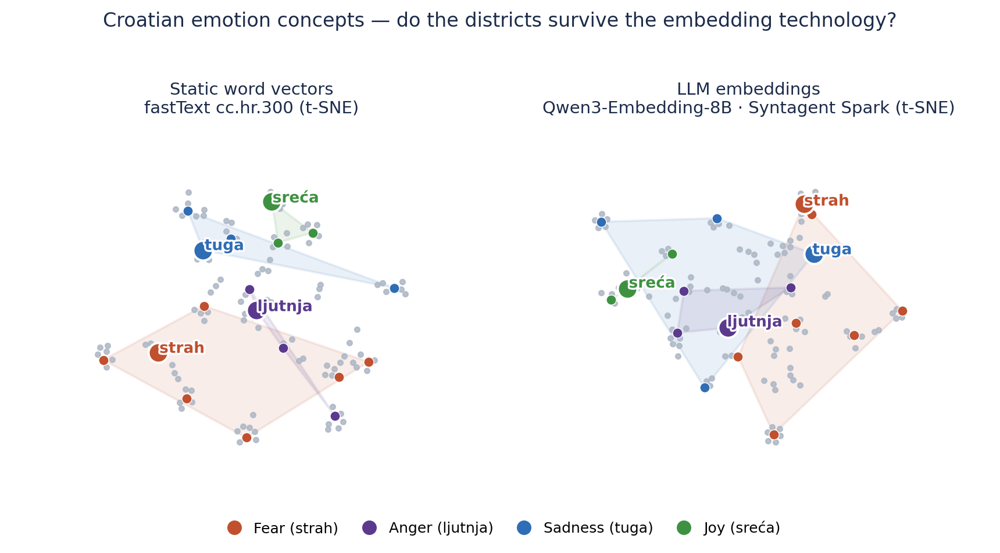
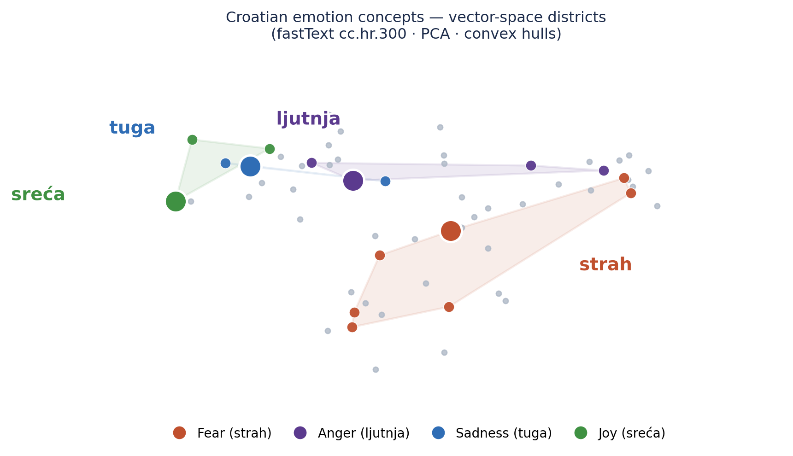
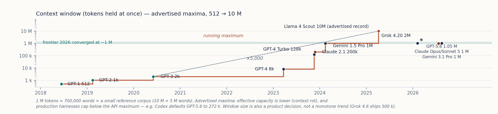
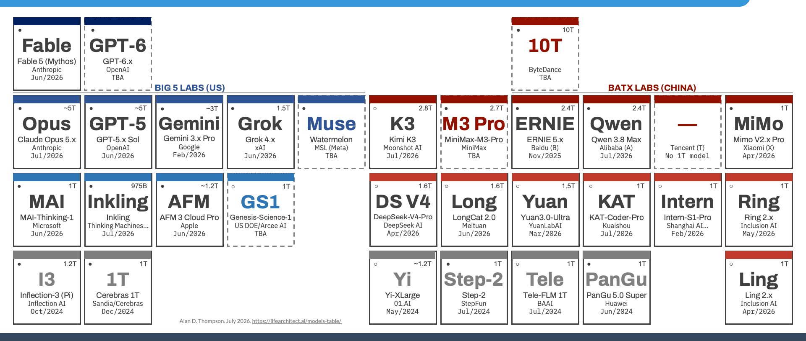
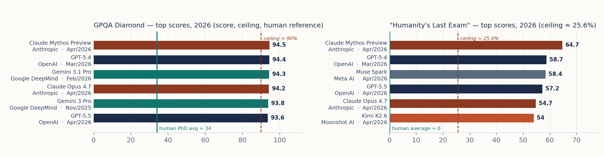
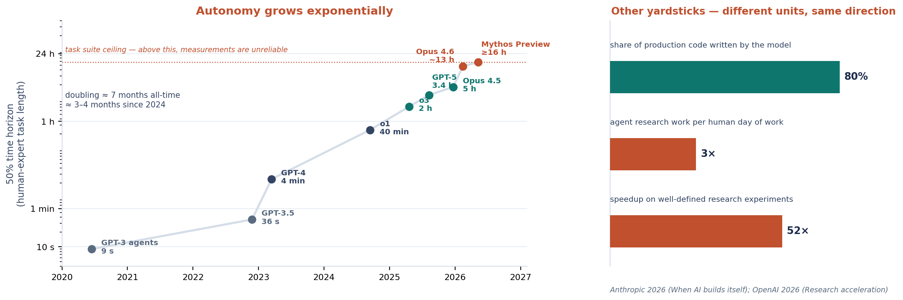

# 10. Geometrija na djelu — i njezine granice

> *Teza poglavlja:* operacije u vektorskom prostoru daju mjerljive i ponovljive rezultate na stvarnim podacima, ali **geometrija nije pojam**: dobivamo strukturu uporabe, ne značenje samo. Poglavlje zato uz svaku brojku nosi i **vrstu dokaza** — jer se u ovome području najlakše pogriješi tako da se procjena pročita kao mjerenje.

---

## 10.1 Postupak na vlastitim podacima: od leksema do klastera

Šesto poglavlje ostavilo je mrežu izgrađenu iz uporabe; deveto je pokazalo kako ko-okurencija postaje geometrija. Ovdje se ta dva koraka spajaju u jedan postupak i izvode **na vlastitim podacima**, do kraja, sa svim odlukama koje se pri tome donose. Nema ničega skrivenoga u tome postupku — i upravo je to njegova vrijednost: ono što se na kraju dobije može se ponoviti, provjeriti i osporiti.

Postupak ima četiri koraka i svaki od njih ima **ulaz**, **izlaz** i **odluku koja mijenja rezultat**:

| korak | ulaz | izlaz | odluka koja mijenja rezultat |
|---|---|---|---|
| 1. popis jedinica | leksemi iz korpusa (npr. 125 emocionalnih leksema) | uređeni popis jedinica | koje jedinice ulaze i po kojemu kriteriju |
| 2. ugrađivanje | popis jedinica + tekst iz kojega se uzimaju primjeri | vektori od 4096 dimenzija po jedinici | ugrađuje li se gola lema ili prosjek njezinih pojavnica |
| 3. mjera srodnosti | matrica vektora | matrica srodnosti *n* × *n* | koja se mjera udaljenosti uzima i je li vektor normaliziran |
| 4. klasteriranje | matrica srodnosti | pripadnost skupinama | broj skupina, prag, algoritam |

**Prvi korak je popis jedinica.** Ulaz nije „jezik" i nije „korpus" — ulaz je **imendani popis**. Kod emocionalnoga leksika to je 125 jedinica iz vlastitoga korpusnog rada (Perak 2014; EmoCNet 2019–21; Ban Kirigin & Perak 2020). Već tu postoji odluka koju treba zapisati: popis je sastavljen po kriteriju, a ne po intuiciji, i drugi kriterij dao bi drugi popis. Granica skupa nije granica domene.

**Drugi korak je ugrađivanje.** Svaka jedinica prevodi se u vektor od **4096 dimenzija** modelom Qwen3-Embedding (Qwen Team 2025, arXiv:2506.05176; vlastiti mjerni postav). Dimenzija je mjerena činjenica o modelu, ne o jeziku: isti leksik u drugom modelu dobiva vektor druge širine i drugog rasporeda. Tu je i najvažnija metodološka odluka cijeloga postupka:

- ugrađuje li se **gola lema** (*strah*), dobiva se vektor koji je model naučio o toj jedinici iz svih svojih podataka — to je *prethodno uvjerenje* modela;
- ugrađuju li se **pojavnice iz korpusa** pa se prosjekuju, dobiva se vektor izveden iz stvarne uporabe u vlastitom materijalu — to je *korpusni* vektor.

Ta dva postupka daju različite brojke, a katkad i različite susjede. Razlika nije tehnička sitnica: prvi mjeri model, drugi mjeri korpus. U knjizi koja tvrdi da je značenje u uporabi, ta razlika mora biti izrečena, a ne prešućena. ↗ Postupak u cijelosti — biblioteke, poslužitelj ugrađivanja, spremište vektora, mjerenje vremena i troška — pripada *Data Science u kulturi* (pogl. 9: ugrađivanja i semantička pretraga); ovdje se zadržavamo na onome što taj postupak ontološki pokazuje.

**Treći korak je mjera srodnosti.** Iz matrice vektora izračunava se matrica srodnosti: za *n* jedinica to je *n* × *n* brojeva, ovdje 125 × 125. Uobičajena je mjera **kosinus kuta** — jedinična vrijednost, neovisna o duljini vektora. To je izbor, i on se prijavljuje: euklidska udaljenost, skalarni produkt i kosinus daju **različite popise najbližih susjeda**, a time i različite skupove. Tko ne zapiše mjeru, ne može ponoviti nalaz. Uz to se vektori obično normaliziraju na jediničnu duljinu, jer u suprotnome duljina vektora (koja ovisi o čestotnosti i o obuci modela) ulazi u „sličnost" kao skriveni član.

**Četvrti korak je klasteriranje.** Skupine se mogu tražiti na više načina — razdvajanjem na *k* skupina, hijerarhijski (dendrogramom i rezom) ili gustoćno, pri čemu neke jedinice ostaju izvan svake skupine kao šum. Nijedan od tih putova ne „otkriva" koliko skupina ima: **broj skupina je ulazna odluka analitičara, a ne izlaz postupka** — s iznimkom gustoćnih metoda, kod kojih broj proizlazi iz praga gustoće, što je i dalje prag koji je netko zadao.

**Peti korak nije korak nego pravilo: provjera stabilnosti.** Isti postupak ponavlja se s drugim sjemenom, s drugim poduzorkom jedinica, s drugim pragom i — najvažnije za ovu knjigu — **s drugom verzijom modela ugrađivanja**. Zapisuje se koliko se pripadnosti promijenilo. Ako se nalaz raspe pri svakoj promjeni verzije, on nije nalaz o jeziku, nego nalaz o jednome modelu.

```python
# 10.1 — leksemi -> vektori (4096) -> srodnost -> skupine
import json, numpy as np, requests

LEKSEMI = [l.strip() for l in open("data/leksemi.txt", encoding="utf-8")]
API = "http://localhost:8000/v1/embeddings"        # poslužitelj ugrađivanja
MODEL = "Qwen3-Embedding"                           # 4096 dimenzija (Qwen Team 2025)

def vektori(tekstovi):
    r = requests.post(API, json={"model": MODEL, "input": tekstovi}, timeout=120)
    r.raise_for_status()
    return np.array([d["embedding"] for d in r.json()["data"]], dtype=np.float32)

def jedinicni(x):                                   # L2 normalizacija
    return x / np.linalg.norm(x, axis=1, keepdims=True)

U = (vektori(LEKSEMI))                              # ulaz: gola lema
S = jedinicni(U)  jedinicni(U).T                   # kosinusna srodnost, n x n

# dijagnostika prostora: koliko se najbliži susjed razlikuje od najdaljega
d = 1 - S[np.triu_indices(len(S), k=1)]
print(f"n={len(S)} d={S.shape[0]}  raspon srodnosti={d.min():.3f}..{d.max():.3f}")

np.save("data/srodnost.npy", S)                     # izlaz 1: matrica srodnosti
np.savetxt("data/vektori.csv", U, delimiter=",")    # izlaz 2: vektori
json.dump({"jedinice": LEKSEMI, "model": MODEL},    # izlaz 3: zapis postavka
          open("data/postavak.json", "w", encoding="utf-8"))
```

**Što je izlaz, a što nije.** Izlaz su: matrica srodnosti, popis najbližih susjeda za svaku jedinicu, pripadnost skupinama, dendrogram i mjera stabilnosti. Izlaz **nije**: značenje jedinice, hijerarhija važnosti među jedinicama, uzrok njihove blizine i bilo kakva tvrdnja o unutrašnjosti govornika. Geometrija daje *položaj prema društvu uporabe* — istu vrstu nalaza koju je mreža davala u šestome poglavlju, samo u drugom zapisu.

**Jedna opomena koja spada u sam postupak.** Broj jedinica i broj dimenzija nisu istoga reda veličine: 125 jedinica u prostoru od 4096 dimenzija. U tako visokom prostoru udaljenosti se **sabijaju** — najbliži susjed prestaje biti bitno bliži od najdaljega, a mjera srodnosti gubi razlučivost. Zato se uz svaku matricu ispisuje raspon srodnosti (u kôdu gore) i zato se klasteri uvijek provjeravaju na stabilnost. Procedura koja to prešuti daje dojam preciznosti koju nema.

**Je li to otkriće o jeziku ili o modelu?** Nalaz da se jedinice slažu u skupine vrijedi za taj vektorski zapis. Ono što mu daje težinu izvan jednoga modela jest nalaz da različiti modeli **konvergiraju** k sličnoj reprezentaciji (Huh i suradnici 2024): ako se prostori dvaju neovisno obučenih sustava poravnavaju, vjerojatnije je da se poravnavaju prema **organizaciji uporabe**, a ne prema hirovima pojedine obuke. To je pojačanje tvrdnje — i istodobno njezino ograničenje: konvergencija prema istoj organizaciji još nije dodir sa svijetom. I modeli sugeriraju da se u aktivacijama pojavljuju strukture koje nalikuju prostoru i vremenu (Gurnee & Tegmark 2023), što drugi dio knjige čita kao organizaciju, a ne kao referenciju.

## 10.2 Vizualizacija i ono što vizualizacija skriva

Prostor od 4096 dimenzija ne može se pogledati. Zato se crta: dvije dimenzije se izaberu tako da prikaz bude čitljiv, najčešće metodama t-SNE ili UMAP. ❓ Njihove izvorne radove ovdje ne citiramo jer nisu u bazi referenci ove knjige; do provjere navodimo samo imena metoda.

To je mjesto na kojemu se u ovome području najčešće gubi stega — i zato mu posvećujemo cijeli odjeljak.

**Što te metode rade.** One ne sažimaju prostor linearno; one traže raspored točaka u ravnini tako da **susjedstva ostanu susjedstva**. Optimiziraju lokalnu strukturu. Globalna struktura — ono što je daleko od čega, koliki je razmak između skupina, koliko je koja skupina gusta — **nije predmet optimizacije**, nego nusproizvod. Iz toga slijedi pet praktičnih posljedica koje treba znati prije nego se pogleda ijedan takav graf:

1. **Udaljenost u prikazu nije udaljenost u prostoru.** Dvije skupine koje su na slici blizu mogu u 4096-dimenzijskome prostoru biti jednako daleko kao dvije skupine na suprotnim krajevima slike.
2. **Razmak između skupina nije mjera njihove razlike.** On ovisi o parametrima metode (broj susjeda, „perplexity", minimalna udaljenost) i o algoritmu rasporeda.
3. **Praznina na slici nije praznina u podacima.** Metode rastežu prostore i stvaraju „otoke" ondje gdje je u izvornome prostoru kontinuum. Tako nastaju kategorije koje nitko nije izmjerio.
4. **Isti podaci, drugi graf.** Drugo sjeme i drugi parametri daju drugu sliku. Ako nalaz postoji samo na jednoj slici, nalaz ne postoji.
5. **Veličina nakupine na slici ne mjeri njezinu zastupljenost.** Gusta mala nakupina može sadržavati više jedinica od velike razvučene.

**Pravilo koje iz toga slijedi za ovu knjigu:** vizualizacija je **kazalo**, a ne dokaz. Svaka tvrdnja koja se iz slike pročita mora se provjeriti u punome prostoru — na matrici srodnosti, na popisu susjeda, na mjeri stabilnosti. Postupak je jednostavan i ponovljiv: (1) odredi susjede u 4096 dimenzija; (2) označi ih na slici; (3) zapiši svako odstupanje slike od prostora. Odstupanja nisu pogreške — ona su svojstvo metode i moraju se prijaviti.



**Slika 10.1.** *Usporedba mrežnoga i vektorskoga prikaza leksema „strah"* ([`fig_strah_usporedba.png`](../figure/fig_strah_usporedba.png)). Isti leksik, dva zapisa iste organizacije: u mreži je položaj posljedica bridova iz uporabe, u vektorskome prostoru posljedica koordinata koje je naučio model. Prikazi se **ne smiju** čitati jedan preko drugoga: ono što je u mreži udaljenost u broju zajedničkih konstrukcija, u prostoru je kut između vektora, a na slici je tek mjesto na papiru.

**I jedna opreza o „pravome prostoru".** Ni prostor od 4096 dimenzija nije pravi prostor značenja. On je jedan zapis, iz jednoga modela, u jednome trenutku obuke. Ako se promijeni verzija modela i skupine se preslože, promijenio se zapis — a pitanje je li se promijenila organizacija uporabe ostaje otvoreno i rješava se usporedbom, a ne uvjerenjem (vježba 🟡).



**Slika 10.2.** Četiri nakupine hrvatskih emocionalnih leksema u vektorskom prostoru — *strah*, *ljutnja*, *tuga* i *sreća* — s granicama skupova kao konveksnim omotačima. **Slika je izrađena na drugom instrumentu nego ostatak knjige:** model *fastText* (cc.hr.300, 300 dimenzija), pa je projekcija na dvije dimenzije izvedena metodom PCA. Ona zato pokazuje **razdiobu**, a ne mjere srodnosti: položaj točke posljedica je projekcije, pa se udaljenost na slici **ne smije** čitati kao udaljenost u prostoru (→ 4.3, 10.2). Izvor: vlastita izrada (Perak); podaci: cc.hr.300.

## 10.3 Kontekstni prozor: od 512 do 10.000.000 tokena

Vektorski prostor je jedno mjesto na kojemu se geometrija izračunava. Drugo je **kontekstni prozor**: količina teksta koju model istovremeno uzima u obzir. Rani modeli imali su prozor od **512 tokena**; kontekstni prozori dostupni 2026. dosežu **10.000.000 tokena** (dokumentacija pružatelja usluga, provjereno 14. 9. 2026.). To je rast od **×5.000** (izvedeno iz tih dviju vrijednosti) — u okvirno šest godina.

| pokazatelj | vrijednost | vrsta | izvor |
|---|---|---|---|
| kontekstni prozor ranih modela | 512 tokena | mjereno | dokumentacija pružatelja usluga (2020) |
| kontekstni prozor 2026. | 10.000.000 tokena | mjereno | dokumentacija pružatelja usluga (provjereno 14. 9. 2026.) |
| rast prozora | ×5.000 | izvedeno | izvedeno iz dviju vrijednosti gore |

Ta brojka ima jasan ontološki smisao: **veličina konteksta je veličina materijala nad kojim se geometrija gradi u jednome trenutku.** Cijela knjiga kakvu čitate stane u najveći današnji prozor. To je promjena, i ona je mjerena — ali iz nje se **ne** smije izvesti ono što se najčešće izvodi.

**Cijena konteksta.** Prvo, **posao nije isto što i prostor**: ulazak teksta u prozor ne znači da model taj tekst i upotrebljava. Pokazalo se da se uspješnost smanjuje kako ulaz raste — i na zadacima koji dodatne tokene uopće ne zahtijevaju (Chroma 2025, *Context rot*), a informacija smještena u sredinu dugačkoga ulaza upotrebljava se slabije od one na početku ili na kraju (Liu i suradnici 2024, *TACL* 12:157–173). Degradacija nije jednolična: zavisi od položaja, od količine sličnoga materijala i od vrste zadatka. Drugo, **kontekst ima cijenu u novcu i u vremenu**: trošak raste s brojem tokena, a odziv se usporava, pa „sve u kontekst" nije samo pitanje mogućnosti nego i računa. Treće, i najvažnije za razlučivanje vrste dokaza:

> **Mjereno je** da prozor prima 10.000.000 tokena i **mjereno je** da uspješnost pada s rastom ulaza. **Procjena je** da veći prozor znači više znanja u sustavu. Prvo je svojstvo isporuke, drugo je pretpostavka o uporabi — i ona je, u najmanju ruku, nelinearna.



**Slika 10.3.** *Rast kontekstnog prozora (512 → 10.000.000 tokena)* ([`fig_context.png`](../figure/fig_context.png)). Graf prikazuje mjerene vrijednosti iz dokumentacije pružatelja; crta između njih je vodilica za oko, a ne izmjereni kontinuum. Svojstva poput „dugi kontekst odgovara većoj sposobnosti" na ovoj slici **nisu prikazana** jer nisu izmjerena.

Praktična posljedica za ovu knjigu je terminološka: „kontekstni prozor" je svojstvo sustava, a **nije razina**. Sustav s velikim prozorom nije „na višoj razini" od sustava s malim; on ima veći radni stol. Gdje taj stol stoji u sustavu — pitanje je za dvanaesto poglavlje, gdje se modelu dodaju dohvat, pamćenje i djelovanje i gdje se pojavljuje razlika između **entiteta** (gdje sustav jest) i **agenta** (što sustav radi).

## 10.4 Veliki brojevi: „klub 10¹² parametara"

Sada najosjetljiviji odjeljak ovoga poglavlja. U javnome govoru o modelima postoji klub velikih brojeva — nazovimo ga, prema Thompsonu (2026, *Models Table*, LifeArchitect.ai), **„klub 10¹² parametara"**. Pravilo je jasno i vrijedi za svaki redak koji slijedi: **brojke o veličini modela su PROCJENE, ne mjerenja.**

Zašto procjene? Zato što veličina frontier modela u pravilu **nije objavljena**. Procjena se izvodi posredno: iz isporučenoga kapaciteta i cijene, iz propusnosti, iz opisa arhitekture, iz potrošnje. Takav je i najpoznatiji takav zapis — procjena arhitekture GPT-4 (SemiAnalysis 2023), koja se u ovoj knjizi navodi **isključivo kao nepotvrđena procjena**. Neovisna evidencija o uloženome računu postoji i vodi se odvojeno (Epoch AI 2026), ali i ona je izvedena iz posrednih pokazatelja. Kad se dvije procjene razilaze, čitatelj mora dobiti obje — isto pravilo koje u ovome poglavlju vrijedi za HLE strop.

**Što „ukupan broj parametara" uopće znači.** Moderna arhitektura razlikuje **ukupan** broj parametara od broja parametara **aktivnih po tokenu**: u rijetkim (*sparse*) sustavima s mnoštvom stručnjaka po jednome se ulazu aktivira samo dio mreže. To nije detalj nego razlika između dvije različite brojke — i stoga je jedini pošten način da se obje navedu. Primjer iz otvorene literature: DeepSeek-V3 (DeepSeek-AI 2024, arXiv:2412.19437) razlikuje 671 milijardu ukupnih parametara od 37 milijardi aktivnih po tokenu — oboje su **samoprijava proizvođača**, pa se navode kao takve. ❓ Točne vrijednosti po modelu ne stoje u evidenciji `data/fakti.csv` i treba ih onamo unijeti prije nego uđu u koje drugo poglavlje.

| što brojka imenuje | čemu služi | što **ne** mjeri |
|---|---|---|
| ukupan broj parametara (procjena) | doseg klubova; usporedba narudžbi | koliko se računa troši po tokenu; kakvoću ishoda |
| aktivni parametri po tokenu | trošak i latencija po tokenu | koliko je sustav „pametan" |
| račun za obuku (FLOP; procjena) | mjesto u zakonima skaliranja (Kaplan i suradnici 2020) | sposobnost pojedinoga zadatka |
| količina podataka prema računu (Chinchilla; Hoffmann i suradnici 2022) | omjer podataka i parametara za zadan račun | je li veći model bolji *za moj zadatak* |
| račun u vrijeme uporabe | koliko se može kupiti bez novih parametara (Snell i suradnici 2024) | da je veličina jedini put do sposobnosti |

**Zakoni skaliranja i njihova granica.** Zakoni skaliranja (Kaplan i suradnici 2020) opisuju **pravilnost** — kako se gubitak smanjuje s računom, parametrima i podacima — ali pravilnost u prosjeku nije zakon rasta na svakome zadatku. Chinchilla (Hoffmann i suradnici 2022) pokazala je da odnos nije „više parametara uvijek" nego „odgovarajući odnos podataka i parametara za zadani račun", čime je veličina prestala biti samostalna varijabla. Nadalje, sposobnosti se u praksi pojavljuju **stupnjevito**, a ne kontinuirano: model kvantizacije skaliranja (Michaud i suradnici 2023) opisuje ih kao „kvante" koje se aktiviraju kroz stupnjeve, pa milijarda parametara više ne kupuje nužno i djelić nove sposobnosti. I najzad, dio se sposobnosti može kupiti **bez novih parametara** — dodatnim računom u vrijeme uporabe (Snell i suradnici 2024).

**Usporedba koja raskrinkava brojanje kao mjeru.** Konektom mozga vinske mušice — najpotpuniji konektom jednoga odraslog mozga — ima **139.255 neurona**, oko **50 milijuna sinapsi** i **64 tipa neurona** (Dorkenwald i suradnici 2024, *Nature*), a model aktivnosti izveden iz toga konektoma ima **734 parametra** (Lappalainen i suradnici 2024, *Nature* 634:1132–1140). Sve su to **mjerenja**. Taj sustav obavlja navigaciju, učenje, pamćenje i socijalno ponašanje u stvarnome svijetu. Zaključak nije da je mušica moćnija od modela — nego da **broj jedinica mjeri arhitekturu, a ne sposobnost**. Isti nalaz dolazi i iz maloga primjera o cirkulaciji brojki: popularni prikazi istoga konektoma navode brojku 166 za broj tipova neurona, koje u izvorniku nema. ❓ Za tu brojku ne postoji izvor i u knjigu ne ulazi; bilježimo je kao primjer kako se procjena ili pogreška širi dalje od mjerenja.


**Slika 10.4.** *Parametri, račun za obuku, Chinchilla i rijetkost* ([`fig_scale.png`](../figure/fig_scale.png)). Graf je sastavljen iz **procjena** veličine i iz mjerenih vrijednosti računa; osi i oznake to navode. Čitanje: položaj modela na grafu nije mjesto u sustavu razina, nego zapis o jednoj veličini arhitekture.



**Slika 10.5.** *„Klub 10¹² parametara"* ([`fig_trillion_club.png`](../figure/fig_trillion_club.png); izvor: Thompson 2026, *Models Table*, LifeArchitect.ai). **Sve vrijednosti na ovoj slici su procjene**, uključujući i one koje se odnose na modele čija je veličina dijelom potvrđena. Slika ne dokazuje natjecanje u veličini; ona prikazuje **stanje procjena** o tome natjecanju — a to su dvije različite stvari.

Zato u ovoj knjizi ne postoji tvrdnja „model je velik, dakle je viši". Model s 10¹² parametara ne dodaje **sedamnaestu razinu** i ne zauzima novu razinu: on je veći sustav iste vrste. Gdje se u sustavu nalazi, određuje njegova **uloga** — a uloga se čita iz dodataka koji ga čine agentom (→ pogl. 12), ne iz broja parametara.

## 10.5 Rezultati i stropovi: GPQA i „Humanity's Last Exam"

Dok brojke o veličini ostaju izvan dosega mjerenja, o **rezultatima na testovima** postoji golema evidencija — i upravo nam ona omogućuje da vidimo kako mjera prestaje biti mjera.

**GPQA.** Skup pitanja na razini doktorskoga studija, „otporan na Google": **448 pitanja**, od kojih je podskup *Diamond* od **198** pitanja (Rein i suradnici 2023, arXiv:2311.12022). Strop „nesporno točnih" odgovora — onoga što u pitanju doista ima jedan neosporan točan odgovor — iznosi **~80 %** i zavisi od podskupa (**procjena**; Thompson 2026, *Mapping IQ, MMLU, MMLU-Pro, GPQA, HLE*, ažurirano 4. 8. 2026.). Isti skup bio je **zasićen u 11/2025** rezultatom **93,8 %** (Gemini 3 Pro; **mjereno**, prema Thompsonu 2026), a **Anthropic je prestao izvještavati GPQA od 6/2026**. Za kontekst: MMLU je zasićen još 9/2024 (o1-preview 92,3 %), a MMLU-Pro u 11/2025 (Gemini 3 Pro 90,1 %); stropovi su procijenjeni na **~91 %** odnosno **~90 %** (procjene; Thompson 2026).

Ovdje treba zastati pred dvjema činjenicama koje se lako pročitaju kao „napredak", a to nisu.

**Prva: rezultat iznad stropa nije bolji rezultat.** Ako ~20 % pitanja nema neosporan točan odgovor — jer je formulacija dvosmislena, jer stručnjaci ne dijele odgovor ili jer pitanje traži pretpostavku koju ne navodi — onda razlika između 80 % i 93,8 % ne mjeri razliku u znanju, nego razliku u **podlozi** koja uzima strop kao 100 %. Model koji „premašuje" strop često pogađa ono što je u pitanju nedorečeno.

**Druga: zasićenje nije samo pobjeda nego i gubitak informacije.** Kad svi vodeći sustavi desežu strop, test prestaje razlikovati — prestaje mjeriti. Uz to je i **prestanak izvještavanja** događaj u mjernome sustavu, a ne u sustavu koji se mjeri: kad izvještaj prestane stizati, o sposobnosti ne znamo ništa više ni manje nego prije. Mjerni instrument ima svoju povijest i treba je zapisati jednako kao i rezultate.

**„Humanity's Last Exam".** Skup od **2.500 pitanja** iz akademskih domena, izgrađen upravo zato da ne bude zasićen (Center for AI Safety, Scale AI & HLE Contributors Consortium 2026, *Nature* 649:1139–1146, DOI 10.1038/s41586-025-09962-4; arXiv:2501.14249; pitanja finalizirana 4/2025.). Njegov strop „nesporno točnih" odgovora navodi se s **dva različita izvora**: **~51,3 %** (FutureHouse, 7/2025) **ili 25,6 %** (Alibaba, 2/2026, arXiv:2602.13964v2) — oba putem Thompsona (2026). Razlika od dvadeset i pet postotnih bodova nije razlika u modelima nego u **filtru pitanja**: u tome što se u svakome od dvaju izvora broji kao neosporan točan odgovor. Skup je gotovo zasićen u 12/2025 (GPT-5.2  **50 %**; mjereno, prema Thompsonu 2026).



**Slika 10.6.** *Rezultati i stropovi testova (GPQA, HLE)* ([`fig_scoreboard.png`](../figure/fig_scoreboard.png)). Na slici se vidi ono što je u tekstu najvažnije: rezultati (mjerenja) i stropovi (procjene) nacrtani su **zajedno**, i upravo ta razlika u vrsti dokaza objašnjava zašto se dvije vrijednosti stropa za isti test razlikuju. Graf s naznačenim stropom čita se samo ako se zna da strop nije izmjeren, nego procijenjen na temelju prosudbe o pitanjima.

**Kako to mislimo dokazati — i kako bismo znali da griješimo.** Ako se pokaže da su rezultati na stropu posljedica **kontaminacije podacima** (pitanja koja su se našla u obuci) ili da su stropovi ispravni i zasićenje potpuno, dio tvrdnji o „sposobnostima" pada i ova knjiga to mora prijaviti kao **vlastito ograničenje**, a ne kao protuargument. Metodološka opreza je u tome već sadržana: pojava na grafu koja izgleda kao skok može biti posljedica **nelinearnoga praga u mjeri** — načina bodovanja i granice prolaza — a ne skoka u sustavu (Schaeffer i suradnici 2023; Wei i suradnici 2022). Mjera je dio tvrdnje. I rasprava o tome što rezultat na testu uopće pokazuje o razumijevanju ostaje otvorena (Mitchell & Krakauer 2023).

## 10.6 Vremenski horizont: od 9 sekundi do ~12 sati

Zadnji skup brojki u ovome poglavlju ne mjeri koliko model zna, nego **koliko dugo zadatak traje**. METR je za to uveo mjeru koja je danas najkorištenija: **vremenski horizont** je duljina zadatka — izražena u ljudskome vremenu potrebnom da ga obavi stručnjak — koju model dovrši s vjerojatnošću od 50 % (METR 2025, arXiv:2503.14499, NeurIPS 2025).

- **2020.: 9 sekundi.** To je **mjerenje** na istome tipu zadataka i ista je mjera koja se primjenjuje i danas.
- **2026.: ~12 sati** za Claude Opus 4.6. To je **procjena** — rezultat modeliranja krivulje na skupu zadataka, a ne izravno izmjereni podatak — i ona je **ispravljena**. Prvotna procjena od 20. 2. 2026. iznosila je **~14,5 h**; METR je **3. 3. 2026.** ispravio bug u modeliranju i vrijednost spustio na **~12 h**.
- **Udvostručavanje.** Prema METR-u (2025) horizont se povijesno udvostručivao približno svakih **~7 mjeseci**; od 2024. u nekim se analizama navodi **3–4 mjeseca**. Obje vrijednosti donosimo s ogradom: razlika nije između dvaju mjerenja nego između dviju **ekstrapolacija** iz istoga tipa modeliranja, pa se brža varijanta ne smije navoditi kao nalaz.

**Granice mjerenja — dio koji se najčešće prešućuje.** Uz METR-ov graf stoji napomena: *„Measurements above 16 hrs are unreliable with our current task suite."* Drugim riječima: **mjerenja iznad 16 sati su nepouzdana** sa sadašnjim skupom zadataka. Claude Mythos (ožujak 2026.) ocijenjen je na **16+ h** — što znači da je dosegnuo **gornju granicu skupa zadataka**, a ne novi plato. Iz toga slijede dvije posljedice. Prvo, brojka iznad 16 h ne smije se čitati kao vrijednost, nego kao **„≥ granica instrumenta"**. Drugo, mjera je **osjetljiva**: pomak jednoga zadatka u skupu mijenja procjenu cijele krivulje, pa je razlika između 12 i 14,5 sati upravo te veličine — u granicama jednoga popravka modeliranja.

**Što je time dokazano, a što nije.** Dokazano je da se duljina zadataka koje sustavi dovršavaju **mijenja za nekoliko redova veličine** unutar nekoliko godina: od 9 sekundi do sati. Nije dokazano da je riječ o općoj sposobnosti: horizont je izmjeren na **softverskim zadacima** s izvornim kodom i provjerljivim ishodom, a to je jedna obitelj zadataka. Ništa se odatle ne smije prenijeti na, primjerice, vođenje razgovora, odgovornost ili razumijevanje namjere — a upravo se takav prenos u javnome govoru događa najčešće. Kao i u jedanaestome poglavlju o mjerenju „razmišljanja": **metrika je izbor, ne činjenica**.



**Slika 10.7.** *Vremenski horizont zadataka (METR)* ([`fig_horizon.png`](../figure/fig_horizon.png)). Crta je procjena iz modeliranja, a ne niz izmjerenih točaka; područje iznad 16 sati na slici je označeno kao nepouzdano. Graf se **ne smije** čitati kao najava: produžetak crte nije izmjereni podatak.

**I jedna vlastita pogreška, zapisana.** U izlaganju iz kojega je nastala ova knjiga (11. 9. 2026.) navodilo se da horizont iznosi „~13–14,5 h". To je bila **prvotna METR-ova procjena**, koja je u međuvremenu ispravljena. Knjiga pogrešku ne briše: u `docs/ISPRAVKE.md` stoji ISPRAVAK-001 s onim što je pisalo, što je točno, odakle to znamo i gdje je ispravljeno. Razlika između 14,5 i 12 sati nije razlika u modelima — **nije se promijenio sustav, promijenio se izračun**. To je najčišći primjer za pravilo cijeloga poglavlja: brojka bez vrste i bez datuma nije brojka.

### 10.6.1 Evidencijska tablica poglavlja

| tvrdnja | brojka | vrsta dokaza | izvor (datum) |
|---|---|---|---|
| dimenzija ugrađivanja (vlastiti postav) | 4.096 dimenzija | mjereno | Qwen Team 2025 (arXiv:2506.05176) |
| veličina vlastitoga leksičkog skupa | 125 leksema | mjereno | Ban Kirigin & Perak 2020; EmoCNet 2019–21; Perak 2014 |
| kontekstni prozor ranih modela | 512 tokena | mjereno | dokumentacija pružatelja (2020) |
| kontekstni prozor 2026. | 10.000.000 tokena | mjereno | dokumentacija pružatelja (provjereno 14. 9. 2026.) |
| rast kontekstnog prozora | ×5.000 | izvedeno | izvedeno iz dviju vrijednosti gore |
| degradacija s rastom ulaza | pad uspješnosti s duljim ulazom | mjereno | Chroma 2025; Liu i suradnici 2024 |
| „klub 10¹² parametara" | ~10¹² parametara | **procjena** | Thompson 2026 (*Models Table*, LifeArchitect.ai) |
| veličina GPT-4 | nepotvrđena procjena | **procjena (nepotvrđena)** | SemiAnalysis 2023 |
| GPQA strop (nesporno točni) | ~80 % | **procjena** | Thompson 2026 (4. 8. 2026.); Rein i suradnici 2023 |
| GPQA rezultat pri zasićenju | 93,8 % | mjereno | Thompson 2026 (Gemini 3 Pro, 11/2025) |
| prestanak izvještavanja GPQA | od 6/2026 | mjereno (dogovor u mjernome sustavu) | Thompson 2026 |
| HLE strop (nesporno točni) | ~51,3 % | **procjena** | FutureHouse (7/2025), putem Thompsona 2026 |
| HLE strop (drugi izvor) | 25,6 % | **procjena** | Alibaba (2/2026, arXiv:2602.13964v2) |
| HLE rezultat pri zasićenju | 50 % | mjereno | Thompson 2026 (GPT-5.2, 12/2025) |
| METR-ov horizont 2020. | 9 sekundi | mjereno | METR 2025 (arXiv:2503.14499) |
| METR-ov horizont 2026. | ~12 sati | **procjena** | METR 2026 (ispravak 3. 3. 2026.; prije toga ~14,5 h) |
| granica pouzdanosti mjerenja | iznad 16 sati nepouzdano | mjereno (napomena uz graf) | METR 2026 |
| konektom vinske mušice | 139.255 neurona · ~50 mil. sinapsi · 64 tipa | mjereno | Dorkenwald i suradnici 2024 |
| model aktivnosti konektoma | 734 parametra | mjereno | Lappalainen i suradnici 2024 |
| MMLU strop · MMLU-Pro strop | ~91 % · ~90 % | **procjena** | Thompson 2026 |

### 10.6.2 Ista brojka, dva čitanja

Tablica postoji zbog jednoga pitanja: **što se promijeni kad se promijeni vrsta dokaza?** Tri primjera.

**Prvi: 10.000.000 tokena.** Kao **mjereno**, to znači: sučelje prihvaća ulaz te duljine i ne odbija ga. Kao **procjena**, to bi značilo: sustav tu količinu i upotrebljava, ravnomjerno i pouzdano. Prvo je istina, drugo nije — i to ne zbog stava, nego zbog mjerenja koje pokazuje pad uspješnosti s duljim ulazom (Chroma 2025) i slabiju uporabu materijala u sredini ulaza (Liu i suradnici 2024). Ista brojka, dva zaključka: *„prozor je ogroman"* i *„informacija mi je negdje u prozoru, pa je nalazim"*. Samo prvi slijedi iz dokaza.

**Drugi: ~12 sati.** Kao **mjerenje**, ta bi brojka značila da je model izvršio posao kakav stručnjaku traje dvanaest sati. Kao **procjena** — što ona i jest — znači: na skupu softverskih zadataka s provjerljivim ishodom krivulja uspješnosti prelazi 50 % oko dvanaest sati, uz nesigurnost koja uključuje i sam popravak modeliranja (14,5 → 12), a iznad 16 sati mjerenje nije pouzdano. Prvo bi bila tvrdnja o sposobnosti, drugo je tvrdnja o instrumentu.

**Treći: HLE strop, ~51,3 % ili 25,6 %.** Kao **mjerenje**, jedna od tih brojki značila bi da je petina do polovice testa neupotrebljiva. Kao **procjena** — što obje jesu — one znače: *dvije neovisne prosudbe o tome koja su pitanja nesporno točna razilaze se za dvadeset i pet postotnih bodova*. To nije slabost podatka, to je **podatak o podatku**. Knjiga zato navodi obje vrijednosti i ne odabire „ljepšu": kad se dva mjerenja razilaze, čitatelj dobiva stanje spora (→ `docs/ISPRAVKE.md`, ISPRAVAK-003).

Iz toga slijedi pravilo koje vrijedi za cijelu knjigu, a ovdje je izvedeno na brojkama:

> **Ista brojka dvaput izrečena — jednom kao mjerenje, jednom kao procjena — nije jedna tvrdnja s dva naglaska, nego dvije tvrdnje s različitim uvjetima opovrgavanja.**

## 10.7 Što geometrija ne pokazuje — i prijelaz na DIO IV

Poglavlje je pokazalo da geometrija **radi**: daje ponovljive, mjerljive i provjerljive nalaze o organizaciji uporabe, i to na vlastitim podacima, s vlastitim brojkama i vlastitim zapisom postupka. Ali upravo zato što radi tako dobro, mora se točno reći gdje prestaje.

**Prvo: geometrija ne pokazuje referenciju.** Položaj jedinice u prostoru jest odnos prema drugim jedinicama — unutrašnji odnos znakova. Nijedna koordinata ne upućuje na stvar u svijetu, a sustav relacija može biti bogat i dobro organiziran, a da nijedan njegov član ne bude povezan s onim na što upućuje. To je problem utemeljenja simbola (Harnad 1990) i on se vektorskim prostorom ne rješava, nego se u njemu ponovno postavlja: bliži susjed nije bliža stvar. Nalaz da modeli u aktivacijama razvijaju strukture koje nalikuju prostoru i vremenu (Gurnee & Tegmark 2023) pojačava **strukturu**, ali ne daje referenciju; a interpretabilnost koja opisuje mehanizme unutar modela (Anthropic 2025, *On the biology of a large language model*) opisuje **mehanizam**, a mehanizam nije svrha.

**Drugo: geometrija ne pokazuje namjeru.** Značenje je, u tradiciji koja ovdje nosi cijeli drugi dio knjige, **prepoznata namjera**: govornik želi da sugovornik prepozna njegovu namjeru upravo time što je prepoznaje (Grice 1957), a komunikacija je prepoznavanje namjere, a ne prijenos predmeta (Harris 1981). U prostoru nema nikoga koga bi se prepoznalo. Klaster pokazuje da se jedinice pojavljuju u sličnim okolinama; ne pokazuje da je itko nešto htio reći. Model koji „razumije" upit jest onaj čije se vektorske okoline poklapaju s okolinama iz obuke — a to je tvrdnja o organizaciji, ne o namjeri.

**Treće: geometrija ne pokazuje odgovornost.** Odgovornost nije svojstvo položaja nego **ustroja**: obveza postoji kad je priznata, a brani se kad postoji ovlaštenje, zapis i postupak osporavanja (Searle 1995; 2010). Prostor ne poznaje sankciju. Udaljenost se ne može pozvati na odgovornost, jer se odgovornost pripisuje **nositelju** u zajednici koja mu obvezu priznaje — a taj je nostitelj, u terminima ove knjige, smješten na razinama 12–16 društvene domene, a ne u koordinatama.

**Četvrto: sam prostor je slabo emergentan.** Struktura koju čitamo izvediva je iz podataka, ali **samo simulacijom** — iznenađujuće u praksi, izvedivo načelno (Bedau 1997). Zato geometrija ne opisuje „dublju razinu stvarnosti": ona opisuje jedan sloj organizacije, relativan prema razini na kojoj ga promatramo (Emmeche, Køppe & Stjernfelt 1997). Isti je zahtjev šestome poglavlju postavljen za mrežu, a ovdje za prostor: nalaz opravdava svoje mjesto samo ako **predviđa nešto izvan podataka iz kojih je izgrađen** — ponašanje jedinica u novome materijalu, u drugome žanru, u drugoj verziji modela.

**Što dakle ostaje otvoreno.** Ako geometrija ne pokazuje referenciju, namjeru ni odgovornost, onda preostala pitanja **nisu pitanja o prostoru**. Ona su pitanja o **položaju**: tko koga adresira, što se broji kao preuzeta obveza, ko je ovlašten utvrditi kršenje i izreći posljedicu. To su pitanja razine 14 (SocCommunication) i onih iznad nje — a na njih se ne odgovara mjerenjem kuta između vektora.

Zato ostatak trećega dijela ide dalje od mjere. Jedanaesto poglavlje pita što je „mišljenje" kad ga opisujemo kao **procesiranje** — kontinuirano unaprjeđenje konteksta — i po kojim se kriterijima to razlikuje od mišljenja u punome smislu. Dvanaesto poglavlje pita postaje li model, kad mu se dodaju djelovanje, pamćenje, dohvat, orkestracija i interoperabilnost, **novi entitet u sustavu** — pri čemu treba ostati dosljedno: **entitet imenuje *gdje* je, a agent *što* radi**, i ta je razlika između položaja i uloge razlika između dvaju pitanja, a ne dvaju stilova.

A kad se ta pitanja postave, otvara se i **četvrti dio knjige**: komunikacija s novim entitetom. Njegovo je polazište upravo nalaz ovoga poglavlja — ono što geometrija pokazuje mjereno je i ponovljivo; ono što ne pokazuje (referencija, namjera, odgovornost) nije praznina koju će veći model popuniti, nego **mjesto na kojemu se postavljaju pitanja o sustavu, konvenciji i obvezi** (→ pogl. 13, 14, 15, 16). Geometrija je dala tlo. Ostaje pitanje tko na njemu stoji.

### Kako bismo znali da griješimo

- Ako se pokaže da su rezultati na stropu testova (10.5) posljedica **kontaminacije podacima** — da su pitanja bila u obuci — dio tvrdnji o „sposobnostima" pada, i ova knjiga to mora prijaviti kao **vlastito ograničenje**, a ne prešutjeti.
- Ako se pokaže da prostor ugrađivanja **ne predviđa ništa izvan podataka** iz kojih je izgrađen (ponašanje jedinica u novome materijalu, u drugome žanru, u drugoj verziji modela), onda je geometrija opisna i prikazna — i to treba reći, a ne pretvarati prikaz u objašnjenje. Isti test vrijedi i za mrežu (→ pogl. 6.5), i ovdje se ponavlja u drugom zapisu.
- Ako se pokaže da se skupine **preslože pri svakoj promjeni verzije modela** ugrađivanja, nalaz nije o jeziku nego o jednome modelu; tvrdnja o „organizaciji uporabe" mora se svesti na tvrdnju o jednome mjernome postavku.
- Ako se pokaže da modeli **upotrebljavaju** dugačak kontekst bez degradacije (da je „context rot" svojstvo pojedine isporuke, a ne rasta ulaza), tvrdnja iz 10.3 pada na razinu pojedinoga proizvoda.
- Ako se pokaže da je METR-ov horizont (10.6) svojstvo **skupa zadataka**, a ne sustava — npr. da se pomakom jednoga zadatka procjena mijenja više od razlike među modelima — onda je ekstrapolacija neosnovana, a brojka iznad 16 sati ostaje neizmjerena.
- Ako se pokaže da su **sve brojke iz evidencijske tablice (10.6.1) mjerenja** i da nijedna nije procjena, tablica je suvišna. Do tada je razlučivanje vrste dokaza posao, a ne ukras.

### Vježbe

🟢 **Nađi tri pogrešna čitanja grafa skaliranja.** Uzmi `fig_scale.png` (i `fig_trillion_club.png` ako radiš s procjenama veličine) i napiši **tri rečenice** koje bi netko mogao izvesti iz slike, a koje slika ne podupire. Za svaku navedi: (a) koja je brojka na slici upotrijebljena, (b) koja je vrsta dokaza — mjereno, procjena ili izvedeno — i (c) što bi se moralo izmjeriti da rečenica postane istinita. Primjer pogrešnoga čitanja koji ne smiješ ponoviti: *„model A ima više parametara od modela B, dakle na višoj je razini"* — to miješa procjenu veličine s položajem u sustavu.

🟡 **Ponovi jedan vlastiti rezultat na novoj verziji modela.** Postupak, korak po korak: (1) fiksiraj popis jedinica u datoteci (`data/leksemi.txt`) i zapiši njegov sažetak (kontrolni zbroj) — popis se ne smije mijenjati između dvaju mjerenja; (2) izračunaj vektore i matricu srodnosti s prvom verzijom modela; spremi ih u `data/` i zapiši ime i verziju modela; (3) ponovi **isti** postupak s drugom verzijom modela (isti način ugrađivanja, ista normalizacija, ista mjera srodnosti); (4) usporedi: korelacija dviju matrica srodnosti, preklapanje pet najbližih susjeda po jedinici i broj jedinica koje su promijenile skupinu uz isti *k* i isto sjeme; (5) napiši nalaz u tri rečenice — je li tvoj zaključak **preživio** promjenu modela, je li se **promijenio** ili je **pao**. Ako je pao, to je nalaz; napiši ga.

🏆 **Provjeri jednu Thompsonovu procjenu na primarnom izvoru.** Koraci: (1) odaberi jednu procjenu iz `fig_trillion_club.png` ili iz Thompsonove tablice stropova (Thompson 2026, LifeArchitect.ai) — npr. veličinu modela ili jedan od stropova; (2) pronađi **primarni izvor**: tehničko izvješće proizvođača, dokumentaciju pružatelja usluge ili recenzirani rad (za HLE: *Nature* 649:1139–1146, DOI 10.1038/s41586-025-09962-4; arXiv:2501.14249; za GPQA: arXiv:2311.12022); (3) zapiši što u primarnome izvoru **stvarno** stoji — je li to mjerenje, samoprijava ili procjena treće strane, i s kojim datumom; (4) usporedi s Thompsonovom vrijednošću i izračunaj razliku; (5) zapiši razliku u `docs/ISPRAVKE.md` po obrascu ISPRAVKA (**pisalo je · točno je · izvor · posljedica za tekst · ispravljeno u**), kao što su zapisana tri ispravka iz ovoga poglavlja. Ako se vrijednosti **poklapaju**, napiši i to — negativan nalaz je nalaz; ako primarni izvor nije dostupan, zapiši ❓ i što bi bilo potrebno za provjeru.

### Sažetak

- **Postupak je javan i ponovljiv:** leksemi → vektori (**4.096 dimenzija**, Qwen3-Embedding; Qwen Team 2025) → mjera srodnosti (kosinus, uz normalizaciju) → skupine. Svaki korak ima ulaz, izlaz i **odluku** koja se prijavljuje; broj skupina je odluka analitičara, ne nalaz postupka. Uz 125 jedinica u 4.096 dimenzija udaljenosti se sabijaju, pa se uz svaku matricu ispisuje njezin raspon.
- **Vizualizacija je kazalo, ne dokaz.** Metode poput t-SNE i UMAPa čuvaju susjedstva, a ne udaljenosti: **udaljenost u prikazu nije udaljenost u prostoru**, praznina na slici nije praznina u podacima, a drugi parametri daju drugu sliku. Svaka se tvrdnja provjerava u punome prostoru.
- **Kontekstni prozor narastao je s 512 na 10.000.000 tokena (×5.000, izvedeno)** — i to je **mjereno**. Da veći prozor znači i veću uporabu nije: uspješnost pada s rastom ulaza (Chroma 2025; Liu i suradnici 2024), pa „sve u kontekst" ima cijenu i u novcu i u točnosti.
- **„Klub 10¹² parametara" (Thompson 2026) čine PROCJENE.** Ukupan broj parametara uključuje rijetke stručnjake i nije isto što i broj aktivnih po tokenu; zakoni skaliranja (Kaplan i suradnici 2020), Chinchilla (Hoffmann i suradnici 2022) i kvantizacija skaliranja (Michaud i suradnici 2023) pokazuju da veličina nije samostalna varijabla. Konektom vinske mušice s **734 parametra** (Lappalainen i suradnici 2024) obavlja ono što veliki modeli ne — jer broj jedinica mjeri arhitekturu, a ne sposobnost.
- **Rezultati i stropovi:** GPQA (448 pitanja; strop ~80 %, procjena; zasićen 11/2025  93,8 %, mjereno; Anthropic prestao izvještavati od 6/2026) i HLE (2.500 pitanja; strop ~51,3 % ili 25,6 %, **oba izvora**; gotovo zasićen 12/2025  50 %). Kad test dođe do stropa, prestaje razlikovati — a prestanak izvještavanja je događaj u mjernome sustavu.
- **Vremenski horizont (METR):** 9 sekundi (2020., mjereno) → **~12 sati** (2026., **procjena**, nakon METR-ova ispravka buga 3. 3. 2026.; prije toga ~14,5 h). Iznad **16 sati** mjerenja su **nepouzdana** sa sadašnjim skupom zadataka; niže vrijednosti udvostručavanja (3–4 mjeseca) su ekstrapolacija, a ne nalaz.
- **Geometrija ne pokazuje referenciju, namjeru ni odgovornost** (Harnad 1990; Grice 1957; Harris 1981; Searle 1995; 2010). Ono što pokazuje — organizaciju uporabe — mjereno je i ponovljivo; ono što ne pokazuje nije praznina koju popunjava veći model, nego mjesto na kojemu počinje četvrti dio knjige.

### Ključni pojmovi

*ugrađivanje od 4.096 dimenzija · kosinusna srodnost · matrica srodnosti · stabilnost nalaza · prokletstvo dimenzionalnosti · klasteriranje · t-SNE/UMAP (kazalo, ne dokaz) · kontekstni prozor · context rot · izgubljeno u sredini · klub 10¹² parametara · ukupni i aktivni parametri · rijetki stručnjaci (sparse experts) · zakoni skaliranja · kvantizacija skaliranja · račun u vrijeme uporabe · strop testa · zasićenje testa · kontaminacija podacima · vremenski horizont · granica pouzdanosti mjerenja · vrsta dokaza (mjereno / procjena / izvedeno)*

### Literatura poglavlja

Anthropic 2025 · Ban Kirigin & Perak 2020 · Chroma 2025 · DeepSeek-AI 2024 · Dorkenwald i suradnici 2024 · Emmeche, Køppe & Stjernfelt 1997 · EmoCNet 2019–21 · Epoch AI 2026 · Grice 1957 · Gurnee & Tegmark 2023 · Harnad 1990 · Harris 1981 · Hoffmann i suradnici 2022 · Huh i suradnici 2024 · Kaplan i suradnici 2020 · Lappalainen i suradnici 2024 · Liu i suradnici 2024 · METR 2025 (uz ispravak od 3. 3. 2026.) · Michaud i suradnici 2023 · Mitchell & Krakauer 2023 · Perak 2014 · Perak 2025 · Qwen Team 2025 · Rein i suradnici 2023 · Schaeffer i suradnici 2023 · Searle 1995 · Searle 2010 · SemiAnalysis 2023 (nepotvrđena procjena) · Snell i suradnici 2024 · Thompson 2026 (*Models Table*; *Mapping IQ, MMLU, MMLU-Pro, GPQA, HLE*) · Center for AI Safety, Scale AI & HLE Contributors Consortium 2026 (uz izvore stropova: FutureHouse 7/2025; Alibaba 2/2026, arXiv:2602.13964v2) · Wei i suradnici 2022
