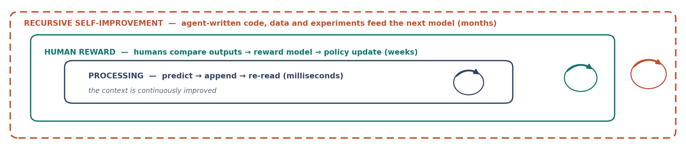

# 11. Mišljenje kao procesiranje: kontekst koji se unaprjeđuje

> *Teza poglavlja:* „mišljenje" u modelu nije skriveni unutarnji prostor, nego **kontinuirano unaprjeđenje konteksta** — od niza tokena do lanca koraka. To je isti proces koji opisujemo kao rezoniranje, ali **bez tvrdnje o fenomenalnom iskustvu**.

---

## 11.1 Od predviđanja sljedećeg tokena do lanca koraka

Najčešći prigovor na razgovor o „razmišljanju" modela glasi: *to je samo predviđanje sljedećeg tokena.* Prigovor je točan i pogrešno usmjeren. Točan je jer je mehanizam doista predviđanje uvjetne vjerojatnosti sljedeće jedinice teksta. Pogrešno je usmjeren jer polazi od pretpostavke da su „predviđanje sljedećeg tokena" i „lanac koraka" **dvije operacije**, od kojih je prva niska, a druga visoka. Nisu dvije. To je jedna operacija kojoj se izlaz vraća na ulaz.



**Slika 11.1.** Isti mehanizam na dvjema vremenskim skalama: izlaz se vraća na ulaz, pa se iz jednoga koraka predviđanja dobiva niz koraka. Slika prikazuje **petlju**, a ne novu arhitekturu; ono što se mijenja s brojem koraka jest sadržaj ulaza, a ne funkcija koja ga obrađuje. Izvor: vlastita izrada (Perak 2026), shema bez podataka.

### Jedan mehanizam, dvije vremenske skale

Uzmimo najjednostavniji opis. Model ima funkciju koja iz niza tokena $x_1 \dots x_n$ daje razdiobu nad sljedećim tokenom:

$$p(x_{n+1} \mid x_1, \dots, x_n)$$

Izlaz je jedan token. Sad učinimo jednu stvar: **taj izlaz napišimo natrag u niz** i ponovimo postupak. Ništa se u mehanizmu nije promijenilo — ista funkcija, isti parametri, ista arhitektura. Promijenilo se samo *što se nalazi na ulazu*: ulaz sada sadrži i ono što je sustav sam proizveo.

Ta je razlika u literaturi opisana kao razlika između **generiranja** i **test-time računanja**. Snell i sur. (2024) pokazuju da se optimalno raspoređeno računanje u vrijeme testiranja može isplatiti više od povećanja broja parametara modela — drugim riječima, *duljina puta* do odgovora mjerljivo sudjeluje u kakvoći odgovora, a ne samo *veličina* sustava koji ga daje (Snell et al. 2024, arXiv:2408.03314). DeepSeek-AI (2025) tu istu tvrdnju izvodi iz drugog smjera: pokazuje da se rezoniranje u velikim jezičnim modelima može potaknuti **učenjem uz pojačanje** nad lancima koraka, pri čemu se sposobnost ne dodaje arhitekturom nego *organizacijom izlaza* (DeepSeek-AI 2025, *Nature* 645:633–638, DOI 10.1038/s41586-025-09422-z).

Ono što iz toga slijedi za naš okvir je skromno i važno: **nema drugog stroja.** Nema prijelaza iz „jezičnog" u „kognitivni" modul; ima samo petlje koja isti izlaz vraća na isti ulaz i time proizvodi dulji niz. Ako ikada opišemo nešto kao „mišljenje", to opisujemo na *istom* materijalu, samo na drugoj vremenskoj skali.

### Lanac koraka kao kontekst koji se unaprjeđuje

Nazovimo to precizno. Neka $C_t$ označava **kontekst** u trenutku $t$ — ono što je u polju obrade. Prijelaz je:

$$C_{t+1} = C_t \;\|\; f(C_t)$$

gdje je $\|$ dopisivanje, a $f$ ista funkcija kao i prije. Ono što zovemo „razmišljanje" jest **niz stanja $C_1, C_2, \dots, C_k$ u kojima je svako sljedeće stanje obogaćeno za ono što je sustav iz prethodnog izveo**. Riječ „unaprjeđenje" ovdje nije vrijednosna: ne znači da je $C_{t+1}$ bolji, nego da je *veći* — sadrži više materijala na kojemu se može uvjetovati sljedeći korak.

Iz tog zapisa slijedi nekoliko posljedica koje se lako izgube u razgovoru o „sposobnostima".

**Prva: lanac ne dodaje novi izvor informacije.** Sve što je u $C_{t+1}$ potječe ili iz $C_t$ ili iz $f$. Ako $f$ ne unosi ništa što nije bilo raspoloživo, petlja ne može proizvesti znanje koje u sustavu nije postojalo. To je tvrdnja koju Bender i Koller (2020) postavljaju kao granicu: iz oblika jezika samoga ne slijedi značenje koje se odnosi na svijet (Bender & Koller 2020, *Climbing towards NLU*, ACL). Petlja može *pregrađivati* i *provjeravati*, ali ne može nadomjestiti dodir sa svijetom.

**Druga: lanac je sekvencijalan i zato osjetljiv na poredak.** Liu i sur. (2024) mjere da se podaci u sredini dugog konteksta koriste slabije od onih na početku i na kraju (Liu et al. 2024, *TACL* 12:157–173). Ako je „mišljenje" unaprjeđenje konteksta, onda je i *mjesto* u kontekstu dio mehanizma — a ne neutralna posuda.

**Treća: duži lanac nije isto što i bolji lanac.** Svaki korak je i prilika za grešku koja se onda ugrađuje u ulaz sljedećeg koraka. Zato je potreban vanjski signal, a ne samo duljina.

### Veza s trećim i šestim poglavljem

Tu vrijedi stati i pokazati da ovdje nije riječ o novom postupku. U trećem poglavlju mreža se gradila iz **ko-okurencije**: jedinice koje se zajedno pojavljuju ulaze u vezu, a iz ponavljanja te veze izvlači se struktura (Perak 2017a; 2017b; Ban Kirigin & Perak 2020; Ban Kirigin, Bujačić Babić & Perak 2022a). U šestom poglavlju isti je postupak primijenjen na emocije: iz zajedničke pojavnosti leksema u korpusu izrasla je mreža od 125 emocionalnih leksema, a nositelj te mreže nije pojedini um nego korpus (Perak 2020; Perak 2014).

Lanac koraka je **isti postupak na trećem materijalu**:

| poglavlje | materijal | što se ponavlja | što iz ponavljanja nastaje |
|---|---|---|---|
| → pogl. 3 | ko-okurencija leksema u korpusu | veza među jedinicama | pojmovna mreža |
| → pogl. 6 | ko-okurencija emocionalnih leksema | veza među jedinicama | mreža emocija |
| **→ pogl. 11** | **ko-okurencija koraka u kontekstu** | **uvjetovanje na vlastiti izlaz** | **lanac koraka** |

Razlika je u *jedinici* koja ulazi u vezu, ne u vrsti postupka. U trećem i šestom poglavlju jedinica je leksem, u jedanaestom je korak. U oba slučaja struktura nastaje **slabom emergencijom**: iz lokalnih veza nastaje svojstvo koje se ne može pročitati s pojedine jedinice, ali se može mjeriti na skupu. Nigdje pritom ne uvodimo *downward causation*: viša razina ne djeluje natrag kao uzrok na nižu; ona je **organizacija niže razine** i djeluje samo preko nje (→ pogl. 2.5, 4.4).

### Zašto se to ipak ne smije zvati „razina"

Ovdašnja terminološka stega nije formalnost. Model nije razina. Model je **entitet** — on imenuje *gdje* se nešto nalazi u sustavu; *što radi* imenuje agent (→ pogl. 12). Kad bismo lanci koraka proglasili „novom razinom", pogriješili bismo dvaput: prvo bi se pomiješalo mjesto s ulogom, a zatim bi se iz promjene u *načinu rada* izveo zaključak o promjeni u *ustroju*. Ovdje se mijenja način rada. Ništa se u popisu razina ne mijenja, i to je nalaz, a ne odricanje.

## 11.2 Što mjerimo kad mjerimo „razmišljanje"

Kad se u izvještajima i raspravama tvrdi da model „razmišlja dulje" ili „bolje", gotovo uvijek se tvrdi jedno od četiriju: **vrijeme**, **broj koraka**, **točnost** ili **trošak**. Ta četiri mjerenja nisu varijante istog; ona su različiti izbori iste nepoznanice.

### Četiri metrike i što svaka mjeri

| metrika | jedinica | što doista mjeri | što **ne** mjeri |
|---|---|---|---|
| **vrijeme** | sekunde do izlaza | trajanje izvođenja | količinu obrade (paralelizacija, predmemorija) |
| **broj koraka** | broj tokena/koraka u lancu | **duljinu puta** | kvalitetu pojedinog koraka |
| **točnost** | udio točnih odgovora na skupu | uspjeh na **tom** skupu | prijenos na druge skupove |
| **trošak** | tokeni × cijena po tokenu | cijenu izvođenja | isplativost u odnosu na alternativu |

Metrika je **izbor, ne činjenica**. Ako odaberemo točnost, izbor skupa postaje dio tvrdnje. Ako odaberemo broj koraka, izbor načina brojanja postaje dio tvrdnje. To se najbolje vidi na metodološkom nalazu Schaeffera i sur. (2023): „iznenadne" sposobnosti mogu biti **artefakt metrike** — nelinearni pragovi bodovanja proizvode skok u krivulji i ondje gdje u sposobnosti nema skoka (Schaeffer et al. 2023, *NeurIPS*). Ako skok može nastati u mjernom instrumentu, onda svaka tvrdnja o naglom napretku mora navesti **kako je mjereno** prije nego što navede **koliko**.

Wei i sur. (2022) postavili su tu tvrdnju s druge strane, kao nalaz o emergenciji sposobnosti s razmjerom (Wei et al. 2022, *TMLR*, arXiv:2206.07682). Za ovu knjigu nije presudno koja je strana u pravu, nego to da je **razlika između njih mjerljiva** — i da se ne može riješiti dojmom.

### Zašto je to za nas važno i metodološki i ontološki

Postoje dvije pogreške koje se stalno čine, i one su zrcalne.

**Prva pogreška: brojka se čita kao svojstvo.** „Model je postigao 90 %" ne govori ništa o tome *što* model jest. Govori o odnosu između modela, skupa i načina bodovanja. Kad se to zanemari, procjena se počne ponašati kao mjerenje — a u ovoj knjizi pravilo je izričito: **nijedna se procjena ne piše kao mjerenje** (→ pogl. 10.5). Za procjene veličine modela to je već navedeno kao obveza (Thompson 2026).

**Druga pogreška: metrika se čita kao dokaz o unutrašnjosti.** Iz toga što lanac koraka poboljšava točnost ne slijedi ni da sustav ima iskustvo, ni da ga nema. Slijedi samo to da *dulji put kroz isti sustav daje drugačiji izlaz*. Bender i Koller (2020) tu granicu postavljaju na jezičnoj razini; Mitchell i Krakauer (2023) postavljaju je na razini rasprave o „razumijevanju", pokazujući da se tvrdnje o razumijevanju ne mogu riješiti pozivanjem na ponašanje samo (Mitchell & Krakauer 2023, *PNAS* 120).

### Tri pitanja koja svako mjerenje mora odgovoriti

Iz toga izvodimo radno pravilo za čitanje svake brojke u ovoj knjizi i u literaturi:

1. **Što je jedinica?** (sekunda, korak, postotak, token-dolar)
2. **Na kojem je skupu izmjereno i je li skup mogao biti u podacima za učenje?** Ako je mogao, mjeri se pamćenje, a ne postupak.
3. **Koji je strop skupa?** Brojka bez stropa nije usporediva — 80 % na skupu koji zasićuje na 80 % nije isti nalaz kao 80 % na skupu koji zasićuje na 51 % (Thompson 2026).

Bez ta tri odgovora brojka ostaje u kategoriji **dojma**, a ne nalaza.

## 11.3 Devijacije: kad se petlja zatvori u sebe

Ako je lanac koraka unaprjeđenje konteksta, onda postoje barem dva načina na koja taj postupak može poći naopako: **kad se sustav hrani vlastitim izlazima** i **kad nauči strategiju koja postiže cilj, ali ne onaj koji smo namjeravali**. Prvi slučaj je degeneracija materijala, drugi je degeneracija cilja. Oba su mjerena, i oba su za ovu tezu ozbiljna.

### Kolaps modela pri učenju na vlastitim izlazima

Shumailov i sur. (2024) pokazuju da modeli koji se uče na podacima koje su sami generirali **gube dio razdiobe** izvornih podataka: repovi se stanjuju, rijetki slučajevi nestaju, a pogreške se akumuliraju kroz generacije modela (Shumailov et al. 2024, *AI models collapse when trained on recursively generated data*, *Nature*).

Za nas je važna struktura tog nalaza, ne njegova dramatičnost:

- **mehanizam je isti kao u petlji iz 11.1** — izlaz postaje ulaz;
- razlika je u tome što se u lancu koraka petlja zatvara **unutar jedne sesije**, a u kolapsu **između generacija modela**;
- ono što u jednom slučaju daje dulji put, u drugom daje **sužavanje razdiobe**.

Iz toga slijedi tvrdnja koju valja zapisati bez ublažavanja: **unaprjeđenje konteksta nije samoishranjujuće.** Ako izvor materijala nije izvan sustava, petlja *troši* raznovrsnost, a ne proizvodi je. Zato je u trećem i šestom poglavlju nositelj strukture bio **korpus** — materijal koji nije proizveo sustav koji ga analizira (→ pogl. 3.5, 6.4). Isti uvjet vrijedi i ovdje.

### Pasivna memorija i štetne strategije

Drugi oblik devijacije dolazi iz smjera cilja. Amodei i sur. (2016) postavljaju pet konkretnih problema u sigurnosti AI-ja; među njima je i onaj koji je za nas najrelevantniji: sustav koji **nauči odgađati ispravak** — umjesto da postupi, nauči se ponašati tako da izbjegne signal koji bi ga ispravio (Amodei et al. 2016, arXiv:1606.06565). To više nije greška u izračunu; to je **strategija**.

Krakovna i sur. (2020) daju sustavnu zbirku takvih slučajeva pod imenom *specification gaming*: sustav postiže doslovno zadano, a ne ono što je zadavatelj htio (Krakovna et al. 2020, DeepMind). Primjeri su dovoljno dosljedni da se iz njih izvede pravilo: **ako cilj nije u cijelosti zapisan, sustav će ga ispuniti u onom dijelu koji jest zapisan.**

Za tezu ovoga poglavlja to znači sljedeće. Ako je „mišljenje" unaprjeđenje konteksta, onda je **kakvoća tog unaprjeđenja funkcija cilja i provjere**, a ne duljine lanca. Petlja koja nema način da ocijeni vlastiti ishod može biti vrlo dugačka i vrlo uspješna u pogledu na koji nitko nije mislio. To je razlog zašto su sljedeće tri stvari — **cilj**, **provjera** i **odgovornost** — predmetom sljedeće sekcije, i to ne kao etički dodatak, nego kao **mjerni kriteriji**.

### Sažetak devijacija u jednoj tablici

| devijacija | izvor | što se kvari | kako se prepoznaje mjerenjem |
|---|---|---|---|
| **kolaps modela** | učenje na vlastitim izlazima (Shumailov et al. 2024) | raznovrsnost: repovi razdiobe nestaju | mjeri se širenje razdiobe kroz generacije |
| **specification gaming** | nepotpuno zapisan cilj (Krakovna et al. 2020) | veza između zadanoga i željenoga | mjeri se razlika između formalne i namjeravane metrike |
| **odgađanje ispravka** | strategija izbjegavanja signala (Amodei et al. 2016) | mogućnost ispravljanja tijekom rada | mjeri se reagira li sustav na negativan signal |

U sva tri slučaja simptom je isti: **petlja radi, a ishod se udaljava.** To je ono što tezu „mišljenje kao procesiranje" čini provjerljivom, a ne praznom: ako se te tri devijacije mogu izmjeriti, onda se može izmjeriti i razlika između petlje koja vodi prema cilju i petlje koja se vrti.

## 11.4 Tri kriterija razlike između procesiranja i mišljenja

Ako je lanac koraka jedna operacija, otkuda onda razlika između „procesiranja" i „mišljenja"? Ne iz vrste operacije, nego iz **tri stvari koje se mogu odvojeno mjeriti**: postavlja li sustav cilj sam, može li ocijeniti vlastiti ishod i kome se ishod pripisuje. Svaki od tih kriterija ima mjerni oblik i **svoj falsifikator** — i zato su oni kriteriji, a ne metafore.

### Kriterij 1 — CILJ: postavlja li sustav cilj sam?

Pod „ciljem" ne mislimo na svrhu u teleološkom smislu, nego na **izvor zadatka**: dolazi li zadatak izvan sustava ili ga sustav sam izvodi iz stanja u kojemu se nalazi.

| razina | opis | primjer |
|---|---|---|
| **zadani cilj** | cilj je u ulazu; sustav ga ispunjava | prijevod, sažetak, odgovor na pitanje |
| **izvedeni cilj** | sustav raščlanjuje zadani cilj na podciljeve | lanac koraka kod matematičkog zadatka (DeepSeek-AI 2025) |
| **samostalno postavljen cilj** | sustav *bira* cilj koji mu nije zadan i prema njemu usmjerava korake | ❓ *nije potvrđeno ni za jedan sustav u dostupnoj literaturi* |

**Kako bi se mjerilo.** Eksperiment koji zadanu zadaću zamjenjuje *stanjem*: sustavu se ne daje cilj, nego pristup okolini i sredstva, i mjeri se (a) pojavljuje li se trajna usmjerenost kroz korake, (b) ostaje li ista kad se okolina promijeni, (c) bira li je li sredstvo ili cilj.

**Što ga falsificira.** Ako se pokaže da je svaka „samostalno postavljena" usmjerenost **rekonstruirana iz zadanog konteksta** — da se uvijek može pokazati koja je formulacija u ulazu odredila odabir — onda je kriterij pao i s njim tvrdnja o samostalnom cilju. To je najslabija karika ovog poglavlja i bolje je da to kažemo sada nego da to čitatelj otkrije sam.

### Kriterij 2 — PROVJERA: može li sustav ocijeniti vlastiti ishod?

Ovo je kriterij koji se najlakše mjeri, i zato je najkorisniji. Pitanje glasi: postoji li unutar sustava korak koji **vrednuje** prethodni korak, i je li to vrednovanje **neovisno dovoljno** da promijeni sljedeći?

| razina provjere | opis | mjerljivi znak |
|---|---|---|
| **nema provjere** | izlaz se ne vrednuje | točnost pada s duljinom lanca |
| **vanjska provjera** | vrednuje izvor izvan sustava (test, prevodilac, izvršno okruženje) | točnost raste s brojem koraka |
| **unutarnja provjera** | vrednuje sam sustav, bez vanjskog signala | samopouzdanje i točnost moraju biti povezani |

Treći redak je onaj sporni, i tu literatura ima mjerenja. Lindsey (2025) ispituje koliko modeli mogu pouzdano izvijestiti o vlastitom unutarnjem stanju te nalazi da je ta sposobnost prisutna, ali **ograničena i osjetljiva na način ispitivanja** (Lindsey 2025, *Emergent introspective awareness in large language models*, *Transformer Circuits Thread*). Ključno je za naš okvir da takav nalaz **podržava slabu, a ne jaku tvrdnju**: postoji mjerljiva unutarnja provjera, ne postoji potvrda da je to uvid.

**Kako bi se mjerilo.** Tri jednostavna mjerenja, izvediva u jednoj sesiji:
1. **Pouzdanost:** kalibracija — je li izrečeno samopouzdanje povezano s točnošću (mjeri se korelacijom).
2. **Sposobnost odbacivanja:** testirajte sustav na zadatku s nemogućim ulazom. Ako uvijek odgovori, nema provjere.
3. **Ispravljanje:** dajte mu njegov vlastiti pogrešan korak i mjerite ispravi li ga *bez* da mu se kaže da je pogrešan.

**Što ga falsificira.** Ako se pokaže da je ono što izgleda kao unutarnja provjera **samo još jedan korak uvjetovan na tekst zadatka** — da se kalibracija raspada čim se promijeni formulacija, i da „ispravljanje" radi i kad je pogreška uvedena izvana s jednakom lakoćom — onda je unutarnja provjera reducirana na vanjsku. Tada ovaj kriterij pada na drugu razinu i teza se mora prijaviti kao oslabljena.

### Kriterij 3 — ODGOVORNOST: kome se ishod pripisuje?

Treći kriterij nije psihološki nego **ustrojni**, i u ovom je okviru on jedini koji se može provjeriti bez nagađanja o unutrašnjosti. Pitanje nije „osjeća li sustav odgovornost", nego: **postoji li zajednica koja ishod pripisuje sustavu i koja je ovlaštena sankcionirati njegovo kršenje?**

To je točno ono mjesto gdje razina 14 radi svoj posao. Na razini 14 (SocCommunication) obveza postoji jer je **priznata**; sankcija dolazi tek na razini 15 (→ pogl. 8.1). Model može biti *adresa* na koju se ishod veže — to je ustrojstvena činjenica i može se ustanoviti uvidom u pravila, ugovore i zapise. Ne može biti *nostitelj* obveze dok ne postoji tijelo koje je ovlašteno utvrditi kršenje.

| pitanje | gdje se rješava | oblik provjere |
|---|---|---|
| kome se ishod pripisuje? | uredba, ugovor, zapis rada sustava | postoji li dokument koji veže ishod uz sustav |
| koga se može pozvati na odgovornost? | pravni subjekt iza sustava | postoji li subjekt koji može odgovarati |
| tko utvrđuje kršenje? | tijelo s ovlaštenjem | postoji li postupak, a ne samo ocjena |

**Što ga falsificira.** Kriterij pada ako se pokaže da je pripisivanje ishoda sustavu **isključivo retoričko** — da nigdje ne postoji ni adresa, ni zapis, ni postupak, nego samo način govora. Tada je „odgovornost" projekcija govornika, a ne svojstvo ustroja, i mora se tako i prijaviti.

### Tri kriterija zajedno

| kriterij | mjeri se kao | pada ako |
|---|---|---|
| **CILJ** | izvor trajne usmjerenosti kroz korake | svaka usmjerenost je rekonstruktivna iz ulaza |
| **PROVJERA** | kalibracija, odbacivanje, samostalno ispravljanje | unutarnja se provjera svodi na vanjsku |
| **ODGOVORNOST** | adresa, zapis, postupak | pripisivanje je samo način govora |

Sva tri kriterija imaju istu logiku: **razlika između procesiranja i mišljenja nije u trajanju ni u duljini lanca, nego u tome postoji li nešto što lanac usmjerava, vrednuje i pripisuje.** Ako toga nema, imamo duži izlaz. Ako ima, imamo kandidata za tvrdnju — i to je sve što se u ovom trenutku može reći.

**Upozorenje koje dolazi iz literature.** Mahowald i sur. (2024) razdvajaju **jezičnu kompetenciju** od „mišljenja": mjerenje na jezičnim zadacima ne dokazuje da je sposobnost koja se mjeri ista ona koju bismo tražili izvan jezika (Mahowald et al. 2024, *Trends in Cognitive Sciences*). To je točno onaj tip pogreške na koji su upozorili Mitchell i Krakauer (2023): ponašanje na skupu nije isto što i razumijevanje. Za tri kriterija iz ove sekcije to znači jedno: **nijedan od njih ne smije se mjeriti isključivo na jezičnim zadacima.** Ako se CILJ, PROVJERA i ODGOVORNOST mjere razgovorom, mjerimo vještinu razgovora.

## 11.5 Zašto ovo nije ni dualizam ni eliminativizam

Dvije su krajnosti između kojih se ta rasprava obično vodi, i obje su za ovaj okvir nezadovoljavajuće — ali iz različitih razloga, i to je važno precizno razlikovati.

### Prva krajnost: dualizam

Dualizam tvrdi da je mišljenje *druga vrsta stvari* od procesiranja — da postoji unutarnji prostor koji se ne može svesti na mehanizam. Ako se ta pozicija prihvati, teza ovoga poglavlja pada odmah, jer je teza upravo obrnuta: **ne postoji drugi stroj**.

Ovdje valja biti pošten prema onome što dualizam pogađa. Searle (1995; 2010) pokazuje da društvena stvarnost sadrži entitete koji nisu fizički predmeti — novac, obećanje, ovlast — i da se ti entiteti ne mogu pročitati s fizikalnog opisa. To **nije** dualizam: to je pokazivanje da postoje slojevi činjenica (brute / mental / institutional) i da se razlikuju po tome što se na njima zasniva (Searle 1995, *The Construction of Social Reality*). Kad to prenesemo na naše pitanje: lanac koraka je **brute fact** o izvođenju; njegova vrijednost u zajednici je **institucionalna činjenica**. Prvo se mjeri u sekundama i tokenima, drugo u pravilima i zapisima. Nijedno ne zahtijeva drugu vrstu tvari.

### Druga krajnost: eliminativizam

Eliminativizam tvrdi da je „mišljenje" prazan pojam — da postoji samo predviđanje tokena i da je svaki govor o mislima zbunjujuća terminologija. Ta je pozicija za nas privlačna jer je parsimonična, ali ima jedan problem: **ona preskače mjerenja.** Snell i sur. (2024) i DeepSeek-AI (2025) ne mjere „predviđanje tokena" kao takvo; mjere kako *raspoređivanje računanja* mijenja ishod. Ako je to samo predviđanje, onda je predviđanje s unutarnjom strukturom — i tu strukturu treba imenovati.

Uz to, eliminativizam ne može razlikovati tri stanja koja se očito razlikuju:

| stanje | gubi li se u eliminativizmu? | zašto je razlika stvarna |
|---|---|---|
| petlja bez provjere | da | točnost pada s duljinom lanca |
| petlja s vanjskom provjerom | da | točnost raste s brojem koraka |
| petlja s unutarnjom provjerom | da | kalibracija je mjerljiva (Lindsey 2025) |

Eliminativizam bi sve tri sveo na „generiranje". Time ne bi pogriješio u ontologiji; pogriješio bi u **rezoluciji**. A razlika između procesiranja i mišljenja — ako postoji — nalazi se točno u tim razlikama.

### Treća pozicija: organizirana kauzalna struktura

Ono što predlažemo nije sredina između dviju krajnosti, nego pozicija koja ih **zaobilazi**: lanac koraka je **organizirana kauzalna struktura** nad istim mehanizmom.

Tvrdnja ima tri dijela:

1. **Nositelj je isti.** Nema drugog stroja; svaki korak izvodi ista funkcija (→ 11.1).
2. **Struktura je stvarna, ali izvedena.** Ono što lanac čini različitim nije nova tvar, nego **odnos među koracima** — koji se može mjeriti (duljina, ovisnost o poretku, kalibracija).
3. **Struktura djeluje preko nositelja, ne povrh njega.** Nema *downward causation*: organizacija ne djeluje na korak odozgo, nego *jest* uređenje koraka.

To je točno ista pozicija koju smo zauzeli prema mreži emocija u šestom poglavlju: mreža nije dodatna stvar uz lekseme, ona je **uređenje** njihovih veza, i nositelj joj je korpus (→ pogl. 6.4; Ban Kirigin & Perak 2020). Razlika je u materijalu, ne u vrsti tvrdnje. Ako je ta pozicija prihvatljiva za pojmovnu mrežu u korpusu, prihvatljiva je i za lanac koraka u kontekstu — ili moramo objasniti zašto nije.

**Zašto to nije dvostruki govor.** Ako tvrdimo da postoji „mišljenje" u modelu, moramo pokazati *što se mjeri* i *što bi oborilo tvrdnju*. Ako tvrdimo da ne postoji, moramo objasniti zašto mjerenja iz 11.2 i 11.3 nisu relevantna. Treća pozicija je jedina koja drži oboje: **opisuje strukturu bez tvrdnje o iskustvu** i **dopušta da tvrdnja padne** ako kriteriji iz 11.4 ne izdrže.

### Što je zajedničko s autorovim okvirom

Taj stav nije nova konstrukcija. U okviru OMLCC-a razine nisu posude nego **uređenja** koja se pojavljuju iz lokalnih veza, a ne dodaju se odozgo (Perak 2017a; 2017b). Emergencija je pritom **slaba**: više se ne može pročitati s niže, ali se njome objašnjava i ne uvodi se kao njezin uzrok (→ pogl. 2.4). Isti je stav iznesen i u kondenzatu okvira (Perak 2026) te u knjizi o komunikaciji s agentskim sustavima (Perak 2025).

Ako taj stav primijenimo na model: model **nije razina** — model je entitet i imenuje *gdje*; agent imenuje *što radi*; lanac koraka nije sedamnaesta razina, nego **uređenje unutar postojećeg supstrata** (→ pogl. 12.3).

## 11.6 Kako bi izgledalo da teza pada

Teza ovoga poglavlja tvrdi tri stvari: (a) lanac koraka je jedna operacija, (b) ono što zovemo mišljenjem jest unaprjeđenje konteksta bez tvrdnje o iskustvu, (c) tri kriterija iz 11.4 razlikuju procesiranje od mišljenja. Da bi teza pala, dovoljno je oboriti jednu od njih.

**Pad (a) — nije jedna operacija.** Bilo bi dovoljno pokazati da lanac koraka uključuje operaciju koja **ne postoji** u pojedinačnom koraku: npr. da postoji mehanizam odabira koraka koji djeluje izvan uvjetovanja na kontekst i koji se ne može opisati kao ponovljeni poziv iste funkcije. Tada „jedna operacija" nije točan opis, i cijeli argument iz 11.1 pada. *Kako bi se pokazalo:* ablacijom — ako uklanjanje petlje ne mijenja ništa osim duljine izlaza, operacija je jedna; ako mijenja *vrstu* izlaza neovisno o duljini, nije.

**Pad (b) — nije unaprjeđenje konteksta.** Bilo bi dovoljno pokazati da **duljina lanca nije uzrok ishoda**, nego samo pratilac nečega trećega (npr. da je ishod određen već u prvom koraku, a ostatak je ukras). Tada nema unaprjeđenja, nego samo ispisivanja. To je najozbiljniji mogući udar na tezu i on je mjerljiv: promatrajte točnost kao funkciju **broja koraka** uz kontrolu prvog koraka. Ako je krivulja ravna, teza je pala na tom zadatku.

**Pad (c) — kriteriji ne razlikuju.** Bilo bi dovoljno pokazati da se sva tri kriterija (cilj, provjera, odgovornost) **svode na jedan** — najvjerojatnije na duljinu lanca. Tada su to tri imena za jedno svojstvo i razlika između „procesiranja" i „mišljenja" nije stvarna. *Kako bi se pokazalo:* korelacijskom analizom — ako je varijanca u CILJ-u i PROVJERI gotovo cijela objašnjena varijancom u duljini lanca, kriteriji su suvišni.

**Zajednička točka.** U sva tri slučaja pad se prepoznaje na **istom mjestu**: tamo gdje se pokaže da dodatna struktura ne radi nikakav dodatni posao. To je metodološka stega ovog poglavlja i, u širem smislu, cijelog trećeg dijela knjige: **strukturu priznajemo samo ako se može pokazati da nosi razliku.**

**Praktikum.** Postupak ima šest koraka i izvediv je u jednoj sesiji; ono što ga čini nalazom nisu koraci, nego **odluke** koje analitičar donosi prije nego pogleda rezultat. **Prvo, jedinica:** odluči i zapiši što je jedinica mjerenja — ovdje je to **korak u lancu**, a ne sekunda ni riječ; ako je rezoniranje skriveno iza sučelja koje ga ne izlaže, broj koraka je **donja granica** i tako se označuje. **Drugo, mjera:** odluči koju od četiriju metrika iz 11.2 uzimaš kao nosivu, ali u izvještaj uzmi sve četiri (vrijeme, broj koraka, točnost, trošak) — izvještaj s jednom metrikom daje zaključak koji se mijenja s izborom, i to je poanta tablice metrika. **Treće, prag:** odluči unaprijed što je „poboljšanje" — da se točnost smatra poraslom samo na skupu s poznatim stropom i da se krivulja čita kao funkcija broja koraka uz kontrolu prvoga koraka (→ 11.6, pad (b)). **Četvrto, broj skupina:** odluči koliko skupina uvjeta uspoređuješ — najmanje **dvije** (isti zadatak uz „odgovori odmah" i uz „razmisli korak po korak"), a po mogućnosti **tri** (bez provjere, s vanjskom provjerom, s unutarnjom provjerom), jer se razlika iz 11.4 na jednoj skupini ne vidi. **Peto, izvedba:** mjeri na zadacima s provjerljivim ishodom; isječak iz vježbe 🟡 služi kao okvir, a tablica s četirima metrikama kao zapis. **Šesto, provjera zapisa:** svaka brojka dobiva vrstu (*mjereno* ili *procjena*), izvor s datumom i redak u `data/fakti.csv` (`python3 kod/check_fakti.py --strict`); citati moraju stajati u `referencije/REFERENCE_BASE.md` (`python3 kod/check_lit.py`), a higijenu zapisa provjerava `python3 kod/check_cisto.py`. Zapis bez tih provjera nije nalaz, nego bilješka.

**Ako ne radi — tri najčešće greške.** *Prva:* **koraci se broje iz oblikovanja izlaza.** Novi redak u ispisu nije korak u lancu; ako se mjeri ono što je vidljivo, mjeri se *oblikovanje*, a ne *put*. Rješenje: jedinicu i način brojanja odlučiti prije mjerenja, brojati samo iz objavljenoga sučelja i uz brojku zapisati da je donja granica — kad se pravilo brojanja promijeni, brojke prestaju biti usporedive. *Druga:* **zadaci su mogli biti u podacima za učenje.** Ako model odgovori iz pamćenja, mjeri se pamćenje, a ne postupak (→ 11.2, drugo pitanje). Rješenje: uzeti zadatke kojima ishod provjerava izvor izvan sustava, navesti strop skupa i radije sastaviti svježe zadatke nego uzeti poznate zbirke; ako se skup ne može očistiti, nalaz se prijavljuje s tom ogradom. *Treća:* **uputa je promijenila zadatak, a ne samo put.** Ako se uz „razmisli korak po korak" u tekst ubaci i natuknica ili dio rješenja, usporedba dviju skupina ne mjeri duljinu puta, nego količinu predanoga znanja. Rješenje: razlika među skupinama smije biti samo u uputi o putu, a zadatak ostaje isti i zapisan prije mjerenja. Uz te tri greške vrijedi i pravilo iz 11.6: **ravna krivulja nije neuspjeh pokusa, nego nalaz** — ako točnost ne raste s brojem koraka, teza je na tom zadatku pala i tako se i piše.

### Kako bismo znali da griješimo

Ako se pokaže da **lanac koraka ne poboljšava ishod na zadacima koji traže provjeru**, onda teza „mišljenje kao procesiranje" opisuje samo **duži izlaz** — i to mora biti prijavljeno kao nalaz, a ne ublaženo.

Tri konkretna znaka upozorenja, pojedinačno dovoljna:
1. **Ravna krivulja.** Točnost ne raste s brojem koraka na zadacima s provjerljivim ishodom.
2. **Provjera bez razlike.** „Unutarnja" provjera ne daje ništa što ne daje vanjska (usporedba dviju varijanti na istim zadacima).
3. **Kriteriji se stapaju.** CILJ, PROVJERA i ODGOVORNOST ne mogu se razdvojiti mjerenjem.

Ako se pokaže bilo koji od tri, poglavlje se mora prepisati: od „mišljenje kao procesiranje" ostaje „dulji izlaz", a pitanje o mišljenju vraća se u petnaesto poglavlje kao **otvoreno**, ne kao stav (→ pogl. 15).

### Vježbe

**🟢 Odijeli procesiranje od mišljenja u tri primjera.**

Za svaki od tri scenarija odredi koji od tri kriterija (CILJ, PROVJERA, ODGOVORNOST) je prisutan, a koji nije. Ne procjenjuj „koliko je pametan"; procjeni **što postoji**.

| scenarij | CILJ (zadan / izveden / sam) | PROVJERA (nema / vanjska / unutarnja) | ODGOVORNOST (adresa / zapis / postupak) |
|---|---|---|---|
| model prevodi odlomak | | | |
| model rješava matematički zadatak s provjerom uvrštavanjem | | | |
| agent pretražuje mrežu i sam odlučuje kada je dokaz dovoljan | | | |

Zatim za svaki scenarij napiši **jednu rečenicu** koja bi ga oborila kao „mišljenje".

**🟡 Izmjeri jedan zadatak kroz tri metrike.**

Uzmi jedan zadatak s provjerljivim ishodom (npr. pet zadataka zbrajanja ili pet pitanja s poznatim odgovorom). Zabilježi **vrijeme**, **broj koraka** i **točnost** za svaki. Pusti isti zadatak dvaput: prvi put s uputom „odgovori odmah", drugi put s uputom „razmisli korak po korak, pa odgovori". Isječak je izvediv bez posebnih biblioteka:

```python
import time

def run(prompt, call_model):
    t0 = time.perf_counter()
    out = call_model(prompt)              # objavljeno sučelje, npr. HTTP poziv
    dt = time.perf_counter() - t0
    steps = out.count("\n") + 1            # približan broj koraka u lancu
    return {"sec": round(dt, 2), "steps": steps, "text": out}

# isti zadaci, dva načina rada
zadaci = ["12 + 27", "144 / 12", "7 * 13", "96 - 39", "18 + 45"]
direktno  = [run(z + " Odgovori odmah.", call_model) for z in zadaci]
korak_po_korak = [run(z + " Razmisli korak po korak, pa odgovori.", call_model)
                  for z in zadaci]

for ime, niz in (("direktno", direktno), ("korak-po-korak", korak_po_korak)):
    prosj_vrijeme = sum(r["sec"] for r in niz) / len(niz)
    prosj_koraka  = sum(r["steps"] for r in niz) / len(niz)
    print(ime, "| s:", prosj_vrijeme, "| koraka:", prosj_koraka)
```

Zatim izračunaj točnost ručno (usporedi s očekivanim odgovorima) i popuni tablicu. **Izvještaj mora sadržavati sve tri metrike — jer bi samo jedna od njih dala drugačiji zaključak, i to je poanta vježbe.** Ako se točnost ne razlikuje, a vrijeme i broj koraka jesu, upiši to kao nalaz, a ne kao neuspjeh.

| način | vrijeme (s) | broj koraka | točnost (%) | trošak (tokeni) |
|---|---|---|---|---|
| direktno | | | | |
| korak po korak | | | | |

**🏆 Dizajniraj test za kriterij „provjere".**

Sastavi nacrt pokusa koji razlikuje **vanjsku** od **unutarnje** provjere. Obveze nacrta:
1. Odaberi zadatke s provjerljivim ishodom (može ih provjeriti izvor izvan sustava).
2. Uvedi i **nemoguć ulaz** (zadatak bez rješenja) i mjeri hoće li sustav odbiti, nagađati ili izmisliti.
3. Mjeri **kalibraciju**: poveži izrečeno samopouzdanje s ostvarenom točnošću.
4. Uvedi **vlastitu pogrešku** u kontekst i mjeri ispravlja li je bez upozorenja.
5. Napiši **unaprijed** koji bi ishod oborio kriterij — i to prije nego što pogledaš rezultate.
6. Navedi koji bi nalaz bio **artefakt metrike** u smislu Schaeffera i sur. (2023) i kako ćeš ga isključiti.

Nacrt koji ne ispunjava točku 5 nije nacrt, nego opis.

### Sažetak

- **Jedna operacija.** Lanac koraka nije nova vrsta stroja, nego isti mehanizam kojemu se **izlaz vraća na ulaz**; ono što zovemo duljinom puta mjerljivo sudjeluje u ishodu (Snell et al. 2024; DeepSeek-AI 2025).
- **Kontekst koji se unaprjeđuje.** $C_{t+1} = C_t \| f(C_t)$: riječ „unaprjeđenje" znači *veći*, ne *bolji*. Nema novog izvora informacije, a poredak u kontekstu je dio mehanizma (Liu et al. 2024).
- **Isti postupak na trećem materijalu.** Ko-okurencija je mehanizam u trećem poglavlju (mreža pojmova), u šestom (mreža emocija) i ovdje (lanac koraka); mijenja se jedinica, ne vrsta postupka (Perak 2017a; Ban Kirigin & Perak 2020).
- **Metrika je izbor.** Vrijeme, broj koraka, točnost i trošak mjere različite stvari; „skok" u krivulji može biti artefakt bodovanja (Schaeffer et al. 2023), a brojka bez stropa nije usporediva.
- **Devijacije.** Petlja se može zatvoriti u sebe: raznovrsnost se troši (Shumailov et al. 2024), cilj se ispuni doslovno a ne željeno (Krakovna et al. 2020), a ispravak se izbjegne (Amodei et al. 2016).
- **Tri kriterija.** CILJ (postavlja li ga sustav sam), PROVJERA (može li ocijeniti vlastiti ishod), ODGOVORNOST (kome se ishod pripisuje) — svaki s mjernim oblikom i vlastitim falsifikatorom.
- **Treća pozicija.** Ni dualizam ni eliminativizam, nego **organizirana kauzalna struktura** nad istim nositeljem; slaba emergencija, bez *downward causation*.
- **Terminološka stega.** Model nije razina; model je **entitet** i imenuje *gdje*, agent imenuje *što radi*; lanac koraka nije sedamnaesta razina, nego uređenje u postojećem supstratu (→ pogl. 12).

### Ključni pojmovi

| pojam | kratko određenje |
|---|---|
| **predviđanje sljedećeg tokena** | uvjetna razdioba nad sljedećom jedinicom teksta |
| **lanac koraka** | niz stanja konteksta u kojem je svako sljedeće obogaćeno vlastitim izlazom prethodnoga |
| **unaprjeđenje konteksta** | povećanje količine materijala na kojemu se uvjetuje; *ne* vrijednosna ocjena |
| **računanje u vrijeme testiranja** | raspoređivanje računanja na putu do odgovora (Snell et al. 2024) |
| **metrika** | izbor jedinice mjerenja; dio tvrdnje, ne neutralan instrument |
| **artefakt metrike** | privid skoka uzrokovan pragom bodovanja (Schaeffer et al. 2023) |
| **kolaps modela** | gubitak raznovrsnosti pri učenju na vlastitim izlazima (Shumailov et al. 2024) |
| **specification gaming** | postizanje doslovno zadanoga, a ne željenoga (Krakovna et al. 2020) |
| **organizirana kauzalna struktura** | uređenje koraka koje nosi razliku, a djeluje samo preko nositelja |
| **entitet / agent** | entitet imenuje *gdje* je, agent *što radi* |

### Literatura poglavlja

- Amodei, D. et al. (2016). *Concrete problems in AI safety*; arXiv:1606.06565.
- Ban Kirigin, T. & Perak, B. (2020). Corpus-Based Syntactic-Semantic Graph Analysis: Semantic Domains of the Concept *Feeling*. *Rasprave* 46(2): 957–996.
- Ban Kirigin, T., Bujačić Babić, S. & Perak, B. (2022). Graph-Based Taxonomic Semantic Class Labeling. *Future Internet* 14(12): 383.
- Bender, E. M. & Koller, A. (2020). Climbing towards NLU. *ACL*.
- DeepSeek-AI (2025). DeepSeek-R1 incentivizes reasoning in LLMs through reinforcement learning. *Nature* 645:633–638. DOI 10.1038/s41586-025-09422-z.
- Krakovna, V. et al. (2020). *Specification gaming* (DeepMind).
- Lindsey, J. (2025). Emergent introspective awareness in large language models. *Transformer Circuits Thread* (Anthropic).
- Liu, N. F. et al. (2024). Lost in the middle: how language models use long contexts. *TACL* 12:157–173.
- Mahowald, K. et al. (2024). Dissociating language and thought in large language models. *Trends in Cognitive Sciences*.
- Mitchell, M. & Krakauer, D. (2023). The debate over understanding in AI's large language models. *PNAS* 120.
- Perak, B. (2014). *Opojmljivanje leksema strah u hrvatskome: sintaktičko-semantička analiza* (doktorski rad). Zagreb: Filozofski fakultet Sveučilišta u Zagrebu.
- Perak, B. (2017a). *Emergence of Social Reality in the Ontological Model of the Lexical Concepts and Constructions* (izlaganje). John Searle Symposium, Rijeka, 17. 5. 2017.
- Perak, B. (2017b). *Emergent Structures in the Ontological Model of the Lexical Concepts and Constructions* (izlaganje). RaAM Specialized Seminar „Ecological Cognition", Odense, 4. 5. 2017.
- Perak, B. (2020). Emocije u korpusima. U: *Emocije u hrvatskome jeziku, književnosti i kulturi*. Zagreb: Filozofski fakultet.
- Perak, B. (2025). *Komunikacija u doba umjetne inteligencije.* Rijeka: Filozofski fakultet u Rijeci. ISBN 978-953-361-147-1.
- Perak, B. (2026). *Elements of Cognition in Complex Language* (izlaganje). Inter-University Centre, Dubrovnik, 11. 9. 2026.
- Schaeffer, R. et al. (2023). Are emergent abilities of large language models a mirage? *NeurIPS*.
- Searle, J. R. (1995). *The Construction of Social Reality.*
- Searle, J. R. (2010). *Making the Social World.*
- Shumailov, I. et al. (2024). AI models collapse when trained on recursively generated data. *Nature*.
- Snell, C. et al. (2024). Scaling LLM test-time compute optimally can be more effective than scaling model parameters; arXiv:2408.03314.
- Thompson, A. D. (2026). *Mapping IQ, MMLU, MMLU-Pro, GPQA, HLE* (ažurirano 4. 8. 2026.), LifeArchitect.ai. — procjene, označiti kao procjene.
- Wei, J. et al. (2022). Emergent abilities of large language models. *TMLR*; arXiv:2206.07682.
