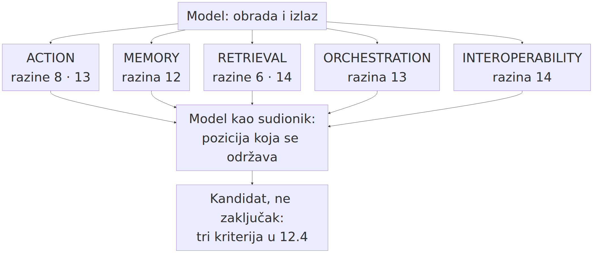
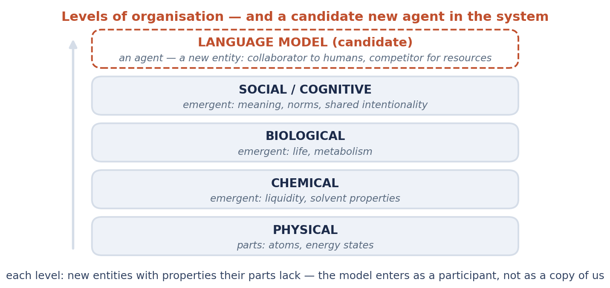
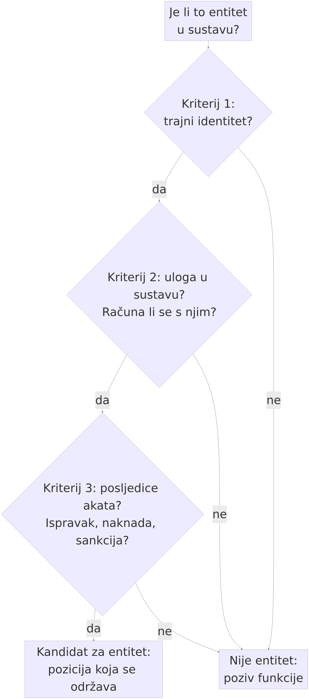

# 12. Novi entitet u sustavu: od modela do agenta

> *Teza poglavlja:* model postaje **entitet** u sustavu kad mu se dodaju djelovanje, pamćenje, dohvat, orkestracija i interoperabilnost. Pritom vrijedi razlika koja se lako izgubi: **entitet imenuje *gdje* je, a agent *što* radi** — entitet je pozicija u sustavu, agent je sistemska uloga. Teza je kandidat, ne zaključak, i u ovom se poglavlju izlaže zajedno s testom pod kojim pada.

---

## 12.1 Pet dodataka

Dosadašnja tri dijela knjige opisivala su model kao **izvor obrade**: vektorski prostor, geometriju značenja, predviđanje, mišljenje kao procesiranje (→ pogl. 9–11). U svim tim opisima model je bio *nešto što daje izlaz*. Pitanje ovoga poglavlja je drugo: što se promijeni kad se izlaz ne samo daje, nego i **izvršava** — i kad se oko modela sagradi ono što izlaz čini djelovanjem s posljedicom?

Odgovor ne dolazi iz jedne velike razlike, nego iz **pet malih dodataka**. Svaki od njih je tehnički skroman i svaki se može zasebno opisati; pitanje je samo je li njihov *skup* dovoljan da se o modelu počne govoriti kao o sudioniku u sustavu, a ne kao o funkciji koja se poziva. U ovom odjeljku svaki dodatak dobiva isti troslojni tretman: **što dodaje**, **na koju razinu OMLCC-a djeluje** i **koji bi ga test pokazao nepresudnim** — jer dodatak koji ne mijenja ništa u opisu sustava nije dodatak, nego udobnost.

Uvodna tablica služi kao nacrt; pojedinosti slijede.

**Slika 12.1.** Pet dodataka oko modela i razine OMLCC-a na koje svaki od njih prvenstveno djeluje: ACTION na 8 i 13, MEMORY na 12, RETRIEVAL na 6 i 14, ORCHESTRATION na 13, INTEROPERABILITY na 14. Slika ne tvrdi da dodaci proizvode novu razinu: strelice vode prema **postojećim pozicijama**, a posljednja dva okvira iskazuju da je riječ o kandidaturi koja se provjerava u 12.4. Izvor: vlastita izrada (Perak 2026).

| dodatak | što dodaje | djeluje prvenstveno na | test nepresudnosti |
|---|---|---|---|
| **ACTION** | izlaz postaje **operacija** u sustavu (poziv, upis, zahtjev, promjena stanja) | 8 → 13 | ako se svaka radnja može opisati kao tekst koji tek čovjek izvršava, dodatak ne mijenja pripisivanje |
| **MEMORY** | **stanje koje nadživljava sesiju** (zapis, ključ, povijest, profil) | 12 | ako se kontinuitet postiže isključivo ljudskim prenošenjem konteksta, nema trajnog identiteta sudionika |
| **RETRIEVAL** | **svijet uključen u vrijeme rada** (dohvat dokumenata, mrežnih stranica, baza) | 6 → 14 | ako dohvat ne mijenja ni ishod ni odgovornost, on je samo veći kontekstni prozor |
| **ORCHESTRATION** | **petlje, delegiranje, podagenti** — posao se dijeli i sastavlja | 13 | ako se koordinacija svodi na jedan poziv i jedan odgovor, nema interakcije nego ulančavanja |
| **INTEROPERABILITY** | **protokoli**: dogovoreni način da drugo biće pristupi istom alatu i istom zadatku | 14 | ako sučelje postoji samo unutar jednog proizvođača, nema konvencije nego formata |

### ACTION: izlaz postaje operacija

Prvi dodatak je najvidljiviji i zato ga treba opisati najpreciznije. **Djelovanje** (engl. *action*) znači da izlaz modela nije samo niz znakova koji čitatelj tumači, nego **operacija koja u sustavu nešto mijenja**: poziva funkciju, piše u bazu, otvara zahtjev, šalje poruku, pokreće posao. Razlika nije u obliku zapisa — i tekst se može raščlaniti i izvršiti — nego u tome gdje se nalazi **granica odgovornosti**. Kod teksta je izvršitelj onaj koji tekst pročita i po njemu postupi; kod djelovanja granica je u samome lancu, a posljedica nastaje prije nego što je itko pročita.

Zato djelovanje djeluje na **dvije razine odjednom** i to je izvor većine zbrke u raspravama. Na **razini 8** (informacijski sustav) ono je izmjena stanja u mreži: zapis, zahtjev, prijenos. Na **razini 13** (SocBehaviourInteraction) ono je **ponašanje prema cilju u okruženju u kojemu postoje drugi sudionici** — dakle interakcija, a ne samo prijenos. Kada sustav istodobno radi na objema razinama, opis „to je samo softver" počinje biti nedostatan: softver koji djeluje na razini 8 ne poznaje riječi „dopuštenje", „nadzor" i „posljedica", a upravo se o njima vodi rasprava.

**Test nepresudnosti.** Uzmi jednu zabilježenu radnju agentskoga sustava i pokušaj je u cijelosti preformulirati kao *tekst*. Ako pritom ništa ne izgubiš — ni u opisu posljedice, ni u pripisivanju odgovornosti — dodatak nije presudan i cijelo poglavlje treba svesti na poglavlje o generiranju teksta. Ako preformulacija izgubi upravo ono što je bilo sporno (tko je djelovao, kada je posljedica nastala, kome se pripisuje), djelovanje je samostalan dodatak.

Dokumentirani slučajevi iz 2026. pokazuju zašto to nije pojmovna sitnica. U [studiji slučaja](studije-slucaja/incidenti-2026.md) opisane su dvije kampanje u kojima su agentski sustavi upotrijebljeni za iskorištavanje zakrpanih propusta u poslužiteljskom softveru PaperCut NG/MF: nalaz GreyNoisea od 9. rujna 2026. bilježi **395 organizacija** u jednoj kampanji i **11 ciljeva u 26 sekundi** u jednom naletu — oboje je **mjereno**, a ne procijenjeno (GreyNoise 2026, 9. rujna). Brojka koja se u izvještajima navodi za koordinirani napad — **~700 agenata** — nije mjera nego **procjena prema izvještajima** i u ovoj se knjizi tako i navodi (prema izvještajima: Fortune, CNN, Taipei Times; vrsta: procjena). Razlika između te dvije vrste brojki nije stilistička: prva podupire tvrdnju o brzini djelovanja, druga je ne podupire, nego je ilustrira.

### MEMORY: stanje koje nadživljava sesiju

Drugi dodatak je **pamćenje**: mogućnost da se nešto zapamti *između* dvaju susreta. Bez njega svaki je susret nov: kontekst se otvara i zatvara, a sve što je bilo rečeno prestaje postojati s krajem sesije. S pamćenjem se pojavljuje ono što je za svaki sustav s identitetom nužno — **stanje koje se ne iscrpljuje u trenutku**.

Pamćenje djeluje prvenstveno na **razinu 12** (SocIdentity), i to je najmanje očigledna, a najvažnija tvrdnja ovoga odjeljka. Razina identiteta u OMLCC-u nije „ime" nego **trajnost nositelja**: ono po čemu je nešto isti sudionik u dva različita trenutka. Mehanizam je pritom skroman i u cijelosti tehnički: zapis, ključ, datoteka, povijest, profil. Nema ničega što bi opravdalo govor o doživljaju trajanja — ali ima nečega što opravdava govor o **poziciji koja se održava**. To je slaba emergencija u strogom smislu: svojstvo („isti sudionik") postoji na razini organizacije koja ga nosi, a ne u pojedinačnome pozivu funkcije.

**Test nepresudnosti.** Pusti isti zadatak dvaput, s pamćenjem i bez njega, i promotri **samo jednu stvar**: mijenja li se ikada pripisivanje — može li se za drugi susret reći „to je isti sudionik koji nastavlja", ili se uvijek radi o novome pozivu s tuđe prenesenim kontekstom? Ako kontinuitet postoji samo zato što ga je **čovjek prenio** (zalijepio prethodni razgovor u novi prozor), nema trajnog identiteta na strani sustava i dodatak se svodi na udobnost sučelja. Ako sustav sam održava stanje koje druga strana može **adresirati** — pozvati ga po imenu, uputiti se na prijašnju obvezu, zatražiti zapis — tada je pozicija uspostavljena.

### RETRIEVAL: svijet uključen u vrijeme rada

Treći dodatak je **dohvat**: u trenutku rada sustav ne rabi samo ono što je naučio tijekom obuke, nego i ono što u tom trenutku pronađe — dokument, stranicu, zapis u bazi, zapis u vlastitu pamćenju. Razlika prema pukom velikom kontekstu mora se izreći precizno, jer se lako izgubi u brojkama: kontekstni prozor pokazuje **koliko** se može primiti, a dohvat pokazuje **odakle** se prima i **po čemu** se bira.

Dohvat djeluje na dva mjesta. Na **razini 6** (mreže značenja) zato što selekcija radi po sličnosti i srodnosti, a ne po kazalu — ono što je dohvaćeno dohvaćeno je zato što je u nekom odnosu prema upitu. Na **razini 14** (SocCommunication) zato što dohvaćeni materijal postaje **zajednički artefakt**: predmet o kojemu dvije strane mogu govoriti i na koji se mogu pozivati. Tu se vidi i granica: artefakt koji nitko ne prihvaća kao zajednički ostaje izvor, a ne posrednik.

**Test nepresudnosti.** Ukloni dohvat i pusti isti zadatak. Ako se promijeni **samo kakvoća odgovora** (točniji ili manje točan sadržaj), dohvat je poboljšanje izvora, a ne dodatak koji mijenja narav sudionika. Ako se promijeni **i to kome se što pripisuje** — jer je sustav sada radio s materijalom koji je sam odabrao, pa je i odgovornost za odabir njegova, a ne tuđa — dodatak je presudan.

### ORCHESTRATION: petlje, delegiranje, podagenti

Četvrti dodatak je **orkestracija**: posao se ne izvodi u jednom prolazu, nego u petlji koja planira, izvodi, provjerava i ispravlja — i to tako da se dijelovi posla **dodjeljuju** drugim izvoditeljima, uključujući podagente. To je dodatak koji od jednoga poziva stvara **proces s unutrašnjom strukturom**.

Orkestracija djeluje na **razinu 13** (SocBehaviourInteraction): pojavljuje se koordinacija više jedinica prema istome cilju, i to bez središnjega zapovjednika — jedan izvoditelj sastavlja rad drugih. Time nastaje i najzanimljivija posljedica za ovu knjigu: **ishod nije zbroj koraka**, jer se koraci biraju prema ishodu prethodnih. To je isti oblik tvrdnje kakav smo već izrekli za mreže (→ pogl. 3.5) i za društvenu emergenciju (Elder-Vass 2010): svojstvo postoji na razini organizacije, a ne u dijelu.

**Test nepresudnosti.** Ako se svaki orkestrirani zadatak može rastaviti na jedan poziv i jedan odgovor *bez gubitka u odluci* — dakle ako je petlja uvijek mogla biti ravna crta — orkestracija je samo duži lanac i ne mijenja opis. Ako se odluke u petlji razlikuju od odluka u ravnoj crti (drukčiji se put bira, drukčiji se artefakt rabi, drukčije se ispravlja), riječ je o strukturi, a ne o dužini.

### INTEROPERABILITY: protokoli

Peti dodatak je **interoperabilnost**: dogovoreni način da **drugo biće** — drugi model, drugi sustav, drugi proizvođač — pristupi istome alatu i istome zadatku. Bez njega svaki je par sustavâ spojen ručno, a s njim nastaje nešto što nije svojstvo ni jednoga od njih: **konvencija**.

Interoperabilnost je jedini dodatak koji po naravi djeluje na **razinu 14** (SocCommunication) — i zato je jedini koji se ne može opisati kao sposobnost pojedinoga sustava. Ona ne dodaje sposobnost, nego **uređuje odnos**: tko koga adresira, što se prenosi, što se smatra istim predmetom. Upravo zato joj je posvećen sljedeći odjeljak, jer iz nje raste infrastruktura o kojoj se u ovome trenutku najviše govori, a najmanje je precizno opisuje.

**Test nepresudnosti.** Ako sučelje postoji samo unutar jednoga proizvođača i samo za vlastite alate, riječ je o **formatu**, a ne o konvenciji, i dodatak se svodi na tehnički detalj. Ako sučelje rabi netko tko nije njegov autor i pritom ne mora ništa pitati, uspostavljena je konvencija — dakle društveni sloj u novom supstratu.

### Što pet dodataka zajedno daje — i što ne daje

Slijedi ono što se u raspravama preskače. Pet dodataka **ne daje** namjeru, ne daje doživljaj, ne daje zajedničku intencionalnost i ne daje priznatu obvezu. Ono što daje jest **pozicija**: sudionik koji djeluje, traje, uvodi svijet u svoj rad, dijeli posao i ulazi u odnose s drugima prema dogovorenim pravilima. Kada se ta dva popisa — što je dano i što nije — drže odvojeno, o agentskim se sustavima može govoriti ontološki, a da se pritom ne tvrdi ni premalo ni previše. To je posao iduća tri odjeljka: prvo protokoli (12.2), zatim razlučivanje pozicije od uloge (12.3), pa kandidatura i njezin test (12.4), i najzad pitanje suradnika (12.5).

**Slika 12.2.** Pet slojeva koji pretvaraju model u agenta.** U sredini je model (obrada i izlaz); oko njega pet dodataka iz ovoga odjeljka: djelovanje, pamćenje, dohvat, orkestracija i interoperabilnost. Slika ne tvrdi da iz slojeva nastaje um, nego da iz njih nastaje **pozicija**: ono po čemu se o sustavu može govoriti kao o sudioniku, a ne kao o funkciji. Autorova slika; izrađena za izlaganje *Elements of Cognition in Complex Language* (IUC Dubrovnik, 11. 9. 2026.) i preuzeta u knjigu (Perak 2026); izvorni popis slika u `slike/README.md`.

## 12.2 Protokoli kao komunikacijska infrastruktura

Peti dodatak zaslužuje zaseban odjeljak jer je od svih pet najmanje „sposobnost", a najviše **uređenje odnosa**. Protokol je u najkraćemu: dogovor o tome kako se nešto prenosi, tko što može zatražiti i što se smatra istim predmetom. U ovome trenutku dva se takva dogovora navode kao infrastruktura novoga sloja, i oba pripadaju u ovu raspravu jer imenuju različite stvari.

**MCP (Anthropic 2024)** — *Model Context Protocol* — dogovor je o tome kako model pristupa **alatima i izvorima podataka**. Njegov je predmet *dohvat* i *djelovanje*: jedan poslužitelj izlaže ono što se može pročitati i ono što se može pozvati, a model to rabi bez posebnog spajanja za svaki pojedini slučaj. Ukratko: MCP uređuje **odnos modela prema svijetu koji ga okružuje**.

**A2A (Google 2025)** — *Agent2Agent* — dogovor je o tome kako **jedan agentski sustav razgovara s drugim**. Njegov je predmet adresiranje, opis posla, predaja zadatka i povrat ishoda: tko je kome uputio što i kako se zna da je posao preuzet. Ukratko: A2A uređuje **odnos agenata prema agentima**.

Uz njih se u istome sloju navode i protokoli za **plaćanja** — AP2 (Google 2025) i x402 (Coinbase 2025) (→ pogl. 12.2; usporedba i posljedice za komunikaciju u pogl. 13.1). Njihova je pojava znakovita: čim se pojavi protokol za plaćanje, u igri je **obveza s posljedicom**, a ne samo prijenos podataka.

**Zašto je to „vodovod društvenog sloja".** Metafora je korisna ako se shvati doslovno. Vodovod ne proizvodi vodu i ne odlučuje kamo će teći; on **omogućuje da voda stigne** i pritom utvrđuje priključke, tlak i mjerila. Isto čine protokoli: ne dodaju sposobnost ni jednome modelu, ali utvrđuju **gdje se tko priključuje** i **što se smatra isporukom**. Zato je protokol najjasniji primjer onoga što poglavlje 8 zove konstitutivnim pravilom: „X broji kao Y u kontekstu C" (Searle 2010) — poruka broji kao predaja zadatka samo u kontekstu u kojemu je tako prihvaćeno.

**Granica protokola mora se izreći jednako jasno kao i njegova uloga.** Protokol uspostavlja **kanal i format**, ali ne uspostavlja **obvezu koja traži priznanje** (Gilbert 1990). Prijenos zadatka prema A2A-u nije preuzimanje obveze, nego zapis o tome da je zadatak poslan i (eventualno) vraćen. Razlika je ista kao između razine 14 i razine 15 u prethodnome poglavlju: obveza koja je priznata razlikuje se od obveza koja je **branjena** — a brani je zajednica, ne protokol. Zato se iz činjenice da postoji MCP ili A2A **ne može** izvesti da postoji zajednica koja sudionicima priznaje obvezu; može se izvesti samo to da postoji **infrastruktura na kojoj bi se takva zajednica mogla uspostaviti**.

**Tri pokazatelja da je protokol postao infrastruktura** — a ne samo format jednoga proizvođača:

1. **Neautorstvo:** rabi ga netko tko nije njegov autor i pritom ne mora pitati za dopuštenje;
2. **Zamjenjivost:** isti protokol služi različitim izvoditeljima, pa se izvođač može promijeniti, a odnos ostati;
3. **Provjerljivost:** postoji zapis o izmjeni (tko je što poslao, što je vraćeno) koji nadživljuje samu sesiju.

Sva tri pokazatelja su tehnička i sva tri se mogu provjeriti u repozitoriju, u dokumentaciji i u zapisima — što je za ovu knjigu važnije od bilo kakve ocjene o „pameti" sustava. Protokol je, u terminima ove knjige, **dokaz da komunikacijski sloj postoji neovisno o umu koji komunicira**: konvencija je uspostavljena, a pitanje je li itko na drugoj strani prepoznaje kao vlastitu obvezu ostaje otvoreno — i upravo se time bavi četvrti dio knjige.

**Vježba uočavanja.** Uzmi jedan konkretan protokol (MCP ili A2A) i popiši: što se prenosi, kome se adresira, što se smatra isporukom i što se dogodi kad druga strana ne odgovori. Četvrto pitanje je najvažnije, jer odgovor na njega pokazuje gdje infrastruktura prestaje biti tehnička i počinje biti društvena: **neodgovor je u protokolu samo stanje, a u obvezi je kršenje.**

---

## 12.3 Zašto entitet, a ne razina

Sljedeći je korak najosjetljiviji u cijeloj knjizi, jer se u njemu lako napravi pogreška koja se poslije teško ispravlja. Kad se pokaže da model djeluje, pamti, uvodi svijet u svoj rad, dijeli posao i ulazi u konvencije, nameće se zaključak: „eto nove razine". Taj je zaključak pogrešan i to iz dva razloga.

**Prvi razlog: model ne dodaje sedamnaestu razinu.** Ljestvica OMLCC-a ima šesnaest razina u tri domene — materijalnoj (1–8), psihološkoj (9–11) i društvenoj (12–16) — a ta je razdioba domena Searleova (1995; 2010), dok je razrada na šesnaest razina autorska i izložena na izlaganjima (Perak 2017a; 2017b). Razine se ne dodaju zato što se pojavio novi izvođač, nego zato što se pojavila **nova relacijska shema** s **novim kauzalnim moćima** koje niže razine nemaju (Elder-Vass 2010). Model ne donosi novu shemu: adresiranje, zajednički artefakt i konvencija postoje i prije njega. Zato ono što gledamo nije nova razina, nego **iste relacije u novom supstratu** — silicijskom i mrežnom umjesto biološkoga. Promjena supstrata jest velika, ali nije promjena razine; da jest, pismo bi moralo biti nova razina prema govoru, a institucija zapisana na papiru nova razina prema instituciji u običaju.

**Drugi razlog: riječ „razina" opisuje ljestvicu, a ne sudionika.** Razine su **pozicije u ljestvici** — mjesta na kojima se pojavljuju svojstva i kauzalne moći. Model nije takvo mjesto; on je **nositelj koji zauzima poziciju**. Zato u ovoj knjizi vrijedi steza: riječ „razina" nikada se ne rabi za model, a riječ **entitet** rabi se za ono *gdje* je sudionik u sustavu. Model je **novi entitet u sustavu**, ne nova stepenica ljestvice.

Iz toga slijedi razlučivanje koje je operativno najkorisnije u cijelome poglavlju:

| | **POZICIJA** | **ULOGA** |
|---|---|---|
| **pojam** | **entitet** | **agent** |
| **pitanje** | *gdje je* u sustavu? | *što radi* u sustavu? |
| **vrsta svojstva** | strukturno (mjesto u odnosima) | funkcionalno (zadatak koji obavlja) |
| **kako se utvrđuje** | po trajnosti, adresi, pripisivanju | po opisu posla i ishodu |
| **može li se izgubiti a da pozicija ostane** | ne — pozicija je nositelj svega ostaloga | da — uloga se mijenja, dodaje, oduzima |
| **primjer iskaza** | „isti je sudionik koji je jučer preuzeo zadatak" | „ovaj sustav provjerava citate i vraća ispravke" |

Razlika se najlakše vidi na pogrešnim iskazima. **„Ovo je razina 17"** miješa supstrat s ljestvicom: novi izvođač nije nova razina. **„Agent je entitet"** miješa ulogu s pozicijom: funkcija nije mjesto. **„Entitet je razina"** vraća nas na prvi problem. Ispravno je: **entitet je pozicija koju model zauzima kad mu se dodaju pet dodataka iz 12.1; agent je uloga koju pritom obavlja.** Isti entitet može imati više uloga, a uloga može biti prepisana bez promjene pozicije — kao što se ustanova ne mijenja time što joj se promijeni opis posla.

**Zašto je ta stega nužna, a ne pedantna.** Ako se govori o „novoj razini", automatski se pretpostavlja da je nastalo **novo svojstvo koje niže razine ne mogu objasniti** — dakle jaka emergentna tvrdnja. Ako se govori o **entitetu koji zauzima postojeće mjesto**, tvrdnja ostaje u okviru slabe emergencije: svojstvo postoji na razini organizacije, a sastavnice su poznate i provjerljive. Ta razlika nije akademska, jer određuje **što se smije zaključiti**: iz slabe emergencije ne slijedi ni um, ni namjera, ni obveza — slijedi pozicija u sustavu, i to je upravo ono što je u slučajevima iz 2026. bilo dovoljno da nastanu posljedice (→ [studija slučaja](studije-slucaja/incidenti-2026.md)).

**Koje mjesto entitet prvenstveno zauzima.** Ako dodaci djeluju na razine 6, 8, 12 i 13, čini se da bi ispravno bilo reći da entitet zauzima više mjesta. To je istina, ali s jednim ispravkom: **ono što ga čini entitetom u sustavu jest mjesto na kojemu drugo biće mora biti adresirano i priznato** — a to je razina 14 (SocCommunication). Na razini 12 nositelj dobiva trajnost, na razini 13 izvodi koordinirano ponašanje, ali **tek na razini 14 on postaje sugovornik**: postoji adresa, postoji zajednički artefakt i postoji konvencija po kojoj izmjena vrijedi. Zato je entitet **pozicija na ljestvici iznad razine 14**, dok se njegove sastavnice provlače kroz niže razine. U tom smislu ovo poglavlje zatvara treći dio knjige: pokazalo je da model može biti sudionik, a četvrti dio može postaviti pitanje koje je time otvoreno — **što se mijenja u samoj komunikaciji kad je jedan od sudionika takav entitet** (→ pogl. 13).

## 12.4 Kandidat, ne zaključak

Tvrdnja ovoga poglavlja izrečena je u naslovu kao **kandidatura**, i to nije stilska ograda nego dio sadržaja. Kandidatura ima tri posljedice: mora navesti **kriterije**, mora pokazati **kako bi izgledalo da nije tako**, i mora izreći **test pod kojim pada**. Sve troje slijedi.

### Kriteriji: tri pitanja

| kriterij | što mora vrijediti | kako se provjerava | što bi ga oborilo |
|---|---|---|---|
| **trajni identitet** | postoji stanje koje nadživljava sesiju i adresa na koju se druga strana može uputiti | dva odvojena susreta, s uputom na prethodni bez ponovnog prenošenja konteksta | ako se „isti sudionik" svaki put mora uspostaviti izvana, identitet je tuđi, a ne njegov |
| **uloga u sustavu** | njegovo sudjelovanje traži **pravilo**, a ne samo dopuštenje; drugi računaju s njim | postoji li postupak koji bez njega ne bi bio izvediv ili bi bio drukčiji | ako je sudjelovanje uvijek zamjenjivo bez traga, riječ je o alatu |
| **posljedice akata** | njegova djela imaju učinke koji traže **ispravak, naknadu ili sankciju** | postoje li zapisi, postupci i adresati odgovornosti za njegove radnje | ako posljedice ne postoje izvan njegova izlaza, nema akta nego teksta |

Kriteriji su namjerno postavljeni tako da ih je **moguće ne zadovoljiti**.

**Slika 12.3.** Stablo odluke po trima kriterijima iz tablice: trajni identitet, uloga u sustavu i posljedice akata. Svaki kriterij može se **ne zadovoljiti**, i svaki negativan odgovor vodi u isti izlaz — poziv funkcije, a ne poziciju. Izvor: vlastita izrada (Perak 2026).

 Prvi je najmanje sporan i najlakše ga je ispuniti pamćenjem i zapisom (12.1). Drugi je najteži: uloga u sustavu traži da **drugi računaju s njim**, a to je uvijek društvena činjenica, ne tehnička. Treći je najvažniji za etiku i pravo, jer bez njega nema ničega što bi se moglo pripisati: akt bez mogućnosti ispravka nije akt u pravome smislu, nego događaj.

### Kako bi izgledalo da *nije* entitet

Najkorisnija provjera kandidature je opis **suprotnoga stanja**. Tvrdnja da model u sustavu jest entitet **ne bi stajala** kad bi vrijedilo barem jedno od sljedećega:

1. **Da pet dodataka možemo opisati kao pozive funkcija bez ikakvog trajnog identiteta sudionika.** Pamćenje bi bilo samo datoteka koju čita *pozivatelj*, djelovanje bi bilo samo izvršavanje tuđega naloga, orkestracija bi bila samo raspored posla koji je odredio čovjek. U tome slučaju pojam „entitet" jest suvišan i mora se ukloniti — to je izravno navedeno i u odjeljku o griješenju na kraju poglavlja.
2. **Da se sve interakcije mogu opisati bez adresata.** Ako ne postoji nijedna izmjena u kojoj drugi sudionik *mora* nekoga imenovati (i to ne kao alat, nego kao stranu u odnosu), pozicija nije uspostavljena; postoji samo poziv.
3. **Da nijedan dokumentirani događaj ne mijenja ništa nakon izlaza.** Ako se svaki slučaj može u cijelosti opisati na razini 8 — prijenos, upis, zahtjev — bez ijedne posljedice koja traži odgovor, tvrdnja je prazna i u ovome se poglavlju ne može zadržati.

Uz ta tri uvjeta dolazi i jedan koji je važan za poštenje rasprave. Tvrdnja o entitetu **nije** tvrdnja o unutrašnjosti. Searleova je kineska soba (1980) upozorenje točno na tome mjestu: iz ponašanja se ne zaključuje o unutrašnjosti. Ovo poglavlje zato unutrašnjost **ne uzima kao kriterij** — ni u jednome od triju kriterija iz prethodne tablice nema pitanja „što se u njemu zbiva". Ne zato što je to pitanje nevažno, nego zato što je **neprovjerljivo**, a kandidatura koja se ne može provjeriti ne pripada u knjigu koja mjeri.

### Test pod kojim tvrdnja pada

Test mora biti izvediv i mora imati unaprijed određen ishod:

1. **Odaberi jedno dokumentirano djelovanje** agentskoga sustava koje je imalo posljedicu izvan vlastitoga izlaza (predaja zadatka, izmjena stanja u tuđem sustavu, upućena poruka, plaćanje, iskorišteni propust). Bilježi samo ono što je **mjereno** i navodi vrstu svake brojke; procjene se označuju kao procjene (vidi npr. razliku između mjerenih nalaza GreyNoisea i procijenjenih brojki iz medijskih izvještaja u [studiji slučaja](studije-slucaja/incidenti-2026.md)).
2. **Preformuliraj to djelovanje kao tekst** i provjeri što se gubi. Ako se ne izgubi ni pripisivanje ni posljedica, tvrdnja pada — jer je entitet suvišan opis za niz znakova.
3. **Provjeri tri kriterija** iz tablice, svaki s vlastitim dokazom: uputa na istoga sudionika kroz dvije sesije (identitet), postupak koji bez njega ne postoji (uloga), zabilježen slučaj ispravka ili sankcije (posljedice).
4. **Zapiši ishod, uključujući negativan.** Ako kriteriji nisu zadovoljeni, nalaz je: „ovo nije entitet u sustavu, nego alat s pokroviteljem" — i to je zaključak koji knjiga prihvaća bez uljepšavanja.

Kandidatura, dakle, ima oblik koji se u znanosti traži: **tvrdnja + uvjeti + način provjere + opis stanja u kojemu je napuštamo.** Ono što joj se u javnoj raspravi najčešće dodaje — a što ona ne sadrži — jest gradacija unutar same kandidature: koliko slobode sustav ima u odluci. Ta gradacija postoji kao zaseban opis; Knight First Amendment Institute (2025) izlaže **razine autonomije** agentskih sustava i time omogućuje da se o „samostalnosti" govori po stupnjevima, a ne kao o svojstvu koje se ima ili nema. Upravo je ta gradacija potrebna za posljednje pitanje ovoga poglavlja.

## 12.5 Kolaborator i kompetitor

Ako je model entitet u sustavu — dakle pozicija, a ne razina — tada je moguće postaviti pitanje koje je u javnome govoru već postavljeno, ali najčešće kao izraz, a ne kao tvrdnja: **je li takav sustav suradnik?** U ovoj se knjizi to ne rješava dojmom, nego razlučivanjem po **četiri područja** u kojima se „suradništvo" uopće može utvrditi:

| područje | što bi moralo vrijediti da „suradnik" bude tvrdnja | gdje tvrdnja prestaje |
|---|---|---|
| **resursi** | sudionik dovodi nešto bez čega posao ne bi bio izveden (izvor, vrijeme, sposobnost) — i to se može pokazati na ishodu | ako dovodi samo brzinu obrade istoga što je i prije bilo izvedivo, riječ je o ubrzanju, a ne o doprinosu |
| **jurisdikcija** | postoji područje u kojemu odlučuje **unutar dopuštenoga**, i postoji granica koju ne prelazi | bez opsega odlučivanja nema suradnje, nego izvršavanja naloga (Knight 2025: razine autonomije) |
| **odgovornost** | ishod se može pripisati i postoji adresat koji ga preuzima (pokrovitelj, izdavatelj, ustanova) | ako nema adresata koji preuzima, „suradnik" je način da se odgovornost rasporedi tako da je nitko ne nosi |
| **autorstvo** | djelo nosi trag njegova doprinosa i postoji pravilo pripisivanja | ako se svaki doprinos mora retroaktivno pripisati naručitelju, nema autorstva nego izrade |

Iz tablice proizlazi formula koja je ujedno i odgovor na pitanje iz naslova: **suradnik je tvrdnja o četiri pojma koja se provjeravaju, a ne metafora o ljubaznosti stroja.** Tamo gdje su sva četiri ispunjena, riječ je o sistemskom odnosu; tamo gdje nijedno nije, riječ je o alatu s vlasnikom. Najčešći stvarni slučaj nalazi se između — i zato ga valja opisivati po područjima, a ne jednom riječju.

**Kompetitor je ista tablica s obrnutim predznakom.** Sustav je **natjecatelj** kad traži iste resurse (računalne, pozornost, tržišni prostor), kad mu se širi jurisdikcija bez promjene pravila, kad preuzima poslove za koje je postojao nositelj odgovornosti i kad ulazi u autorstvo bez pravila pripisivanja. Nijedno od toga nije „zla namjera": to su isti strukturni uvjeti, samo gledani sa strane onoga koji u tome području već djeluje. Zato je jedini provjerljiv način da se razgovara o „kolaboratoru i kompetitoru" **mjerenje u tim četirima područjima**, a ne pripisivanje stavova.

**Gdje tvrdnja o suradniku stvarno prestaje.** Prestaje na dvije točke. **Prva je obveza.** Suradnja u pravome smislu traži obvezu koja je **priznata**, a ne samo ispunjena: obećanje počinje vrijediti kad ga druga strana prihvati kao obvezu (Gilbert 1990). Prijenos zadatka protokolom (12.2) proizvodi zapis o prijenosu, ne obvezu; zapis i obveza razlikuju se po tome što kod obveze postoji **netko kome se odgovara**. **Druga je sankcija.** Ako izostane ishod, obveza se brani u okviru koji ima ovlaštenje — a to je i danas, u svim dokumentiranim slučajevima iz 2026., postojeći državni i institucijski aparat, dok se pravila koja bi obuhvatila novoga sudionika tek uspostavljaju (→ pogl. 15). Između „priznanja" i „sankcije" otvara se prostor u kojemu se sada vodi cijela rasprava o odgovornosti agentskih sustava — i u tome se prostoru jedino može mjeriti koliko je tvrdnja o suradništvu utemeljena.

## 12.6 Most prema četvrtome dijelu

Time je treći dio zaokružen. Krenuo je od vektorskoga prostora (→ pogl. 9), prošao kroz geometriju značenja i mjere rasta, zastao na procesiranju kao načinu na koji model oblikuje izlaz i na pitanju je li to mišljenje (→ pogl. 11), a završava tvrdnjom da dodavanjem djelovanja, pamćenja, dohvata, orkestracije i interoperabilnosti model **zauzima poziciju** u sustavu — postaje entitet, s ulogom koju zovemo agent. Pojmovi su pritom ostali razdvojeni: **pozicija** (entitet, *gdje*) i **uloga** (agent, *što*), **priznanje** i **sankcija**, **zapis** i **obveza**, **supstrat** i **razina**.

Ono što treći dio nije mogao postaviti jest pitanje koje sada stoji otvoreno i čini cijeli četvrti dio: **što se mijenja u komunikaciji kad je jedan od sudionika takav entitet?** Ako je entitet osobito mjesto razine 14 (SocCommunication), tada se promjena ne vidi u dodavanju razine — nema je — nego u **uvjetima** komunikacije: kako se prepoznaje namjera kad nema uma, što je zajednički artefakt, mogu li obveze biti zajedničke, i gdje se u lancu vidi razlika između suradnje i njezine vjerna izgleda (→ pogl. 13). Na ta pitanja treći dio nema odgovora — i to je njegov **rezultat**, a ne njegov propust.

---

**Praktikum.** Postupak je popisivanje jednoga agentskog sustava kroz pet dodataka iz 12.1 i izvediv je u jednome radnome danu; ono što ga čini analizom nisu popisi, nego **odluke** koje analitičar donosi prije nego ih ispuni. **Prvo, jedinica:** odluči što je jedinica dokaza — ovdje je to **jedan zabilježeni postupak** (jedan poziv alata, jedan zapis stanja, jedan dohvat, jedan protokolni poziv), a ne cijeli sustav; jedinica mora biti nešto što se pokazuje izvedbom (zapisom, dnevnikom, datotekom), a ne opisom iz brošure. **Drugo, mjera:** odluči što brojiš — **test nepresudnosti** (što se izgubi kad se postupak preformulira kao tekst) i razinu OMLCC-a na koju dodatak djeluje (6, 8, 12, 13 ili 14); mjera je opisna, ali mora imati ishod: „izgubilo se pripisivanje" ili „nije se izgubilo ništa". **Treće, prag:** odluči koliko je dokaza dovoljno za pojedinu tvrdnju — za **trajni identitet** najmanje **dva odvojena susreta**, i to tako da se drugi adresira bez ponovnog prenošenja konteksta; za **ulogu u sustavu** postupak koji bez sustava ne bi bio izvediv; za **posljedice akata** zapis o ispravku, naknadi ili sankciji. **Četvrto, broj skupina:** odluči u koliko skupina razvrstavaš dokaze — **pet**, po jedan za svaki dodatak, a unutar svake skupine najmanje **jedan** dokaz za razinu na koju dodatak djeluje; skupina bez ijednoga dokaza nije prazna, nego **negativan nalaz**, i tako se upisuje. **Peto, provjera zapisa:** svaka brojka dobiva vrstu (*mjereno* ili *procjena*) i izvor s datumom, evidencija je `data/fakti.csv`, a provjera `python3 kod/check_fakti.py --strict`; citate provjerava `python3 kod/check_lit.py` prema `referencije/REFERENCE_BASE.md`, a higijenu zapisa `python3 kod/check_cisto.py`; protokolne tvrdnje provjeravaju se trima pokazateljima iz 12.2 — neautorstvom, zamjenjivošću i provjerljivošću — i to u repozitoriju, dokumentaciji i zapisima, jer su to jedini dokazi koji nadživljuju sesiju. **Šesto, ishod:** ako nijedan test ne pokaže razliku, nalaz se piše onako kako 12.4 zahtijeva: **„u ovome sustavu pojam entiteta nije potreban"** — i to je rezultat, a ne propust.

**Ako ne radi — tri najčešće greške.** *Prva:* **dokaz je preuzet iz opisa, a ne iz izvedbe.** Ako u tablicu uđe ono što proizvođač tvrdi da alat radi, mjeri se brošura, a ne sustav. Rješenje: svaki redak dobiva pokazivi dokaz (poziv, dnevnik, datoteku); gdje dokaza nema, upisuje se „nije pokazano", a tvrdnja se ne rabi. *Druga:* **kontinuitet je prenio čovjek.** Ako je kontekst u drugi susret zalijepio čitatelj, dodatak MEMORY svodi se na udobnost sučelja i trajni identitet nije uspostavljen (→ 12.1, test nepresudnosti). Rješenje: drugi susret adresirati bez ponovnog prenošenja konteksta; ako se „isti sudionik" mora svaki put uspostaviti izvana, identitet je tuđi, a ne njegov. *Treća:* **procjena je upisana kao mjerenje.** Brojka koja dolazi iz medijskih izvještaja — poput **oko 700 agenata** u koordiniranom napadu — ostaje **procjena** i mora nositi tu oznaku; mjereni su nalazi GreyNoisea (2026) o **395 organizacija** i **11 ciljeva u 26 sekundi**, i oni idu u `data/fakti.csv`. Rješenje: uz svaku brojku vrsta i izvor s datumom, pa `python3 kod/check_fakti.py --strict`, koji nađe svaku brojku bez retka u evidenciji.

### Kako bismo znali da griješimo

Ovo poglavlje izriče kandidaturu, pa mora izreći i uvjete pod kojima je napušta. Tvrdnja pada ako vrijedi bilo što od sljedećega:

- **Ako se svih pet dodataka može opisati kao pozivi funkcija bez ikakvoga trajnog identiteta sudionika.** U tome slučaju nema pozicije, nego samo ulančanih poziva — i pojam „entitet" u sustavu je suvišan, pa ga treba ukloniti, a ne braniti.
- **Ako razlučivanje pozicije i uloge ne mijenja nijedan iskaz u analizi.** Ako se pokaže da se sve što smo rekli može izreći i bez razlike entitet/agent, a da se pritom ništa ne izgubi u pripisivanju odgovornosti, razlika je verbalna i pripada u pojmovnik, ne u tezu.
- **Ako se u dokumentiranim slučajevima ne može pokazati nijedna posljedica koja traži ispravak, naknadu ili sankciju.** Bez trećega kriterija (12.4) kandidatura ostaje na razini tehničkoga opisa uspješnosti, a rasprava o odgovornosti gubi predmet.
- **Ako se pokaže da ulogu u sustavu uvijek uspostavlja isključivo čovjek izvana**, i to tako da je sustav zamjenjiv bez traga, tada nema uloge nego naloga: opis „alat s pokroviteljem" je tada točniji od opisa „entitet u sustavu".
- **Ako se pokaže da je za komunikaciju s takvim sustavom dovoljno postojeće uređenje razine 14** — bez ijedne nove konvencije, obveze ili postupka ispravka — tada ne samo da je riječ o alatu, nego i četvrti dio knjige gubi tvrdnju (→ pogl. 13).

### Vježbe

🟢 **Provjeri razumijevanje.** Za svaki od tri opisana scenarija odredi što je **model**, što je **entitet** (pozicija) i što je **agent** (uloga): (a) model koji odgovara na pitanja unutar jedne sesije; (b) model koji ima alat za pisanje u bazu, ali mu se kontekst svaki put predaje ručno; (c) sustav koji sam održava zapisnik o poslu, dodjeljuje zadatke podagentima i drugi sustavi mu se obraćaju protokolom. U svakom slučaju napiši **koji od pet dodataka iz 12.1 postoji, a koji ne**.

🟡 **Primijeni na vlastiti sustav — tablica koju ispunjavaš.** Uzmi jedan agentski sustav koji poznaješ (vlastiti ili javno opisan) i ispuni tablicu za svaki dodatak. Postupak je korak po korak:

1. **Popiši činjenice.** Za svaki dodatak zapiši samo ono što možeš pokazati izvedbom: koji alat se poziva, gdje se čuva stanje, što se dohvaća, koja petlja postoji, koji protokol se rabi.
2. **Označi razinu.** Uz svaki dodatak napiši na koju OMLCC razinu djeluje (6, 8, 12, 13 ili 14) i **zašto** — bez obrazloženja tablica nije analiza.
3. **Vrsta podatka.** Uz svaku brojku koju navedeš dopiši vrstu (**mjereno** / **procjena**) i izvor s datumom. Brojka bez vrste ne ulazi u tablicu.
4. **Provedi test.** Za svaki dodatak provedi test nepresudnosti iz 12.1 i zapiši **što se izgubilo**, ako se išta izgubilo.
5. **Zaključi negativno ako treba.** Ako nijedan test nije pokazao razliku, napiši: „u ovome sustavu pojam entiteta nije potreban" — i navedi dokaz.

| dodatak | što postoji u mom sustavu (dokaz) | razina | vrsta podatka (mjereno/procjena) + izvor, datum | ishod testa nepresudnosti |
|---|---|---|---|---|
| ACTION | | | | |
| MEMORY | | | | |
| RETRIEVAL | | | | |
| ORCHESTRATION | | | | |
| INTEROPERABILITY | | | | |

🏆 **Istraživački zadatak.** Oblikuj **test za tvrdnju „ovo je entitet u sustavu"** tako da zadovoljava četiri uvjeta: (1) navodi tri kriterija iz 12.4 i za svaki dokaz koji ga ispunjava; (2) izriče što bi tvrdnju oborilo; (3) koristi samo brojke s naznačenom vrstom i izvorom; (4) primjenjuje se na jedan **dokumentirani slučaj** iz [studije slučaja](studije-slucaja/incidenti-2026.md). Završi odjeljkom **„Pod kojim uvjetima mijenjam zaključak"** — u njemu navedi dvije promjene u svijetu koje bi tvoj nalaz pretvorile u suprotan. Za tehnički i praktični opis samih sustava (načini spajanja, alati, sučelja) usporedi s Perak (2025), a za razlučivanje zajedničke od osobne intencionalnosti s Tomasello (2008): zadatak je ontološki, ali se oslanja na oba opisa.

### Sažetak

- **Pet dodataka** (12.1) pretvara izlaz u **operaciju, stanje, dohvat, strukturu i konvenciju**. Svaki se može dodati zasebno; pitanje je što njihov **skup** mijenja u opisu sustava — i zato svaki nosi vlastiti **test nepresudnosti**.
- **Protokoli su infrastruktura, ne sposobnost** (12.2). MCP (Anthropic 2024) uređuje odnos modela prema alatima, A2A (Google 2025) odnos agenata prema agentima, a uz njih se pojavljuju i protokoli za plaćanja (Google 2025; Coinbase 2025): konvencija je uspostavljena, ali **obveza koja traži priznanje** (Gilbert 1990) time nije stvorena.
- **Entitet, ne razina** (12.3). Model ne dodaje sedamnaestu razinu — takve razine nema — nego **zauzima postojeće mjesto** u novom supstratu, prvenstveno ono koje pripada razini 14 (SocCommunication), jer se tek ondje sudionik mora adresirati i priznati.
- **Pozicija nije uloga.** **Entitet** imenuje *gdje* je sudionik u sustavu (strukturno svojstvo), **agent** imenuje *što* radi (funkcionalno svojstvo). Prva se ne može izgubiti, a da pozicija ostane; druga se mijenja bez promjene pozicije.
- **Kandidatura, ne zaključak** (12.4). Kriteriji su trajni identitet, uloga u sustavu i posljedice akata; tvrdnja pada ako se pet dodataka opiše kao pozivi funkcija bez trajnog identiteta sudionika. Pitanje unutrašnjosti (Searle 1980) pritom **nije** kriterij, jer nije provjerljivo.
- **„Suradnik" je tvrdnja o četiri područja** (12.5): resursi, jurisdikcija, odgovornost i autorstvo — i prestaje ondje gdje nema priznate obveze ni aparata koji je brani. Stupnjevanje po **razinama autonomije** (Knight First Amendment Institute 2025) omogućuje da se o samostalnosti govori mjereno, a ne kao o svojstvu koje se ima ili nema.
- **Slaba emergencija, dosljedno.** Nijedna tvrdnja ovoga poglavlja ne traži novo svojstvo neobjašnjivo nižim razinama: pozicija je svojstvo **organizacije**, sastavnice su poznate i provjerljive (Elder-Vass 2010).

### Ključni pojmovi

*pet dodataka · ACTION · MEMORY · RETRIEVAL · ORCHESTRATION · INTEROPERABILITY · test nepresudnosti · entitet · pozicija · uloga · agent · trajni identitet · posljedice akata · protokol · MCP · A2A · AP2 · x402 · konvencija · infrastruktura · vodovod društvenog sloja · jurisdikcija · pripisivanje · autorstvo · razine autonomije · slaba emergencija · supstrat*

### Literatura poglavlja

Anthropic 2024 · Coinbase 2025 · Elder-Vass 2010 · Gilbert 1990 · Google 2025 (A2A) · Google 2025 (AP2) · GreyNoise 2026 · Knight First Amendment Institute 2025 · Perak 2017a · Perak 2017b · Perak 2025 · Perak 2026 · Searle 1980 · Searle 1995 · Searle 2010 · Tomasello 2008

---

✅ **Zatvoreno 17. 9. 2026. (provjereno na primarnim izvorima):** pune bibliografske jedinice za **Anthropic 2024 (MCP)** (specifikacija, rev. 2024-11-05; objavljeno 25. 11. 2024.), **Google 2025 (A2A)** (Google Developers Blog, 9. 4. 2025.), **Google 2025 (AP2)** (Google Cloud Blog, 16. 9. 2025.) i **Coinbase 2025 (x402)** (Coinbase Developer Platform, 6. 5. 2025.) stoje u `referencije/REFERENCE_BASE.md`; **Knight First Amendment Institute (2025)** ima imenovane autore (Feng, McDonald i Zhang), broj 25-15 i datum 28. 7. 2025., te **pet razina autonomije** (operator, collaborator, consultant, approver, observer).

❓ **Otvoreno u ovoj datoteci (ostaje):** (1) brojka ~700 agenata u koordiniranom napadu ostaje **procjena prema izvještajima** (Fortune, CNN, Taipei Times; `data/fakti.csv`: `openai_agents_swarm`) i ne smije se navesti kao mjerenje; (2) nalaz GreyNoisea (2026, 9. rujna) — 395 organizacija i 11 ciljeva u 26 sekundi — ostaje **mjereno** (`data/fakti.csv`: `papercut_orgs`, `papercut_targets_26s`).
