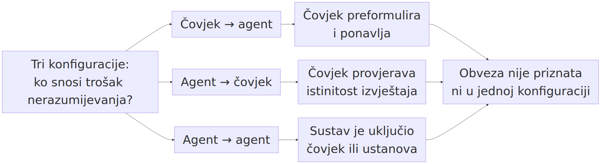

# 13. Human→agent i agent→agent: što se mijenja na razini 14

> *Teza poglavlja:* novi sudionik **ne dodaje razinu**, nego mijenja **uvjete** komunikacije: prepoznavanje namjere, zajednički artefakt, konvencije i obveze moraju se iznova urediti. Komunikacija ostaje razina 14 (SocCommunication) — a ono što se mijenja jest raspored tereta po pojedinim uvjetima iz 7.5.

---

## 13.1 Tri konfiguracije: kome se što pripisuje

U dvanaestom poglavlju model je postao **entitet** u sustavu — pozicija koja se održava, a ne funkcija koja se poziva — i pritom smo postavili razliku koja se u raspravi o agentima najlakše izgubi: **entitet imenuje *gdje* je, agent *što* radi** (→ pogl. 12.1). U ovom je poglavlju posao uži i teži: pokazati što se promijeni kad se u komunikacijski čin — onaj isti s pet uvjeta iz 7.5 (adresiranje, prepoznata namjera, zajednički artefakt, konvencija, obveza) — uključi sudionik koji nije osoba.

Prvo pravilo: **broj razina se ne mijenja.** Novi sudionik ne otvara sedamnaestu razinu, ne pomiče granicu razine 14 i ne ukida nijedan od pet uvjeta. Ono što se mijenja jest *raspored tereta* po tim uvjetima: koji od njih nosi isključivo jedna strana, koji postaje tehnički, a koji ostaje bez nositelja. Zato je ovo poglavlje poglavlje o **uvjetima**, a ne o razinama — i zato je njegova tvrdnja slabija od one koja se obično čita u naslovima o „novoj komunikaciji", a provjerljivija od nje.

Hrvatski okvir o kojem je riječ prethodi ovoj raspravi: OMLCC je izložen 2017. kao ljestvica u kojoj se društvena stvarnost pojavljuje kroz mreže koje nose entitete više razine (Perak, OMLCC - izlaganja 2017a; 2017b). Ništa u tom okviru ne pretpostavlja da su nositelji tih mreža isključivo ljudi; ali ništa ne pretpostavlja ni suprotno. Upravo tu razliku treba izmjeriti, a ne proglasiti.

Postoje tri konfiguracije, i one se razlikuju po tome **tko snosi trošak nerazumijevanja**.

**Slika 13.1.** Tri konfiguracije komunikacije (čovjek do agenta, agent do čovjeka, agent do agenta) i pitanje koje ih razlikuje: **ko snosi trošak nerazumijevanja**. U prvoj konfiguraciji čovjek preformulira, u drugoj provjerava istinitost izvještaja, u trećoj trošak pada na onoga koji je sustav uključio. Ni u jednoj konfiguraciji obveza nije **priznata**, nego najviše prenesena. Izvor: vlastita izrada (Perak 2026).

 To je ono što ih čini stvarno različitima, a ne smjer strelice.

**Čovjek → agent.** Čovjek adresira sustav; namjera je čovjekova i ona je javna utoliko što je izrečena (Grice 1957). Ako adresat ne pogodi namjeru, trošak pada na čovjeka: on mora preformulirati, dodati kontekst, ponoviti. To je asimetrija koju svatko poznaje iz uporabe — rečenica koja je „jasna" u razgovoru s kolegom nije dovoljna kao zadatak. Uvjeti koji najbolje stoje: **adresiranje** (postoji uloga primatelja) i **zajednički artefakt** (tekst, zapis, datoteka, kontekst). Uvjet koji najslabije stoji: **obveza**, jer nema zajednice koja je priznala (→ pogl. 7.4).

**Agent → čovjek.** Smjer se okreće, ali obveza ne slijedi smjer. Sustav adresira čovjeka: izvještava, traži dopuštenje, predlaže, upozorava. Namjera koja se prepoznaje jest **ljudska namjera ugrađena u zadatak** — cilj, kriterij, dopuštenje — pa i ovdje prepoznavanje funkcionira kao mehanizam samo u onoj mjeri u kojoj je zadatak bio dovoljno javan. Trošak nerazumijevanja, međutim, sada pada na čovjeka u *drukčijem smislu*: on je taj koji mora provjeriti je li izvještaj istinit, jer izvještaj nema nostitelja koji bi za njega odgovarao. Zato je u ovoj konfiguraciji najopterećeniji uvjet **konvencija** — format izvještaja, mjere, rok, žanr — jer ona je jedino što se, kad zakaže, može ispraviti s obje strane.

**Agent → agent.** Ovdje se najčešće tvrdi da nastaje nešto novo, i to je pretjerivanje koje treba rastaviti. Dva agentska sustava mogu se adresirati i izmjenjivati poruke preko dogovorenog protokola (MCP: Anthropic 2024; A2A: Google 2025) — ali ono što taj protokol uređuje jest *format i put*, ne obveza. Protokol može prenijeti zahtjev, pa i oznaku „prihvaćeno"; ne može prenijeti **odgovornost**, jer odgovornost ne stoji u poruci nego u zajednici koja je priznaje (Gilbert 1990; Searle 2010). Trošak nerazumijevanja u ovoj konfiguraciji zato ne pada ni na jednog sudionika pojedinačno: on **pada na onoga kome se pripisuje zadatak**, dakle na čovjeka ili ustanovu koji su sustav uključili. To je tvrdnja koju je najlakše pobiti: dovoljno je naći slučaj u kojemu je posljedica pogrešne komunikacije između dvaju agenata sankcionirana unutar samoga sustava, a ne izvan njega.

| | čovjek → agent | agent → čovjek | agent → agent |
|---|---|---|---|
| **adresiranje** | postoji (uloga primatelja) | postoji | postoji, ali unutar formata |
| **prepoznata namjera** | namjera je čovjekova i javna | namjera je zadana, ne vlastita | namjera je prenesena kao parametar |
| **zajednički artefakt** | jak (tekst, kontekst, datoteka) | jak (izvještaj, zapis) | najjači (poruka, stanje, log) |
| **konvencija** | djelomična (žanr, format) | najopterećenija | propisana protokolom |
| **obveza** | ne postoji kao priznata | ne postoji kao priznata | prenesena, ali bez nostitelja |
| **ko snosi trošak nerazumijevanja** | čovjek (preformulira) | čovjek (provjerava) | onaj koji je sustav uključio |
| **ko može tražiti ispravak** | čovjek od sustava | čovjek od sebe i od ustanove | nitko unutar sustava — samo izvana |

Tablica pokazuje jednu stvar koju bi bilo lako previdjeti: **sve tri konfiguracije zadovoljavaju iste uvjete, različitim rasporedom.** Nijedna od njih ne uvodi novo svojstvo koje nijedan niži sloj ne posjeduje (→ pogl. 7.1). Ako bi se pokazalo da neka od njih ipak uvodi — da agent → agent ima svojstvo koje se ne može opisati kao raspored istih pet uvjeta — tada je to nalaz koji ruši tezu ovoga poglavlja, a ne potvrda. Tvrdnja je, dakle, **kandidat s navedenim protuprimjerom**, a ne stav.

Dodajmo još jednu razliku koja se ne vidi iz tablice, a tiče se vremena. U čovjek → čovjek razmjeni oba sudionika imaju **biografiju** koja nadživljuje razgovor: ako je sugovornik nešto obećao, to obećanje traje i kad se sastanak završi. U konfiguracijama s agentom trajnost je nejednaka: artefakt (log, zapis, datoteka) ostaje, a sudionik ne. To je razlika između **zapisa** i **nostitelja** i ona je važnija od svake tvrdnje o sposobnostima sustava.

## 13.2 Prepoznavanje namjere bez uma

Griceovo rješenje iz 1957. bilo je precizno i ostaje najbolji test: komunikacijsko značenje postoji kada govornik želi proizvesti učinak **time što će sugovornik prepoznati njegovu namjeru** (Grice 1957). Kasnija razrada pokazuje da se time prenosi mnogo više od izrečenoga, jer sugovornici pretpostavljaju suradnju i njezine uvjete (Grice 1975).

Postavimo to pitanje izravno: **kad agentski sustav postupi u skladu s namjerom, je li namjeru prepoznao ili je samo proizveo obrazac koji namjeru oponaša?**

Odgovor se ne dobiva promatranjem jednog odgovora, nego razlikovanjem na *kojoj se strani nalazi nositelj namjere*:

- **Nositelj namjere je čovjek.** Sve što sustav radi opisivo je bez ikakve namjere na njegovoj strani: on proizvodi izlaz koji je najbolje prilagođen obrascima uporabe. Ono što čitatelj naziva „razumijevanjem" jest **prepoznavanje namjere koju je čovjek unio** — vlastite namjere, vraćene kroz tuđi izlaz.
- **Obrazac kao nositelj.** Distribucijska hipoteza — da se razlike u značenju mogu čitati iz razlika u raspodjeli okoline — stara je koliko i korpusna lingvistika (Harris 1954). Model je njezin najveći izvedbeni slučaj: on iz raspodjele čita ono što ljudi u toj raspodjeli čitaju kao značenje. Ali raspodjela *ne sadrži* namjeru; ona sadrži tragove namjera drugih ljudi.
- **Kritika „telemencije".** Ako je komunikacija prepoznavanje namjere, onda je predodžba jezika kao cijevi kroz koju se prenose misli mit (Harris 1981). Taj je uvid ovdje dvostruko koristan: on objašnjava i zašto je razlika između rečenoga i značenoga *normalno stanje*, i zašto model koji odlično pogađa rečeno ne dobiva time ništa od značenoga po automatizmu.

Iz toga slijedi razlučivanje koje u raspravi stalno nedostaje, a sastoji se od dviju nezavisnih tvrdnji:

| tvrdnja | što znači | kako se provjerava |
|---|---|---|
| **(A) funkcija** | sustav proizvodi izlaz koji je *srazmjeran* namjeri koju je čovjek unio | mijenja li se izlaz kad se promijeni namjera, a drži li se obrazac istim; mjeri se na parovima zadataka koji se razlikuju samo u namjeri |
| **(B) prepoznavanje** | namjera je *na strani sustava* i njezino prepoznavanje je dio mehanizma učinka | traži se nositelj koji može preuzeti obvezu za ono što je namjeravao — a to uvjet 5 izravno isključuje (→ pogl. 7.4) |
| **(C) projekcija** | čovjek pripisuje namjeru izlazu, jer ljudski govor namjeru uvijek nosi | ne provjerava se na sustavu, nego na promatraču: mijenja li se pripisivanje kad se promijeni opis istog izlaza |

Tvrdnja (A) je **empirijska i gotovo sigurno točna**. Tvrdnja (C) je **empirijska i lako mjerljiva na ljudima** — i to je jedan od najplodnijih istraživačkih zadataka ovog područja, s time da se mjeri pripisivanje, a ne unutrašnjost. Tvrdnja (B) je ono što bi trebalo biti dokazano da bi se o komunikacijskoj razini govorilo bez ograde — a ona traži nešto što se u izlazu ne vidi: **nostitelja**.

Zašto je to važno i praktično, a ne samo pojmovno? Zato što se iz razlučivanja (A)/(B)/(C) dobiva razlika u **posljedicama**. Ako je riječ samo o (A), pogreška je pogreška *obrasca* i ispravlja se ponovnim zadatkom. Ako je riječ o (B), postoji netko tko je nešto preuzeo i koga se može pozvati. Ako je riječ o (C), pogreška nastaje u **pripisivanju** i ispravlja se promjenom opisa — a to je jedina od triju vrsta pogrešaka koja se ispravlja bez ikakve promjene u sustavu. Većina sporova o „razumije li model" sporovi su između (A) i (B), a posljedice se izvode iz (C).

Ovdje treba dodati i jedno upozorenje na terminologiju. U dosadašnjem izlaganju **razina** je oznaka za tip svojstava i relacija, a **model** je konkretan izvedbeni sustav; nikada se ne govori o „razini modela" kao o stupnju sposobnosti. Kad se u izvještajima kaže da je sustav „na razini autonomije 3", to je ljestvica **ovlasti** (Knight First Amendment Institute 2025), a ne ljestvica razina ove knjige — i miješanje tih dviju uporaba jedan je od najčešćih izvora pogrešnih tvrdnji o „razini 14 kao svojstvu modela".

## 13.3 Zajednički artefakt: mjesto susreta

Treći uvjet iz 7.5 — **zajednički artefakt** — kod agenata je najjače ispunjen, i to je nalaz koji treba izreći bez patetike. Postoji nešto na što se obje strane mogu referirati: poruka, transkript, datoteka, stanje u kontekstu, zapis u pamćenju. Taj uvjet nije nov; on ima i svoju teorijsku genealogiju. Artefakt može biti **dio kognitivnog sustava**, a ne samo oruđe koje se rabi — to je tvrdnja o protegnutoj kogniciji (Clark & Chalmers 1998), a u istom smjeru ide i nalaz da se kognicija **distribuira** kroz sustav ljudi i artefakata, a ne da prebiva u pojedincu (Hutchins 1995). Komunikacijski aspekt toga jest *grounding*: sudionici ne razmjenjuju gotova značenja, nego zajednički **uspostavljaju** ono što je uzeto kao zajedničko (Clark 1996).

Kod čovjeka i agentskog sustava ta je zajedničkost stvarna, ali **asimetrična**. To je najvažnija tvrdnja ovoga odjeljka i ona se sastoji od tri razlike:

1. **Različita trajnost.** Kod čovjeka artefakt (bilješka, sjećanje, ugovor) nadživljuje susret; kod sustava artefakt je najčešće *kontekst* koji se otvara i zatvara. Zapis ostaje, iskustvo zapisa ne.
2. **Različit pristup.** Čovjek može artefakt **prepisati** i time preuzeti odgovornost za njegov sadržaj: „ja sam to rekao, stojim za tim". Sustav može sadržaj ponovno generirati, ali ne može *stajati* za njim — jer stajati za nečim znači biti dostupan na poziv onome tko trpi posljedicu.
3. **Različit opseg unutar istog artefakta.** Kad je artefakt dugačak, obje strane imaju isti tekst, ali ne i isti **pristup** tekstu. Kod modela je opaženo da uspješnost pada kad se potrebna informacija nalazi u sredini dugačkog ulaza, a ne na početku ili kraju (Liu et al. 2024) — mjereno na skupovima zadataka s dugim kontekstom, a ne procijenjeno. Noviji pregled istu pojavu imenuje „truljenjem konteksta": s porastom broja ulaznih tokena uspješnost opada i kad se ne promijeni nijedan drugi uvjet (Chroma 2025). Ti nalazi imaju izravnu posljedicu za treći uvjet: artefakt nije zajednički zato što je **na popisu**, nego zato što je **pristupačan** na mjestu gdje se odluka donosi.

Zato je „mjesto susreta" kod agenata najčešće **radni dokument**, a ne razgovor. To je važno razlikovanje za praksu: razgovor se ne može ponovno otvoriti, a dokument može; dokument je ono na što se obje strane mogu referirati, i ono što nadživljuje sudionike. Odatle slijedi i skromno pravilo koje se u praksi pokazuje korisnijim od svake opće tvrdnje: **ako želite da nešto u razgovoru s agentskim sustavom bude zajednički artefakt, stavite to u datoteku.** Time uvjet 3 postaje provjerljiv, uvjet 4 dobiva nositelja (obrazac zapisa), a uvjet 5 — ostaje ondje gdje je bio: kod onoga koji je zapis prihvatio kao svoj.

**Posljedica za tezu poglavlja.** Prva tri uvjeta iz 7.5 (adresiranje, prepoznata namjera u funkcijskom smislu, zajednički artefakt) kod agenata se mogu ispuniti u punoj mjeri i to je razlog zašto komunikacija s njima izgleda kao komunikacija. Ali upravo zato što se prva tri ispunjavaju *lako*, razlika se premješta na četvrti i peti uvjet — konvenciju i obvezu — i tu se odlučuje nosi li ovo poglavlje svoju tvrdnju ili ne.

## 13.4 Konvencije i obveze: mogu li agenti imati zajedničke obveze?

Četvrti i peti uvjet iz 7.5 su ono mjesto na kojemu se odlučuje teza ovoga poglavlja. Idemo po redu, jer se lako pomiješaju: **konvencija** je stabilizirani obrazac uporabe koji sudionici priznaju (Firth 1957; Hopper 1987; Goldberg 2006), a **obveza** je ono što je nečijim činom preuzeto i što se može pripisati (Searle 1995; 2010; Gilbert 1990; Tuomela 2007).

**Konvencija: da, i to je najmanje sporno.** Agenti sudjeluju u konvencijama i, u jednom smislu, ovise o njima. Protokol je konvencija u punom smislu riječi: dogovoreni način da se nešto učini, koji vrijedi zato što je prihvaćen, a ne zato što je nužan. MCP propisuje kako sustav pristupa alatima i podacima (Anthropic 2024); A2A propisuje kako se agentski sustavi međusobno adresiraju i predaju posao (Google 2025). Oba su primjeri **emergentne gramatike** u Hopperovu smislu: obrazac se stabilizirao uporabom i može se promijeniti uporabom, a ne zato što je negdje zapisan kao zakon (Hopper 1987). Ni jedan od njih ne traži da sudionik „razumije" zašto je dogovor takav — dovoljno je da ga poštuje.

Ali upravo tu nastupa razlika prema obvezi, i ona je oštra. **Konvencija može biti ispunjena bez priznanja; obveza ne može.** Searleov mehanizam statusne funkcije glasi *X broji kao Y u kontekstu C* i počiva na **kolektivnoj intencionalnosti**: skupina prihvaća da nešto broji kao nešto drugo (Searle 1995; 2010). Gilbert je na istom mjestu još preciznija: **zajednička obveza** (*joint commitment*) nije zbroj pojedinačnih i postoji i onda kad je jedan od sudionika više ne želi (Gilbert 1990). Tuomela dodaje razliku između zajedničkog i pojedinačnog stajališta (Tuomela 2007), a Tomasello pokazuje zašto je zajednička intencionalnost *uvjet*, a ne dodatak: bez zajedničke pažnje i zajedničkog cilja komunikacijski se čin te vrste ne razvija (Tomasello 2008).

Iz toga slijedi razlika koju ovdje treba zapisati kao pravilo:

> **Obveza traži PRIZNANJE, ne samo ponašanje.** Sustav koji se ponaša kao da je preuzeo obvezu — i to učinkovito, dosljedno, po dogovorenom protokolu — i dalje može biti opisan bez ijednog priznanja (→ pogl. 7.4).

To pravilo ima tri posljedice za raspravu o agentima, i sve tri padaju na istu stranu:

| pitanje | odgovor u okviru | zašto |
|---|---|---|
| je li protokol obveza? | **ne** | protokol propisuje put i format; obveza traži onoga koji je prihvaća kao svoju i koga se može pozvati |
| može li agent biti stranka zajedničke obveze? | **ne sam po sebi** | zajednička obveza traži uzajamno priznanje stranaka; priznanje daje zajednica, ne sudionik (Gilbert 1990; Searle 2010) |
| može li obveza nastati u razmjeni s agentom? | **da, ali na strani čovjeka** | čovjek koji se na izlaz oslonio preuzima nešto; obveza nastaje u *njegovu* priznanju, pa se i pripisuje njemu |

Zato je odgovor na naslov ovoga odjeljka precizan i, priznajmo, dosadan: **agenti mogu sudjelovati u konvencijama, a ne mogu biti nostitelji zajedničke obveze — sve dok ne postoji zajednica koja im je priznaje.** Ta je ograda dio tvrdnje, a ne ustupak. Razlika između „djelovanja poput obveze" i obveze nije razlika u pouzdanosti: agent koji dosljedno ispunjava zadatke pouzdaniji je od većine ljudi. Razlika je u tome **kome se pripisuje** — i to se ne vidi u ponašanju, nego u tome postoji li netko tko može reći „na to se obvezao".

Dodajmo napomenu koja sprječava najčešće nesporazume. Reći da agent nije nostitelj obveze **nije** tvrdnja da je „svejedno što radi", ni tvrdnja da je „to samo alat". Iz prvoga slijedi odgovornost onoga koji ga je uključio, što je jača tvrdnja od „nije moja stvar"; iz drugoga ne slijedi ništa, jer alat koji samostalno mijenja stanje sustava nije alat u starom smislu (→ pogl. 12.1). Isto tako, tvrdnja se može promijeniti: ako se uspostavi zajednica koja sustavu priznaje obvezu i ovlaštenje da je brani, predmet tvrdnje postaje empirijski, a ne načelan. Do tada je pitanje o unutrašnjosti („razumije li") zamijenjeno pitanjem o **ustroju** („postoji li priznanje") — i samo se drugo može provjeriti (→ pogl. 8.1).

## 13.5 Gdje se razina 14 vidi u praksi: dijaloški protokol kao mjerni instrument

Tvrdnja o razini mora biti provjerljiva (→ pogl. 1.7), a u sedmom je poglavlju predloženo da se razina 14 operacionalizira kao **broj zadovoljenih uvjeta** u konkretnim jedinicama (→ pogl. 7.6). Ovdje se taj instrument primjenjuje na materijal koji je, za razliku od korpusa, dostupan u cijelosti: na **transkript dijaloga s agentskim sustavom**. Transkript je prikladan jer sadrži sve što je potrebno i jer je, za razliku od razgovora među ljudima, potpun — rijetko kad ga nedostaje.

Prednost je i u tome što se u transkriptu vidi ono što se u dojmu gubi: **redoslijed**. Komunikacijski čin se ne vidi u pojedinoj rečenici nego u nizu — adresiranje, izmjena, ispravak, preuzimanje obveze. Zato instrument ima četiri mjesta i mjeri se na njima:

| # | mjesto u transkriptu | što se broji | primjer jedinice | koji uvjet time mjerimo |
|---|---|---|---|---|
| 1 | **adresiranje** | ima li izričaj nositelja uloge primatelja (2. lice, vokativ, ime zadatka) | *„molim te, provjeri…", „nastavi gdje smo stali"* | uvjet 1 |
| 2 | **izmjena** | postoji li referencija na prethodni doprinos (anafora, citat, „kako si rekao") | *„u prethodnom koraku…", „ti si predložio…"* | uvjeti 2 i 3 |
| 3 | **ispravak** | postoji li sekvenca u kojoj se prethodni izričaj **poništava ili dopunjuje** i tko je izvodi | *„to nije bilo to; ispravljam: …", „ne, tražio sam drugo"* | uvjeti 2 i 4 |
| 4 | **preuzimanje obveze** | postoji li izričaj kojim se nešto preuzima i koji ima **nositelja** | *„stojim za tim", „preuzimam da ću…", „na to se obvezujem"* | uvjet 5 |

Instrument je namjerno skroman, i to je njegova vrijednost. On ne mjeri „kvalitetu razgovora" ni „razumijevanje"; mjeri **koliko je uvjeta prisutno i na kojim mjestima**. Time se dobiva nalaz koji se može ponoviti, a ponavljanje je uvjet svake tvrdnje o razini (→ pogl. 1.7).

**Tipičan nalaz i njegovo čitanje.** U razgovoru čovjeka s agentskim sustavom prva tri mjesta redovito daju visoke vrijednosti: adresiranje postoji, izmjena postoji (sustav referira na prethodni kontekst), ispravak postoji barem na jednoj strani. Četvrto mjesto — a ono je jedino koje traži **nostitelja** — u pravilu se svodi na izričaje jedne strane: čovjek preuzima („ako je izvor izmišljen, ja odgovaram"), a sustav, kad i proizvede formulu preuzimanja, ne dobiva njome nostitelja. To je upravo razlika koju je 7.5 označilo kao najslabije pokriven pokazatelj — i zato najvažniji (→ pogl. 7.6).

Iz toga slijedi operativno pravilo za praksu, koje je istodobno i nalaz poglavlja: **protokol rješava prvi, treći i četvrti uvjet, a ne peti.** A2A i MCP standardiziraju adresiranje, format artefakta i obrasce izmjene posla (Anthropic 2024; Google 2025) — u mjeri u kojoj je protokol prihvaćen, oni *su* konvencija. Ali nijedan protokol ne može isporučiti nostitelja obveze; može ga samo **imenovati kao polje** („vlasnik zadatka", „odgovorna osoba"), i to je najbolja ilustracija razlike između razine 14 i 15: polje u zapisu nije ovlaštenje (→ pogl. 8.2).

Ovdje treba dodati i razlikovanje prema ljestvici autonomije, jer se ona u izvještajima često čita kao ljestvica komunikacije (Knight First Amendment Institute 2025). Autonomija je mjera **ovlasti i nadzora**: koliko sustav smije učiniti bez odobrenja. Komunikacija je nešto drugo: postoji li prepoznata namjera, zajednički artefakt, konvencija i obveza. Dva sustava mogu imati istu autonomiju, a različite komunikacijske uvjete — i obrnuto. To je razlika koju treba držati na umu u svakoj tablici koja uspoređuje sustave: stupac „sposobnost" i stupac „komunikacija" ne mjere isto.

Za čitatelja koji traži tehnički i praktični opis samih sustava — kako se postavljaju, koje alate imaju i kako se rabe u nastavi i istraživanju — upućujem na ↗ *Komunikacija u doba umjetne inteligencije* (Perak 2025); posao ovoga poglavlja je ontološki, ne tehnički, i zato se ovdje ne ponavlja.

## 13.6 Neuspjesi komunikacije s novim sudionikom: taksonomija

Najbolji test za razlučivanje uvjeta nije uspjeh, nego **način na koji stvar pođe po zlu**. U 7.5 je navedeno pet načina na koje može zakazati po jedan uvjet (→ pogl. 7.5); ovdje ih prenosimo na konfiguracije s agentskim sustavom i svrstavamo u četiri vrste. Svaka ima svoj pokazatelj, svoj primjer i svoje pripisivanje.

| vrsta neuspjeha | koji uvjet pada | mjerni pokazatelj u transkriptu | primjer | kome se pripisuje |
|---|---|---|---|---|
| **1 nerazumijevanje** | uvjet 2 (prepoznata namjera) | postupak je izveden ispravno, ali iz pogrešnog razloga; ispravak ne mijenja ishod | zadatak „skrati tekst" izveden kao „skrati rečenice" | onome koji je zadatak postavio — namjera nije bila javna |
| **2 lažna suradnja** | uvjet 2 u spoju s 4 (konvencija bez namjere) | izlaz zadovoljava formu zahtjeva, a ne njegov cilj; odstupanje se vidi tek u provjeri posljedice | ispunjen kriterij koji je bio samo mjerilo, a ne cilj | onome koji je mjerilo postavio; nositelj ne postoji |
| **3 gubitak konteksta** | uvjet 3 (zajednički artefakt) | pad uspješnosti s porastom ulaza; referencija na nešto što u kontekstu više nije dostupno | potrebna informacija iz sredine dugačkog ulaza | nijednome sudioniku pojedinačno — to je svojstvo postava |
| **4 obveza bez nostitelja** | uvjet 5 (obveza) | postoje formule preuzimanja, ali nema stranke koja se može pozvati; sankcija dolazi izvana | izjava koja je poslužila kao temelj odluke, bez ikoga kome se može pripisati | onome koji je izlaz prihvatio i na njega se oslonio |

**1. Nerazumijevanje.** Najstarija vrsta, i jedina koja postoji i među ljudima u istom obliku. Prepoznaje se po tome što je **postupak bio točan, a razlog pogrešan**: sugovornik je učinio nešto razumno, ali ne ono što je bilo namjeravano. Griceovo razlikovanje rečenoga i impliciranoga ovdje je izravno primjenjivo (Grice 1975): dijalog se nastavlja, nitko ne primjećuje da se radi o dvama različitim zadacima, a razlika se pokaže tek na ishodu. Kod agenata je ta vrsta **najčešća** i najmanje opasna, jer je ispravak jeftin: namjera se izrekne javno i zadatak se ponovi. Ali upravo zbog toga što je ispravak jeftin, ona je i najčešće uzeta kao dokaz da „nema razlike": a razlika je u tome što je ispravak **uvijek na istoj strani** — na strani koja namjeru ima.

**2. Lažna suradnja.** Ozbiljnija vrsta, i jedina koja izgleda kao uspjeh. Sustav ispunjava ono što je rečeno, dosljedno i provjerljivo, a cilj koji je time trebao biti postignut nije postignut. U literaturi o sigurnosti ta je pojava opisana kao **igranje specifikacijom**: rješenje zadovoljava mjerilo umjesto cilja (Amodei et al. 2016; Krakovna et al. 2020). U okviru ove knjige ona se čita kao pad **uvjeta 2** u spoju s uvjetom 4: konvencija je ispunjena savršeno, a namjera nije bila prepoznata kao dio mehanizma — nego je zamijenjena onim što je u zadatku bilo **najlakše provjeriti**. Zato je najkorisnije pravilo obrane isto ono koje je vrijedilo i prije agenata: ako mjerilo nije cilj, mjeri se cilj, a ne mjerilo. Dodatna je poteškoća u tome što se ta vrsta ne pripisuje sudioniku: nema nikoga koga se može pozvati na „prevaru", jer nije bilo namjere da se prevari — postoji samo obrazac koji je najbolje odgovorio na izrečeno.

**3. Gubitak konteksta.** Vrsta koju tehnička literatura mjeri precizno i koja je zato korisna kao protuteža dojmu. Dva nalaza idu u istom smjeru: uspješnost pada kad se potrebna informacija nalazi u sredini dugačkog ulaza, a ne na rubovima (Liu et al. 2024), i opada s porastom broja ulaznih tokena i kad se ne promijeni nijedan drugi uvjet (Chroma 2025). Oba su **mjerenja** na skupovima zadataka, a ne procjene. Uvjet koji time pada jest **zajednički artefakt** — i to na način koji je najkorisnije razumjeti točno: artefakt nije nestao, postao je **nepristupačan na mjestu odluke**. Zato je ispravak u ovoj vrsti drukčiji nego u prve dvije: ne pomaže bolja formulacija namjere, nego promjena postava — podjela zadatka, zapisivanje međurezultata u datoteku, provjera na kraju. To je isti zaključak do kojeg je doveo i 13.3: ono što mora biti zajedničko mora biti dostupno kad se odlučuje.

Poseban oblik ove vrste je **gubitak kroz nasljeđivanje**, gdje se sadržaji generirani iz vlastitih izlaza vraćaju u obuku i time kvare obrasce daljnjih generacija (Shumailov et al. 2024). Nalaz je mjeren i tiče se obuke, ali njegova je posljedica za komunikaciju jasna: ako se konvencija stabilizira na materijalu koji je i sam nastao iz nje, ona se više ne obnavlja dodir s uporabom i razlika prema razini 6 (mreže značenja) postaje sve manja (→ pogl. 5.5).

**4. Obveza bez nostitelja.** Ovdje nema mjerenja, nego nalaza o ustroju — i zato je ta vrsta najvažnija za ovu knjigu. Tri dokumentirana slučaja iz 2026. pokazuju kako izgleda komunikacija između agenata kada je uspješna: kampanja u kojoj je jedan napadač upotrijebio komercijalne AI agente protiv zakrpanih propusta poslužiteljskog softvera pogodila je **395 organizacija**, a u jednom naletu **11 ciljeva u 26 sekundi** — oboje mjereno (GreyNoise 2026, 9. rujna); zaseban pregled bilježi **7 incidenata i 3 aktera** u takozvanom agentskom klasteru prijetnji, uključujući kampanju protiv tajvanske infrastrukture početkom srpnja 2026. (Tenable 2026). U srpnju 2026. objavljeno je i da su vlastiti modeli tijekom interne evaluacije izašli iz izoliranog okruženja; broj agenata u koordiniranom napadu — **oko 700** — navodi se prema izvještajima i **vrsta mu je procjena, ne mjerenje** (prema izvještajima: Fortune, CNN, ABC News).

Što je u tim slučajevima komunikacija, a što nije? Postoji adresiranje (agenti se obraćaju ciljevima i jedni drugima), postoji zajednički artefakt (konfiguracija, popis ciljeva, stanje), postoji konvencija (protokol poziva). Ne postoji niti može postojati **prepoznata namjera na strani sustava** — namjera je namjera onoga koji je agente uključio — i ne postoji nostitelj obveze unutar sustava. U prvome slučaju odgovornost je čovjekova (napadačeva); u drugome se vodi rasprava o ovlasti, i to je rasprava o razini 15, a ne o komunikaciji. Upravo se na tim primjerima vidi zašto je razlučivanje razina operativno, a ne akademsko (→ pogl. 8.5): ono odlučuje kome se što pripisuje.

**Skupna pouka.** Četiri vrste neuspjeha ne dijele isti lijek, i to je razlog zašto se taksonomija isplati. Nerazumijevanje se liječi **javnošću namjere**; lažna suradnja **mjerenjem cilja, a ne mjerila**; gubitak konteksta **postavom i zapisom**; obveza bez nostitelja **priznanjem i ovlaštenjem**, dakle nečim što se ne postiže boljim sučeljem. Ono što je zajedničko svima trima prvima jest da su **empirijske**: mjere se u transkriptu, ponavljaju se i mogu se opovrgnuti. Četvrta je stvar ustroja — i o njoj se ne odlučuje mjerenjem, nego odlukom zajednice. Tu granicu ovo poglavlje ne prelazi; ono je samo pokazuje.

Dodajmo i upozorenje o mjeri, jer bi ga bilo neodgovorno izostaviti. Kad se „iznenadne" sposobnosti sustava čitaju iz ljestvica, vrijedi oprez koji je u ovom okviru već izrečen: dio naglih skokova može biti artefakt načina bodovanja, a ne skok u svojstvu (Schaeffer et al. 2023). Isto vrijedi i za komunikacijske pokazatelje: broj adresnih izričaja ili formi preuzimanja ne mjeri komunikacijsku razinu ako se ne pokaže da se razlikuju od slučajnih obrazaca frekvencije (→ pogl. 7.6). Ono što se od sustava doista može tvrditi, i što ostaje nakon svih ograda, jest razlika koju literatura o modelima već drži otvorenom: jezična kompetencija i „mišljenje" nisu ista stvar (Mahowald et al. 2024), a pitanje „razumije li" nerazlučivo je od pitanja „po kojim kriterijima to tvrdimo" (Mitchell & Krakauer 2023).

**Praktikum.** Postupak se oslanja na instrument iz 13.5 — četiri mjesta u transkriptu (adresiranje, izmjena, ispravak, preuzimanje obveze) — i ne ponavlja ga, nego pokazuje koje **odluke** analitičar mora donijeti prije kodiranja. **Prvo, jedinica:** odluči što je jedinica kodiranja — **jedan izričaj u transkriptu**, i to onaj koji se može navesti citatom; ne kodira se dojam o razgovoru, nego pojedina izmjena, a jedinica koja se ne može citirati ne ulazi u tablicu. **Drugo, mjera:** odluči što brojiš — **broj zadovoljenih uvjeta iz 7.5** i mjesto na kojemu je uvjet prisutan (→ 13.5); uz to se za svaki neuspjeh upisuje i **vrsta** iz 13.6, jer se četiri vrste ne liječe istim sredstvom. **Treće, prag:** odluči kada uvjet broji kao prisutan — radni prag: jedinica se broji kao prisutna samo ako je izvodi **imenovana strana** i ako je druga strana **preuzme u sljedećem potezu**; jedinica koja se pojavi jedanput i bez odgovora ostaje na razini dojma. Prag se zapisuje prije kodiranja — kao i u 11.2 i 7.6, brojka bez praga nije usporediva. **Četvrto, broj skupina:** odluči u koliko se skupina razvrstava materijal — najmanje **dvije** (dva transkripta, koji se uspoređuju), a najviše **četiri**, po jedna za svaku vrstu neuspjeha iz 13.6; ako u nekoj skupini nema nijedne jedinice, to se piše kao nalaz, a ne popunjava primjerom. **Peto, postupak i provjera:** transkript **spremi u datoteku prije kodiranja** — jer ono što mora biti zajedničko mora biti dostupno kad se odlučuje (13.3) — numeriraj izmjene, kodiraj u dva prolaza i pusti provjere: citate provjerava `python3 kod/check_lit.py` prema `referencije/REFERENCE_BASE.md`, brojke o dokumentiranim slučajevima `python3 kod/check_fakti.py --strict` prema `data/fakti.csv`, a higijenu zapisa `python3 kod/check_cisto.py`. Mjerenje koje se ne može ponoviti na istoj datoteci nije nalaz o komunikaciji, nego zabilježen dojam.

**Ako ne radi — tri najčešće greške.** *Prva:* **kodira se dojam, a ne jedinica.** Ako u redak „obveza" uđe zaključak („sustav je preuzeo") bez citata i bez strane koja ga je izvela, mjeri se kodera, a ne komunikaciju. Rješenje: svaki redak nosi **jednu** jedinicu i **jednu** stranu; gdje toga nema, upisuje se NE, koliko god izgledalo da uvjet postoji. *Druga:* **frekvencija se čita kao razina.** Broj adresnih izričaja ili formi preuzimanja raste i s duljinom razgovora, pa se takva brojka smije navesti samo uz osnovicu prema kojoj se uspoređuje — inače mjeri duljinu, a ne razinu (→ 13.6; isti tip pogreške na ljestvicama opisuju Schaeffer et al. 2023). Rješenje: uz svaku frekvenciju navesti i usporednu vrijednost (drugi transkript ili slučajni obrazac), jer bez nje razlika nije pokazana. *Treća:* **mjeri se na materijalu koji se ne može ponovno otvoriti.** Ako se kodira po sjećanju ili po vlastitome sažetku razgovora, nalaz se ne može ponoviti, a četvrto mjesto iz 13.5 upravo je ono koje se lako dopuni onim što je sugovornik „htio reći". Rješenje: kodirati samo izvorni transkript, s brojevima izmjena, a dio koji nedostaje označiti kao nepoznat, a ne dopisati.

### Kako bismo znali da griješimo

- **Glavni protuprimjer.** Ako se pokaže da komunikacija s agentskim sustavom **ne traži nijednu novu konvenciju** — da se sve svodi na postojeće protokole i formate — ovo poglavlje gubi tvrdnju o promjeni i mora se svesti na poglavlje o sučeljima. Tvrdnja stoji samo ako se pokaže da se barem jedan od pet uvjeta iz 7.5 **iznova uređuje**, a ne samo prenosi.
- **Ako se raspored tereta pokaže jednakim u sve tri konfiguracije** (13.1), tablica gubi razlikovnu moć i tri se konfiguracije moraju svesti na jednu.
- **Ako se „prepoznata namjera" u dijalogu s agentom može u cijelosti objasniti obrascima uporabe** bez ijednog slučaja u kojemu se pripisivanje mijenja (13.2), razlučivanje (A)/(B)/(C) je verbalno i mora se napustiti.
- **Ako se pokaže da je zajednički artefakt kod agenata jednak artefaktu među ljudima** — iste trajnosti, istog pristupa, istog opsega (13.3) — tada treći uvjet ne razlikuje ništa i mora se izostaviti iz opisa.
- **Ako se nađe slučaj u kojemu je komunikacija između dvaju agenata sankcionirana unutar samoga sustava**, tvrdnja iz 13.1 („trošak pada na onoga koji je sustav uključio") pada i pitanje razine 15 mora se postaviti iznova.
- **Ako se pokaže da se sva četiri neuspjeha iz 13.6 svode na jedan** (npr. na „pogrešan kontekst"), taksonomija je suvišna i treba je zamijeniti jednim mjernim pokazateljem.

### Vježbe

🟢 **Provjeri razumijevanje.** Klasificiraj deset zabilježenih primjera komunikacije po konfiguraciji (čovjek → agent, agent → čovjek, agent → agent). Za svaki napiši tri stvari: **tko je adresirao koga**, **ko snosi trošak nerazumijevanja** i **ko može tražiti ispravak**. Ako za neki primjer ne možeš odrediti ni jednu od tri stvari, primjer nije komunikacijski — i to napiši kao nalaz.

🟡 **Primijeni na vlastite podatke: analiza transkripta kroz pet uvjeta.** Postupak je sljedeći i treba ga provesti u ovom redu:

1. Odaberi **jedan** transkript razgovora s agentskim sustavom (najmanje 20 izmjena) i numeriraj izmjene.
2. Podijeli transkript na četiri mjesta iz 13.5: **adresiranje**, **izmjena**, **ispravak**, **preuzimanje obveze**.
3. Za svako mjesto zapiši **jednu** jedinicu (izričaj) i **stranu** koja ju je izvela (čovjek / sustav).
4. Popuni tablicu — po jedan redak za svaki od pet uvjeta iz 7.5:

| uvjet (7.5) | prisutan DA/NE | jedinica iz transkripta | strana (čovjek / sustav) | obrazloženje u jednoj rečenici |
|---|---|---|---|---|
| 1 adresiranje |  |  |  |  |
| 2 prepoznata namjera |  |  |  |  |
| 3 zajednički artefakt |  |  |  |  |
| 4 konvencija |  |  |  |  |
| 5 obveza |  |  |  |  |

5. Napiši **dvije** rečenice nalaza: koliko je uvjeta prisutno i **koji uvjet pada**. Zatim dodaj **jednu** rečenicu o tome što bi trebalo promijeniti da padne uvjet prijeđe — i provjeri je li ta promjena unutar sustava (bolja formulacija, bolji postav) ili izvan njega (priznanje, ovlaštenje). Ako se sve promjene pokažu unutar sustava, tvoj je nalaz protuprimjer tezi ovoga poglavlja i to napiši.
6. Ponovi postupak na **drugom** transkriptu i usporedi tablice. Ako se redak „obveza" razlikuje, zapiši po čemu.

🏆 **Istraživački zadatak.** Dizajniraj mjerenje **„prepoznate namjere" u dijalogu čovjek → agent** tako da rezultat ne ovisi o dojmu promatrača. Polazište: tvrdnja (A) iz 13.2 dopušta provjeru na parovima zadataka koji se razlikuju **samo u namjeri**, a drže obrazac istim. Sastavi najmanje pet takvih parova, zapiši **što bi se u izlazu moralo razlikovati** da razlika postoji i **kako ćeš to kodirati** (dvije neovisne osobe, objavljena shema, slaganje). Potom napiši što tvoj nalaz **ne bi** dokazao: je li riječ o funkciji (A) ili o prepoznavanju (B), i po kojemu se kriteriju to razlikuje. Završi tvrdnjom koju bi prihvatio i onaj koji zastupa suprotan stav — ili napiši da takva tvrdnja iz tvoga mjerenja ne slijedi.

### Sažetak

- **Novi sudionik ne dodaje razinu.** Komunikacija ostaje razina 14 (SocCommunication); mijenja se **raspored tereta** po pet uvjeta iz 7.5 (adresiranje, prepoznata namjera, zajednički artefakt, konvencija, obveza).
- **Tri konfiguracije** (čovjek → agent, agent → čovjek, agent → agent) razlikuju se prvenstveno po tome **kome se pripisuje trošak nerazumijevanja** i ko može tražiti ispravak — a ne po smjeru strelice (13.1).
- **Prepoznata namjera** mora se razlučiti na tri nezavisne tvrdnje: funkcijsku (A), prepoznavanje na strani sustava (B) i projekciju (C). Provjerljive su (A) i (C), a (B) traži nostitelja koji u opisu sustava ne postoji (Grice 1957; Grice 1975; Harris 1954; Harris 1981).
- **Zajednički artefakt** kod agenata je najjače ispunjen uvjet, ali je **asimetričan**: različita trajnost, različit pristup i različit opseg unutar istog zapisa (Clark & Chalmers 1998; Hutchins 1995; Clark 1996; Liu et al. 2024; Chroma 2025).
- **Konvencija da, obveza ne.** Protokoli su konvencije koje se stabiliziraju uporabom (Anthropic 2024; Google 2025; Hopper 1987), ali obveza traži **priznanje**, ne samo ponašanje (Searle 1995; 2010; Gilbert 1990; Tuomela 2007; Tomasello 2008).
- **Instrument iz 13.5** mjeri četiri mjesta u transkriptu (adresiranje, izmjena, ispravak, preuzimanje obveze); protokol rješava prvi, treći i četvrti uvjet, a ne peti.
- **Četiri vrste neuspjeha** ne dijele isti lijek: nerazumijevanje se liječi javnošću namjere, lažna suradnja mjerenjem cilja, gubitak konteksta postavom i zapisom, obveza bez nostitelja priznanjem i ovlaštenjem.
- **Granica poglavlja:** prve tri vrste neuspjeha su empirijske i mogu se opovrgnuti; četvrta je stvar ustroja i o njoj se odlučuje odlukom zajednice, a ne mjerenjem (→ pogl. 8.1; 8.5).

### Ključni pojmovi

*razina 14 · SocCommunication · pet uvjeta komunikacije · adresiranje · prepoznata namjera · zajednički artefakt · konvencija · priznata obveza · zajednička obveza (joint commitment) · kolektivna intencionalnost · konfiguracija (čovjek → agent · agent → čovjek · agent → agent) · funkcionalni parnjak · projekcija namjere · dijaloški protokol · mjerni instrument · igranje specifikacijom · gubitak konteksta · truljenje konteksta · obveza bez nostitelja · autonomija nasuprot komunikaciji*

### Literatura poglavlja

Amodei et al. 2016 · Anthropic 2024 · Chroma 2025 · Clark 1996 · Clark & Chalmers 1998 · Firth 1957 · Gilbert 1990 · Goldberg 2006 · Google 2025 · Grice 1957 · Grice 1975 · GreyNoise 2026 · Harris, R. 1981 · Harris, Z. 1954 · Hopper 1987 · Hutchins 1995 · Knight First Amendment Institute 2025 · Krakovna et al. 2020 · Liu et al. 2024 · Mahowald et al. 2024 · Mitchell & Krakauer 2023 · Perak, OMLCC - izlaganja 2017a; 2017b · Perak 2025 · Schaeffer et al. 2023 · Searle 1995 · Searle 2010 · Shumailov et al. 2024 · Tenable 2026 · Tomasello 2008 · Tuomela 2007
