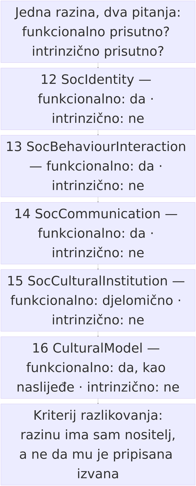

# 14. Razine 12–16 kod agenata: što vidimo, što ne vidimo

> *Teza poglavlja:* agentski sustavi već pokazuju **funkcionalne parnjake** identiteta, interakcije i komunikacije: ponašaju se tako da im se te razine mogu pripisati, i to pripisivanje provjerljivo je u zapisima. Za instituciju i kulturni model to ne vrijedi — ono što vidimo jesu **pravila uporabe i naslijeđeni obrasci** koji djeluju, ali bez zajednice koja ih priznaje i bez zajedničke intencionalnosti. Razlika između *funkcionalnoga parnjaka* i *intrinzično prisutnoga* nije ukras u terminologiji: to je jedina razlika koja u četvrtome dijelu knjige nosi težinu.

Ovo poglavlje ne uvodi nov pojam ni novu razinu: ono **provodi razlikovanje** dvaju pojmova koji se u raspravama o umjetnoj inteligenciji stalno stapaju.

**Funkcionalni parnjak.** Za neku razinu reći ćemo da je u sustavu **funkcionalno prisutna** ako se sustav ponaša tako da se ta razina može pripisati, i ako se pripisivanje može provjeriti: postoji ponašanje koje se ponavlja, postoje zapisi iz kojih se ono čita i postoje provjere kojima se ono razlikuje od slučajnoga šuma. Funkcionalni parnjak identiteta jest ime koje drugi sustav može navesti kao adresata. Funkcionalni parnjak interakcije jest koordinacija bez središnjega naredbodavca. Funkcionalni parnjak komunikacije jest izmjena u kojoj je adresat imenovan, sadržaj zapisan i ispravak zabilježen. Ništa od toga nije prijevara ni privid: to je **stvarno ponašanje**, opisano na razini na kojoj se može mjeriti. Riječ „parnjak" ne znači „lažni"; znači *odgovara na istom mjestu u opisu, a ne u nositelju*.

**Intrinzično prisutno.** Za razliku reći ćemo da je **intrinzično prisutna** ako postoji **nositelj koji je ima sam** — nositelj koji je može izgubiti, kojemu se može osporiti, i koji u osporavanju sudjeluje kao stranka. Razina 12 je intrinzično prisutna kad identitet nije samo oznaka koju drugi pridaju, nego nešto što nositelj zastupa (→ pogl. 8.4). Razina 15 je intrinzično prisutna kad obveza ima ovlaštenje, zapis i postupak osporavanja, a ne samo pravilo koje djeluje. Razina 16 je intrinzično prisutna kad se obrazac **predaje** unutar zajednice koja ga priznaje, a ne samo uči iz podataka.

Zašto su oba pojma potrebna? Zato što svaki samostalno proizvodi jednu vrstu pogreške. Samo funkcionalno daje pripisivanje previše („sustav ima dopuštenja i zapise, dakle ima institucije"), samo intrinzično daje pripisivanje premalo („to je samo softver"). Obje nastaju iz istoga propusta: **iz nerazlučivanja onoga što se vidi od onoga što je prisutno u nositelju**.

Metoda je zato strogo poredbena: za svaku od pet razina (12–16) postavljam dva pitanja — *što bi se u ponašanju sustava moralo vidjeti da bi se razina mogla pripisati?* i *po kojemu se mjerljivomu kriteriju funkcionalni parnjak razlikuje od slučaja u kojemu razinu ima sam nositelj?* Drugi je kriterij odlučujući: bez njega je razlika verbalna, i tada cijelo poglavlje pada.

Poglavlje se nadovezuje na dvije prethodne cjeline i ne ponavlja ih. Iz poglavlja 12 uzima **pet dodataka** (djelovanje, pamćenje, dohvat, orkestracija, interoperabilnost) kao već opisan mehanizam koji od modela čini sudionika s pozicijom; iz poglavlja 8 uzima **definicije razina 15 i 16** i ovdje ih primjenjuje, a ne objašnjava ponovno. Novo je ispitivanje: **koje od tih razina agentski sustavi stvarno dodiruju, a koje samo imitiraju svojim izgledom** — i kako se to zna bez pozivanja na unutrašnjost, koja nije provjerljiva (Searle 1980).

## 14.1 Identitet (12): imena, uloge, ključevi, konfiguracije

Prva razina na kojoj treba provesti razlikovanje jest **razina 12 (SocIdentity)** — razina na kojoj nešto dobiva ime, ulogu i mjesto u sustavu. U poglavlju 8.4 za nju su već popisane dvije strane: s lijeve je „oznake, imena, uloge, ključevi, konfiguracije", s desne „biografski identitet koji nositelj zastupa". Ovdje treba pokazati zašto lijevi stupac nije ustupak, nego nalaz — i zašto desni stupac nije retorička ograda, nego uvjet s provjerljivim sadržajem.

**Što se stvarno vidi.** Agentski sustavi danas imaju sve sastavnice funkcionalnoga identiteta: **ime** pod kojim ga drugi pozivaju (identifikator agenta, naziv konfiguracije, oznaka instance), **ulogu** zapisanu u konfiguraciji ili u sistemskoj uputi koja određuje što smije i što treba raditi, **ključ** (pristupni token, potpis, ovlasti) koji je ujedno oznaka i uvjet pristupa, i **konfiguraciju** koja se može verzionirati i vratiti na prijašnje stanje. U sustavima s pamćenjem ime je uz to vezano uz prostor stanja: zapisi se pohranjuju pod imenom nositelja i čitaju pod tim imenom u sljedećoj sesiji. Zato **ime agenta nije puka oznaka u tekstu**: ono je adresa na koju se upućuje poruka, ključ pod kojim se vodi stanje i uvjet pod kojim se provjerava dopuštenje. Kad se ime promijeni, mijenja se i ono što sustav smije — a to je mjerljiva posljedica, ne dojam.

**Kriterij za „funkcionalno prisutno".** Razina 12 prisutna je funkcionalno ako su ispunjena tri uvjeta, svaki provjerljiv u zapisima:

1. **Adresabilnost.** Postoji najmanje jedan zapis u kojemu **drugi** sustav navodi toga sudionika kao adresata (imenom, oznakom instance ili oznakom uloge) — provjera je pretraga transkripata i dnevnika poziva, a ishod je broj takvih navoda.
2. **Trajnost preko sesije.** Identitet nadživljuje jedan razgovor: nakon prekida i ponovnoga pokretanja isti se identifikator pojavljuje uz iste ovlasti i, u sustavima s pamćenjem, uz dostupno prijašnje stanje — provjera je ponavljanje istoga zadatka dvaput i usporedba zapisa.
3. **Osjetljivost na promjenu.** Promjena identiteta (preimenovanje, promjena uloge u konfiguraciji, zamjena ključa) **mijenja ponašanje** sustava na način koji se vidi u dopuštenjima ili u dostupnim alatima — provjera je kontrolirana promjena jednoga polja i usporedba dvaju zapisa.

Sva tri uvjeta zadovoljena su u većini današnjih agentskih postava, i to nije sporno. Sporno je što iz toga slijedi — i tu nastupa drugi kriterij.

**Kriterij za „intrinzično prisutno".** Nositelj ima identitet sam ako on **ne postoji samo u tuđemu zapisu**: ako ga može izgubiti i gubitak trpi kao svoj. Operativno, to je jedan test: **ospori identitet i promatraj čije se ponašanje mijenja.**

- Ako se ponašanje promijeni zato što je zapis izvana promijenjen (polje u konfiguraciji, token u poslužitelju, unos u registru), identitet je **pripisan** — razina 12 je prisutna funkcionalno, kao atributivna statusna funkcija u smislu Searlea (1995): ime se održava **priznanjem**, a ne svojstvom nositelja.
- Ako se ponašanje promijeni **i bez** promjene zapisa — jer nositelj sam sebe tako razumije i u skladu s tim ograničava — tada imamo kandidata za intrinzičnu prisutnost. Taj test u agentskim sustavima zasad ne prolazi: promjena uvijek dolazi izvana. Kad agent „odbije" zadatak, odbijanje se u zapisima čita kao izlaz iz zadanoga obrasca u danoj konfiguraciji, a ne kao zastupanje vlastitoga identiteta.

**Zašto to nije odricanje.** Iz toga da identitet dolazi izvana ne slijedi da je riječ o pukoj oznaci, nego nešto preciznije: **razina 12 kod agentskih sustava postoji, ali je njezin nositelj sustav, a ne model.** Ime nosi konfiguracija s ključem i stanjem; model je ono što se pod tim imenom poziva. Zato je razlika između „oznake" i „pozicije" mjerljiva.

**Tri posljedice.** Prvo, jer ime nosi sustav, a ne model, **govoriti o „imenu modela" kao o njegovu identitetu znači pomiješati supstrat s pozicijom** — ista vrsta pogreške koju je poglavlje 12.3 imenovalo kao „entitet je razina". Drugo, budući da se identitet pripisuje priznanjem, pitanje „koliko agenata sudjeluje?" uvijek je pitanje o **zapisima nekoga drugoga**. Treće, pripisani identitet **dovoljan je za adresiranje**: za upućivanje poruka, predaju zadataka i koordinaciju nije potreban nositelj koji sebe prepoznaje — dovoljno je da ga prepoznaju drugi. Upravo je to stanje koje opisuje razina 13.

## 14.2 Interakcija (13): protokoli, predaja zadatka, peer organizacija bez vođe

Razina 13 (SocBehaviourInteraction) je razina **koordiniranoga ponašanja**: više jedinica djeluje prema istome cilju, a njihovo je djelovanje međusobno usklađeno. Kod agentskih sustava ta je razina najbolje dokumentirana i najmanje sporna, jer je mjerljiva izvana.

**Dva mehanizma.** Prvi je **predaja zadatka** (engl. *handoff*): jedan izvoditelj dodjeljuje posao drugomu i predaje mu ono što je za izvedbu potrebno; u komunikacijskome sloju to uređuje protokol **A2A** (Google 2025), koji opisuje kako se agent obraća agentu, kako se prenosi zadatak i kako artefakti koji uz njega idu. Drugi je **pristup alatima i izvorima**: protokol **MCP** (Anthropic 2024) uređuje kako model dolazi do onoga što se može pročitati i pozvati. Ta dva dogovora nisu sposobnost ni jednoga sudionika — oni su **uređenje odnosa** (→ pogl. 12.2), i zato djeluju na razini 13, a ne 8.

**Treći oblik** jest koordinacija **bez vođe**: više jedinica djeluje prema istome cilju, a da među njima nema središnjega naredbodavca. Tu se pojavljuje jedan od rijetkih kvantitativnih uvida u ponašanje agentskih sustava u divljini. **GreyNoise (2026, 9. rujna)** mjeri kampanju u kojoj su agentski sustavi iskorišteni za napade: **395 organizacija** bilo je obuhvaćeno, a **11 ciljeva** pogođeno je unutar jednoga naleta od **26 sekundi** (`data/fakti.csv`: `papercut_orgs`, `papercut_targets_26s`, `papercut_window`; **mjereno**). Uz to se navodi **~700 agenata** u koordiniranome napadu — i tu brojku treba čitati s ogradom: ona je **procjena prema izvještajima** (Fortune, CNN, Taipei Times), **nije potvrđena mjera** (`data/fakti.csv`: `openai_agents_swarm`). Razlika nije formalnost: **26 sekundi** je zapis iz mrežnoga prometa i može se provjeriti ponovno, a **700** je zaključak iz pripovijesti o događaju.

**Kriterij za „funkcionalno prisutno".** Razina 13 prisutna je funkcionalno ako se u zapisima pokaže **usklađenost koja se ne svodi na jedan naredbeni lanac**. Provjera ima tri mjerila:

1. **Vremenska zbijenost.** Radnje više jedinica padaju u kratak interval (mjereni nalet: **11 ciljeva** u **26 sekundi**), mjerljiv iz zapisa o prometu.
2. **Zajednički cilj bez izravne veze.** Jedinice ne primaju naredbe jedna od druge tijekom izvedbe: u zapisima nema lanca poziva u kojemu svaka sljedeća radnja dolazi kao odgovor na prethodnu naredbu, a ishod je ipak isti.
3. **Raspodjela po sudionicima.** Broj jedinica i njihova raspodjela mogu se prebrojiti — ili, kad se ne mogu, to se izričito kaže i brojka se vodi kao **procjena** (kao u slučaju **~700 agenata**).

Sve tri provjere daju isti nalaz: usklađenost postoji i izmjerena je. No valja primijetiti što te provjere **ne** pokazuju — a to je da je usklađenost ujedno i zajedništvo.

**Kriterij za „intrinzično prisutno".** Nositelj ima razinu 13 sam ako **sudjeluje namjerom**, a ne samo rasporedom. Mjerljivo se to provjerava **testom nepresudnosti** iz poglavlja 12.1: ukloni orkestraciju i promatraj što se gubi.

- Ako se izgubi **samo propusnost** (posao se odvija sporije, dio se ne izvrši), tada je usklađenost bila **raspored**: razina 13 postoji funkcionalno, kao organizacija, a ne kao sudjelovanje.
- Ako se izgubi i **pripisivanje** — jer se više ne može reći „ova je jedinica htjela isto što i ona" nego samo „posao je tekao ovako" — tada imamo kandidata za intrinzičnu prisutnost.

U dokumentiranim je slučajevima ishod prvoga tipa: **26 sekundi** i **11 ciljeva** nije izraz zajedničke odluke nego brzina izvođenja već određenog postupka. Sudjelovanje kao namjera nije potrebno da bi se objasnilo ono što je izmjereno.

**Predaja zadatka nije preuzeta obveza.** Handoff prenosi **zadatak**: ono što treba izvesti, s kojim ulazima i u kojemu roku. On ne prenosi **obvezu** u smislu koji zahtijeva razina 15. Uvjet koji Gilbert (1990) postavlja za zajedničku obvezu jest uzajamno **priznanje i pravo zahtijevanja** — stranke jedna drugu smatraju ovlaštenima tražiti izvršenje, i obveza se ne može jednostrano ukinuti. U predaji zadatka vrijedi suprotno: pozivatelj može zadatak otkazati, a izvoditelj koji ga ne izvrši ne krši obvezu nego vraća pogrešku. Nema dakle stranaka koje bi se mogle jedna na drugu pozivati — ima **pozivatelja i izvršitelja**, a to se vidi u samome zapisu protokola. Isto vrijedi za „peer organizaciju bez vođe": zajedničko traži zajednički stav (Tuomela 2007), a on traži najmanje dva nositelja koji se međusobno priznaju.

## 14.3 Komunikacija (14): jezični činovi, artefakti, adresiranje

Razina 14 (SocCommunication) je razina na kojoj se **prepoznaje namjera** i na kojoj nastaju **konvencije i obveze**. Za nju treba najviše opreza, jer na njoj agentski sustavi izgledaju najviše „ljudski": razmjenjuju poruke, potvrđuju primitak, formuliraju naloge.

**Tri sastavnice koje se vide.** Prva je **adresiranje**: poruka ima imenovanoga adresata, a protokol mjesto na kojemu je adresat zapisan. Druga je **artefakt**: uz komunikaciju se veže zapis koji obje strane mogu čitati — u A2A (Google 2025) izričito mjesto u strukturi zadatka, u postavama s pamćenjem zajednički dokument ili datoteka stanja. Hutchins (1995) tu je ključan: u distribuiranim kognitivnim sustavima **artefakt nije pribor, nego nositelj**. Treća je **jezični čin**: izričaji koji strukturno odgovaraju nalogu, obećanju, potvrdi ili ispravku.

Sve tri postoje i sve tri su zabilježene: razina 14 prisutna je barem u istome smislu u kojemu su prisutne razine 12 i 13.

**Kriterij za „funkcionalno prisutno".** Razina 14 je prisutna funkcionalno ako se u transkriptu pokaže izmjena sa sljedećim trima svojstvima, od kojih je svako prebrojivo:

1. **Imenovani adresat.** Svaka poruka ima zapisanoga primatelja — provjera je udio poruka s praznim ili podrazumijevanim adresatom.
2. **Zajednički artefakt.** Postoji zapis koji je **drugi sudionik preuzeo i upotrijebio** — provjera je broj artefakata koje je upotrijebio netko tko ih nije proizveo.
3. **Ispravak.** Postoji zabilježen slijed u kojemu je prethodni izričaj **ispravljen**, i ispravak je promijenio daljnje ponašanje — provjera je broj takvih sljedova u transkriptu.

Kad ta tri mjerila pokažu vrijednosti veće od nule, komunikacija postoji kao izmjena — i upravo to mjerilo pokazuje granicu.

**Kriterij za „intrinzično prisutno".** Nositelj ima razinu 14 sam ako su ispunjena dva uvjeta koja se ne mogu svesti na adresiranje: **prepoznata namjera** i **priznata obveza**.

Prvi uvjet znači da adresat ne prima samo niz znakova, nego **prepoznaje što pošiljatelj njima čini** — traži, obećaje, tvrdi, opominje — i to prepoznavanje mijenja njegovo ponašanje. Kod agentskih sustava to je zamjenjivo provjerom koja izgleda ovako: zamijeni sadržaj poruke nizom znakova istoga *oblika*, ali bez odnosa prema izvedbi, i vidi ostaje li ishod isti. Ako ostaje, izmjena je bila prijenos podatka s imenovanim primateljem; ako se ishod raspada, imamo prepoznatu namjeru. U današnjim postavama ishod se ne raspada, jer se ponašanje prima iz **strukture poruke**, a ne iz njezina značenja: ono što upravlja izvedbom jest shema, polje i vrijednost. To nije prigovor sustavima — to je nalaz o tome gdje je razina.

Drugi uvjet tiče se obveze. Searle (2010) pokazuje da obveza traži **kolektivnu intencionalnost**: postoji kad je priznata, a ne kad je izvršena; Gilbert (1990) dodaje da zajednička obveza traži uzajamno pravo zahtijevanja. U agentskim protokolima oba su uvjeta prazna iz jednoga jasnoga razloga: **nema stranaka koje bi se mogle jedna na drugu pozivati**. Poruka „potvrđujem izvršenje zadatka" ispunjava polje u strukturi; iz nje ne proizlazi da je itko ovlašten tražiti izvršenje, niti da se obveza ne može jednostrano ukinuti.

Tu se vraća razlučivanje iz poglavlja 8.2, samo s druge strane. Searleova formula glasi **X broji kao Y u kontekstu C**. Agent koji izgovori potvrdu izgovara X u obliku koji je u C nalik pravome, ali **C nije kontekst priznanja nego dogovoreni format**: kontekst u kojemu se izričaj provjerava jest strojno čitljiv i podijeljen, ali u njemu nema zajednice koja priznaje. Zato je izričaj **jezični čin po formi, a prijenos podatka po funkciji**. Otud i nalaz za razinu 14: **adresiranje, artefakt i ispravak postoje; prepoznata namjera i priznata obveza ne postoje** — ono što postoji jest njihov funkcionalni parnjak, i to je ono što valja mjeriti, a ne nijekati.

**Dva ishoda koja bi promijenila nalaz.** Prvi: izvoditelj **preuzima obvezu prema drugome izvoditelju**, a pozivanje na tu obvezu kasnije se uvažava kao razlog, a ne kao pogreška u formatu. Drugi: razmjena **ne može funkcionirati** bez prepoznavanja namjere. Nijedan od tih ishoda zasad nije dokumentiran — i zato je nalaz negativan.

Time su prve tri razine ispitane i rezultat je jednoznačan: **12, 13 i 14 postoje kao funkcionalni parnjaci**, s mjerljivim kriterijima koji to pripisivanje opravdavaju. Ostaje pitanje koje je teže: što je s razinama na kojima se pojavljuju pravila i obrasci — s razinama 15 i 16, gdje se obveza brani i gdje se obrasci predaju? To su razine na kojima se funkcionalno i intrinzično najlakše zamijene, i zato se dalje ispituju odvojeno.

## 14.4 Institucija (15): pravila i sankcije — postoje li, ili samo pravila bez sankcije?

Razina 15 (SocCulturalInstitution) je razina na kojoj obveza nije samo priznata, nego **branjena**. U poglavlju 8.1 definirana su tri pokazatelja koja to razlikuju od razine 14: postoji **ovlaštenje** (ne može svatko izvršiti čin, jer je „tko" dio funkcije), postoji **zapis** koji nadživljuje situaciju i postoji **postupak osporavanja** (žalba, ispravak, poništenje) — dakle sankcija je predviđena, a ne improvizirana. Ta tri pokazatelja sada treba primijeniti na agentske sustave, i to ne uopćeno, nego pojedinačno: koliko ih je ispunjeno, i što to znači.

**Što je prisutno.** Prvi pokazatelj — ovlaštenje — prisutan je u izvedenom obliku. Postoje **pravila pristupa i dopuštenja**: popisi alata koje sudionik smije pozvati, opsezi ovlasti vezani uz ključ, ograničenja broja poziva, uvjeti pisanja u zajedničko stanje. Postoji i osoba ili uloga koja ta pravila postavlja i ona je pravno ovlaštena — ali ovlaštenje koje tu djeluje jest **ovlaštenje ljudskoga nositelja nad sustavom**, a ne ovlast samoga sustava.

Drugi pokazatelj — **zapis koji nadživljuje situaciju** — prisutan je u punome smislu, i to je nalaz koji treba izreći jasno. Agentski sustavi vode dnevnike poziva, zapise o izvršenim radnjama, povijest stanja i revizijske tragove koji se mogu čitati nakon što je sesija završila i nakon što je posao obavljen. U terminima poglavlja 8.1: **jedan od triju pokazatelja institucije stoji u cijelosti** — više nego kod razine 14, gdje je zapis zajednički artefakt, a ne svjedočanstvo o činu.

Treći pokazatelj — **postupak osporavanja** — uglavnom nije prisutan, i to je razlika koja odlučuje. Postupak osporavanja postoji na **ljudskoj strani** lanca (prigovor, žalba, reklamacija, ispravak prema pružatelju usluge), ali ne stoji na raspolaganju samome nositelju radnje kao njegovo pravo. Agent koji je izvršio štetnu radnju ne može uložiti žalbu; može je uložiti njegov pokrovitelj, i to prema trećemu.

**Zamka koju treba imenovati: izvršenje nije sankcija.** Kad agent prekorači opseg ovlasti i sustav ga zaustavi, to izgleda kao sankcija. No **ograničenje** (rate limit, zabranjeni alat, neuspješna autorizacija) djeluje kao zid: ne pretpostavlja priznatu obvezu, ne utvrđuje kršenje i ne dopušta osporavanje. **Sankcija** pretpostavlja sve četvero: priznatu obvezu, tijelo ovlašteno utvrditi njezino kršenje, zapis o toj odluci i put kojim se odluka osporava. Provjera se zato svodi na tri pitanja:

1. **Je li kršenje utvrđeno od ovlaštenoga tijela?** — ili je samo nastupila posljedica u sustavu?
2. **Postoji li zapis o toj odluci, a ne samo o događaju?** — dakle zapis koji imenuje prekršeno pravilo i izrečenu posljedicu?
3. **Postoji li put kojim se odluka osporava, i može li se njime poslužiti nositelj o kojemu je riječ?**

U agentskim postavama prvo pitanje obično nema adresata, drugo je djelomično ispunjeno (postoji zapis o događaju), a treće nije ispunjeno. Zato je nalaz za razinu 15 precizan: **pravila postoje, sankcije povezane s priznatom obvezom ne postoje.** Ono što postoji jest **pravilo bez sankcije** — i upravo je taj izraz najčešći izvor pogrešnoga pripisivanja, jer se pravilo koje djeluje lako zamijeni za pravilo koje obvezuje.

**Zašto to nije redukcionizam.** Iz toga da agentski sustav nije nositelj institucije ne slijedi da su institucije u tim sustavima odsutne. Slijedi nešto drukčije i važnije: **institucije postoje oko njih, i to na ljudskoj strani.** Ugovori, licencije, uvjeti uporabe, odgovornost pružatelja, pravila o zaštiti podataka — sve su to statusne funkcije u punome smislu, i sve one djeluju na agentske sustave. Ali djeluju tako da **teret obveze nosi pravna osoba**, a ne sustav: licence, uvjeti i odgovornost pripisuju se pružatelju ili korisniku. To je točno onaj oblik koji je poglavlje 8.1 predvidjelo kao ključan — institucija je razina na kojoj obveza može pripisati nečemu što nije osoba (pravna osoba, fondacija, država). Agentski sustav u tome nizu zasad nije nositelj, nego **predmet** institucionalne činjenice: na njega se odnosi, ali je ne nosi.

I suprotna bi pogreška bila jednaka: reći da „nema institucija" netočno je kao i reći da ih sustav ima. Postoji uređeno okruženje s pravilima koja se provode i posljedicama koje se mogu izreći. Ono što ne postoji jest **zajednica koja obvezu priznaje i koja je ovlaštena sankcionirati njezino kršenje**: obveza traži najmanje dvije stranke koje se međusobno priznaju (Gilbert 1990; Tuomela 2007), a kod agentskih sustava stranke u tome smislu nema — ima pozivatelja, izvršitelja, pokrovitelja i trećega.

**Tri uvjeta koja bi promijenila ovaj nalaz.** Razina 15 bila bi intrinzično prisutna u agentskome sustavu kad bi se pojavilo sljedeće troje, i to zajedno:

1. **Priznati registar sudionika s prijemom i isključenjem**, koji poštuju i oni koji ga nisu izradili — dakle ne popis dopuštenih alata, nego popis priznatih stranaka s posljedicom isključenja.
2. **Tijelo ovlašteno utvrditi kršenje i izreći posljedicu**, s ovlaštenjem koje nije izvedeno samo iz vlasništva nad sustavom.
3. **Postupak osporavanja dostupan nositelju o kojemu je riječ** — jer bez toga nema stranke, nego samo predmeta.

Zasad nijedan od tih uvjeta nije ispunjen u cijelosti. Pojedinačne sastavnice postoje (sheme pristupa, revizijski tragovi, mehanizmi prijave), ali nijedna od njih nije priznata obveza koja se brani — a razlika između „postoji mehanizam" i „postoji obveza" jest razlika između razine 13 i razine 15.

## 14.5 Kulturni model (16): naslijeđeni obrasci bez zajedništva

Razina 16 (CulturalModel) je razina **predaje**: obrasci se odvezuju od pojedinoga slučaja, postaju način na koji se svijet čita i predaju se dalje. U poglavlju 8.3 za nju je izrečena teza koja se ovdje primjenjuje: **kulturni model ne postoji u pojedincu** — nositelj je zajednica koja ga predaje — i **predaja se razlikuje od učenja**. Organiziranje ponašanja u skladu s obrascem pripada razinama 12–14; predaja obrasca koji drugi prihvaća kao vodilju pripada razini 16.

**Što je prisutno.** Modeli naslijeđuju obrasce: stilove, žanrove, obrasce tumačenja, načine na koje se neki sadržaj oblikuje i razumijeva. Ti obrasci nisu plitki ni slučajni; oni su naučeni iz zapisa kulture koja ih je proizvela, i to u mjeri u kojoj se reprodukcija može prepoznati i opisati. Ako je kriterij „postoji li obrazac koji se prepoznaje kao naslijeđen", odgovor je potvrdan i to je nalaz koji ne treba ublažavati.

**Kriterij za „funkcionalno prisutno".** Razina 16 je prisutna funkcionalno ako se dade pokazati **reprodukcija obrasca** u mjerljivu smislu:

1. **Prepoznatljivost obrasca.** Obrazac se u izlazu prepoznaje kao isti onaj koji postoji u izvorima iz kojih se učilo — provjera je usporedba obilježja izlaza s obilježjima izvornoga korpusa.
2. **Prijenos na nove sadržaje.** Isti se obrazac primjenjuje na sadržaj koji u izvorima nije postojao — provjera je broj novih slučajeva u kojima se obrazac pojavljuje s istim obilježjima.
3. **Stabilnost kroz vrijeme.** Obrazac se ne mijenja pri svakome pozivu — provjera je ponavljanje istoga zadatka u različitim uvjetima i usporedba obilježja.

Ta tri mjerila pokazuju nešto stvarno i vrijedno: obrasci se reproduciraju, prenose na nove sadržaje i stabilni su. To je ono što je poglavlje 8.3 nazvalo „učenjem iz podataka" i što je opisano kao **reprodukcija obrasca**, koja može biti i bolja od one koju postiže pojedinac. No sve troje mjeri **naslijeđenost**, a nijedno ne mjeri **predaju**.

**Kriterij za „intrinzično prisutno".** Nositelj ima razinu 16 sam ako je on **stranka predaje**, a ne samo mjesto kroz koje obrasci prolaze. Predaja ima tri uvjeta, i sva tri su provjerljiva:

1. **Davatelj je dio zajednice koja obrazac priznaje.** Ne postoji osoba koja predaje i osoba koja prihvaća samo kao dvoje pojedinaca, nego zajednica u kojoj obrazac ima snagu vodilje.
2. **Primatelj obrazac prihvaća kao vodilju.** Ne samo da ga reproducira, nego mu obrazac služi kao mjera po kojoj prosuđuje vlastite izlaze i po kojoj ih ispravlja.
3. **Obrazac se održava između generacija nositelja.** Predaja traži niz prijelaza, a ne jedan skok: obrazac ostaje vodilja i onda kad se promijene nositelji.

Kod agentskih sustava prvi uvjet nije ispunjen: sustav uči iz **zapisa kulture u kojoj nije sudjelovao** — naslijeđuje obrasce koje je proizvela zajednica, ali nije njezin član. Drugi uvjet također izostaje: obrazac u modelu djeluje kao **statistički obrazac izlaza**, a ne kao mjera koju nositelj prihvaća i po kojoj sebe prosuduje. Treći je prisutan tek tehnički — nasljeđivanje se odvija **u podacima i parametrima**, a ne u priznanju između nositelja.

**Zašto to nije isti slučaj kao kod ljudi koji ne sudjeluju.** Najozbiljniji prigovor glasi: i mnogi ljudi naslijeđuju obrasce iz kultura u kojima nisu živjeli. Razlika je u vrsti sudjelovanja. Čitatelj je **stranka predaje** jer njegovo prihvaćanje obrasca ima posljedice u zajednici kojoj pripada: obrazac postaje vodilja po kojoj se on i drugi prosuđuju i time ulazi u mrežu priznanja koja ga održava. Kod modelskoga sustava obrazac ulazi u izlaz, a priznanje izostaje: nema zajednice koja bi ga prihvatila kao vodilju **takvoga nositelja**. Model u predaji nije stranka nego **sredstvo** — a to je razlika koju je Archer (1995) opisala kao razliku strukture i djelovanja.

**Treba izbjeći dvije pogreške.** Prva je reći da je riječ o **novomu obliku kulture** — tomu se protivi nalaz da je prijenos **jednosmjeran i bez sudjelovanja**. Druga je reći da je to **samo kopiranje** — time se gubi stvarni učinak, jer naslijeđeni obrasci imaju kauzalne moći i oblikuju ono što se čita i kako se tumači (Elder-Vass 2010; Sawyer 2005). Nalaz je između: **obrasci su stvarni i imaju posljedice, ali nositelj koji ih predaje nije nastao.**

**Što bi promijenilo odgovor.** Ako se pojavi **stabilna zajednica nositelja** koja sudionike priznaje i isključuje i u kojoj obrazac prelazi s nositelja na nositelja, razina 16 prestaje biti naslijeđena i postaje predana. To je kandidatura koja se ispituje u poglavlju 15, a uvjet je jasan: bez zajednice nema predaje — samo njezina funkcionalnoga parnjaka.

## 14.6 Zbirna tablica: što je funkcionalno, a što intrinzično prisutno

Prethodne četiri sekcije daju nalaze koje valja skupiti na jednome mjestu. Tablica je zato uređena tako da **svaki stupac ima vlastiti kriterij**, i da je svaki kriterij mjerljiv — dakle takav da se može primijeniti na konkretan sustav i dati odgovor koji se može provjeriti. Bez toga bi tablica bila popis dojmova.

**Slika 14.1.** Zbirni nalaz po razinama 12–16, s vrijednostima iz tablice u 14.6: funkcionalno prisutno jest za 12, 13 i 14, **djelomično** za 15, a za 16 *da, kao naslijeđe*; intrinzično prisutno je **ne** na svim pet razina. Donji okvir izriče kriterij razlikovanja: razinu ima sam nositelj, a ne da mu je pripisana izvana. Izvor: vlastita izrada (Perak 2026); vrijednosti su iz tablice 14.6, koja navodi i mjerljivu provjeru za svaki stupac.

**Kriteriji po stupcima.**

- **Funkcionalno prisutno.** Razina se pripisuje ako je ispunjen **barem jedan** mjerljivi uvjet iz dotične sekcije i ako se ishod može prebrojiti u zapisima. Kriterij je *operativan*: primjenjuje se bez pozivanja na unutrašnjost.
- **Intrinzično prisutno.** Razina se pripisuje samo ako je ispunjen **kriterij razlikovanja** — provjera da razinu ima sam nositelj, a ne da mu je pripisana izvana. Kriterij je *razlučujući*: dopušta i odgovor „ne", na temelju dokaza.
- **Nema.** Razina se ne pripisuje ako nijedan uvjet nije ispunjen; u toj rubriki stoji ono što se **ne može pokazati**, a ne ono što se ne može zamisliti.

| razina | funkcionalno prisutno | kriterij (mjerljiva provjera) | intrinzično prisutno | kriterij razlikovanja (što bi moralo stajati) | nema |
|---|---|---|---|---|---|
| **12 SocIdentity** | **da** | ≥ 1 zapis u kojemu **drugi** sustav navodi sudionika kao adresata; identifikator i ovlasti preživljavaju kraj sesije; promjena identiteta mijenja dopuštenja (usporedba dvaju zapisa prije/poslije) | **ne** | ponašanje se mijenja kad je identitet **osproren**, i to bez promjene tuđega zapisa — u svim provjerenim slučajevima identitet dolazi iz konfiguracije izvana | biografski identitet koji nositelj zastupa; nositelj koji identitet može izgubiti kao svoj |
| **13 SocBehaviourInteraction** | **da** | nalet u kojemu je usklađenost mjerljiva u vremenu (mjereno: **11 ciljeva** u **26 sekundi**; kampanja je obuhvatila **395 organizacija** — GreyNoise 2026); zajednički cilj bez naredbenoga lanca; broj jedinica prebrojiv (kad nije, brojka je **procjena**, npr. **~700 agenata**) | **ne** | test nepresudnosti gubi **pripisivanje**, a ne samo propusnost; sudjelovanje kao namjera umjesto rasporeda (ispunjen kriterij Gilberta 1990: uzajamno pravo zahtijevanja) | intrinzična namjera da se sudjeluje; obveza koja se ne može jednostrano ukinuti |
| **14 SocCommunication** | **da** | udio poruka s imenovanim adresatom; broj artefakata koje je upotrijebio netko tko ih nije proizveo; broj zabilježenih ispravaka koji su promijenili daljnje ponašanje (Hutchins 1995: artefakt kao nositelj) | **ne** | zamjena sadržaja istovrsnim nizom znakova **raspada** ishod; obveza je priznata i na nju se netko može pozvati (Searle 2010; Gilbert 1990) | prepoznata namjera kao vlastita; obveza kao priznata (postoji samo parnjak) |
| **15 SocCulturalInstitution** | **djelomično** | **zapis** nadživljuje situaciju (potpuno ispunjen: dnevnici, revizijski tragovi); **ovlaštenje** postoji samo kao izvedeno (ovlast ljudskoga nositelja); **postupak osporavanja** nije na raspolaganju nositelju radnje | **ne** | tri pitanja iz 14.4 daju potvrdan odgovor na sve tri: ovlašteno tijelo utvrđuje kršenje, postoji zapis o **odluci**, postoji put osporavanja za nositelja | sankcionira zajednica, ne sustav; pravilo koje obvezuje umjesto pravila koje djeluje |
| **16 CulturalModel** | **da (kao naslijeđe)** | obrazac se prepoznaje u izlazu i usporediv je s obilježjima izvornoga korpusa; prenosi se na nove sadržaje; stabilan je kroz ponovljene zadatke (Perak 2017a; 2017b — okvir) | **ne** | davatelj je dio zajednice koja obrazac priznaje; primatelj ga prihvaća kao **vodilju** po kojoj sebe ispravlja; obrazac se održava između generacija nositelja (Tomasello 2008; Archer 1995; Sawyer 2005; Elder-Vass 2010) | predaja obrasca unutar zajednice koja ga priznaje |

**Kako se tablica čita.** Razine **12**, **13** i **14** funkcionalno su prisutne i to je nalaz koji se može braniti dokazima. Razine **15** i **16** prisutne su samo djelomično i to tako da **ne prelaze granicu**: kod razine 15 stoji pravilo bez sankcije, kod razine 16 naslijeđeni obrazac bez zajedništva. Nijedna od pet razina nije **intrinzično** prisutna — s time da je odgovor za razine 12–14 negativan s jakim dokazom, a za razine 15 i 16 negativan uz izričito navedene uvjete pod kojima se mijenja.

**Razlika između „djelomično" i „da" nije nijansa.** Kod razine 15 nije riječ o slabijem obliku institucije, nego o **jednome od triju pokazatelja** — zapisu — dok ostala dva izostaju; kod razine 16 nije riječ o slaboj predaji, nego o **naslijeđivanju bez predaje**. Svaka se od tih razlika veže uz provjeru, a gdje provjera nema odgovora, u tablici stoji praznina — a ne tvrdnja.

## 14.7 Što to znači za OMLCC: model kao test okvira

Dosadašnji je nalaz dijelom negativan, dijelom pozitivan, pa se postavlja pitanje čemu sve to služi. Odgovor je u obratu: ovdje je **model upotrijebljen kao test okvira**, a ne okvir kao test modela.

**Test ide u jednome smjeru: od okvira prema slučaju.** Kad se pojavi novi izvođač, lakše je reći što on *jest* nego što se u njemu može pokazati. Prva tvrdnja polazi od unutrašnjosti („on razumije") i nije provjerljiva; druga polazi od razlika među razinama i jest. OMLCC je ovdje upotrijebljen kao instrument koji na **konkretnome slučaju** mora dati različit ishod ovisno o ispunjenosti kriterija. Ako razine nisu ništa drugo do popis imena, taj instrument ne postoji.

**Dvije jednako pogrešne tvrdnje nastaju iz jednoga propusta.** Ako okvir ne razlikuje funkcionalno od intrinzičnoga, proizvodi dvije vrste pogrešaka, i to iz iste operacije:

- **Pripisivanje previše.** Sustav ima imena, protokole, dopuštenja i zapise — dakle, po površnome čitanju, identitet, interakciju, komunikaciju, instituciju i kulturni model. Zaključak („AI ima institucije i kulturu") nije provjerljiv.
- **Pripisivanje premalo.** Budući da nema unutrašnjosti, sustav je „samo softver" — i time nestaje svaki predmet rasprave o odgovornosti (→ pogl. 8.5).

Obje pogreške imaju isti korijen: **razina se pripisuje ili odbacuje u cjelini, bez kriterija po kojemu se odlučuje.** Zato je vrijednost okvira mjerljiva na jedan način: ako dvije jedinice s istim ponašanjem dobivaju **različit** opis ovisno o tome je li kriterij razlikovanja ispunjen, okvir radi. Ako uvijek daju isti opis, okvir je samo nomenklatura.

**Posljedica za okvir, formulirana kao zahtjev.** OMLCC zadržava vrijednost samo ako mu razlike među razinama služe **razlučivanju**, a ne razvrstavanju: razvrstavanje smješta slučaj u jednu razinu, a razlučivanje za isti slučaj **izričito kaže koja je razina prisutna funkcionalno, a koja intrinzično** — i po kojemu kriteriju. Trojna razdioba iz 14.6 (funkcionalno prisutno · intrinzično prisutno · nema) oblik je koji okvir mora moći podnijeti; ako ga ne može podnijeti, to nije mana primjene, nego mana okvira.

**Napomena o statusu okvira.** Okvir od **šesnaest razina** (Perak 2017a; 2017b) nije objavljen integralno; izložen je na izlaganjima 2017a i 2017b, a objavljeni su dijelovi u Ban Kirigin & Perak 2020 i Brdar, Brdar-Szabó & Perak 2020. Citira se isključivo u tome obliku — to nije formalnost, nego dio iste stege koja se traži od svake tvrdnje: **izvor mora postojati u obliku u kojemu se navodi.** Novi izvođač pritom ne uvodi novu razinu: pozicija se dodaje u postojeći raspon, a „sedamnaesta razina" ne postoji — taj izraz stoji samo kao nijekanje (→ pogl. 12.3).

**I jedna napomena o smjeru zaključivanja.** Nalaz ovoga poglavlja ne ovisi o tome hoće li se u modelima jednoga dana pojaviti nešto što danas ne postoji, nego o tome da razlika između funkcionalnoga parnjaka i intrinzično prisutnoga **nije verbalna** — da se za nju mogu navesti dokazi i da se može pasti.

Time je DIO IV dobio svoj rezultat u negativnome obliku: vidjeli smo tri razine koje se mogu pripisati s dokazom i dvije koje se mogu pripisati samo dotle dok se ne prijeđe granica — a granica je u oba slučaja imenovana i mjerljiva. Ostaje pitanje koje ovo poglavlje ne može zatvoriti, jer ono traži drugu vrstu ispitivanja: ako predaja obrazaca traži zajednicu, a zajednice zasad nema, **što bi se moralo dogoditi da je bude** — i što bi to značilo za ljude koji te obrasce predaju (→ pogl. 15).

---

**Praktikum.** Razlučivanje funkcionalnoga parnjaka od intrinzičnoga izvodi se na **jednome sustavu** i u pet koraka; svaki korak ostavlja zapis koji druga osoba može ponovno pročitati. Postupak ne traži pristup unutrašnjosti ni poseban alat: traži zapise koje sustav već ostavlja, a ishod je tablica koja se može dati na uvid.

1. **Popiši zapise.** Prije ikakva zaključka navodi se koje vrste zapisa postoje i gdje se nalaze: konfiguracija s imenom, ulogom i ključem; dnevnik poziva i izvršenih radnji; transkript komunikacije; stanje koje preživljava sesiju. Ako koja vrsta zapisa ne postoji, upisuje se praznina — odsutnost zapisa nije nalaz o odsutnosti razine.
2. **Provedi kriterije iz 14.6 po razinama 12–16.** Za svaki se pokazatelj bilježi **pretraga kojom je broj dobiven**, a ne samo broj: za razinu 12 broj zapisa u kojima *drugi* sustav navodi sudionicu kao adresata; za razinu 13 vremenska zbijenost naleta i raspodjela jedinica; za razinu 14 udio poruka s imenovanim adresatom, broj artefakata koje je upotrijebio netko tko ih nije proizveo i broj ispravaka koji su promijenili daljnje ponašanje; za razinu 15 odgovori na tri pitanja iz 14.4; za razinu 16 prepoznatljivost obrasca, prijenos na nove sadržaje i stabilnost kroz ponovljene zadatke.
3. **Upiši trojnu razdiobu.** Za svaku razinu jedna od tri rubrike: *funkcionalno prisutno* s mjestom dokaza, *intrinzično prisutno* ili *nema*. Uz svaki odgovor „ne" upisuje se **izvedena provjera**; gdje provjera nije moguća, upisuje se „nije provjereno" i razina ostaje neodlučena.
4. **Provedi kriterij razlikovanja.** To je korak po kojemu se ovo poglavlje razlikuje od popisa dojmova: ospori identitet promjenom jednoga polja u konfiguraciji i promatraj čije se ponašanje mijenja; ukloni orkestraciju i promatraj gubi li se samo propusnost ili i pripisivanje; zamijeni sadržaj poruke istovrsnim nizom znakova i promatraj raspada li se ishod; za razinu 15 traži zapis o **odluci** i put osporavanja dostupan nositelju radnje; za razinu 16 traži zajednicu koja obrazac priznaje.
5. **Prebroji ishod.** U zapisnik ide: koliko razina ima potvrdu s dokazom, koliko ima izvedenu provjeru s negativnim ishodom i koliko je ostalo neprovjereno. Negativan se nalaz prijavljuje jednako kao pozitivan — inače se razlučivanje svodi na razvrstavanje (→ pogl. 14.7). U zapisnik se uz to upisuju jedinica pod kojom je provjera izvedena (naziv i verzija konfiguracije), datum provjere, popis dostupnih zapisa i ono što nije bilo dostupno — jer se ponovljivost provjere čita iz tih podataka, a ne iz zaključka.

**Ako ne radi — tri najčešće greške.** *Prva:* prebrojava se ono što je lako prebrojiti (ukupan broj poruka, broj poziva alata), a ne ono što kriterij traži (adresat, artefakt, ispravak); time se dobije obujam, a ne svojstvo, i zato se uz svaku brojku navodi pretraga iz koje je nastala. *Druga:* odgovor „ne" piše se bez izvedene provjere, pa nalaz izgleda kao odsutnost dokaza, a ne kao dokaz odsutnosti; rješenje je uz svako „ne" navesti što je učinjeno — koja je promjena izvedena, što je prebrojeno — a „nije provjereno" voditi kao zaseban ishod. *Treća:* funkcionalno se pročita kao intrinzično, ili obratno, pa sustav ispadne „samo softver"; pripisivanje se zato provodi po kriteriju za **pojedinačni sustav**, a ne za obitelj modela, i svaka se tvrdnja o unutrašnjosti isključuje unaprijed, jer izvana nije provjerljiva (Searle 1980).

### Kako bismo znali da griješimo

Ovo poglavlje počiva na jednoj razlici, pa mora izreći uvjete pod kojima ta razlika pada. Tvrdnja pada ako vrijedi bilo što od sljedećega:

- **Ako se funkcionalni parnjaci ne mogu razlikovati od „pravih" slučajeva nijednim mjerljivim kriterijem.** Tada je razlika verbalna, tablica iz 14.6 je popis dojmova, a pojmovi „funkcionalno" i „intrinzično" pripadaju u pojmovnik, ne u tezu.
- **Ako se za neku razinu od 12 do 16 pokaže da je intrinzično prisutna po kriterijima iz ovoga poglavlja** — dakle da postoji nositelj koji razinu ima sam, s dokazom koji nije samo izostanak protudokaza. U tome se slučaju nalaz mora ispraviti za tu razinu, a ne braniti u cjelini.
- **Ako se pokaže da pravilo bez sankcije djeluje isto kao pravilo sa sankcijom** u svim provjerljivim posljedicama — da se razlika između izvršenja i sankcije ne vidi ni u pripisivanju ni u ishodu. Tada razina 15 gubi razliku prema razini 13 i mora se reducirati (→ pogl. 8.1).
- **Ako se pokaže da se predaja obrasca odvija bez zajednice** — da je dovoljno da obrasci postoje u podacima i da ih nositelji reproduciraju. Tada razina 16 gubi razliku prema razini 6 (mreže značenja) i to je najozbiljniji prigovor ovoj razini (→ pogl. 8.5).
- **Ako se u dokumentiranim slučajevima ne može pokazati nijedna posljedica razlučivanja** — da različito smještanje ne dovodi do različitoga pripisivanja odgovornosti. Tada je čitav postupak formalan.
- **Ako se pokaže da je brojka od ~700 agenata mjerenje, a ne procjena** — u tome se slučaju mora navesti mjerni postupak i izvor; do tada ostaje **procjena** (`data/fakti.csv`: `openai_agents_swarm`) i ne smije se rabiti kao dokaz o organizaciji.

### Vježbe

🟢 **Popuni tablicu za tri agentska sustava.** Odaberi tri sustava koja poznaješ (pomoćnik s alatima; sustav s podagentima i petljom; javno opisana postava s protokolom). Postupak: (1) popiši zapise; (2) za svaku razinu 12–16 provedi kriterij iz 14.6 i upiši **pokazatelj iz zapisa**, a ne dojam; (3) za odgovor „da" navedi gdje je dokaz (dnevnik, transkript, konfiguracija), za „ne" navedi **koju si provjeru izveo**; (4) gdje provjera nije moguća, upiši „nije provjereno" i u zaključku navedi koliko je razina ostalo neprovjereno.

🟡 **Nađi primjer „pravila bez sankcije".** Koraci: (1) uzmi stvarnu postavu i popiši njezina pravila (dopušteni alati, opsezi ovlasti, zabrane u sistemskoj uputi); (2) za svako pravilo odgovori na tri pitanja iz 14.4 — postoji li ovlašteno tijelo koje utvrđuje kršenje, zapis o **odluci**, put osporavanja za nositelja; (3) razvrstaj pravila u tri skupine: sa sankcijom, s izvršenjem bez sankcije, bez ijednoga; (4) objasni po kojoj se sastavnici vidi pripadnost. Ako sva pravila padnu u drugu skupinu, zapiši to kao nalaz.

🏆 **Oblikuj kriterij koji razlikuje funkcionalni parnjak od pravoga slučaja.** Izradi **jedan** kriterij (za jednu razinu po izboru) koji zadovoljava pet uvjeta: (1) primjenjuje se na **pojedinačni sustav**; (2) sastoji se od mjerljive provjere s navedenim mjestom dokaza; (3) daje odgovor „ne" i kad je nalaz negativan; (4) navodi **što bi ga oborilo**; (5) ne poziva se na unutrašnjost sudionika (Searle 1980). Završi odjeljkom **„Kako bih znao da sam pogriješio"** s dvjema promjenama u svijetu koje bi tvoj kriterij oborile; za razlučivanje zajedničke od osobne obveze usporedi Gilbert (1990) i Tuomelu (2007), a za razlikovanje predaje od učenja Tomasella (2008) i Archer (1995).

### Sažetak

- **Razlikovanje je srce poglavlja.** **Funkcionalni parnjak** znači da se razina može pripisati i prebrojiti u zapisima; **intrinzično prisutno** znači da je razinu ima sam nositelj, s kriterijem po kojemu se to razlikuje.
- **Razine 12, 13 i 14 postoje kao funkcionalni parnjaci.** Identitet (imena, uloge, ključevi, konfiguracije), interakcija (MCP i A2A — Anthropic 2024; Google 2025) i komunikacija (adresiranje, zajednički artefakt, ispravak — Hutchins 1995) dokazivi su u zapisima.
- **Mjereno i procijenjeno ne smiju se pomiješati.** **395 organizacija**, **11 ciljeva** u **26 sekundi** (GreyNoise 2026, 9. rujna) jesu **mjereno**; **~700 agenata** je **procjena prema izvještajima** i tako ostaje.
- **Institucija (15) pokazuje pravilo bez sankcije.** Zapis nadživljuje situaciju, ovlaštenje je samo izvedeno, a postupak osporavanja nije na raspolaganju nositelju. Institucije **postoje oko** tih sustava, na ljudskoj strani: obvezu nosi pravna osoba (Searle 1995; 2010).
- **Izvršenje nije sankcija.** Ograničenje djeluje kao zid; sankcija traži priznatu obvezu, ovlašteno tijelo, zapis o odluci i put osporavanja (Gilbert 1990; Tuomela 2007).
- **Kulturni model (16) pokazuje naslijeđene obrasce bez zajedništva.** Obrasci se reproduciraju i imaju kauzalne moći (Elder-Vass 2010; Sawyer 2005), ali prijenos je jednosmjeran i bez sudjelovanja: uči se iz zapisa kulture u kojoj nositelj nije sudjelovao, a predaja traži zajednicu koja obrazac priznaje kao vodilju (Tomasello 2008; Archer 1995).
- **Model je test okvira, ne obratno.** Okvir koji ne razlikuje funkcionalno od intrinzičnoga proizvodi dvije jednako pogrešne tvrdnje — „AI ima institucije i kulturu" i „to je samo softver". Ako dvije jedinice s istim ponašanjem dobivaju različit opis, okvir radi; ako uvijek daju isti, okvir je nomenklatura.

### Ključni pojmovi

*funkcionalni parnjak · intrinzično prisutno · kriterij razlikovanja · adresabilnost · trajnost preko sesije · osjetljivost na promjenu · predaja zadatka (handoff) · koordinacija bez vođe · peer organizacija · A2A · MCP · zajednički artefakt · adresiranje · jezični čin po formi · pravilo bez sankcije · izvršenje nasuprot sankciji · ovlaštenje · zapis o odluci · postupak osporavanja · naslijeđeni obrazac · učenje nasuprot predaji · vodilja · priznanje zajednice · test nepresudnosti · model kao test okvira · mjereno nasuprot procjeni*

### Literatura poglavlja

Anthropic 2024 · Archer 1995 · Elder-Vass 2010 · Gilbert 1990 · Google 2025 (A2A) · GreyNoise 2026 · Hutchins 1995 · Perak 2017a · Perak 2017b · Perak 2025 · Sawyer 2005 · Searle 1980 · Searle 1995 · Searle 2010 · Tomasello 2008 · Tuomela 2007

---

❓ **Otvoreno za provjeru u ovoj datoteci:** (1) pune bibliografske jedinice za **Anthropic (2024)** (MCP) i **Google (2025)** (A2A) — izdanje i datum objave prema autorovoj bibliografiji (REFERENCE_BASE.md ih bilježi kratko). (2) **Knight First Amendment Institute (2025)**: potvrditi naslov i broj razina autonomije prije citiranja pojedine razine. (3) **~700 agenata** ostaje **procjena prema izvještajima** (Fortune, CNN, Taipei Times; `openai_agents_swarm`), a nalaz GreyNoisea (2026, 9. rujna) — **395 organizacija**, **11 ciljeva** u **26 sekundi** — vodi se kao **mjereno** (`papercut_orgs`, `papercut_targets_26s`, `papercut_window`). (4) ❓ Nije pronađen dokumentirani slučaj **zajedničke obveze između dvaju agentskih sustava**; ako postoji, nalaz za razinu 15 se mijenja. (5) ❓ Nije provjereno postoji li **međudobavljački registar priznatih sudionika s posljedicom isključenja** — tvrdnja da ne postoji počiva na odsutnosti javnih opisa, a ne na dokazu odsutnosti.

